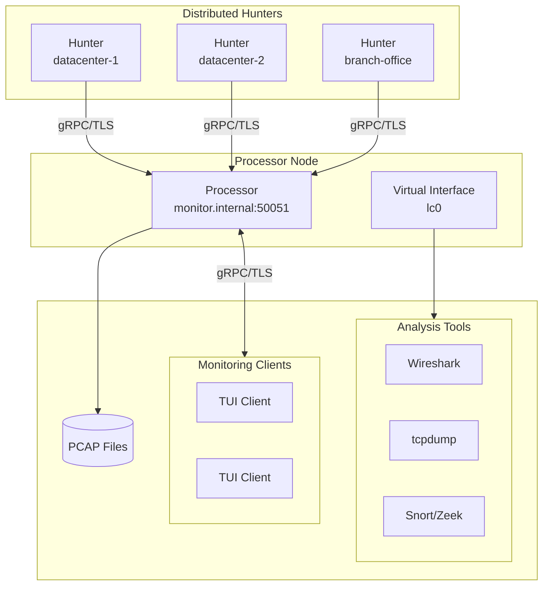

# lippycat 🫦🐱

[](CHANGELOG.md)
[](go.mod)
[](LICENSE)
[](#installation)

[](#features)
[](docs/GPU_ACCELERATION.md)
[](docs/SECURITY.md)
[](docs/DISTRIBUTED_MODE.md)

Network traffic sniffer and protocol analyzer built with Go. Supports VoIP (SIP/RTP), DNS, HTTP, TLS/JA3, and Email (SMTP/IMAP/POP3) analysis with distributed capture capabilities.

**Status:** v0.8.1 - Early development. Expect breaking changes.

## Table of Contents

- [Features](#features)
- [Installation](#installation)
- [Quick Start](#quick-start)
- [Commands](#commands)
- [Configuration](#configuration)
- [Performance](#performance)
- [Distributed Mode](#distributed-mode)
- [Documentation](#documentation)
- [Security](#security)
- [Development](#development)
- [Changelog](#changelog)
- [Roadmap](#roadmap)
- [Contributing](#contributing)
- [License](#license)

## Features

- **Multi-Protocol Analysis**:
  - **VoIP**: SIP/RTP traffic capture, call tracking, per-call PCAP, user targeting
  - **DNS**: Query/response correlation, RTT calculation, tunneling detection
  - **HTTP**: Request/response tracking, method/path/host filtering, status code analysis
  - **TLS**: JA3/JA3S fingerprinting, certificate extraction, SNI filtering, [traffic decryption](docs/TLS_DECRYPTION.md)
  - **Email**: SMTP/IMAP/POP3 session tracking, sender/recipient/mailbox filtering, content keywords
- **Distributed Capture**: Multi-node architecture with hunter/processor nodes
- **Virtual Interface**: Replay filtered streams to Wireshark, tcpdump, Snort (Linux only)
- **Secure by Default**: TLS enabled for all gRPC connections, with optional mTLS
- **Hunter Subscription**: Selective monitoring of specific hunters via TUI
- **Performance**: SIMD optimizations, optional GPU acceleration, AF_XDP support
- **TUI & CLI**: Terminal UI with remote monitoring and command-line interfaces
- **Flexible Output**: PCAP files (unified, per-call, auto-rotating), structured logging

## Installation

### Prerequisites
- Go 1.24+
- libpcap (`libpcap-dev` on Ubuntu/Debian)
- Root/sudo for live capture

### Build

#### Using Makefile (recommended)
```bash
git clone https://github.com/endorses/lippycat.git
cd lippycat

# Standard build with version info
make build

# Or quick dev build
make dev

# Build optimized release binary
make build-release

# Build with CUDA GPU acceleration (requires CUDA Toolkit)
make build-cuda
```

#### Building Specialized Binaries

lippycat uses Go build tags to create optimized binaries for specific deployment scenarios:

```bash
# Build all variants (output to bin/ directory)
make binaries

# Or build specific variants (all stripped and optimized):
make all        # Complete suite (22 MB) - all commands
make hunter     # Hunter node only (18 MB) - edge capture
make processor  # Processor node only (14 MB) - central aggregation
make cli        # CLI tools only - sniff, debug, interfaces
make tui        # TUI only - terminal interface
```

**Use cases:**
- **Hunter**: Edge deployment with GPU-accelerated filtering, minimal size
- **Processor**: Central aggregation servers without TUI/CLI overhead
- **CLI**: Headless servers for scripted packet capture
- **TUI**: Interactive monitoring without distributed mode
- **Complete suite**: All-in-one deployment with every feature

#### Using go build directly
```bash
# Build complete suite
go build -tags all -o lc

# Build specific variant
go build -tags hunter -o lc-hunt
go build -tags processor -o lc-process
go build -tags cli -o lc-cli
go build -tags tui -o lc-tui
```

**Note on Build Tags:** If you run `go build ./...` without specifying tags, you may see warnings about build constraints excluding files in the `cmd/` directory. This is expected behavior - the build system uses tags to exclude unused code paths for each specialized binary. Always use `make build` or specify a tag explicitly (e.g., `-tags all`) to build successfully.

#### Installing system-wide
```bash
# Install to $GOPATH/bin as 'lc'
make install

# Or install to /usr/local/bin (requires sudo)
make install-system
```

Run `make help` to see all available build targets.

## Quick Start

```bash
# List interfaces
lc list interfaces

# Capture VoIP traffic
sudo lc sniff voip --interface eth0

# Target specific SIP users
sudo lc sniff voip --sip-user alicent,robb

# Capture DNS traffic
sudo lc sniff dns --interface eth0

# Capture TLS traffic with JA3 fingerprinting
sudo lc sniff tls --interface eth0

# Capture Email traffic (SMTP/IMAP/POP3)
sudo lc sniff email --interface eth0

# Capture IMAP only
sudo lc sniff email --interface eth0 --protocol imap

# PCAP replay with filtering (tcpreplay alternative)
sudo lc sniff voip -r capture.pcap --sip-user alicent --virtual-interface
wireshark -i lc0  # Monitor filtered stream in another terminal

# Interactive TUI
sudo lc watch

# Analyze PCAP file in TUI
lc watch file -r capture.pcap

# Remote monitoring
lc watch remote --nodes-file nodes.yaml

# Distributed capture (TLS enabled by default)
lc process --listen :50051 --tls-cert server.crt --tls-key server.key  # Processor
sudo lc hunt --interface eth0 --processor host:50051 --tls-ca ca.crt   # Hunter

# Local testing without TLS (not for production)
lc process --listen :50051 --insecure
sudo lc hunt --interface eth0 --processor host:50051 --insecure
```

## Commands

```
lc [verb] [object] [flags]

VERBS:
  sniff     Capture packets from interface or file
  tap       Standalone capture with processor capabilities
  hunt      Distributed edge capture (hunter node)
  process   Central aggregation (processor node)
  watch     Monitor traffic (TUI)
  list      List resources
  show      Display information/diagnostics
```

| Command | Description |
|---------|-------------|
| `sniff` | Packet capture (general) |
| `sniff voip` | VoIP capture with SIP/RTP analysis |
| `sniff dns` | DNS capture with query/response correlation |
| `sniff http` | HTTP capture with request/response tracking |
| `sniff tls` | TLS capture with JA3 fingerprinting |
| `sniff email` | Email (SMTP/IMAP/POP3) capture with session tracking |
| `tap` | Standalone capture with TUI serving and PCAP writing |
| `tap voip` | VoIP tap with per-call PCAP |
| `tap dns` | DNS tap with domain filtering |
| `tap http` | HTTP tap with method/path filtering |
| `tap tls` | TLS tap with JA3/SNI filtering |
| `tap email` | Email tap with content filtering |
| `watch` | Interactive TUI (defaults to live mode) |
| `watch live` | Live capture in TUI |
| `watch file` | Analyze PCAP file in TUI |
| `watch remote` | Monitor remote nodes in TUI |
| `hunt` | Hunter node (distributed edge capture) |
| `hunt voip` | VoIP hunter with call buffering |
| `hunt dns` | DNS hunter with domain filtering |
| `hunt http` | HTTP hunter with URL filtering |
| `hunt tls` | TLS hunter with JA3/SNI filtering |
| `hunt email` | Email hunter with content filtering |
| `process` | Processor node (distributed aggregation) |
| `list interfaces` | List available network interfaces |
| `list filters` | List filters on a processor |
| `show status` | Show processor status |
| `show hunters` | Show connected hunters |
| `show topology` | Show distributed topology |
| `show filter` | Show filter details |
| `show config` | Display local configuration |

Run `lc [command] --help` for detailed options.

## Configuration

Configuration files (priority order):
1. `~/.config/lippycat/config.yaml`
2. `~/.config/lippycat.yaml`
3. `~/.lippycat.yaml`

See `example-config.yaml` for configuration options.

### Basic Config Example
```yaml
voip:
  tcp_performance_mode: "balanced"  # balanced, throughput, latency, memory
  gpu_backend: "auto"               # auto, cuda, opencl, cpu-simd, disabled
  max_tcp_buffers: 10000
  enable_backpressure: true
```

## Performance

### GPU Acceleration
Supports GPU-accelerated pattern matching with multiple backends:

- **CUDA**: Full implementation for NVIDIA GPUs (requires CUDA Toolkit and `-tags cuda` build)
- **OpenCL**: Placeholder (planned)
- **CPU SIMD**: AVX2/SSE4.2 optimizations (always available, default fallback)

Standard builds use CPU SIMD. Use `make build-cuda` for GPU acceleration.

### Performance Modes
- **balanced**: General-purpose (default)
- **throughput**: High-volume traffic
- **latency**: Real-time monitoring
- **memory**: Resource-constrained environments

### AF_XDP Support
Kernel-bypass packet capture on Linux 4.18+ with XDP-capable NICs. See [docs/AF_XDP_SETUP.md](docs/AF_XDP_SETUP.md).

## Distributed Mode

Deploy hunters across network segments and aggregate to central processors. **TLS is enabled by default** for all gRPC connections—processors require certificates, hunters require CA verification.



```bash
# Processor (TLS enabled by default, requires cert/key)
lc process --listen :50051 --write-file capture.pcap --virtual-interface \
  --tls-cert server.crt --tls-key server.key --tls-ca ca.crt

# Hunter (TLS enabled by default, requires CA cert)
sudo lc hunt --interface eth0 --processor processor:50051 --tls-ca ca.crt

# Mutual TLS (client certificate authentication)
sudo lc hunt --interface eth0 --processor processor:50051 \
  --tls-cert client.crt --tls-key client.key --tls-ca ca.crt

# Protocol-specific hunters (all use TLS by default)
sudo lc hunt voip --interface eth0 --processor processor:50051 --tls-ca ca.crt
sudo lc hunt dns --interface eth0 --processor processor:50051 --tls-ca ca.crt
sudo lc hunt tls --interface eth0 --processor processor:50051 --tls-ca ca.crt

# Analyze aggregated traffic on processor with external tools
wireshark -i lc0     # Real-time analysis in Wireshark
tcpdump -i lc0 -w out.pcap  # Capture filtered stream

# TUI monitoring with selective hunter subscription
lc watch remote --nodes-file nodes.yaml
# Press 's' to select specific hunters to monitor
# Press 'd' to unsubscribe from hunters
```

See [docs/DISTRIBUTED_MODE.md](docs/DISTRIBUTED_MODE.md) for details.

## Documentation

- [Virtual Interface](docs/VIRTUAL_INTERFACE.md) - Tool integration (Wireshark, Snort, tcpdump)
- [Distributed Mode](docs/DISTRIBUTED_MODE.md) - Multi-node architecture
- [TUI Remote Capture](docs/TUI_REMOTE_CAPTURE.md) - Remote monitoring setup
- [GPU Acceleration](docs/GPU_ACCELERATION.md) - GPU/SIMD optimization
- [AF_XDP Setup](docs/AF_XDP_SETUP.md) - Kernel-bypass capture
- [Security Features](docs/SECURITY.md) - Encryption, sanitization, DoS protection
- [TCP Troubleshooting](docs/tcp-troubleshooting.md) - TCP stream debugging
- [GPU Troubleshooting](docs/GPU_TROUBLESHOOTING.md) - GPU backend issues
- [Operational Procedures](docs/operational-procedures.md) - Deployment guide

## Security

**Defensive use only.** This tool is for authorized network monitoring and analysis.

- ✅ Network diagnostics and troubleshooting
- ✅ Protocol security analysis (VoIP, DNS, TLS, Email)
- ✅ Traffic analysis and testing
- ✅ Lawful interception (ETSI X1/X2/X3 interfaces)
- ❌ Unauthorized surveillance

Requires root privileges for packet capture. Use responsibly and legally.

**Security Features:**
- **Secure by default**: TLS enabled for all distributed connections (use `--insecure` to disable)
- TLS/mTLS encryption with mutual authentication
- Call-ID sanitization for privacy
- PCAP file encryption support
- DoS protection with rate limiting
- Per-node certificate authentication
- ETSI-compliant lawful interception (X1/X2/X3)

See [docs/SECURITY.md](docs/SECURITY.md) for detailed security documentation. For lawful interception setup, see [docs/LI_INTEGRATION.md](docs/LI_INTEGRATION.md).

## Development

### Testing
```bash
go test ./...
```

### Code Standards
- Follow Go conventions and `gofmt`
- Add tests for new features
- Update documentation

### Architecture
- Plugin-based protocol analyzers
- Distributed hunter/processor architecture
- gRPC for node communication
- Cobra CLI + Bubbletea TUI

## Changelog

See [CHANGELOG.md](CHANGELOG.md) for detailed version history.

## Roadmap

### Planned
- Enhanced GPU acceleration
- Additional protocol plugins

## Contributing

Contributions welcome! Please:
1. Fork and create a feature branch
2. Follow Go code standards
3. Add tests
4. Submit a pull request

For security issues, follow responsible disclosure practices.

## License

MIT License - see [LICENSE](LICENSE) file.

## Acknowledgments

- [gopacket](https://github.com/google/gopacket) - Packet capture
- [Cobra](https://github.com/spf13/cobra) - CLI framework
- [Viper](https://github.com/spf13/viper) - Configuration
- [Bubbletea](https://github.com/charmbracelet/bubbletea) - TUI framework

---

**⚠️ Legal Notice**: For authorized network monitoring only. Users are responsible for legal compliance. Unauthorized interception may violate laws.
