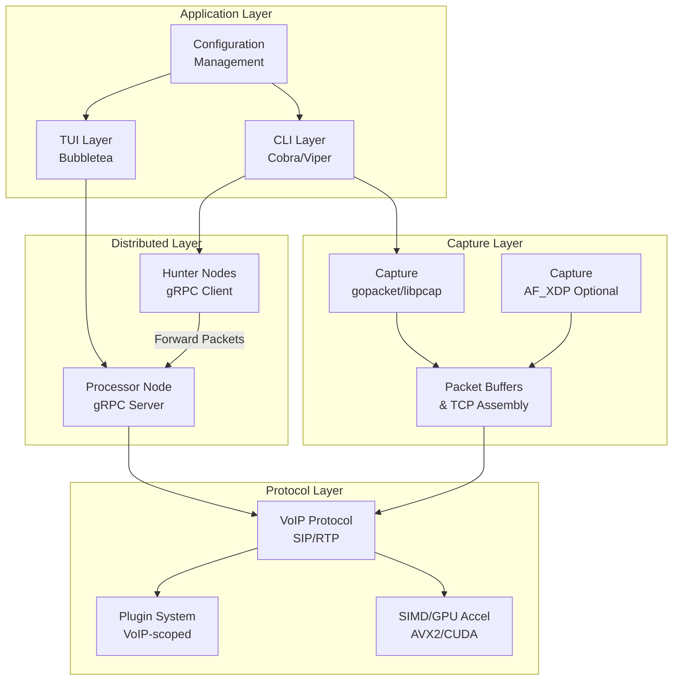
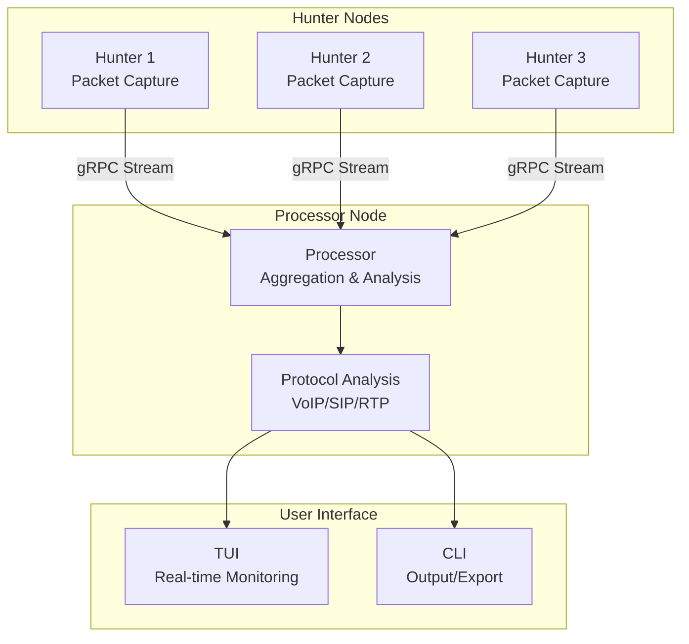

# lippycat 🫦🐱

A high-performance, network traffic sniffer and protocol analyzer built with Go. Designed as an extensible platform for multi-protocol network monitoring and analysis, lippycat currently features comprehensive VoIP analysis capabilities with plans for additional protocol support.

## 🚀 Features

### Core Network Analysis
- **Multi-Protocol Foundation**: Extensible architecture supporting multiple network protocols
- **Real-time Processing**: Live network capture with configurable BPF filtering
- **PCAP Analysis**: Read and analyze existing packet capture files
- **High-Performance Processing**: GPU acceleration, SIMD optimizations, zero-copy I/O
- **Flexible Output**: PCAP files (including mmap-based writers), structured logging

### VoIP Analysis (Primary Current Feature)
- **SIP Protocol Support**: Complete UDP and TCP SIP traffic analysis
- **RTP Stream Detection**: Automatic media stream identification and tracking
- **User Surveillance**: Target specific SIP users for focused monitoring
- **Call Tracking**: Automatic call session detection and correlation
- **RTP Port Extraction**: Intelligent extraction of media stream information from SDP

### Advanced Performance Optimizations
- **GPU Acceleration**: CUDA and OpenCL support for pattern matching (2-3x speedup on supported hardware)
- **SIMD Processing**: AVX2/SSE4.2 optimized packet parsing and pattern matching
- **Zero-Copy I/O**: AF_XDP (XDP sockets) for kernel-bypass packet capture on Linux
- **Batch Processing**: Optimized batch packet processing with worker pools
- **CPU Affinity**: Pin workers to specific CPU cores for cache optimization
- **Lock-free Data Structures**: Minimize contention in high-throughput scenarios

### Advanced TCP Processing (VoIP-Focused)
- **Production-Ready TCP Stream Reassembly**: Complete TCP SIP message processing
- **Performance Modes**: Optimized configurations for throughput, latency, or memory usage
- **Intelligent Buffering**: Adaptive, fixed, and ring buffer strategies
- **Backpressure Handling**: Automatic load management and graceful degradation
- **Memory-Mapped Writers**: High-performance mmap-based PCAP writing
- **Real-time Monitoring**: Comprehensive metrics and health monitoring

### Future Protocol Support
- **Extensible Architecture**: Plugin-ready design for additional protocol analyzers
- **HTTP/HTTPS Analysis**: Planned support for web traffic analysis
- **DNS Monitoring**: Future DNS query and response analysis
- **Database Protocols**: MySQL, PostgreSQL protocol analysis
- **Custom Protocols**: Framework for implementing custom protocol parsers

### Configuration & Deployment
- **CLI Interface**: Intuitive command-line interface with extensive configuration options
- **YAML Configuration**: Flexible configuration file support
- **Environment Variables**: 12-factor app compliance with environment-based configuration
- **Hot Configuration**: Runtime configuration updates without restart

## 📦 Installation

### Prerequisites
- Go 1.19 or later
- Root/Administrator privileges (for live network capture)
- libpcap development libraries

### Optional Performance Prerequisites
- **CUDA Toolkit** (for GPU acceleration): NVIDIA CUDA 11.0+ for CUDA backend support
- **Linux Kernel 4.18+** (for XDP): AF_XDP zero-copy packet capture
- **XDP-capable NIC driver**: For zero-copy capture (check driver compatibility)

### From Source

#### Standard Build
```bash
git clone https://github.com/endorses/lippycat.git
cd lippycat
go build -o lippycat
```

#### Build with CUDA Support
```bash
# Build CUDA kernels
cd internal/pkg/voip
make -f Makefile.cuda

# Build lippycat with CUDA tag
cd ../../..
go build -tags cuda -o lippycat
```

#### Build with All Optimizations
```bash
# Requires: CUDA Toolkit, Linux kernel 4.18+
go build -tags "cuda xdp" -o lippycat
```

### Dependencies
```bash
# Ubuntu/Debian
sudo apt-get install libpcap-dev

# RHEL/CentOS/Fedora
sudo yum install libpcap-devel

# macOS
brew install libpcap
```

## 🏃‍♂️ Quick Start

### Available Commands
```bash
lippycat sniff          # Packet capture CLI mode
lippycat sniff voip     # VoIP-specific capture with SIP/RTP analysis
lippycat tui            # Terminal User Interface for real-time monitoring
lippycat hunt           # Hunter node (distributed capture)
lippycat process        # Processor node (distributed analysis)
lippycat interfaces     # List available network interfaces
lippycat debug          # Debug TCP SIP processing components
```

### Basic Network Monitoring
```bash
# General packet capture with BPF filter
sudo ./lippycat sniff --interface eth0 --filter "port 80"

# Capture to PCAP file
sudo ./lippycat sniff --interface any --write-file capture.pcap

# Analyze existing PCAP
./lippycat sniff --read-file capture.pcap --filter "tcp"
```

### VoIP-Specific Monitoring
```bash
# Monitor all interfaces for SIP traffic
sudo ./lippycat sniff voip

# Monitor specific interface for VoIP
sudo ./lippycat sniff voip --interface eth0

# Target specific SIP users
sudo ./lippycat sniff voip --sipuser alice,bob --write-file

# Analyze existing PCAP for VoIP traffic
./lippycat sniff voip --read-file capture.pcap --sipuser alice
```

### VoIP Performance Optimization
```bash
# High-throughput capture with GPU acceleration (default when available)
sudo ./lippycat sniff voip --tcp-performance-mode throughput --enable-backpressure

# Disable GPU acceleration (CPU/SIMD only)
sudo ./lippycat sniff voip --gpu-backend disabled

# Force CUDA backend with custom batch size
sudo ./lippycat sniff voip --gpu-backend cuda --gpu-batch-size 2048

# Low-latency real-time analysis
sudo ./lippycat sniff voip --tcp-performance-mode latency

# Memory-constrained environment
sudo ./lippycat sniff voip --tcp-performance-mode memory --memory-optimization
```

### Distributed Mode (Multi-Node Capture)
```bash
# Start processor node (receives packets from hunters)
./lippycat process --listen 0.0.0.0:50051

# Start hunter nodes on different machines/interfaces
sudo ./lippycat hunt --interface eth0 --processor processor-host:50051
sudo ./lippycat hunt --interface eth1 --processor processor-host:50051

# Monitor distributed capture via TUI
./lippycat tui --remote --nodes-file nodes.yaml

# Example nodes.yaml:
# nodes:
#   - name: "Hunter-1"
#     address: "192.168.1.10:50051"
#   - name: "Hunter-2"
#     address: "192.168.1.11:50051"
```

**Use Cases for Distributed Mode:**
- **Multi-interface monitoring**: Deploy hunters on different network interfaces or segments
- **Scalable capture**: Distribute capture load across multiple machines
- **Network segmentation**: Capture in restricted zones, analyze in monitoring zones
- **Centralized analysis**: Aggregate packets from multiple sources for unified analysis

## ⚙️ Configuration

### Configuration File
Create configuration file (in priority order):
1. `~/.config/lippycat/config.yaml` (preferred)
2. `~/.config/lippycat.yaml` (XDG standard)
3. `~/.lippycat.yaml` (legacy)

Example configuration:

```yaml
# General network capture settings
capture:
  default_interface: "eth0"
  buffer_size: 65536
  promiscuous: false

# VoIP-specific configuration
voip:
  # GPU Acceleration (for pattern matching)
  gpu_enable: true              # Enable GPU acceleration (default: true)
  gpu_backend: "auto"           # auto, cuda, opencl, cpu-simd, disabled
  gpu_batch_size: 1024          # Batch size for GPU processing
  gpu_max_memory: 0             # Max GPU memory in bytes (0 = auto)

  # Performance Mode: balanced, throughput, latency, memory
  tcp_performance_mode: "balanced"

  # Basic Configuration
  max_goroutines: 1000
  tcp_cleanup_interval: 60s
  max_tcp_buffers: 10000

  # Buffer Strategy: adaptive, fixed, ring
  tcp_buffer_strategy: "adaptive"

  # Optimization Features
  enable_backpressure: true
  memory_optimization: false
  tcp_memory_limit: 104857600  # 100MB

  # Advanced Tuning
  tcp_batch_size: 32
  tcp_buffer_pool_size: 1000

# Future protocol configurations
# http:
#   follow_redirects: true
#   max_body_size: 1048576
# dns:
#   track_queries: true
#   resolve_names: false
```

### CLI Options

#### Global Options
```bash
  --config string          config file (default is $HOME/.lippycat.yaml)
  --interface, -i string   interface(s) to monitor, comma separated (default "any")
  --filter, -f string      bpf filter to apply
  --read-file, -r string   read from pcap file
  --write-file, -w string  write to pcap file
  --promiscuous, -p        use promiscuous mode (default: false)
```

#### VoIP Protocol Options
```bash
  --sipuser, -u string     SIP user to intercept
  --write-file, -w         write to pcap file (default: false)
```

#### GPU Acceleration Options
```bash
  --gpu-enable             Enable GPU acceleration for pattern matching (default: true)
  --gpu-backend string     GPU backend: auto, cuda, opencl, cpu-simd, disabled (default: auto)
  --gpu-batch-size int     Batch size for GPU processing (default: 1024)
  --gpu-max-memory int     Maximum GPU memory in bytes (0 = auto)
```

#### TCP Performance Options (VoIP-Focused)
```bash
  --tcp-performance-mode string         Performance mode: balanced, throughput, latency, memory
  --tcp-buffer-strategy string          Buffer strategy: adaptive, fixed, ring
  --tcp-max-goroutines int              Maximum concurrent TCP processing goroutines
  --tcp-cleanup-interval duration       TCP resource cleanup interval
  --tcp-buffer-max-age duration         Maximum age for TCP packet buffers
  --max-tcp-buffers int                 Maximum number of TCP packet buffers
  --tcp-stream-timeout duration         Timeout for TCP stream processing
  --enable-backpressure                 Enable backpressure handling
  --memory-optimization                 Enable memory usage optimizations
```

## 🎯 Performance Features

### GPU Acceleration
lippycat automatically detects and uses GPU acceleration for pattern matching when available:

- **CUDA Backend**: NVIDIA GPU support (2-3x speedup on RTX series GPUs)
- **OpenCL Backend**: Cross-platform GPU support (AMD, Intel, NVIDIA)
- **CPU-SIMD Fallback**: AVX2/SSE4.2 optimized CPU processing
- **Automatic Selection**: Tries CUDA → OpenCL → SIMD in order

**Note**: GPU acceleration is used for pattern matching (e.g., matching phone numbers). Simple operations like CallID extraction remain on CPU where they're faster (100-180 ns/op).

#### GPU Performance Characteristics
```bash
# Pattern matching against 1000s of phone numbers:
# - CPU SIMD: ~34 µs/operation
# - GPU CUDA: ~15 µs/operation (2.3x faster)
# - 70% less memory usage
# - 97% fewer allocations
```

### VoIP Performance Modes

The current VoIP implementation supports four performance modes optimized for different use cases:

#### Balanced Mode (Default)
Optimal for general-purpose VoIP analysis with reasonable resource consumption.

#### Throughput Mode
```bash
sudo ./lippycat sniff voip --tcp-performance-mode throughput
```
- **Use Case**: High-volume SIP traffic analysis
- **Benefits**: 3-5x packet processing improvement
- **Resources**: Increased memory usage, higher CPU utilization
- **Optimizations**: Batch processing, ring buffers, increased concurrency

#### Latency Mode
```bash
sudo ./lippycat sniff voip --tcp-performance-mode latency
```
- **Use Case**: Real-time call monitoring and alerting
- **Benefits**: <1ms processing delays
- **Resources**: Moderate resource usage
- **Optimizations**: Single-packet processing, fixed buffers, frequent cleanup

#### Memory Mode
```bash
sudo ./lippycat sniff voip --tcp-performance-mode memory
```
- **Use Case**: Resource-constrained environments
- **Benefits**: 60-80% memory usage reduction
- **Resources**: Minimal memory footprint
- **Optimizations**: Aggressive cleanup, adaptive buffers, reduced concurrency

## 🔍 Monitoring & Observability

### Health Checks
lippycat provides built-in health monitoring, currently focused on VoIP/TCP processing:

- **Stream Metrics**: Active streams, completion rates, failure rates
- **Buffer Statistics**: Memory usage, cleanup efficiency, packet loss
- **Performance Indicators**: Throughput, latency, resource utilization
- **System Health**: Goroutine usage, queue depth, backpressure status

### Logging
Structured logging with configurable levels:
```bash
# Set log level via environment
export LIPPYCAT_LOG_LEVEL=debug

# Verbose protocol processing logs
sudo ./lippycat sniff voip --tcp-performance-mode throughput
```

## 🛡️ Security Considerations

### Network Permissions
- **Root Privileges**: Required for live network capture
- **Promiscuous Mode**: Use `--promiscuous` flag with caution
- **Interface Access**: Ensure appropriate network interface permissions

### Data Handling
- **PCAP Output**: Contains network traffic data and metadata
- **VoIP Targeting**: `--sipuser` flag enables surveillance capabilities for VoIP traffic
- **Storage**: Secure PCAP file storage and access controls recommended

### Defensive Use Only
lippycat is designed for **defensive security and network analysis purposes only**:
- ✅ Network monitoring and diagnostics
- ✅ Protocol analysis and troubleshooting
- ✅ VoIP security and performance analysis
- ✅ Security incident investigation
- ✅ Network performance optimization
- ❌ Unauthorized surveillance or interception

## 🏗️ Architecture

### Core Components



### Performance Architecture (VoIP Mode)

```mermaid
graph TB
    Capture[Packet Capture<br/>libpcap / AF_XDP zero-copy optional<br/>mmap ring buffers]

    Batch[Batch Processor<br/>• Worker pools with CPU affinity<br/>• Lock-free queues<br/>• Adaptive batching 64-2048 packets]

    FastPath[Fast Path CPU/SIMD<br/>• CallID Parse<br/>• AVX2/SSE4.2<br/>• 100-180 ns/op benchmark]

    GPU[Pattern Match GPU/CUDA optional<br/>• Phone Number Match<br/>• Batch Process<br/>• 15 µs/batch benchmark]

    Analysis[Protocol Analysis<br/>• TCP stream reassembly<br/>• Call tracking lock-free/hybrid<br/>• RTP detection]

    Distributed[Distributed Mode optional<br/>• gRPC packet forwarding<br/>• Multi-node aggregation]

    Capture --> Batch
    Capture --> Distributed
    Batch --> FastPath
    Batch --> GPU
    FastPath --> Analysis
    GPU --> Analysis
    Distributed --> Analysis
```



**Note**: This architecture applies primarily to **VoIP mode**. AF_XDP requires Linux 4.18+ and XDP-capable NIC drivers. GPU acceleration requires CUDA/OpenCL hardware. Performance numbers are from benchmarks.

### Distributed Architecture



### Extensibility Framework
- **Protocol Plugins**: Modular design for adding new protocol parsers
- **Output Modules**: Flexible output formatting (PCAP, JSON, custom)
- **Filter Chains**: Configurable packet filtering and processing pipelines
- **Analysis Engines**: Pluggable analysis modules for different protocols

## 🧪 Testing

### Unit Tests
```bash
go test ./...
```

### Integration Tests
```bash
# Test with sample PCAP files
./lippycat sniff voip --read-file captures/test-sip-tcp.pcap --sipuser testuser

# General protocol testing
./lippycat sniff --read-file captures/mixed-traffic.pcap --filter "tcp"

# VoIP performance testing
./lippycat sniff voip --tcp-performance-mode throughput --read-file large-capture.pcap
```

### Test Data
The `captures/` directory contains sample PCAP files for testing various protocols and scenarios.

## 🛣️ Roadmap

### Current Status
- ✅ **VoIP/SIP Analysis**: Complete UDP and TCP SIP support with advanced performance optimization
- ✅ **GPU Acceleration**: CUDA and OpenCL support with automatic backend selection
- ✅ **SIMD Optimizations**: AVX2/SSE4.2 accelerated packet processing
- ✅ **Zero-Copy I/O**: AF_XDP support for kernel-bypass packet capture
- ✅ **Batch Processing**: High-throughput batch packet processing
- ✅ **TCP Stream Reassembly**: Production-ready TCP processing framework
- ✅ **Configuration System**: Comprehensive CLI and YAML configuration
- ✅ **Performance Monitoring**: Real-time metrics and health monitoring

### Planned Features
- 🔄 **HTTP/HTTPS Protocol**: Web traffic analysis and monitoring
- 🔄 **DNS Protocol**: Query/response analysis and monitoring
- 🔄 **Database Protocols**: MySQL, PostgreSQL protocol analysis
- 🔄 **Custom Protocol Framework**: SDK for implementing custom parsers
- 🔄 **JSON/CSV Output**: Structured data export formats
- 🔄 **Web Dashboard**: Real-time monitoring and analysis interface

## 🤝 Contributing

### Development Setup
1. Fork the repository
2. Create a feature branch: `git checkout -b feature/amazing-feature`
3. Commit changes: `git commit -m 'Add amazing feature'`
4. Push to branch: `git push origin feature/amazing-feature`
5. Open a Pull Request

### Adding New Protocols
lippycat is designed for easy protocol extension:

1. **Create Protocol Parser**: Implement the protocol analyzer interface
2. **Add Configuration**: Define protocol-specific configuration options
3. **Register Protocol**: Add protocol registration to the main router
4. **Add Tests**: Include unit and integration tests
5. **Update Documentation**: Document new protocol capabilities

### Code Standards
- Follow Go conventions and `gofmt` formatting
- Add tests for new functionality
- Update documentation for user-facing changes
- Ensure compatibility with existing APIs

### Security Guidelines
- Only implement defensive security features
- No credential harvesting or bulk data collection
- Maintain user privacy and data protection standards
- Follow responsible disclosure for security issues

## 📚 Documentation

### Additional Resources
- [Configuration Reference](docs/configuration.md)
- [Performance Tuning Guide](docs/performance.md)
- [Protocol Extension Guide](docs/extending.md)
- [Troubleshooting Guide](docs/troubleshooting.md)
- [API Documentation](docs/api.md)

### Examples
See the `examples/` directory for:
- Configuration file examples
- Protocol-specific usage patterns
- Performance optimization scenarios
- Integration examples

## 📄 License

This project is licensed under the MIT License - see the [LICENSE](LICENSE) file for details.

## 🙏 Acknowledgments

- [gopacket](https://github.com/google/gopacket) - Packet capture and analysis
- [Cobra](https://github.com/spf13/cobra) - CLI framework
- [Viper](https://github.com/spf13/viper) - Configuration management
- [testify](https://github.com/stretchr/testify) - Testing framework
- NVIDIA CUDA - GPU acceleration support
- Linux AF_XDP - Zero-copy packet capture

## 📞 Support

- **Issues**: [GitHub Issues](https://github.com/endorses/lippycat/issues)
- **Feature Requests**: Use GitHub Issues to request new protocol support

---

**⚠️ Legal Notice**: This tool is intended for authorized network monitoring, diagnostics, and protocol analysis only. Users are responsible for complying with all applicable laws and regulations. Unauthorized use for surveillance or interception may violate local, state, and federal laws.
