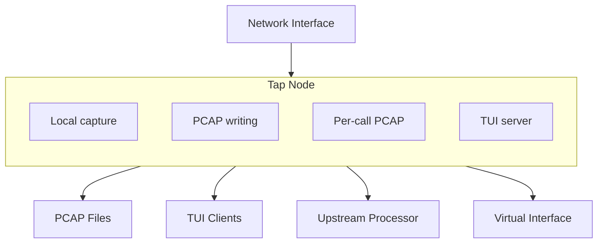
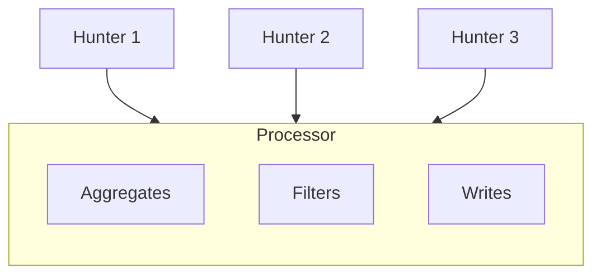
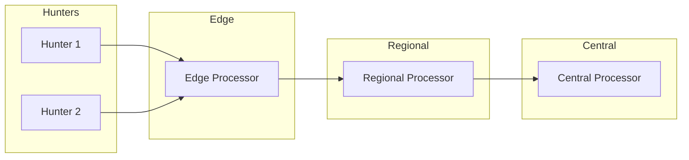
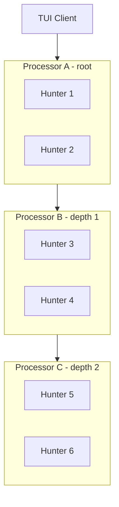
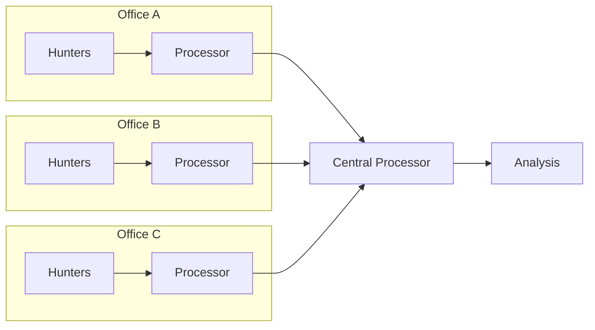
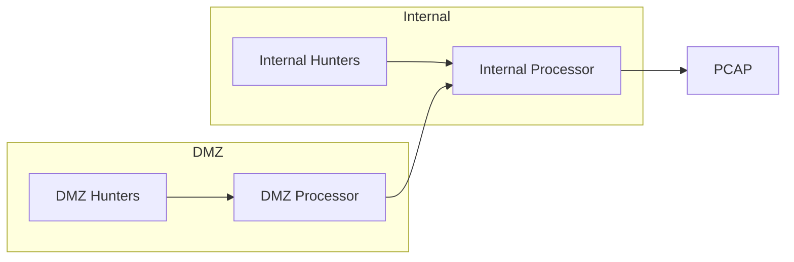
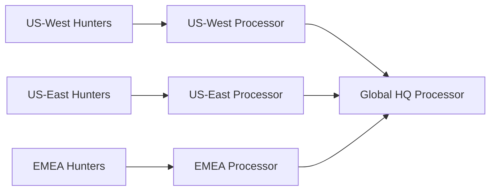
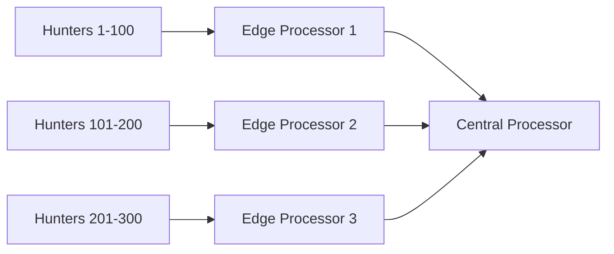

# Distributed Mode - Complete Documentation

## Table of Contents

- [Overview](#overview)
- [Architecture](#architecture)
  - [Standalone Tap Mode](#standalone-tap-mode)
  - [Hub-and-Spoke Mode](#hub-and-spoke-mode)
  - [Hierarchical Mode](#hierarchical-mode)
  - [Multi-Level Management](#multi-level-management-v030)
- [Components](#components)
- [Quick Start](#quick-start)
- [Configuration](#configuration)
- [Features](#features)
- [Use Cases](#use-cases)
- [Production Deployment](#production-deployment)
- [Performance Tuning](#performance-tuning)
- [Troubleshooting](#troubleshooting)
- [Protocol Details](#protocol-details)
- [Security Features](#security-features-v024)
- [Known Limitations](#known-limitations)
- [FAQ](#faq)

---

## Overview

Lippycat supports a fully distributed packet capture architecture that allows you to deploy multiple capture nodes (hunters) across your network and aggregate traffic to central processors. This enables scalable, multi-site packet capture with hierarchical aggregation.

### Key Features

- **Multi-node capture** across network segments
- **Hierarchical aggregation** (edge → regional → central)
- **Standalone tap mode** for single-machine deployments
- **Real-time monitoring** via TUI with selective hunter subscription
- **TLS/mTLS security** for encrypted node communication
- **Automatic fault recovery** with fast reconnection (<100ms)
- **Filter distribution** from processor to hunters
- **Health monitoring** with heartbeat streaming
- **Scalable** to hundreds of capture nodes

---

## Architecture

### Standalone Tap Mode

For single-machine deployments, tap mode combines local capture with processor capabilities:



**When to use Tap Mode:**
- Single-machine VoIP capture with per-call PCAP
- Standalone deployments with TUI monitoring
- Edge nodes that need local capture AND TUI serving
- Development/testing before distributed deployment

**When to use Hunter/Processor:**
- Multi-machine distributed capture
- Network segmentation (capture in DMZ, analyze elsewhere)
- High-scale deployments (hundreds of capture points)
- Centralized analysis with multiple capture sources

**Quick Start:**
```bash
# Standalone VoIP capture with TUI
sudo lc tap voip -i eth0 --sipuser alicent --insecure

# Connect TUI
lc watch remote --addr localhost:55555 --insecure
```

### Hub-and-Spoke Mode

Simple architecture where hunters connect directly to a central processor:



### Hierarchical Mode

Multi-tier architecture for geographic or network segmentation:



### Multi-Level Management (v0.3.0+)

**NEW:** Hierarchical management enables real-time topology updates and transparent operation proxying across processor chains.

**Key Features:**
- **Real-time topology updates** propagate upstream from leaf processors to root
- **Transparent management proxying** allows TUI to control hunters on downstream processors
- **Streaming topology subscription** replaces polling for instant updates
- **Event-driven architecture** with hunter connect/disconnect propagation
- **Authorization tokens** for secure multi-hop operations
- **Hierarchy depth limits** (max: 10 levels) for performance and latency control

**Example Topology:**


**How It Works:**
1. **Topology Propagation**: When Hunter 5 connects to Processor C, the event flows:
   - Processor C publishes `HunterConnected` event
   - Event propagates to Processor B
   - Processor B forwards to Processor A
   - Processor A broadcasts to TUI clients
   - TUI updates hunters view instantly

2. **Operation Proxying**: When TUI creates filter on Hunter 5:
   - TUI requests auth token from Processor A (root)
   - TUI sends `UpdateFilterOnProcessor(target=ProcessorC, hunter=Hunter5)` to A
   - Processor A validates token and routes to Processor B
   - Processor B validates and routes to Processor C
   - Processor C applies filter to Hunter 5
   - Success/error propagates back up chain to TUI

**Hierarchy Depth Guidelines:**

| Depth | Use Case | Latency | Status |
|-------|----------|---------|--------|
| 0-1 | Direct hunters, single edge processor | <100ms | Optimal |
| 2-3 | Regional aggregation, multi-site | 100-500ms | Recommended |
| 4-6 | Large enterprise, geographic distribution | 500ms-2s | Acceptable |
| 7-9 | Complex hierarchies, extreme distribution | 2s-5s | Performance warning |
| 10+ | Not recommended | >5s | Rejected |

**Operation Latency by Depth:**
- Base timeout: 5 seconds
- Per-hop timeout: +500ms per level
- Examples:
  - Depth 1 (direct): ~5.5s max
  - Depth 3 (regional): ~6.5s max
  - Depth 7 (complex): ~8.5s max
  - Depth 10 (max): ~10s max

**Best Practices:**
- Keep depth ≤3 for optimal performance
- Use regional aggregation for geographic distribution
- Monitor operation latency metrics
- Configure depth limits based on requirements
- Use TLS/mTLS for security across all hops

---

## Components

### Tap Node (Standalone Capture)

Tap nodes combine local capture with processor capabilities on a single machine.

**Features:**
- Local packet capture from network interfaces
- Per-call PCAP writing (VoIP)
- Auto-rotating PCAP writing (non-VoIP)
- Management gRPC API for TUI connections
- Optional upstream forwarding (hierarchical mode)
- Command hooks for PCAP/call completion

**Use Cases:**
- Single-machine VoIP monitoring
- Edge deployments with local TUI access
- Development and testing

**Resource Usage:**
- Memory: ~300-400MB (with per-call PCAP)
- CPU: Depends on traffic volume and PCAP writing
- Disk: Depends on captured traffic

### Hunter (Edge Capture Node)

Hunters capture packets at the network edge and forward them to processors.

**Features:**
- Live packet capture from network interfaces
- BPF filtering support
- Packet batching (default: 64 packets per batch)
- gRPC streaming to processor
- Automatic reconnection on failure
- Real-time filter updates from processor
- Health status reporting via heartbeat

**Resource Usage:**
- Memory: ~50MB per hunter
- CPU: Minimal (depends on traffic volume)
- Network: Depends on captured traffic

### Processor (Central Aggregation Node)

Processors receive packets from multiple hunters and optionally forward to upstream processors.

**Features:**
- Receives from multiple hunters
- Writes packets to PCAP file
- Distributes filters to hunters
- Monitors hunter health
- Flow control and acknowledgments
- Optional upstream forwarding (hierarchical mode)
- Statistics aggregation

**Resource Usage:**
- Memory: Scales with number of hunters
- CPU: Minimal overhead per hunter
- Disk I/O: Depends on packet volume

---

## Quick Start

### 1. Build

```bash
make build
```

### 2. Basic Setup (Hub-and-Spoke)

**Terminal 1 - Start Processor:**
```bash
sudo lc process --listen :55555 --write-file /tmp/captured.pcap --stats
```

**Terminal 2 - Start Hunter:**
```bash
sudo lc hunt --processor localhost:55555 --interface any
```

### 3. Hierarchical Setup (3-Tier)

**Terminal 1 - Central Processor:**
```bash
sudo lc process --listen :50053 --write-file /tmp/central.pcap
```

**Terminal 2 - Regional Processor:**
```bash
sudo lc process --listen :50052 --upstream localhost:50053
```

**Terminal 3 - Edge Processor:**
```bash
sudo lc process --listen :55555 --upstream localhost:50052
```

**Terminal 4 - Hunter:**
```bash
sudo lc hunt --processor localhost:55555 --interface any
```

### 4. Multi-Level Management with TUI (v0.3.0+)

**Terminal 1 - Root Processor:**
```bash
sudo lc process --listen :55555 --write-file /tmp/root.pcap
```

**Terminal 2 - Downstream Processor:**
```bash
sudo lc process --listen :50052 --upstream localhost:55555
```

**Terminal 3 - Hunter (connected to downstream):**
```bash
sudo lc hunt --processor localhost:50052 --interface any
```

**Terminal 4 - TUI (connected to root, can manage all hunters):**
```bash
lc watch remote --addr localhost:55555 --insecure
```

**Features:**
- TUI shows hunters from both root and downstream processors
- Real-time topology updates when hunters connect/disconnect
- Create/delete filters on any hunter through transparent proxying
- Hierarchy depth and processor chain visible in TUI

---

## Configuration

### Command-Line Flags

#### Hunter

```bash
lc hunt [flags]
```

| Flag | Description | Default |
|------|-------------|---------|
| `--processor <host:port>` | Processor address (required) | - |
| `--hunter-id <id>` | Unique hunter identifier | hostname |
| `--interface <iface>` | Network interface to capture | any |
| `--filter <bpf>` | BPF filter expression | "" |
| `--batch-size <n>` | Packets per batch | 64 |
| `--batch-timeout <ms>` | Batch timeout in milliseconds | 100 |
| `--buffer-size <n>` | Packet buffer size | 10000 |

#### Processor

```bash
lc process [flags]
```

| Flag | Description | Default |
|------|-------------|---------|
| `--listen <host:port>` | Listen address for hunters | :55555 |
| `--upstream <host:port>` | Upstream processor (hierarchical) | "" |
| `--max-hunters <n>` | Maximum concurrent hunters | 100 |
| `--write-file <path>` | PCAP output file | "" |
| `--stats` | Display statistics | true |

### Configuration File

Create `~/.config/lippycat.yaml`:

```yaml
hunter:
  processor_addr: "processor.example.com:55555"
  hunter_id: "edge-node-01"
  interfaces:
    - eth0
    - eth1
  bpf_filter: "port 5060 or port 5061"
  buffer_size: 10000
  batch_size: 64
  batch_timeout_ms: 100

processor:
  listen_addr: ":55555"
  upstream_addr: "central.example.com:55555"
  max_hunters: 100
  write_file: "/var/log/lippycat/captured.pcap"
  display_stats: true
```

---

## Features

### Packet Capture and Forwarding

**Capture:**
- Live network interface capture using libpcap
- Offline PCAP file reading (hunters can read from files)
- BPF filtering at capture time
- Configurable ring buffer

**Batching:**
- Packets are batched before transmission
- Configurable batch size (default: 64 packets)
- Configurable timeout (default: 100ms)
- 64x reduction in gRPC overhead

**Forwarding:**
- Bidirectional gRPC streaming
- Flow control with acknowledgments
- Preserves original timestamps
- Maintains hunter ID through all tiers

**Performance:**
- ~10,000 packets/sec per hunter
- <100ms end-to-end latency
- Minimal CPU and memory overhead

### Filter Distribution

Processors can distribute filters to hunters in real-time.

**Filter Types:**
- `FILTER_SIP_USER` - SIP From/To headers
- `FILTER_PHONE_NUMBER` - Phone numbers with wildcards
- `FILTER_IP_ADDRESS` - IP addresses or CIDR ranges
- `FILTER_CALL_ID` - SIP Call-IDs
- `FILTER_CODEC` - Audio/video codecs
- `FILTER_BPF` - Custom BPF filters

**Operations:**
- `UPDATE_ADD` - Add new filter
- `UPDATE_MODIFY` - Modify existing filter
- `UPDATE_DELETE` - Delete filter

**Targeting:**
- Broadcast to all hunters
- Target specific hunter by ID

**Example (using grpcurl):**
```bash
# Add filter to all hunters
grpcurl -plaintext -d '{
  "id": "filter-1",
  "type": "FILTER_IP_ADDRESS",
  "pattern": "192.168.1.0/24",
  "enabled": true,
  "description": "Local network filter"
}' localhost:55555 lippycat.management.ManagementService/UpdateFilter

# Add filter to specific hunter
grpcurl -plaintext -d '{
  "id": "filter-2",
  "type": "FILTER_SIP_USER",
  "pattern": "alicent@example.com",
  "target_hunters": ["hunter-1"],
  "enabled": true
}' localhost:55555 lippycat.management.ManagementService/UpdateFilter

# Delete filter
grpcurl -plaintext -d '{
  "filter_id": "filter-1"
}' localhost:55555 lippycat.management.ManagementService/DeleteFilter
```

**Note:** Filters are currently distributed and stored but not yet applied to packet processing. Use BPF filters on hunters for active filtering.

### Health Monitoring

**Heartbeat Streaming:**
- Hunters send heartbeat every 5 seconds
- Includes current statistics and status
- Processors respond with acknowledgment
- Stale detection after 30 seconds

**Hunter Status:**
- `STATUS_HEALTHY` - Normal operation
- `STATUS_WARNING` - Buffer >80% or drop rate >10%
- `STATUS_ERROR` - Connection timeout or critical error
- `STATUS_STOPPING` - Graceful shutdown in progress

**Statistics Reported:**
- Packets captured
- Packets matched (by filters)
- Packets forwarded
- Packets dropped
- Buffer usage
- Active filters count

**Processor Monitoring:**
- Tracks all connected hunters
- Aggregates statistics
- Detects stale/disconnected hunters
- Reports health status

### Automatic Reconnection

Hunters automatically reconnect when connection is lost.

**Reconnection Strategy:**
- **Detection:** Immediate on stream error
- **Backoff:** Exponential (1s, 2s, 4s, 8s, 16s, 32s, 60s max)
- **Max Attempts:** 10 (configurable)
- **Total Time:** ~5 minutes before giving up

**Reconnection Flow:**
1. Detect connection failure
2. Mark as disconnected
3. Wait for exponential backoff
4. Attempt reconnection
5. On success: restore all services
6. On failure: retry with longer backoff

**During Reconnection:**
- Packet capture continues
- Packets are buffered (up to buffer size)
- Failed sends are counted as drops
- After reconnection, forwarding resumes

**Backoff Schedule:**

| Attempt | Backoff | Total Time |
|---------|---------|------------|
| 1 | 1s | 1s |
| 2 | 2s | 3s |
| 3 | 4s | 7s |
| 4 | 8s | 15s |
| 5 | 16s | 31s |
| 6 | 32s | 63s |
| 7-10 | 60s | 123s - 303s |

**Logs During Reconnection:**
```
ERROR Failed to send heartbeat error=<...>
WARN Connection lost, will attempt reconnection
INFO Attempting reconnection attempt=1 max=10 backoff=1s
ERROR Reconnection failed error=connection refused attempt=1
INFO Attempting reconnection attempt=2 max=10 backoff=2s
INFO Reconnection successful attempt=2
INFO Starting heartbeat stream to processor
INFO Heartbeat stream established
```

### TUI Monitoring

The TUI includes a "Nodes" tab for monitoring hunters.

**Access:**
```bash
lc watch
# Press Tab key twice to switch to Nodes tab
```

**Display:**
- Hunter ID
- Hostname
- Status (color-coded)
- Uptime
- Packets captured
- Packets forwarded
- Active filters count

**Navigation:**
- `j` / `↓` - Select next hunter
- `k` / `↑` - Select previous hunter
- `Tab` - Next tab
- `Shift+Tab` - Previous tab
- `q` - Quit

**Status Colors:**
- Green (HEALTHY) - Normal operation
- Yellow (WARNING) - High buffer or drops
- Red (ERROR) - Connection timeout
- Gray (STOPPING) - Shutting down

**Note:** Currently shows placeholder until processor integration is complete. Hunters are monitored via processor logs and stats output.

---

## Use Cases

### 1. Multi-Site VoIP Monitoring

Capture SIP/RTP traffic across multiple office locations:



**Configuration:**
```yaml
# Hunter at each office
hunter:
  bpf_filter: "port 5060 or port 5061 or (udp and portrange 10000-20000)"

# Regional processors forward to central
processor:
  upstream_addr: "central.company.com:55555"
```

### 2. DMZ and Internal Network Segmentation

Capture from both DMZ and internal networks:



**Security:** DMZ processor forwards through firewall to internal processor.

### 3. Geographic Distribution

Global packet capture with regional aggregation:



### 4. Load Distribution

Distribute load across multiple edge processors:



---

## Production Deployment

### Prerequisites

- Go 1.21+ (for building)
- Root/sudo access for packet capture
- Network connectivity between nodes
- Open port 55555 (or configured port)

### Installation

**1. Build binary:**
```bash
make build
sudo cp lc /usr/local/bin/
```

**2. Set capabilities (optional, avoids sudo):**
```bash
sudo setcap cap_net_raw,cap_net_admin=eip /usr/local/bin/lc
```

**3. Create configuration:**
```bash
mkdir -p ~/.config
vi ~/.config/lippycat.yaml
```

### Systemd Services

**Processor Service (`/etc/systemd/system/lippycat-processor.service`):**
```ini
[Unit]
Description=Lippycat Processor
After=network.target

[Service]
Type=simple
User=lippycat
ExecStart=/usr/local/bin/lc process --listen :55555 --write-file /var/log/lippycat/capture.pcap
Restart=always
RestartSec=10

[Install]
WantedBy=multi-user.target
```

**Hunter Service (`/etc/systemd/system/lippycat-hunter.service`):**
```ini
[Unit]
Description=Lippycat Hunter
After=network.target

[Service]
Type=simple
User=lippycat
ExecStart=/usr/local/bin/lc hunt --processor processor.example.com:55555
Restart=always
RestartSec=10

[Install]
WantedBy=multi-user.target
```

**Enable and start:**
```bash
sudo systemctl enable lippycat-processor
sudo systemctl start lippycat-processor

sudo systemctl enable lippycat-hunter
sudo systemctl start lippycat-hunter
```

### Firewall Configuration

**Processor:**
```bash
# Allow hunters to connect
sudo iptables -A INPUT -p tcp --dport 55555 -j ACCEPT
```

**Hunter:**
```bash
# Allow outbound to processor
sudo iptables -A OUTPUT -p tcp --dport 55555 -j ACCEPT
```

### Monitoring

**Check status:**
```bash
# Processor stats (every 5s)
sudo lc process --listen :55555 --stats

# Hunter logs
sudo journalctl -u lippycat-hunter -f

# Processor logs
sudo journalctl -u lippycat-processor -f
```

**Verify PCAP output:**
```bash
# Check file is being written
ls -lh /var/log/lippycat/capture.pcap

# View packets
tcpdump -r /var/log/lippycat/capture.pcap | head -20

# Or use Wireshark
wireshark /var/log/lippycat/capture.pcap
```

---

## Performance Tuning

### High-Throughput Capture

For high packet rates:

```bash
# Hunter: larger batches, higher buffer
sudo lc hunt \
  --processor localhost:55555 \
  --batch-size 256 \
  --buffer-size 50000 \
  --batch-timeout 500
```

### Low-Latency Forwarding

For minimal latency:

```bash
# Hunter: small batches, short timeout
sudo lc hunt \
  --processor localhost:55555 \
  --batch-size 16 \
  --batch-timeout 10
```

### Memory-Constrained

For limited memory:

```bash
# Hunter: small buffer
sudo lc hunt \
  --processor localhost:55555 \
  --buffer-size 1000 \
  --batch-size 32
```

### Large-Scale Deployment

For many hunters:

```bash
# Processor: increase limits
sudo lc process \
  --listen :55555 \
  --max-hunters 1000 \
  --stats=false
```

---

## Troubleshooting

### Hunter Can't Connect

**Error:** `failed to connect to processor: connection refused`

**Solutions:**
1. Verify processor is running:
   ```bash
   sudo netstat -tlnp | grep 55555
   ```

2. Check firewall:
   ```bash
   sudo iptables -L -n | grep 55555
   ```

3. Test connection:
   ```bash
   telnet processor-host 55555
   ```

### No Packets Being Forwarded

**Checklist:**
1. Verify hunter is capturing:
   ```bash
   # Check hunter logs for "Sent packet batch"
   sudo journalctl -u lippycat-hunter -f
   ```

2. Verify processor is receiving:
   ```bash
   # Check processor logs for "Received packet batch"
   sudo journalctl -u lippycat-processor -f
   ```

3. Check BPF filter:
   ```bash
   # Test filter
   sudo tcpdump -i any <your-bpf-filter>
   ```

4. Check interface:
   ```bash
   # List interfaces
   lc list interfaces
   ```

### Reconnection Issues

**Hunter keeps reconnecting:**

1. Check network connectivity:
   ```bash
   ping processor-host
   ```

2. Check processor is accepting connections:
   ```bash
   sudo netstat -tlnp | grep 55555
   ```

3. Check hunter logs for errors:
   ```bash
   sudo journalctl -u lippycat-hunter -f
   ```

**Max attempts exceeded:**
- Hunter gives up after 10 attempts (~5 minutes)
- Check processor availability
- Verify network path
- Check firewall rules

### PCAP File Issues

**File is empty:**
- Wait for batch flush (default 100ms)
- Or use Ctrl+C for graceful shutdown
- Check processor logs for write errors

**File is huge:**
- Apply BPF filter to reduce capture
- Use filter distribution to be more selective
- Rotate PCAP files periodically

### High Packet Drops

**Hunter reporting drops:**

1. Increase buffer size:
   ```bash
   --buffer-size 50000
   ```

2. Increase batch size:
   ```bash
   --batch-size 128
   ```

3. Reduce batch timeout:
   ```bash
   --batch-timeout 50
   ```

4. Check system resources:
   ```bash
   top
   htop
   ```

### Multi-Level Hierarchy Issues (v0.3.0+)

#### Chain Operation Failures

**Error:** `operation failed in chain: processor "proc-b" unreachable`

**Solutions:**
1. Check processor health:
   ```bash
   # Verify downstream processor is running
   ssh proc-b systemctl status lippycat-processor
   ```

2. Check network connectivity:
   ```bash
   # Test connection from upstream to downstream
   telnet proc-b 55555
   ```

3. Verify TLS certificates (if enabled):
   ```bash
   # Check certificate validity
   openssl x509 -in /path/to/cert.crt -noout -dates

   # Verify SAN matches hostname
   openssl x509 -in /path/to/cert.crt -noout -ext subjectAltName
   ```

4. Check processor logs:
   ```bash
   # Check for topology stream errors
   journalctl -u lippycat-processor -f | grep -i "topology\|downstream"
   ```

#### Operation Timeout

**Error:** `context deadline exceeded`

**Cause:** Operation took longer than configured timeout for hierarchy depth.

**Solutions:**
1. Check hierarchy depth:
   - Depth >7 has high latency (2s-5s)
   - Consider restructuring to reduce depth

2. Verify network latency:
   ```bash
   # Measure latency between processors
   ping -c 10 downstream-processor

   # Trace route to identify slow hops
   traceroute downstream-processor
   ```

3. Check processor load:
   ```bash
   # High CPU/memory can slow operations
   top -bn1 | grep lippycat
   ```

4. Increase timeout tolerance:
   - Base timeout: 5s
   - Per-hop: +500ms
   - Depth 7 = 8.5s max (not configurable, but automatic)

#### Topology Updates Not Propagating

**Symptom:** TUI doesn't show new hunters on downstream processors

**Solutions:**
1. Verify topology subscription is active:
   ```bash
   # Check TUI logs for subscription errors
   journalctl -u lippycat-tui -f | grep -i "topology"
   ```

2. Check downstream processor registration:
   ```bash
   # On upstream processor, verify downstream is registered
   journalctl -u lippycat-processor -f | grep "Downstream processor registered"
   ```

3. Test topology stream health:
   ```bash
   # Look for stream reconnection messages
   journalctl -u lippycat-processor -f | grep "topology stream"
   ```

4. Manual topology refresh:
   - In TUI, press `r` to force refresh (if implemented)
   - Or restart TUI connection

#### Authorization Token Errors

**Error:** `authorization token invalid` or `token expired`

**Solutions:**
1. Check token expiration (5-minute TTL):
   - Operations must complete within 5 minutes of token issuance
   - For deep hierarchies, this should be sufficient

2. Verify token signature:
   ```bash
   # Check processor certificate is valid
   openssl x509 -in /path/to/processor.crt -noout -text
   ```

3. Check clock synchronization:
   ```bash
   # Ensure all processors have synchronized clocks
   timedatectl status

   # Install NTP if needed
   sudo apt-get install ntp
   ```

4. Verify root processor identity:
   - Token must be issued by root processor in chain
   - Check TUI is connected to correct root

#### Processor Chain Broken/Partitioned

**Symptom:** Subtree shows as "unreachable" in TUI

**Solutions:**
1. Check network partition:
   ```bash
   # From upstream processor, test downstream connectivity
   ping downstream-processor
   telnet downstream-processor 55555
   ```

2. Check processor status:
   ```bash
   # On downstream processor
   systemctl status lippycat-processor

   # Check if it's trying to reconnect
   journalctl -u lippycat-processor -f | grep -i "reconnect\|upstream"
   ```

3. Wait for automatic recovery:
   - Health checks run every 30 seconds
   - Automatic reconnection with exponential backoff
   - Full topology re-sync on reconnection
   - Should recover within 1-2 minutes

4. Manual reconnection:
   ```bash
   # Restart downstream processor to force reconnection
   sudo systemctl restart lippycat-processor
   ```

5. Check for network policy changes:
   - Firewall rules blocking port 55555
   - Network segmentation changes
   - VPN/tunnel failures

#### Hierarchy Depth Limit Exceeded

**Error:** `hierarchy depth limit exceeded (max: 10)`

**Cause:** Attempting to register processor that would exceed max depth of 10 levels.

**Solutions:**
1. Restructure hierarchy:
   - Flatten deep chains
   - Use hub-and-spoke instead of deep chains
   - Combine intermediate processors

2. Example restructuring:
   ```
   # Before (depth 11 - rejected)
   TUI → P1 → P2 → P3 → P4 → P5 → P6 → P7 → P8 → P9 → P10 → P11 → Hunter

   # After (depth 3 - optimal)
   TUI → Regional1 → Edge1 → Hunter1
       → Regional1 → Edge2 → Hunter2
       → Regional2 → Edge3 → Hunter3
       → Regional2 → Edge4 → Hunter4
   ```

3. Consider direct connections:
   - For some edges, connect hunters directly to regional processor
   - Skip intermediate aggregation where not needed

#### Cycle Detection Error

**Error:** `processor cycle detected in upstream chain`

**Cause:** Processor attempting to register would create a loop (A → B → C → A).

**Solutions:**
1. Check upstream chain:
   - Verify processor hierarchy configuration
   - Ensure each processor has unique upstream

2. Fix configuration:
   ```bash
   # Check processor's configured upstream
   grep upstream_addr ~/.config/lippycat.yaml

   # Verify no cycles exist
   # Each processor should have exactly one upstream (or none for root)
   ```

3. Example cycle (INCORRECT):
   ```
   Processor A --upstream--> Processor B
   Processor B --upstream--> Processor C
   Processor C --upstream--> Processor A  # CYCLE!
   ```

4. Correct hierarchy:
   ```
   Processor A (root, no upstream)
   Processor B --upstream--> Processor A
   Processor C --upstream--> Processor A
   ```

#### Performance Degradation in Deep Chains

**Symptom:** Operations slow or timing out in hierarchies with depth >5

**Mitigation:**
1. Monitor operation latency:
   - Expected: base 5s + (depth × 500ms)
   - Depth 7 = 8.5s max
   - If exceeding this, investigate network/processor issues

2. Optimize hierarchy:
   - Keep critical operations at depth ≤3
   - Use regional aggregation for non-critical monitoring

3. Check processor resources:
   ```bash
   # CPU usage should be low
   top -bn1 | grep lippycat

   # Memory should be stable
   free -h

   # Network saturation?
   iftop -i eth0
   ```

4. Consider horizontal scaling:
   - Instead of deep chains, use multiple shallow trees
   - Aggregate at application layer rather than network layer

---

## Protocol Details

### gRPC Services

**Data Service (Port 55555):**
```protobuf
service DataService {
  rpc StreamPackets(stream PacketBatch) returns (stream StreamControl);
}
```

**Management Service (Port 55555):**
```protobuf
service ManagementService {
  rpc RegisterHunter(HunterRegistration) returns (RegistrationResponse);
  rpc Heartbeat(stream HunterHeartbeat) returns (stream ProcessorHeartbeat);
  rpc GetFilters(FilterRequest) returns (FilterResponse);
  rpc SubscribeFilters(FilterRequest) returns (stream FilterUpdate);
  rpc GetHunterStatus(StatusRequest) returns (StatusResponse);
  rpc UpdateFilter(Filter) returns (FilterUpdateResult);
  rpc DeleteFilter(FilterDeleteRequest) returns (FilterUpdateResult);

  // Multi-level management (v0.3.0+)
  rpc SubscribeTopology(TopologySubscribeRequest) returns (stream TopologyUpdate);
  rpc UpdateFilterOnProcessor(ProcessorFilterRequest) returns (FilterUpdateResult);
  rpc DeleteFilterOnProcessor(ProcessorFilterDeleteRequest) returns (FilterUpdateResult);
  rpc GetFiltersFromProcessor(ProcessorFilterQueryRequest) returns (FilterResponse);
  rpc RequestAuthToken(AuthTokenRequest) returns (AuthTokenResponse);
  rpc GetTopology(TopologyRequest) returns (TopologyResponse);  // Legacy, use SubscribeTopology
}
```

### Message Flow

**Startup:**
1. Hunter connects to processor (gRPC)
2. Hunter registers (RegisterHunter RPC)
3. Processor responds with initial filters
4. Hunter subscribes to filter updates
5. Hunter starts heartbeat stream
6. Hunter starts packet stream

**Normal Operation:**
1. Hunter captures packets
2. Hunter batches packets (64 default)
3. Hunter sends batch via StreamPackets
4. Processor receives and processes batch
5. Processor sends acknowledgment
6. Processor writes to PCAP file

**Hierarchical Forwarding:**
1. Edge processor receives from hunter
2. Edge writes to local PCAP (optional)
3. Edge forwards to regional processor
4. Regional forwards to central processor
5. Central writes to PCAP
6. Acks flow back down the chain

**Reconnection:**
1. Stream error detected
2. Hunter marks disconnected
3. Monitor triggers reconnection
4. Exponential backoff wait
5. Reconnect and re-register
6. Re-subscribe to filters
7. Resume packet forwarding

**Multi-Level Topology (v0.3.0+):**
1. TUI connects to root processor
2. TUI calls `SubscribeTopology()` RPC
3. Processor sends initial topology snapshot
4. Processor streams real-time updates
5. When hunter connects to downstream processor:
   - Downstream publishes `HunterConnected` event
   - Event propagates through processor chain
   - Root processor broadcasts to all TUI subscribers
6. When TUI creates filter on downstream hunter:
   - TUI calls `RequestAuthToken()` to get auth token
   - TUI calls `UpdateFilterOnProcessor(target=downstream, token=...)`
   - Root processor validates token and routes to downstream
   - Downstream applies filter and returns result
   - Result propagates back to TUI

**Topology Events:**
- `TOPOLOGY_HUNTER_CONNECTED` - New hunter registered
- `TOPOLOGY_HUNTER_DISCONNECTED` - Hunter disconnected
- `TOPOLOGY_HUNTER_STATUS_CHANGED` - Hunter health status changed
- `TOPOLOGY_PROCESSOR_CONNECTED` - Downstream processor registered
- `TOPOLOGY_PROCESSOR_DISCONNECTED` - Downstream processor disconnected
- `TOPOLOGY_FILTER_UPDATED` - Filter created/modified/deleted

---

## Security Features (v0.2.4+)

### TLS/mTLS Support

All gRPC connections support TLS encryption with mutual authentication:

**Command Line Flags:**
```bash
# Processor with TLS
lc process --listen :55555 \
  --tls-cert /path/to/server.crt \
  --tls-key /path/to/server.key \
  --tls-ca /path/to/ca.crt

# Hunter with TLS
sudo lc hunt --processor processor.example.com:55555 \
  --tls-cert /path/to/client.crt \
  --tls-key /path/to/client.key \
  --tls-ca /path/to/ca.crt
```

**Configuration File:**
```yaml
# Global TLS config
tls:
  enabled: true
  ca_file: /etc/lippycat/certs/ca.crt
  cert_file: /etc/lippycat/certs/node.crt
  key_file: /etc/lippycat/certs/node.key
  skip_verify: false  # Only set to true for testing!

# Per-node TLS in nodes.yaml
processors:
  - name: secure-processor
    address: processor.local:55555
    tls:
      enabled: true
      ca_file: /certs/ca.crt
      cert_file: /certs/client.crt
      key_file: /certs/client.key
```

**Certificate Generation:**
See `test/testcerts/generate_test_certs.sh` for example certificate generation with proper SAN fields.

**Important:** Certificates MUST include Subject Alternative Name (SAN) matching the hostname/IP. The CN field is deprecated and no longer sufficient.

### Hunter Subscription (v0.2.4+)

TUI clients can selectively subscribe to specific hunters:

**Usage:**
1. Connect to a processor in TUI remote mode
2. Press `s` on a processor to open hunter selector
3. Use arrow keys to navigate, Enter to toggle selection
4. Selected hunters highlighted in cyan
5. Press Enter again to confirm subscription
6. Press `d` on a hunter to unsubscribe

**Benefits:**
- Reduce bandwidth by only receiving packets from relevant hunters
- Focus monitoring on specific network segments
- Multiple TUI clients can subscribe to different hunters independently

## Known Limitations

1. **No Packet Buffering During Disconnect**
   - Packets captured during reconnection are dropped
   - Mitigation: Increase buffer size
   - Future: Add disk-backed buffer queue

2. **Filters Not Applied to Packets**
   - Filters are distributed and stored but not applied
   - Mitigation: Use BPF filter on hunter
   - Future: Implement SIP/RTP metadata filtering

3. **No Token-Based Authentication**
   - TLS provides encryption and certificate-based auth
   - No role-based access control (RBAC)
   - Mitigation: Network segmentation, firewall rules
   - Future: Add token-based authentication and RBAC

---

## Future Enhancements

### Planned Features

**High Priority:**
- Persistent packet buffering during disconnect
- Sequence tracking and batch resume
- Filter application (SIP user, phone number matching)
- Role-based access control (RBAC)

**Medium Priority:**
- Token-based authentication
- Compression (zstd/lz4)
- Metrics export (Prometheus)
- Enhanced filtering capabilities

**Low Priority:**
- Web dashboard
- OpenTelemetry tracing
- Kubernetes operator
- Multi-region replication

---

## Performance Characteristics

### Throughput
- **Per Hunter:** ~10,000 packets/sec
- **Batch Size:** 64 packets (default)
- **Batch Timeout:** 100ms (default)
- **gRPC Efficiency:** 64x reduction in calls

### Latency
- **End-to-End:** <100ms
- **Heartbeat Interval:** 5 seconds
- **Stale Detection:** 30 seconds

### Scalability
- **Max Hunters:** Configurable (default 100)
- **Tested:** Up to 10 concurrent hunters
- **Memory per Hunter:** ~50MB

### Reconnection
- **Detection:** Immediate on error
- **Max Attempts:** 10 (configurable)
- **Max Backoff:** 60 seconds
- **Total Retry Time:** ~5 minutes

---

## FAQ

**Q: Can hunters read from PCAP files?**
A: Yes, specify a PCAP file path instead of interface name.

**Q: How do I stop capturing without losing packets?**
A: Use Ctrl+C for graceful shutdown. Hunter will flush remaining batches.

**Q: Can I change filters without restarting?**
A: Yes, use UpdateFilter/DeleteFilter RPCs via grpcurl or custom client.

**Q: What happens if processor dies?**
A: Hunter automatically reconnects with exponential backoff (up to 10 attempts).

**Q: How many tiers can I have?**
A: Unlimited. Each processor can forward to an upstream processor.

**Q: Are packets encrypted?**
A: No, connections are plaintext gRPC. Use VPN or add TLS support.

**Q: Can I capture on multiple interfaces?**
A: Yes, specify multiple interfaces: `--interface eth0,eth1` or run multiple hunters.

**Q: How do I rotate PCAP files?**
A: Use external tools (logrotate) or restart processor with new filename.

**Q: What protocols are supported?**
A: All protocols. Lippycat captures raw packets. Built-in VoIP analysis available.

**Q: How deep can processor hierarchies be? (v0.3.0+)**
A: Maximum 10 levels. Recommended depth is 1-3 for optimal performance. Depth >7 results in higher latency (2s-5s).

**Q: Can I manage hunters on downstream processors from TUI? (v0.3.0+)**
A: Yes! With multi-level management, TUI can create/delete filters on any hunter in the hierarchy, even those connected to downstream processors. Operations are transparently proxied through the processor chain.

**Q: How do I know if a processor chain is broken? (v0.3.0+)**
A: The TUI shows processors and their subtrees as "unreachable" when a network partition is detected. The system automatically attempts reconnection every 30 seconds.

**Q: Are topology updates real-time? (v0.3.0+)**
A: Yes! The TUI uses streaming topology subscription instead of polling. When a hunter connects/disconnects anywhere in the hierarchy, the TUI updates within milliseconds.

**Q: What happens if authorization tokens expire? (v0.3.0+)**
A: Tokens have a 5-minute TTL. If an operation fails due to expired token, the TUI automatically requests a new token and retries the operation.

---

## Support

For issues or questions:
- Check logs: `journalctl -u lippycat-hunter -f`
- Review troubleshooting section above
- Check GitHub issues: https://github.com/endorses/lippycat/issues

---

## License

See LICENSE file in repository.
