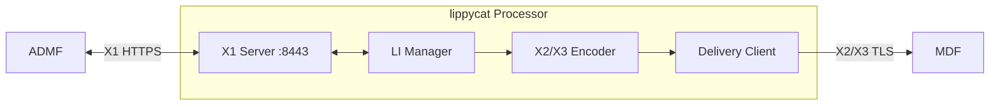

# ETSI Lawful Interception Integration Guide

This guide covers the deployment and operation of lippycat's ETSI X1/X2/X3 lawful interception interfaces.

## Overview

lippycat implements the following ETSI interfaces for lawful interception:

| Interface | Purpose | Protocol | Specification |
|-----------|---------|----------|---------------|
| **X1** | Administration (ADMF ↔ NE) | XML/HTTPS | TS 103 221-1 |
| **X2** | IRI delivery (signaling metadata) | Binary TLV/TLS | TS 103 221-2 |
| **X3** | CC delivery (content) | Binary TLV/TLS | TS 103 221-2 |

**Architecture:**



## Build Requirements

LI support is compiled via the `li` build tag:

```bash
# Build processor with LI support
make processor-li

# Build complete suite with LI support
make build-li

# Verify non-LI builds exclude LI code
make verify-no-li
```

LI code is completely excluded from standard builds through dead code elimination.

## Quick Start

### 1. Generate Certificates

LI interfaces require mutual TLS. Generate certificates for:
- X1 server (processor ↔ ADMF)
- X2/X3 delivery (processor → MDF)

See [LI_CERTIFICATES.md](LI_CERTIFICATES.md) for detailed certificate setup.

### 2. Start Processor with LI

```bash
lc process --listen :55555 \
  --tls-cert=server.crt --tls-key=server.key \
  --li-enabled \
  --li-x1-listen :8443 \
  --li-x1-tls-cert x1-server.crt \
  --li-x1-tls-key x1-server.key \
  --li-x1-tls-ca admf-ca.crt \
  --li-admf-endpoint https://admf.example.com:8443 \
  --li-admf-tls-cert x1-client.crt \
  --li-admf-tls-key x1-client.key \
  --li-admf-tls-ca admf-ca.crt \
  --li-delivery-tls-cert delivery-client.crt \
  --li-delivery-tls-key delivery-client.key \
  --li-delivery-tls-ca mdf-ca.crt
```

### 3. Configure via YAML

```yaml
# ~/.config/lippycat/config.yaml
processor:
  listen_addr: ":55555"
  tls:
    enabled: true
    cert_file: "/etc/lippycat/certs/server.crt"
    key_file: "/etc/lippycat/certs/server.key"

  li:
    enabled: true

    # X1 server (receives requests from ADMF)
    x1_listen_addr: ":8443"
    x1_tls_cert: "/etc/lippycat/li/x1-server.crt"
    x1_tls_key: "/etc/lippycat/li/x1-server.key"
    x1_tls_ca: "/etc/lippycat/li/admf-ca.crt"

    # X1 client (sends notifications to ADMF)
    admf_endpoint: "https://admf.example.com:8443"
    admf_tls_cert: "/etc/lippycat/li/x1-client.crt"
    admf_tls_key: "/etc/lippycat/li/x1-client.key"
    admf_tls_ca: "/etc/lippycat/li/admf-ca.crt"
    admf_keepalive: "30s"

    # X2/X3 delivery (to MDF)
    delivery_tls_cert: "/etc/lippycat/li/delivery.crt"
    delivery_tls_key: "/etc/lippycat/li/delivery.key"
    delivery_tls_ca: "/etc/lippycat/li/mdf-ca.crt"
    delivery_tls_pinned_cert:
      - "sha256:abc123..."  # Optional: pin MDF certificates
```

## X1 Interface (Administration)

The X1 interface provides task and destination management.

### Supported Operations

| Operation | HTTP Method | Path | Description |
|-----------|-------------|------|-------------|
| Ping | GET | /Ping | Health check |
| CreateDestination | POST | / | Register MDF endpoint |
| ModifyDestination | POST | / | Update MDF endpoint |
| RemoveDestination | DELETE | / | Remove MDF endpoint |
| ActivateTask | POST | / | Create intercept task |
| ModifyTask | POST | / | Update intercept task |
| DeactivateTask | POST | / | Stop intercept task |
| GetTaskDetails | GET | / | Query task status |

### X1 Request Format

Requests use XML per ETSI TS 103 221-1 schema:

```xml
<?xml version="1.0" encoding="UTF-8"?>
<activateTaskRequest>
  <x1RequestMessage>
    <admfIdentifier>ADMF-001</admfIdentifier>
    <x1TransactionId>550e8400-e29b-41d4-a716-446655440000</x1TransactionId>
    <messageTimestamp>2025-12-27T10:30:00Z</messageTimestamp>
    <version>v1.13.1</version>
  </x1RequestMessage>
  <taskDetails>
    <xId>a1b2c3d4-e5f6-7890-abcd-ef1234567890</xId>
    <targetIdentifiers>
      <targetIdentifier>
        <sipUri>sip:alice@example.com</sipUri>
      </targetIdentifier>
    </targetIdentifiers>
    <listOfDIDs>
      <dId>d1e2f3g4-h5i6-7890-jklm-nop123456789</dId>
    </listOfDIDs>
    <deliveryType>X2andX3</deliveryType>
    <implicitDeactivationAllowed>true</implicitDeactivationAllowed>
  </taskDetails>
</activateTaskRequest>
```

### Supported Target Types

| Target Type | X1 Element | Example | Filter Type |
|-------------|------------|---------|-------------|
| SIP URI | `<sipUri>` | `sip:alice@example.com` | FILTER_SIP_URI |
| TEL URI | `<telUri>` | `tel:+15551234567` | FILTER_PHONE_NUMBER |
| E.164 Number | `<e164Number>` | `+15551234567` | FILTER_PHONE_NUMBER |
| IPv4 Address | `<ipv4Address>` | `192.168.1.100` | FILTER_IP_ADDRESS |
| IPv4 CIDR | `<ipv4Cidr>` | `10.0.0.0/8` | FILTER_IP_ADDRESS |
| IPv6 Address | `<ipv6Address>` | `2001:db8::1` | FILTER_IP_ADDRESS |
| IPv6 CIDR | `<ipv6Cidr>` | `2001:db8::/32` | FILTER_IP_ADDRESS |
| NAI | `<nai>` | `user@realm.example.com` | FILTER_SIP_URI |

### Delivery Types

| Type | Description | X2 (IRI) | X3 (CC) |
|------|-------------|----------|---------|
| X2Only | Signaling metadata only | ✓ | |
| X3Only | Content only | | ✓ |
| X2andX3 | Both signaling and content | ✓ | ✓ |

### X1 Error Codes

| Code | Name | Description |
|------|------|-------------|
| 100 | GenericError | General error |
| 101 | RequestSyntaxError | Invalid XML |
| 300 | XIDAlreadyExists | Task XID exists |
| 301 | XIDNotFound | Task XID not found |
| 302 | DIDAlreadyExists | Destination DID exists |
| 303 | DIDNotFound | Destination DID not found |
| 400 | DeliveryNotPossible | Cannot deliver to MDF |
| 401 | TargetNotSupported | Unsupported target type |
| 402 | DeliveryTypeNotSupported | Unsupported delivery type |

## X2/X3 Protocol (Binary TLV)

Content is delivered to MDF using binary TLV encoding per TS 103 221-2.

### PDU Structure

| Offset | Field | Size |
|--------|-------|------|
| 0 | Version | 2 bytes |
| 2 | Type | 2 bytes |
| 4 | HeaderLen | 2 bytes |
| 6 | PayloadFmt | 2 bytes |
| 8 | PayloadLength | 4 bytes |
| 12 | XID (UUID) | 16 bytes |
| 28 | CorrelationID | 8 bytes |
| 36+ | Conditional Attributes (TLV) | variable |
| ... | Payload | variable |

### X2 IRI Events

| Event | SIP Trigger | Description |
|-------|-------------|-------------|
| SessionBegin | INVITE | Call initiated |
| SessionAnswer | 200 OK to INVITE | Call answered |
| SessionEnd | BYE | Call terminated |
| SessionAttempt | CANCEL/4xx/5xx/6xx | Call attempt failed |
| Registration | REGISTER | User registration |
| RegistrationEnd | REGISTER (Expires: 0) | User deregistration |

**X2 PDU Attributes:**
- Timestamp (POSIX timespec)
- Sequence Number
- Source/Destination IP and Port
- IRI Type
- SIP Call-ID, From, To, Method
- Correlation Number

### X3 CC Content

| Content Type | Description |
|--------------|-------------|
| RTP Payload | Voice/video media packets |
| DTMF | Telephone keypad signals |

**X3 PDU Attributes:**
- Timestamp
- Sequence Number
- RTP SSRC, Sequence, Timestamp
- RTP Payload Type
- Stream ID (for X2 correlation)
- Media Payload

## Task Lifecycle

### Task States

| State | Description |
|-------|-------------|
| Pending | Received but StartTime not reached |
| Active | Actively intercepting traffic |
| Suspended | Temporarily paused |
| Deactivated | Explicitly stopped |
| Failed | Fatal error occurred |

### Implicit Deactivation

When `ImplicitDeactivationAllowed=true`:
- NE may autonomously deactivate when `EndTime` is reached
- Status notification sent to ADMF via X1

When `ImplicitDeactivationAllowed=false`:
- NE ignores `EndTime`
- Only ADMF `DeactivateTask` or fatal error can end task

### Task Modification

Modifiable fields (via `ModifyTask`):
- Targets (adds/removes filter criteria)
- DestinationIDs (changes delivery endpoints)
- DeliveryType (changes X2/X3 delivery mode)
- EndTime (changes expiration)
- ImplicitDeactivationAllowed

Non-modifiable:
- XID (task identity)
- StartTime (after activation)

## ADMF Notifications

The processor sends notifications to ADMF via X1:

| Notification | Trigger |
|--------------|---------|
| Startup | Processor starts |
| Shutdown | Processor stops |
| KeepAlive | Periodic heartbeat |
| TaskProgress | Task activation progress |
| ErrorReport | Task execution errors |
| DeliveryNotification | X2/X3 delivery issues |
| ImplicitDeactivation | Task auto-expired |

Configure keepalive interval:
```bash
--li-admf-keepalive 30s  # Send keepalive every 30 seconds
--li-admf-keepalive 0    # Disable keepalive
```

## Filter Integration

LI tasks integrate with lippycat's optimized filter system:

| LI Target Type | Filter System | Optimization |
|----------------|---------------|--------------|
| SIP URI | Aho-Corasick | Pattern matching |
| Phone Number | PhoneNumberMatcher | Bloom filter + suffix matching |
| IP Address | Hash Map | O(1) lookup |
| IP CIDR | Radix/Patricia Trie | O(prefix) lookup |

**Filter Flow:**
1. ADMF activates task via X1
2. LI Manager creates filters for each target
3. Filters pushed to hunters
4. Matching packets tagged with filter IDs
5. LI Manager correlates filter ID → XID
6. X2/X3 PDUs delivered to MDF

## Performance

### Encoding Benchmarks

| Operation | Throughput | Latency |
|-----------|------------|---------|
| X2 Encode (IRI) | ~500K PDUs/s | ~2µs |
| X3 Encode (CC) | ~1M PDUs/s | ~1µs |

### Delivery

| Configuration | Throughput |
|---------------|------------|
| Single destination | ~100K PDUs/s |
| Multiple destinations | ~50K PDUs/s per dest |

Delivery uses:
- Async queue with backpressure (default: 10K items)
- Batching (default: 100 PDUs per batch)
- Connection pooling per destination

## Security

### TLS Requirements

| Interface | Minimum TLS | Mutual TLS |
|-----------|-------------|------------|
| X1 Server | TLS 1.2 | Required |
| X1 Client | TLS 1.2 | Required |
| X2/X3 Delivery | TLS 1.2 | Required |

### Certificate Pinning

For X2/X3 delivery, optionally pin MDF certificates:

```bash
--li-delivery-tls-pinned-cert sha256:abc123...
```

### Audit Logging

All LI operations are logged with structured fields:
- Task activations/deactivations
- Target modifications
- Delivery success/failures
- X1 requests and responses

## Troubleshooting

### X1 Server Not Starting

Check:
1. TLS certificates are valid and not expired
2. CA certificate matches ADMF client certs
3. Port is not in use
4. Processor built with `-tags li`

### X2/X3 Delivery Failures

Check:
1. Destination created via X1 `CreateDestination`
2. MDF server is reachable
3. Client certificates match MDF CA
4. Delivery queue not full (check stats)

### Task Not Matching

Check:
1. Task status is "Active"
2. Target format matches traffic (e.g., full SIP URI vs user only)
3. Filters pushed to hunters
4. Hunter receiving matching traffic

### Logs

Enable debug logging:
```bash
LOG_LEVEL=debug lc process --li-enabled ...
```

Key log fields:
- `xid`: Task identifier
- `did`: Destination identifier
- `filter_id`: Internal filter ID
- `packets_matched`: Count of matched packets

## Related Documentation

- [LI_CERTIFICATES.md](LI_CERTIFICATES.md) - Certificate management
- [SECURITY.md](SECURITY.md) - General security configuration
- [internal/pkg/li/CLAUDE.md](../internal/pkg/li/CLAUDE.md) - Architecture details
