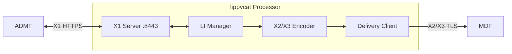

# ETSI Lawful Interception Integration Guide

This guide covers the deployment and operation of lippycat's ETSI X1/X2/X3 lawful interception interfaces.

## X1 version compatibility

lippycat declares ETSI TS 103 221-1 `v1.22.1`, matching the bundled
`TS_103_221_01.xsd` schema. It accepts the verified inclusive compatibility
window from `v1.13.1` through `v1.22.1` (with or without the lowercase `v`
prefix). Malformed revisions and revisions outside that window are rejected
with an explicit X1 request-syntax error. This is a reviewed schema
compatibility window, not a general semantic-version compatibility rule.

The V1.23.1 gap review did not pass: the generated schema remains V1.22.1 and
the implemented surface is destination create/modify/remove, task
activate/modify/deactivate/details, ping/keepalive, lifecycle/error
notifications, and state reconciliation—not every mandatory V1.23.1 operation
and field. Do not advertise V1.23.1 until all X1 schemas are regenerated and
the server, ADMF client, fixtures, and peer compatibility tests are upgraded
together. Confirm ADMF peers accept V1.22.1 responses and notifications before
cutover; remove V1.13.1 compatibility only in a coordinated release.

## X2/X3 correlation compatibility invariant

For SIP/RTP interception, the wire-level X2/X3 correlation ID is the FNV-1a
64-bit hash of the exact SIP Call-ID bytes. X2 signalling and every X3 media
stream carrying that Call-ID use the same value, regardless of SSRC, packet
direction, or SDP changes caused by a re-INVITE. Reuse of a Call-ID therefore
also reuses the correlation ID; the MDF must scope it with the XID and task time
window. Changing this derivation is an interop-breaking protocol change and
requires a coordinated MDF cutover.

## X2/X3 sequence-number policy

When attribute 8 is enabled, lippycat follows ETSI TS 103 221-2 clause 5.3.9.
Each `(PDU type, XID, Domain ID, NFID, IPID, Correlation ID)` context starts at
zero, increments independently, and wraps to zero after the maximum unsigned
32-bit value. X2 and X3 are separate contexts. The X2/X3 Domain ID is not an X1
delivery-destination `DId`, and fan-out of one encoded PDU to several MDFs does
not change its sequence number.

Sequence state is in memory. Task deactivation removes every context for its
XID. A lippycat process restart establishes new delivery connections and starts
new sequence contexts at zero; operators must confirm that the MDF treats a new
connection after a POI restart as a new sequence epoch because TS 103 221-2 does
not define a sequence-reset signal.

### X2/X3 application keepalive

Application keepalive is disabled by default and is configured independently
for X2 and X3. Enabling `--li-delivery-x2-keepalive` or
`--li-delivery-x3-keepalive` requires the MDF to return a KeepaliveAck on the
same TLS association with the identical sequence number before that
interface's TIME_P2. A missing, malformed, or wrong-sequence acknowledgement
does not refresh liveness; expiry disconnects and reconnects only that
interface and reports a delivery fault.

Inbound keepalive acknowledgement is a separate, disabled-by-default role.
Enable it per interface with
`--li-delivery-x2-ack-inbound-keepalive` or
`--li-delivery-x3-ack-inbound-keepalive`. A valid request is then answered on
the same association with its sequence echoed. This allows bidirectional
keepalive only when the MDF profile has been verified to support it.

Per-destination X2 and X3 statistics expose sent, acknowledged, timed-out,
disconnected, reconnected, inbound, inbound-acknowledged, unexpected, and
malformed control-PDU counters. Unexpected control traffic is counted without
limit while its warning log is rate-limited.

## Overview

lippycat implements the following ETSI interfaces for lawful interception:

| Interface | Purpose                           | Protocol       | Specification |
| --------- | --------------------------------- | -------------- | ------------- |
| **X1**    | Administration (ADMF ↔ NE)        | XML/HTTPS      | TS 103 221-1  |
| **X2**    | IRI delivery (signaling metadata) | Binary TLV/TLS | TS 103 221-2  |
| **X3**    | CC delivery (content)             | Binary TLV/TLS | TS 103 221-2  |

**Architecture:**


```mermaid
flowchart LR
    ADMF["ADMF"]

    subgraph Processor[lippycat Processor]
        X1["X1 Server :8443"]
        LIM["LI Manager"]
        ENC["X2/X3 Encoder"]
        DC["Delivery Client"]
    end

    MDF["MDF"]

    ADMF <-->|X1 HTTPS| X1
    X1 <--> LIM
    LIM --> ENC
    ENC --> DC
    DC -->|X2/X3 TLS| MDF
```

## Build Requirements

LI support is compiled via the `li` build tag:

```bash
# Build processor with LI support
make processor-li

# Build complete suite with LI support
make build-li

# Verify non-LI builds exclude LI code
make verify-no-li
```

LI code is completely excluded from standard builds through dead code elimination.

## Quick Start

### 1. Generate Certificates

LI interfaces require mutual TLS. Generate certificates for:

- X1 server (processor ↔ ADMF)
- X2/X3 delivery (processor → MDF)

See [LI_CERTIFICATES.md](LI_CERTIFICATES.md) for detailed certificate setup.

### 2. Start Processor with LI

```bash
lc process --listen :55555 \
  --tls-cert=server.crt --tls-key=server.key \
  --li-enabled \
  --li-x1-listen :8443 \
  --li-x1-tls-cert x1-server.crt \
  --li-x1-tls-key x1-server.key \
  --li-x1-tls-ca admf-ca.crt \
  --li-admf-endpoint https://admf.example.com:8443 \
  --li-admf-tls-cert x1-client.crt \
  --li-admf-tls-key x1-client.key \
  --li-admf-tls-ca admf-ca.crt \
  --li-delivery-tls-cert delivery-client.crt \
  --li-delivery-tls-key delivery-client.key \
  --li-delivery-tls-ca mdf-ca.crt
```

### 3. Configure via YAML

```yaml
# ~/.config/lippycat/config.yaml
processor:
  listen_addr: ":55555"
  tls:
    enabled: true
    cert_file: "/etc/lippycat/certs/server.crt"
    key_file: "/etc/lippycat/certs/server.key"

  li:
    enabled: true

    # X1 server (receives requests from ADMF)
    x1_listen_addr: ":8443"
    x1_tls_cert: "/etc/lippycat/li/x1-server.crt"
    x1_tls_key: "/etc/lippycat/li/x1-server.key"
    x1_tls_ca: "/etc/lippycat/li/admf-ca.crt"

    # X1 client (sends notifications to ADMF)
    admf_endpoint: "https://admf.example.com:8443"
    admf_tls_cert: "/etc/lippycat/li/x1-client.crt"
    admf_tls_key: "/etc/lippycat/li/x1-client.key"
    admf_tls_ca: "/etc/lippycat/li/admf-ca.crt"
    admf_keepalive: "30s"

    # X2/X3 delivery (to MDF)
    delivery_tls_cert: "/etc/lippycat/li/delivery.crt"
    delivery_tls_key: "/etc/lippycat/li/delivery.key"
    delivery_tls_ca: "/etc/lippycat/li/mdf-ca.crt"
    delivery_tls_pinned_cert:
      - "sha256:abc123..." # Optional: pin MDF certificates
```

## X1 Interface (Administration)

The X1 interface provides task and destination management.

### Supported Operations

| Operation         | HTTP Method | Path  | Description           |
| ----------------- | ----------- | ----- | --------------------- |
| Ping              | GET         | /Ping | Health check          |
| CreateDestination | POST        | /     | Register MDF endpoint |
| ModifyDestination | POST        | /     | Update MDF endpoint   |
| RemoveDestination | DELETE      | /     | Remove MDF endpoint   |
| ActivateTask      | POST        | /     | Create intercept task |
| ModifyTask        | POST        | /     | Update intercept task |
| DeactivateTask    | POST        | /     | Stop intercept task   |
| GetTaskDetails    | GET         | /     | Query task status     |

### X1 Request Format

Requests use XML per ETSI TS 103 221-1 schema:

```xml
<?xml version="1.0" encoding="UTF-8"?>
<activateTaskRequest>
  <x1RequestMessage>
    <admfIdentifier>ADMF-001</admfIdentifier>
    <x1TransactionId>550e8400-e29b-41d4-a716-446655440000</x1TransactionId>
    <messageTimestamp>2025-12-27T10:30:00Z</messageTimestamp>
    <version>v1.13.1</version>
  </x1RequestMessage>
  <taskDetails>
    <xId>a1b2c3d4-e5f6-7890-abcd-ef1234567890</xId>
    <targetIdentifiers>
      <targetIdentifier>
        <sipUri>sip:alice@example.com</sipUri>
      </targetIdentifier>
    </targetIdentifiers>
    <listOfDIDs>
      <dId>d1e2f3g4-h5i6-7890-jklm-nop123456789</dId>
    </listOfDIDs>
    <deliveryType>X2andX3</deliveryType>
    <implicitDeactivationAllowed>true</implicitDeactivationAllowed>
  </taskDetails>
</activateTaskRequest>
```

### Supported Target Types

| Target Type    | X1 Element          | Example                  | Filter Type                          |
| -------------- | ------------------- | ------------------------ | ------------------------------------ |
| SIP URI        | `<sipUri>`          | `sip:alice@example.com`  | FILTER_SIP_URI                       |
| TEL URI        | `<telUri>`          | `tel:+15551234567`       | FILTER_PHONE_NUMBER                  |
| E.164 Number   | `<e164Number>`      | `+15551234567`           | FILTER_PHONE_NUMBER                  |
| IPv4 Address   | `<ipv4Address>`     | `192.168.1.100`          | FILTER_IP_ADDRESS                    |
| IPv4 CIDR      | `<ipv4Cidr>`        | `10.0.0.0/8`             | FILTER_IP_ADDRESS                    |
| IPv6 Address   | `<ipv6Address>`     | `2001:db8::1`            | FILTER_IP_ADDRESS                    |
| IPv6 CIDR      | `<ipv6Cidr>`        | `2001:db8::/32`          | FILTER_IP_ADDRESS                    |
| NAI            | `<nai>`             | `user@realm.example.com` | RADIUS compound / exact User-Name    |
| Subscriber MAC | `<macAddress>`      | `02:00:00:00:00:01`      | RADIUS compound / Calling-Station-Id |
| RADIUS AVP     | `<radiusAttribute>` | `57086C696E652D61`       | RADIUS compound / exact AVP          |

### RADIUS X1 authorization and NAI migration

X1 `nai` now selects the complete RADIUS User-Name bytes, case-sensitively,
without stripping realms, normalization, substring matching, or SIP parsing.
NAIs must satisfy the RFC 7542 grammar and already be NFC. Intentional non-NAI
account bytes use a complete User-Name `radiusAttribute`. SIP interception must
use an explicit `sipUri` target; existing NAI tasks are never converted to SIP
URI tasks.

The accepted `radiusAttribute` subset is one complete hexadecimal AVP: User-Name
(type 1), NAS-Port-Id (87), or vendor 3561/type 1 Agent-Circuit-Id (26). Outer and
inner lengths must match; unsupported vendors, types and concatenated AVPs are
rejected. Serialization uses uppercase hex. All RADIUS targets within one task
are conjunctive; a task cannot mix RADIUS and SIP/IP targets. See the
[identity contract](design/radius-identity-contract.md) for binary examples.

Provisioning requires an explicit dedicated POI scope. The embedding application
sets `li.ManagerConfig.RADIUSScope` (operator scope, profile revision and optional
origin/interface restrictions), or `processor.Config.LIRADIUSScope`. X1 and ADMF
identifiers are bound to this deployment policy, never used to infer scope.
MAC provisioning also requires `RADIUSMACProfile` / `LIRADIUSMACProfile` set to
`calling-station-id-uppercase-hyphen-v1`. X1 MAC syntax is six lowercase
colon-separated octets; captured Calling-Station-Id must use the configured
uppercase hyphen convention. CLI deployments bind these policies with
`--li-radius-operator-scope`, `--li-radius-profile-revision`, optional
`--li-radius-origin-node` / `--li-radius-source`, and `--li-radius-mac-profile`.
Shared YAML uses `li.radius.*` and environment uses `LIPPYCAT_LI_RADIUS_*`.
For local tap capture, ordinary `--radius-operator-scope` and
`--radius-profile-revision` must match the LI binding. See the
[RADIUS operator guide](RADIUS.md#tap-poi-and-mdf-setup) for a complete tap POI
example, exact flag/key reference, NatParas resolution and known-line verification.

RADIUS tasks accept only `X2Only`, with explicitly X2-enabled destinations.
One compound filter carries the task UUID, activation generation, complete
criteria and scope. Its filter and criterion revisions equal that generation.
Modification (including destination or timing changes), expiry, deactivation and
reactivation invalidate old authorization. Direct criteria are checked against
captured bytes; inherited criteria require a unique request association and the
complete current generation. A generic filter ID never authorizes RADIUS.

Restart withdraws persisted RADIUS/legacy NAI filter IDs before listeners start.
Pending and active RADIUS tasks require ADMF confirmation or explicit provisioning
and a fresh generation; old queued product is not replay-authorized. Legacy NAI
tasks with missing scope or unsupported delivery remain disarmed until corrected.
Retained deactivated/failed legacy NAI identities stay inactive; provision a new
XID when the corrected scope or service differs from the retained identity.
Reconciliation replaces valid scoped definitions and revokes invalid RADIUS
replacements. Legacy migration requires filter inventory support to find obsolete short IDs.
Failed filter withdrawal blocks startup; failed runtime withdrawal
cannot preserve authorization for a rejected replacement. Keep durable LI state
and filter state together so generation watermarks survive ID reuse.

Local tap batches establish capture origin internally. Direct hunter streams
require verified mutual TLS with a certificate identity matching the batch hunter
ID, which must also match the observation origin. Trust is internal and is not
forwarded in protobuf. Insecure streams, server-only TLS and unverified relayed
origins continue ordinary outputs but cannot authorize RADIUS LI. Distributed
relay origin policy and reconnect/snapshot convergence remain Phase 7 gates.

### Raw RADIUS X2 delivery

Authorized RADIUS observations use a dedicated format-11 encoder and the shared
queued TLS X2 delivery path. The payload is the original validated RADIUS message;
Ethernet/IP/UDP encapsulation and padding remain only in ordinary packet outputs.
Capture timestamps and UDP endpoints are conveyed separately. Subscriber-relative
Payload Direction remains Unknown for both requests and responses. SIP metadata,
Call-ID and normalized metadata output are not prerequisites.

The authoritative processor reserves persistent Correlation ID ranges before use.
Set `processor.Config.LIRADIUSCorrelationStateFile`, or configure `LIStateFile` to
use its path plus `.radius-correlation`. The parent directory must exist and be
writable. NFID and IPID both use `ProcessorID`; missing identity or storage causes
RADIUS X2 encoding to fail closed and increments the existing X2 error counter.
Ordinary outputs continue. CLI deployments use
`--li-radius-correlation-state-file`, YAML `li.radius.correlation_state_file`, or
`LIPPYCAT_LI_RADIUS_CORRELATION_STATE_FILE`; the default is empty and retains the
LI-state-path fallback. Set `--li-radius-transaction-timeout` (YAML `li.radius.transaction_timeout`,
environment `LIPPYCAT_LI_RADIUS_TRANSACTION_TIMEOUT`) to the capture association
lifetime; it defaults to 30 seconds and accepts 1 second through 5 minutes.
`tap radius` rejects mismatched capture/LI lifetimes. Remote processors must use
their hunter deployment lifetime;
see [RADIUS configuration](RADIUS.md#shared-flags-and-configuration).

Keep the reservation file and its `.lock` file on durable storage supporting
exclusive file locks and atomic rename. Every encoder sharing NFID/IPID must use
the same shared state path; concurrent owners of that path are rejected. Different
paths on different hosts cannot detect duplicate configured identities, so assign
separate ProcessorIDs to independent POIs. Never delete or roll back reservation
storage while retaining the same ProcessorID. Restart skips unused reserved IDs;
resetting storage requires a new ProcessorID.

Request retransmissions and uniquely associated responses share an allocation
across task XIDs during the configured request lifetime (30 seconds by default). Orphan or ambiguous direct
matches use observation-scoped allocations. The map is bounded by 65,536 entries
and 16 MiB; expiration cleanup runs at most once per second. Expired exchange
observations and allocation/encoding failures suppress X2 only. Each captured
matching datagram remains a delivery opportunity; serialized retries retain their
Correlation ID and sequence. Destination and task generations use the existing
queue lifecycle safeguards. Persisted RADIUS product is not replay-authorized.

Synthetic tap pipeline tests verify a local mutual-TLS MDF receiver, exact payloads,
sequence/correlation, queue pressure, destination removal, encoder failure and
shutdown with ordinary PCAP/log outputs active. Receiving-MDF agreement and
production operator traces remain external acceptance gates; these tests do not
establish production interoperability.

### Delivery Types

| Type    | Description                | X2 (IRI) | X3 (CC) |
| ------- | -------------------------- | -------- | ------- |
| X2Only  | Signaling metadata only    | ✓        |         |
| X3Only  | Content only               |          | ✓       |
| X2andX3 | Both signaling and content | ✓        | ✓       |

### X1 Error Codes

| Code | Name                     | Description                                                     |
| ---- | ------------------------ | --------------------------------------------------------------- |
| 100  | GenericError             | General error; reactivation identity differs from retained task |
| 101  | RequestSyntaxError       | Invalid XML                                                     |
| 300  | XIDAlreadyExists         | Task XID exists                                                 |
| 301  | XIDNotFound              | Task XID not found                                              |
| 302  | DIDAlreadyExists         | Destination DID exists                                          |
| 303  | DIDNotFound              | Destination DID not found                                       |
| 400  | DeliveryNotPossible      | Cannot deliver to MDF                                           |
| 401  | TargetNotSupported       | Unsupported target type                                         |
| 402  | DeliveryTypeNotSupported | Unsupported delivery type                                       |

A repeated `ActivateTask` for an equivalent active or pending task is an
idempotent retry: it returns success without reinstalling filters or changing
the activation generation. A new, authenticated `ActivateTask` may reactivate
a retained deactivated task (tombstone) only when its protected interception
identity is unchanged. The protected identity is the XID, delivery type, and
canonical set of target type/value pairs; target order and exact duplicates do
not matter. Destination IDs, mediation start/end times, and lifecycle options
may be replaced, but the complete replacement must pass current validation.

If a retained task's protected identity differs, activation fails closed with
error 100 and the stable description `retained task's interception identity
differs` (followed by the XID). It is deliberately not error 300. Suspended and
failed tasks cannot be reactivated with `ActivateTask`.

## X2/X3 Protocol (Binary TLV)

Content is delivered to MDF using binary TLV encoding per TS 103 221-2.
The two-byte protocol version is 0.5, encoded in network byte order as `00 05`.
The fixed PDU header is 40 bytes; conditional TLV attributes extend it.

### PDU Structure

| Offset | Field                               | Size     |
| ------ | ----------------------------------- | -------- |
| 0      | Version (`0.5`, wire bytes `00 05`) | 2 bytes  |
| 2      | Type                                | 2 bytes  |
| 4      | HeaderLen                           | 4 bytes  |
| 8      | PayloadLength                       | 4 bytes  |
| 12     | PayloadFmt                          | 2 bytes  |
| 14     | PayloadDirection                    | 2 bytes  |
| 16     | XID (UUID)                          | 16 bytes |
| 32     | CorrelationID                       | 8 bytes  |
| 40+    | Conditional Attributes (TLV)        | variable |
| ...    | Payload                             | variable |

### X2 IRI Events

| Event           | SIP Trigger           | Description         |
| --------------- | --------------------- | ------------------- |
| SessionBegin    | INVITE                | Call initiated      |
| SessionAnswer   | 200 OK to INVITE      | Call answered       |
| SessionEnd      | BYE                   | Call terminated     |
| SessionAttempt  | CANCEL/4xx/5xx/6xx    | Call attempt failed |
| Registration    | REGISTER              | User registration   |
| RegistrationEnd | REGISTER (Expires: 0) | User deregistration |

**X2 PDU Attributes:**

- Timestamp (POSIX timespec)
- Sequence Number
- Source/Destination IP and Port
- IRI Type
- SIP Call-ID, From, To, Method
- Correlation Number

### X3 CC Content

| Content Type | Description               |
| ------------ | ------------------------- |
| RTP Payload  | Voice/video media packets |
| DTMF         | Telephone keypad signals  |

**X3 PDU Attributes:**

- Timestamp
- Sequence Number
- RTP SSRC, Sequence, Timestamp
- RTP Payload Type
- Stream ID (for X2 correlation)
- Media Payload

### Payload Direction

X2 and X3 PDUs carry the ETSI Payload Direction (`fromTarget` / `toTarget`), which a
LEMF uses to build the two-channel audio product by pairing the two directions of a
call. It is set only for tasks with **exactly one target** — with several targets the
matched identity is ambiguous, so the direction is left `indeterminate` and the MDF
correlates by XID instead.

How it is derived:

| Target type                | Signaling (X2)                        | Media (X3)                                 |
| -------------------------- | ------------------------------------- | ------------------------------------------ |
| IP address / CIDR          | packet source and destination address | packet source and destination address      |
| SIP URI, tel URI, username | SIP `From` / `To` identity            | the call's SDP, resolved once per RTP SSRC |

For identity targets the media direction comes from the signalling of the same call:
which party of the dialog the target is, and which media endpoints each party
advertised in SDP. It is therefore `indeterminate` when that signalling was not
observed — most commonly when a task is activated **mid-call**, since the offer and
answer have already passed. Media of calls set up after activation is labelled
normally. A direction is never guessed: where the evidence is absent, the field stays
`indeterminate`.

Both legs of a relayed call (for example a target behind an IMS media gateway) are
delivered and are labelled consistently, distinguished by their stream identifier.

### Security-sensitive RTP attribution

RTP identity-filter inheritance is fail closed. The processor resolves the exact
source and destination media endpoints against the active-call registry. Identity
selection is inherited only when that lookup proves one authoritative Call-ID. If
the endpoint is unknown or is shared by multiple live calls, the packet is not
assigned to the most recently observed call and identities from every possible
owner are not combined. The inherited identity match is suppressed instead.

Packet-level IP address and CIDR targets are independent direct evidence. They are
matched against the RTP packet's source and destination addresses and remain
eligible even when call ownership is ambiguous. Thus an ambiguous RTP packet can
still be delivered to a directly matching IP/CIDR task, but it cannot enter a SIP
URI, telephone-number, username, IMSI, or IMEI task by guessed inheritance.

Call finalization is also an enforcement boundary. A shared lifecycle registry
prevents X3 encoding, reorder-buffer insertion, and delivery after BYE/CANCEL,
failure, idle/capacity cleanup, or manual finalization. Terminal Call-ID
tombstones are retained for the configured closed-call TTL (one hour by default)
and are bounded to 100,000 entries. Capacity eviction is observable. A Call-ID
seen after its tombstone expires starts a new generation; buffered content from
an older generation is never attached to it.

For tasks with multiple MDF destinations, fan-out is fail-closed but not an
atomic multicast operation. The first destination commits under the task and
call admissions acquired for the packet; each subsequent destination rechecks
those admissions before accepting the same PDU. If task or call finalization
begins during that loop, an earlier MDF may receive the PDU while later MDFs
drop it and increment the applicable finalized/stale suppression accounting.
Operators that require cross-MDF atomic delivery must provide that coordination
outside lippycat and reconcile per-destination sequence and drop metrics.

## Task Lifecycle

### Task States

| State       | Description                        |
| ----------- | ---------------------------------- |
| Pending     | Received but StartTime not reached |
| Active      | Actively intercepting traffic      |
| Suspended   | Temporarily paused                 |
| Deactivated | Explicitly stopped                 |
| Failed      | Fatal error occurred               |

`GetTaskDetails` keeps the ETSI `provisioningStatus` enumeration unchanged:
pending tasks use `awaitingProvisioning`, failed tasks use `failed`, and active,
suspended, and deactivated tasks use `complete`. No vendor-specific task-status
extension is emitted on X1.

### Explicit tombstone reactivation

Deactivation removes the task's enforcement filters but retains a tombstone for
audit and retry safety. It never becomes enforcing through startup,
reconciliation, or tombstone maintenance. Reactivation requires an explicit,
authenticated `ActivateTask` with the same protected identity described under
[X1 Error Codes](#x1-error-codes). A successful reactivation increments the
activation generation, preserves the prior deactivated task in audit history,
and installs only the replacement task's filters.

Provision destinations before sending the reactivation. A missing destination
or an incompatible task/destination delivery combination rejects the request
without changing the tombstone or filters. After an uncertain response, query
`GetTaskDetails`: retry the identical request only when the state is `pending`
or `active`; if it remains `deactivated`, correct the validation error and send
a new explicit activation. Treat error 100 with the retained-identity
description as an authorization/identity mismatch requiring operator review,
not as a cue to modify the target under the retained XID.

### Implicit Deactivation

When `ImplicitDeactivationAllowed=true`:

- NE may autonomously deactivate when `EndTime` is reached
- Status notification sent to ADMF via X1

When `ImplicitDeactivationAllowed=false`:

- NE ignores `EndTime`
- Only ADMF `DeactivateTask` or fatal error can end task

### Task Modification

Modifiable fields (via `ModifyTask`):

- Targets (adds/removes filter criteria)
- DestinationIDs (changes delivery endpoints)
- DeliveryType (changes X2/X3 delivery mode)
- EndTime (changes expiration)
- ImplicitDeactivationAllowed

Non-modifiable:

- XID (task identity)
- StartTime (after activation)

## ADMF Notifications

The processor sends notifications to ADMF via X1:

| Notification         | Trigger                  |
| -------------------- | ------------------------ |
| Startup              | Processor starts         |
| Shutdown             | Processor stops          |
| KeepAlive            | Periodic heartbeat       |
| TaskProgress         | Task activation progress |
| ErrorReport          | Task execution errors    |
| DeliveryNotification | X2/X3 delivery issues    |
| ImplicitDeactivation | Task auto-expired        |

Configure keepalive interval:

```bash
--li-admf-keepalive 30s  # Send keepalive every 30 seconds
--li-admf-keepalive 0    # Disable keepalive
```

## Filter Integration

LI tasks integrate with lippycat's optimized filter system:

| LI Target Type | Filter System       | Optimization                   |
| -------------- | ------------------- | ------------------------------ |
| SIP URI        | Aho-Corasick        | Pattern matching               |
| Phone Number   | PhoneNumberMatcher  | Bloom filter + suffix matching |
| IP Address     | Hash Map            | O(1) lookup                    |
| IP CIDR        | Radix/Patricia Trie | O(prefix) lookup               |

**Filter Flow:**

1. ADMF activates task via X1
2. LI Manager creates filters for each target
3. Filters pushed to hunters
4. Matching packets tagged with filter IDs
5. LI Manager correlates filter ID → XID
6. X2/X3 PDUs delivered to MDF

## Performance

### Encoding Benchmarks

| Operation       | Throughput   | Latency |
| --------------- | ------------ | ------- |
| X2 Encode (IRI) | ~500K PDUs/s | ~2µs    |
| X3 Encode (CC)  | ~1M PDUs/s   | ~1µs    |

### Delivery

| Configuration         | Throughput           |
| --------------------- | -------------------- |
| Single destination    | ~100K PDUs/s         |
| Multiple destinations | ~50K PDUs/s per dest |

Delivery uses:

- Async queue with backpressure (default: 10K items)
- Batching (default: 100 PDUs per batch)
- Connection pooling per destination

## Security

### TLS Requirements

| Interface      | Minimum TLS | Mutual TLS                                               |
| -------------- | ----------- | -------------------------------------------------------- |
| X1 Server      | TLS 1.3     | Required; `--li-x1-tls-ca` must trust the ADMF client CA |
| X1 Client      | TLS 1.2     | Required                                                 |
| X2/X3 Delivery | TLS 1.2     | Required                                                 |

### Certificate Pinning

For X2/X3 delivery, optionally pin MDF certificates:

```bash
--li-delivery-tls-pinned-cert sha256:abc123...
```

### Audit Logging

All LI operations are logged with structured fields:

- Task activations/deactivations
- Target modifications
- Delivery success/failures
- X1 requests and responses

### Delivery Telemetry

Query a processor or standalone tap through its management endpoint:

```bash
lc show status -P processor.example.com:55555 --tls-ca ca.crt
```

When LI delivery is configured, the JSON response includes `li_delivery` alongside
the separate `li_encoding` counters. The delivery object reports aggregate
`x2_enqueue_calls`, `x3_enqueue_calls`, `x2_written`, `x3_written`, `x2_dropped`,
`x3_dropped`, `retries`, and `queue_depth`. Enqueue counters count successful
asynchronous calls into the delivery client, including calls with no eligible
destinations. Written and dropped counters count destination copies: one
enqueue can fan out to several destinations, so these counters do not directly
reconcile with each other or with encoded counts.

`li_delivery.destinations` is keyed by destination UUID. Each entry includes:

| Fields                                                                                                                                  | Interpretation                                                                                                                    |
| --------------------------------------------------------------------------------------------------------------------------------------- | --------------------------------------------------------------------------------------------------------------------------------- |
| `x2_queue_depth`, `x3_queue_depth`, `x2_queue_capacity`, `x3_queue_capacity`                                                            | Current backlog and capacity for each interface; capacity is not shared between X2 and X3.                                        |
| `oldest_queued_age_ms`, `x2_oldest_age_ms`, `x3_oldest_age_ms`                                                                          | Current age of the oldest queued product, in milliseconds; use rising age to detect delay before overflow.                        |
| `x2_written`, `x3_written`, `x2_dropped`, `x3_dropped`, `retries`, `dropped_by_reason`                                                  | Cumulative delivery outcomes and retry attempts, including `queue_overflow` losses.                                               |
| `last_write_unix_ms`, `last_queue_error`                                                                                                | Last successful queued-product write timestamp and queue error; a zero timestamp means no such write has been observed.           |
| `connection_state`, `last_connection_error`, `connect_attempts`, `connect_failures`, `write_errors`, `x2_connections`, `x3_connections` | Connection state, failures, and current connections for the destination.                                                          |
| `x2_keepalive`, `x3_keepalive`                                                                                                          | Per-interface probe configuration, latest probe and ACK timestamps, ACK age, probe/ACK/timeout counts, and reconnect information. |

Written counts mean successful **local TLS writes**, not receiver acceptance of
individual products. Keepalive ACKs establish control responsiveness, not product
acknowledgement. An empty queue alone therefore does not prove end-to-end receipt.
Queue ages and depths describe current backlog; drops are cumulative loss, so
compare successive samples to identify new losses. The last connection error is
cleared on successful connect; the last queue error is cleared on successful
queued-product write.

These counters are volatile and reset when the delivery client restarts.
Per-destination details disappear when a destination is removed; collect them
externally if historical diagnostics are required. Zero-valued fields may be
omitted from JSON. An absent `li_delivery` means delivery telemetry is unavailable,
not that delivery has succeeded.

Snapshots are observations taken during concurrent delivery, so aggregate and
destination values can differ briefly. Keepalive timestamps describe connection
observations and may reset on reconnection; a missing ACK timestamp means no ACK
has been observed for that reported connection state.

## Troubleshooting

### X1 Server Not Starting

Check:

1. TLS certificates are valid and not expired
2. CA certificate matches ADMF client certs
3. Port is not in use
4. Processor built with `-tags li`

### X2/X3 Delivery Failures

Check:

1. Destination created via X1 `CreateDestination`
2. MDF server is reachable
3. Client certificates match MDF CA
4. Per-destination queue depth, oldest queued age, retries, and overflow drops
5. Reconnect and peer-close logs for the destination DID

Short MDF outages are buffered and flushed in interface FIFO order. With
journaling disabled, capacity pressure can evict an unclaimed oldest PDU
(`queue_overflow`); claimed heads and admissions that cannot fit are protected by
rejecting the new PDU (`capacity_rejected`). Journaled X2 rejects new admissions
instead of evicting retained product. Oversized PDUs are rejected explicitly.

### Task Not Matching

Check:

1. Task status is "Active"
2. Target format matches traffic (e.g., full SIP URI vs user only)
3. Filters pushed to hunters
4. Hunter receiving matching traffic

### Media Delivered as `indeterminate`

If CC PDUs carry no Payload Direction, the LEMF cannot pair the two audio channels
automatically. Check:

1. The task has exactly one target — direction is not set for multi-target tasks
2. The call's INVITE and its answer were intercepted; a task activated mid-call has
   no signalling to derive from
3. The signalling carried SDP (both the offer and the answer)
4. With debug logging, look for `LI media direction resolved for SSRC`; its absence
   alongside `LI media direction: SDP owner not attributable` means the SDP could not
   be attributed to a party

### Ambiguous RTP ownership or rejected late X3

These are intentional fail-closed outcomes, not evidence of packet loss. Monitor
the processor/source status counters and structured warnings:

| Signal                                                 | Increment owner and interpretation                                                                                                                                                                                                                                                           |
| ------------------------------------------------------ | -------------------------------------------------------------------------------------------------------------------------------------------------------------------------------------------------------------------------------------------------------------------------------------------- |
| `rtp_ownership_unresolved` / `rtp_ownership_ambiguous` | The local source or distributed hunter increments one exceptional-outcome counter when exact-endpoint lookup cannot identify one authoritative call. `ambiguous` means multiple live calls own the evidence; `unresolved` means none does. Resolved packets do not increment either counter. |
| `identity_inheritance_suppressed`                      | The local source or distributed hunter increments once per classified media packet whose identity inheritance is denied. Direct IP/CIDR matches may still pass.                                                                                                                              |
| `inherited_provenance_rejected`                        | The LI manager increments once per inherited filter ID rejected at the LI trust boundary, including non-authoritative or mismatched Call-ID provenance.                                                                                                                                      |
| `x3_finalized_or_stale_suppressed`                     | The processor LI path increments at the admission check that rejects X3 work for a finalized or stale call generation. It is not incremented again by a downstream layer for the same rejection.                                                                                             |
| `x3_buffered_discarded`                                | The call-finalization subscriber increments by the number of queued reorder entries removed for that exact Call-ID and generation.                                                                                                                                                           |
| lifecycle tombstone capacity evictions                 | The lifecycle registry increments once for each terminal tombstone removed to enforce its bound. Sustained growth shortens effective late-content protection.                                                                                                                                |

Warnings for ambiguous ownership and rejected late X3 content are rate limited.
They use sanitized or hashed identifiers rather than raw SIP identities or Call-IDs;
use the counter deltas as the authoritative volume signal. A rising ambiguity rate
usually indicates shared SBC/media-gateway endpoints, missing SDP, or capture from
only one side of a NAT boundary. A rising finalized/stale-generation rate indicates
late capture batches, excessive reorder delay, or Call-ID reuse. Do not work around
either condition by selecting the newest candidate or merging candidate owners.

### Logs

Enable debug logging:

```bash
LOG_LEVEL=debug lc process --li-enabled ...
```

Key log fields:

- `xid`: Task identifier
- `did`: Destination identifier
- `filter_id`: Internal filter ID
- `packets_matched`: Count of matched packets

## Related Documentation

- [LI_CERTIFICATES.md](LI_CERTIFICATES.md) - Certificate management
- [SECURITY.md](SECURITY.md) - General security configuration
- [internal/pkg/li/CLAUDE.md](../internal/pkg/li/CLAUDE.md) - Architecture details

### Delivery byte limits, age and X2 persistence

Processor and tap accept the same LI delivery options. Existing deployments keep
10,000 PDUs per destination **and interface**, with no byte limit, age expiry or
journal unless configured. `--li-delivery-queue-size` remains the fallback PDU cap;
`--li-delivery-x2-queue-size` and `--li-delivery-x3-queue-size` independently override
it (zero inherits the fallback).

| Option                                 | Unit/default   | Behavior                                                        |
| -------------------------------------- | -------------- | --------------------------------------------------------------- |
| `--li-delivery-x2-queue-size`          | PDUs / `0`     | X2 cap per destination; zero inherits queue-size                |
| `--li-delivery-x3-queue-size`          | PDUs / `0`     | X3 cap per destination; zero inherits queue-size                |
| `--li-delivery-x2-queue-bytes`         | bytes / `0`    | Per-destination X2 encoded payload budget; zero disables it     |
| `--li-delivery-x3-queue-bytes`         | bytes / `0`    | Independent X3 encoded payload budget                           |
| `--li-delivery-x3-max-age`             | duration / `0` | Maximum local X3 residence; zero disables expiry                |
| `--li-delivery-memory-budget-bytes`    | bytes / `0`    | Reservation ceiling; requires both byte budgets when enabled    |
| `--li-delivery-x2-spool-dir`           | path / empty   | Enables the encrypted X2 journal                                |
| `--li-delivery-x2-spool-max-bytes`     | bytes / `0`    | Required positive disk budget when journaling is enabled        |
| `--li-delivery-x2-spool-key-file`      | path / empty   | Required private file containing a raw 32-byte AES key          |
| `--li-delivery-x2-spool-replay-policy` | `hold`         | Recovered records remain held; `purge` explicitly discards them |

Byte and PDU limits both apply, including claimed writes. Oversized PDUs are
rejected. X2 and X3 have independent FIFO delivery and retry workers, so an X3
outage does not reserve X2 capacity. The memory budget reserves each destination's
full configured payload capacities plus conservative queue and worker overhead;
a destination cannot borrow another destination's reservation. This is an LI
delivery reservation estimate, not a process RSS limit: packet capture, encoding,
TLS, Go runtime and other processor services need separate memory headroom.

Size each interface for **peak encoded bytes/second × desired outage seconds**,
then add headroom and a sufficient PDU cap. For example, 200,000 encoded X3
bytes/second for five minutes needs at least 60,000,000 bytes, before headroom.
Recovery throughput must exceed ongoing traffic to drain backlog.

```yaml
processor: # use tap: for standalone capture
  li:
    delivery_queue_size: 100000
    delivery_x2_queue_bytes: 67108864
    delivery_x3_queue_bytes: 83886080
    delivery_x3_max_age: 5m
    delivery_memory_budget_bytes: 4294967296
    delivery_x2_spool_dir: /var/lib/lippycat/x2
    delivery_x2_spool_max_bytes: 1073741824
    delivery_x2_spool_key_file: /etc/lippycat/x2.key
    delivery_x2_spool_replay_policy: hold
```

For these new options, environment names are
`LIPPYCAT_PROCESSOR_LI_DELIVERY_X3_MAX_AGE`,
`LIPPYCAT_TAP_LI_DELIVERY_X3_MAX_AGE`, and equivalently the uppercase underscored
option names under the matching role. Explicit flags override environment values,
which override YAML. Integer capacities are bytes, not MiB strings.

X3 age begins at first local LI admission, includes RTP reorder and retries, and
is independent of diagnostic capture timestamps. Expiry remains active during an
outage and is checked again at the transport write lock. Task/call cancellation
can close an active write. A partial or uncertain write is reported separately
from a known queue discard. A successful local write does not prove MDF receipt.
X2 does not inherit X3 expiry; X3 is never written to the journal.

Journal directories must be private (`0700`) and journal/key files private
(`0600`). Keep the key across restarts: losing it prevents recovery. Journal
records preserve the immutable encoded PDU, sequence and lifecycle identity.
Asynchronous enqueue acknowledges memory admission only. A crash before the
journal worker syncs can lose pending records; status separates pending from
persisted records. Full journal capacity rejects new admissions while retaining
persisted records.

Recovered X2 is **held by default**, including records whose task has ended or
whose destination was removed or replaced. Neither a reused XID nor a reused
destination UUID authorizes replay. Authorized replay is an embedding/control-plane
operation through `ReplayHeldX2` with an explicit identity reconciliation callback;
the command-line application can authorize an exact private replay manifest only after ADMF startup reconciliation.
`PurgeHeldX2` provides explicit administrative removal; the startup `purge` policy
removes recovered records. Held records remain inside the journal byte budget.
Retained sequences are reserved before new encoding. Preserve the default `hold`
policy until the controlling application can verify the original identities with
ADMF. Use the export/replay procedure below to approve recovered backlog after restart.

`lc show status` exposes encoded queue/in-flight bytes, effective per-interface
byte capacities, expired X3 counts, reason-labelled dropped bytes, and X2 journal
bytes, limit, pending/persisted/held counts, rejection count and last error.
Aggregate dropped-byte counts survive destination removal. Shutdown uses the
configured delivery drain deadline; persistent X2 retained on disk is distinct
from volatile loss. Existing status field meanings remain unchanged.

#### Approving held X2 from the command line

Start with the usual spool/key configuration and
`--li-delivery-x2-spool-export-manifest=/secure/held-x2.json`. The export is a
private JSON identity manifest, bounded to 10,000 records per export. Keep it
outside the journal directory. Review its exact record IDs, XIDs, destination
UUIDs and lifecycle generations against ADMF authorization, retaining only the
records approved for delivery in a separate private file.

On the next startup, pass
`--li-delivery-x2-spool-replay-manifest=/secure/approved-x2.json`, together with
`--li-state-file`, ADMF endpoint and enabled startup synchronization. Replay needs
both exact manifest identity and current reconciled authorization; UUID equality
alone does not suffice. Export and approval paths must differ. Records not
approved remain held and consume journal capacity. Because held product precedes
live X2, live journal admissions for that destination are rejected until held records are
reconciled or explicitly purged; other destinations remain independent. When more than 10,000 records are held, repeat the bounded
export/approval procedure after each approved group drains.

The LI state file retains per-XID generation watermarks after task expiry and
cleanup, so its metadata grows with historical XIDs. Keep this state with the X2
journal; deleting or restoring it independently can erase the identities needed
to distinguish old product from a later activation of the same XID.
Task generations and destination identities are checkpointed before the changed
delivery becomes eligible. Failure of that identity checkpoint prevents publishing
the change.

A manifest has this versioned shape (use exported values):

```json
{
  "version": 1,
  "records": [
    {
      "id": 123,
      "xid": "00000000-0000-0000-0000-000000000001",
      "did": "00000000-0000-0000-0000-000000000002",
      "task_generation": 8,
      "destination_generation": 9
    }
  ]
}
```

Managed memory reservations include a 16 MiB shared RTP reorder allowance,
per-destination payload/owner reservations, one shared incoming-payload allowance
equal to the larger X2/X3 byte limit, and bounded journal index, pending
operation, recovery and encryption working memory. Journal working memory is
reserved conservatively even when the current journal is empty. Status exposes
`memory_budget_bytes`, `reserved_memory_bytes` and `x3_max_age_ms`; aggregate
reason counters and `first_dropped_unix_ms` remain available after destination
removal. These reservations cover managed LI delivery/reorder allocations and do
not bound total process RSS.

The incoming-payload allowance covers admission while existing queues are full.
Explicit memory budgets sized exactly to older reservation totals may need to
increase by the larger interface byte limit before startup accepts them.

`uncertain_writes` and `uncertain_bytes` count transport attempts whose remote
acceptance is unknown, including attempts later retried successfully. They are
separate from terminal drop counters: a retry can duplicate bytes accepted by MDF
before the connection failed. No exactly-once remote receipt is implied.

Journal sequence high-water marks survive successful delivery and product purge,
so sequence continuity also covers a restart after the backlog has drained.
Sequence contexts consume a bounded journal budget; exhausting that metadata
capacity fails closed rather than forgetting previously used sequence values.

`queue_bytes` counts logical encoded destination copies; `physical_queue_bytes`
counts the shared encoded payload allocation once while any destination retains
it. Per-destination budgets still charge each copy independently.

ShutdownTimeout bounds the eligible delivery drain and transport cancellation.
The journal then checkpoints and joins its filesystem worker on a functioning
local filesystem. A filesystem syscall stuck in the kernel cannot be forcibly
cancelled by this deadline; a failed or unresponsive storage device can delay
shutdown. Pending records are not durability acknowledgements.

`x2_journal.replay_pending` counts held records already authorized but awaiting
memory capacity for replay; remaining held records still need authorization.
`x2_journal.uncertain` counts records possibly durable after a later checkpoint
failure. Programmatic persistent X2 producers must supply nonzero task activation
generation through `SendX2WithMetadata`; built-in processor/tap producers do so.
Journal file budgets charge filesystem block-rounded allocations and reserve
fault/checkpoint metadata; directory, inode and filesystem journal overhead need
separate disk headroom. Sequence identity fields are bounded to 512 combined bytes.
