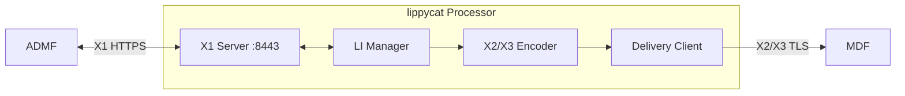

# ETSI Lawful Interception Integration Guide

This guide covers the deployment and operation of lippycat's ETSI X1/X2/X3 lawful interception interfaces.

## X1 version compatibility

lippycat declares ETSI TS 103 221-1 `v1.22.1`, matching the bundled
`TS_103_221_01.xsd` schema. It accepts the verified inclusive compatibility
window from `v1.13.1` through `v1.22.1` (with or without the lowercase `v`
prefix). Malformed revisions and revisions outside that window are rejected
with an explicit X1 request-syntax error. This is a reviewed schema
compatibility window, not a general semantic-version compatibility rule.

The V1.23.1 gap review did not pass: the generated schema remains V1.22.1 and
the implemented surface is destination create/modify/remove, task
activate/modify/deactivate/details, ping/keepalive, lifecycle/error
notifications, and state reconciliation—not every mandatory V1.23.1 operation
and field. Do not advertise V1.23.1 until all X1 schemas are regenerated and
the server, ADMF client, fixtures, and peer compatibility tests are upgraded
together. Confirm ADMF peers accept V1.22.1 responses and notifications before
cutover; remove V1.13.1 compatibility only in a coordinated release.

## X2/X3 correlation compatibility invariant

For SIP/RTP interception, the wire-level X2/X3 correlation ID is the FNV-1a
64-bit hash of the exact SIP Call-ID bytes. X2 signalling and every X3 media
stream carrying that Call-ID use the same value, regardless of SSRC, packet
direction, or SDP changes caused by a re-INVITE. Reuse of a Call-ID therefore
also reuses the correlation ID; the MDF must scope it with the XID and task time
window. Changing this derivation is an interop-breaking protocol change and
requires a coordinated MDF cutover.

## X2/X3 sequence-number policy

When attribute 8 is enabled, lippycat follows ETSI TS 103 221-2 clause 5.3.9.
Each `(PDU type, XID, Domain ID, NFID, IPID, Correlation ID)` context starts at
zero, increments independently, and wraps to zero after the maximum unsigned
32-bit value. X2 and X3 are separate contexts. The X2/X3 Domain ID is not an X1
delivery-destination `DId`, and fan-out of one encoded PDU to several MDFs does
not change its sequence number.

Sequence state is in memory. Task deactivation removes every context for its
XID. A lippycat process restart establishes new delivery connections and starts
new sequence contexts at zero; operators must confirm that the MDF treats a new
connection after a POI restart as a new sequence epoch because TS 103 221-2 does
not define a sequence-reset signal.

### X2/X3 application keepalive

Application keepalive is disabled by default and is configured independently
for X2 and X3. Enabling `--li-delivery-x2-keepalive` or
`--li-delivery-x3-keepalive` requires the MDF to return a KeepaliveAck on the
same TLS association with the identical sequence number before that
interface's TIME_P2. A missing, malformed, or wrong-sequence acknowledgement
does not refresh liveness; expiry disconnects and reconnects only that
interface and reports a delivery fault.

Inbound keepalive acknowledgement is a separate, disabled-by-default role.
Enable it per interface with
`--li-delivery-x2-ack-inbound-keepalive` or
`--li-delivery-x3-ack-inbound-keepalive`. A valid request is then answered on
the same association with its sequence echoed. This allows bidirectional
keepalive only when the MDF profile has been verified to support it.

Per-destination X2 and X3 statistics expose sent, acknowledged, timed-out,
disconnected, reconnected, inbound, inbound-acknowledged, unexpected, and
malformed control-PDU counters. Unexpected control traffic is counted without
limit while its warning log is rate-limited.

## Overview

lippycat implements the following ETSI interfaces for lawful interception:

| Interface | Purpose | Protocol | Specification |
|-----------|---------|----------|---------------|
| **X1** | Administration (ADMF ↔ NE) | XML/HTTPS | TS 103 221-1 |
| **X2** | IRI delivery (signaling metadata) | Binary TLV/TLS | TS 103 221-2 |
| **X3** | CC delivery (content) | Binary TLV/TLS | TS 103 221-2 |

**Architecture:**


```mermaid
flowchart LR
    ADMF["ADMF"]

    subgraph Processor[lippycat Processor]
        X1["X1 Server :8443"]
        LIM["LI Manager"]
        ENC["X2/X3 Encoder"]
        DC["Delivery Client"]
    end

    MDF["MDF"]

    ADMF <-->|X1 HTTPS| X1
    X1 <--> LIM
    LIM --> ENC
    ENC --> DC
    DC -->|X2/X3 TLS| MDF
```

## Build Requirements

LI support is compiled via the `li` build tag:

```bash
# Build processor with LI support
make processor-li

# Build complete suite with LI support
make build-li

# Verify non-LI builds exclude LI code
make verify-no-li
```

LI code is completely excluded from standard builds through dead code elimination.

## Quick Start

### 1. Generate Certificates

LI interfaces require mutual TLS. Generate certificates for:
- X1 server (processor ↔ ADMF)
- X2/X3 delivery (processor → MDF)

See [LI_CERTIFICATES.md](LI_CERTIFICATES.md) for detailed certificate setup.

### 2. Start Processor with LI

```bash
lc process --listen :55555 \
  --tls-cert=server.crt --tls-key=server.key \
  --li-enabled \
  --li-x1-listen :8443 \
  --li-x1-tls-cert x1-server.crt \
  --li-x1-tls-key x1-server.key \
  --li-x1-tls-ca admf-ca.crt \
  --li-admf-endpoint https://admf.example.com:8443 \
  --li-admf-tls-cert x1-client.crt \
  --li-admf-tls-key x1-client.key \
  --li-admf-tls-ca admf-ca.crt \
  --li-delivery-tls-cert delivery-client.crt \
  --li-delivery-tls-key delivery-client.key \
  --li-delivery-tls-ca mdf-ca.crt
```

### 3. Configure via YAML

```yaml
# ~/.config/lippycat/config.yaml
processor:
  listen_addr: ":55555"
  tls:
    enabled: true
    cert_file: "/etc/lippycat/certs/server.crt"
    key_file: "/etc/lippycat/certs/server.key"

  li:
    enabled: true

    # X1 server (receives requests from ADMF)
    x1_listen_addr: ":8443"
    x1_tls_cert: "/etc/lippycat/li/x1-server.crt"
    x1_tls_key: "/etc/lippycat/li/x1-server.key"
    x1_tls_ca: "/etc/lippycat/li/admf-ca.crt"

    # X1 client (sends notifications to ADMF)
    admf_endpoint: "https://admf.example.com:8443"
    admf_tls_cert: "/etc/lippycat/li/x1-client.crt"
    admf_tls_key: "/etc/lippycat/li/x1-client.key"
    admf_tls_ca: "/etc/lippycat/li/admf-ca.crt"
    admf_keepalive: "30s"

    # X2/X3 delivery (to MDF)
    delivery_tls_cert: "/etc/lippycat/li/delivery.crt"
    delivery_tls_key: "/etc/lippycat/li/delivery.key"
    delivery_tls_ca: "/etc/lippycat/li/mdf-ca.crt"
    delivery_tls_pinned_cert:
      - "sha256:abc123..."  # Optional: pin MDF certificates
```

## X1 Interface (Administration)

The X1 interface provides task and destination management.

### Supported Operations

| Operation | HTTP Method | Path | Description |
|-----------|-------------|------|-------------|
| Ping | GET | /Ping | Health check |
| CreateDestination | POST | / | Register MDF endpoint |
| ModifyDestination | POST | / | Update MDF endpoint |
| RemoveDestination | DELETE | / | Remove MDF endpoint |
| ActivateTask | POST | / | Create intercept task |
| ModifyTask | POST | / | Update intercept task |
| DeactivateTask | POST | / | Stop intercept task |
| GetTaskDetails | GET | / | Query task status |

### X1 Request Format

Requests use XML per ETSI TS 103 221-1 schema:

```xml
<?xml version="1.0" encoding="UTF-8"?>
<activateTaskRequest>
  <x1RequestMessage>
    <admfIdentifier>ADMF-001</admfIdentifier>
    <x1TransactionId>550e8400-e29b-41d4-a716-446655440000</x1TransactionId>
    <messageTimestamp>2025-12-27T10:30:00Z</messageTimestamp>
    <version>v1.13.1</version>
  </x1RequestMessage>
  <taskDetails>
    <xId>a1b2c3d4-e5f6-7890-abcd-ef1234567890</xId>
    <targetIdentifiers>
      <targetIdentifier>
        <sipUri>sip:alice@example.com</sipUri>
      </targetIdentifier>
    </targetIdentifiers>
    <listOfDIDs>
      <dId>d1e2f3g4-h5i6-7890-jklm-nop123456789</dId>
    </listOfDIDs>
    <deliveryType>X2andX3</deliveryType>
    <implicitDeactivationAllowed>true</implicitDeactivationAllowed>
  </taskDetails>
</activateTaskRequest>
```

### Supported Target Types

| Target Type | X1 Element | Example | Filter Type |
|-------------|------------|---------|-------------|
| SIP URI | `<sipUri>` | `sip:alice@example.com` | FILTER_SIP_URI |
| TEL URI | `<telUri>` | `tel:+15551234567` | FILTER_PHONE_NUMBER |
| E.164 Number | `<e164Number>` | `+15551234567` | FILTER_PHONE_NUMBER |
| IPv4 Address | `<ipv4Address>` | `192.168.1.100` | FILTER_IP_ADDRESS |
| IPv4 CIDR | `<ipv4Cidr>` | `10.0.0.0/8` | FILTER_IP_ADDRESS |
| IPv6 Address | `<ipv6Address>` | `2001:db8::1` | FILTER_IP_ADDRESS |
| IPv6 CIDR | `<ipv6Cidr>` | `2001:db8::/32` | FILTER_IP_ADDRESS |
| NAI | `<nai>` | `user@realm.example.com` | FILTER_SIP_URI |

### Delivery Types

| Type | Description | X2 (IRI) | X3 (CC) |
|------|-------------|----------|---------|
| X2Only | Signaling metadata only | ✓ | |
| X3Only | Content only | | ✓ |
| X2andX3 | Both signaling and content | ✓ | ✓ |

### X1 Error Codes

| Code | Name | Description |
|------|------|-------------|
| 100 | GenericError | General error; reactivation identity differs from retained task |
| 101 | RequestSyntaxError | Invalid XML |
| 300 | XIDAlreadyExists | Task XID exists |
| 301 | XIDNotFound | Task XID not found |
| 302 | DIDAlreadyExists | Destination DID exists |
| 303 | DIDNotFound | Destination DID not found |
| 400 | DeliveryNotPossible | Cannot deliver to MDF |
| 401 | TargetNotSupported | Unsupported target type |
| 402 | DeliveryTypeNotSupported | Unsupported delivery type |

A repeated `ActivateTask` for an equivalent active or pending task is an
idempotent retry: it returns success without reinstalling filters or changing
the activation generation. A new, authenticated `ActivateTask` may reactivate
a retained deactivated task (tombstone) only when its protected interception
identity is unchanged. The protected identity is the XID, delivery type, and
canonical set of target type/value pairs; target order and exact duplicates do
not matter. Destination IDs, mediation start/end times, and lifecycle options
may be replaced, but the complete replacement must pass current validation.

If a retained task's protected identity differs, activation fails closed with
error 100 and the stable description `retained task's interception identity
differs` (followed by the XID). It is deliberately not error 300. Suspended and
failed tasks cannot be reactivated with `ActivateTask`.

## X2/X3 Protocol (Binary TLV)

Content is delivered to MDF using binary TLV encoding per TS 103 221-2.

### PDU Structure

| Offset | Field | Size |
|--------|-------|------|
| 0 | Version | 2 bytes |
| 2 | Type | 2 bytes |
| 4 | HeaderLen | 2 bytes |
| 6 | PayloadFmt | 2 bytes |
| 8 | PayloadLength | 4 bytes |
| 12 | XID (UUID) | 16 bytes |
| 28 | CorrelationID | 8 bytes |
| 36+ | Conditional Attributes (TLV) | variable |
| ... | Payload | variable |

### X2 IRI Events

| Event | SIP Trigger | Description |
|-------|-------------|-------------|
| SessionBegin | INVITE | Call initiated |
| SessionAnswer | 200 OK to INVITE | Call answered |
| SessionEnd | BYE | Call terminated |
| SessionAttempt | CANCEL/4xx/5xx/6xx | Call attempt failed |
| Registration | REGISTER | User registration |
| RegistrationEnd | REGISTER (Expires: 0) | User deregistration |

**X2 PDU Attributes:**
- Timestamp (POSIX timespec)
- Sequence Number
- Source/Destination IP and Port
- IRI Type
- SIP Call-ID, From, To, Method
- Correlation Number

### X3 CC Content

| Content Type | Description |
|--------------|-------------|
| RTP Payload | Voice/video media packets |
| DTMF | Telephone keypad signals |

**X3 PDU Attributes:**
- Timestamp
- Sequence Number
- RTP SSRC, Sequence, Timestamp
- RTP Payload Type
- Stream ID (for X2 correlation)
- Media Payload

### Payload Direction

X2 and X3 PDUs carry the ETSI Payload Direction (`fromTarget` / `toTarget`), which a
LEMF uses to build the two-channel audio product by pairing the two directions of a
call. It is set only for tasks with **exactly one target** — with several targets the
matched identity is ambiguous, so the direction is left `indeterminate` and the MDF
correlates by XID instead.

How it is derived:

| Target type | Signaling (X2) | Media (X3) |
|-------------|----------------|------------|
| IP address / CIDR | packet source and destination address | packet source and destination address |
| SIP URI, tel URI, NAI, username | SIP `From` / `To` identity | the call's SDP, resolved once per RTP SSRC |

For identity targets the media direction comes from the signalling of the same call:
which party of the dialog the target is, and which media endpoints each party
advertised in SDP. It is therefore `indeterminate` when that signalling was not
observed — most commonly when a task is activated **mid-call**, since the offer and
answer have already passed. Media of calls set up after activation is labelled
normally. A direction is never guessed: where the evidence is absent, the field stays
`indeterminate`.

Both legs of a relayed call (for example a target behind an IMS media gateway) are
delivered and are labelled consistently, distinguished by their stream identifier.

## Task Lifecycle

### Task States

| State | Description |
|-------|-------------|
| Pending | Received but StartTime not reached |
| Active | Actively intercepting traffic |
| Suspended | Temporarily paused |
| Deactivated | Explicitly stopped |
| Failed | Fatal error occurred |

`GetTaskDetails` keeps the ETSI `provisioningStatus` enumeration unchanged:
pending tasks use `awaitingProvisioning`, failed tasks use `failed`, and active,
suspended, and deactivated tasks use `complete`. No vendor-specific task-status
extension is emitted on X1.

### Explicit tombstone reactivation

Deactivation removes the task's enforcement filters but retains a tombstone for
audit and retry safety. It never becomes enforcing through startup,
reconciliation, or tombstone maintenance. Reactivation requires an explicit,
authenticated `ActivateTask` with the same protected identity described under
[X1 Error Codes](#x1-error-codes). A successful reactivation increments the
activation generation, preserves the prior deactivated task in audit history,
and installs only the replacement task's filters.

Provision destinations before sending the reactivation. A missing destination
or an incompatible task/destination delivery combination rejects the request
without changing the tombstone or filters. After an uncertain response, query
`GetTaskDetails`: retry the identical request only when the state is `pending`
or `active`; if it remains `deactivated`, correct the validation error and send
a new explicit activation. Treat error 100 with the retained-identity
description as an authorization/identity mismatch requiring operator review,
not as a cue to modify the target under the retained XID.

### Implicit Deactivation

When `ImplicitDeactivationAllowed=true`:
- NE may autonomously deactivate when `EndTime` is reached
- Status notification sent to ADMF via X1

When `ImplicitDeactivationAllowed=false`:
- NE ignores `EndTime`
- Only ADMF `DeactivateTask` or fatal error can end task

### Task Modification

Modifiable fields (via `ModifyTask`):
- Targets (adds/removes filter criteria)
- DestinationIDs (changes delivery endpoints)
- DeliveryType (changes X2/X3 delivery mode)
- EndTime (changes expiration)
- ImplicitDeactivationAllowed

Non-modifiable:
- XID (task identity)
- StartTime (after activation)

## ADMF Notifications

The processor sends notifications to ADMF via X1:

| Notification | Trigger |
|--------------|---------|
| Startup | Processor starts |
| Shutdown | Processor stops |
| KeepAlive | Periodic heartbeat |
| TaskProgress | Task activation progress |
| ErrorReport | Task execution errors |
| DeliveryNotification | X2/X3 delivery issues |
| ImplicitDeactivation | Task auto-expired |

Configure keepalive interval:
```bash
--li-admf-keepalive 30s  # Send keepalive every 30 seconds
--li-admf-keepalive 0    # Disable keepalive
```

## Filter Integration

LI tasks integrate with lippycat's optimized filter system:

| LI Target Type | Filter System | Optimization |
|----------------|---------------|--------------|
| SIP URI | Aho-Corasick | Pattern matching |
| Phone Number | PhoneNumberMatcher | Bloom filter + suffix matching |
| IP Address | Hash Map | O(1) lookup |
| IP CIDR | Radix/Patricia Trie | O(prefix) lookup |

**Filter Flow:**
1. ADMF activates task via X1
2. LI Manager creates filters for each target
3. Filters pushed to hunters
4. Matching packets tagged with filter IDs
5. LI Manager correlates filter ID → XID
6. X2/X3 PDUs delivered to MDF

## Performance

### Encoding Benchmarks

| Operation | Throughput | Latency |
|-----------|------------|---------|
| X2 Encode (IRI) | ~500K PDUs/s | ~2µs |
| X3 Encode (CC) | ~1M PDUs/s | ~1µs |

### Delivery

| Configuration | Throughput |
|---------------|------------|
| Single destination | ~100K PDUs/s |
| Multiple destinations | ~50K PDUs/s per dest |

Delivery uses:
- Async queue with backpressure (default: 10K items)
- Batching (default: 100 PDUs per batch)
- Connection pooling per destination

## Security

### TLS Requirements

| Interface | Minimum TLS | Mutual TLS |
|-----------|-------------|------------|
| X1 Server | TLS 1.3 | Required; `--li-x1-tls-ca` must trust the ADMF client CA |
| X1 Client | TLS 1.2 | Required |
| X2/X3 Delivery | TLS 1.2 | Required |

### Certificate Pinning

For X2/X3 delivery, optionally pin MDF certificates:

```bash
--li-delivery-tls-pinned-cert sha256:abc123...
```

### Audit Logging

All LI operations are logged with structured fields:
- Task activations/deactivations
- Target modifications
- Delivery success/failures
- X1 requests and responses

## Troubleshooting

### X1 Server Not Starting

Check:
1. TLS certificates are valid and not expired
2. CA certificate matches ADMF client certs
3. Port is not in use
4. Processor built with `-tags li`

### X2/X3 Delivery Failures

Check:
1. Destination created via X1 `CreateDestination`
2. MDF server is reachable
3. Client certificates match MDF CA
4. Per-destination queue depth, oldest queued age, retries, and overflow drops
5. Reconnect and peer-close logs for the destination DID

Short MDF outages are buffered and flushed in order. A full queue drops the
oldest PDU and increments the destination's `queue_overflow` drop counter.

### Task Not Matching

Check:
1. Task status is "Active"
2. Target format matches traffic (e.g., full SIP URI vs user only)
3. Filters pushed to hunters
4. Hunter receiving matching traffic

### Media Delivered as `indeterminate`

If CC PDUs carry no Payload Direction, the LEMF cannot pair the two audio channels
automatically. Check:
1. The task has exactly one target — direction is not set for multi-target tasks
2. The call's INVITE and its answer were intercepted; a task activated mid-call has
   no signalling to derive from
3. The signalling carried SDP (both the offer and the answer)
4. With debug logging, look for `LI media direction resolved for SSRC`; its absence
   alongside `LI media direction: SDP owner not attributable` means the SDP could not
   be attributed to a party

### Logs

Enable debug logging:
```bash
LOG_LEVEL=debug lc process --li-enabled ...
```

Key log fields:
- `xid`: Task identifier
- `did`: Destination identifier
- `filter_id`: Internal filter ID
- `packets_matched`: Count of matched packets

## Related Documentation

- [LI_CERTIFICATES.md](LI_CERTIFICATES.md) - Certificate management
- [SECURITY.md](SECURITY.md) - General security configuration
- [internal/pkg/li/CLAUDE.md](../internal/pkg/li/CLAUDE.md) - Architecture details
