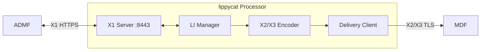

# ETSI Lawful Interception Integration Guide

This guide covers the deployment and operation of lippycat's ETSI X1/X2/X3 lawful interception interfaces.

## X1 version compatibility

lippycat declares ETSI TS 103 221-1 `v1.22.1`, matching the bundled
`TS_103_221_01.xsd` schema. It accepts the verified inclusive compatibility
window from `v1.13.1` through `v1.22.1` (with or without the lowercase `v`
prefix). Malformed revisions and revisions outside that window are rejected
with an explicit X1 request-syntax error. This is a reviewed schema
compatibility window, not a general semantic-version compatibility rule.

The V1.23.1 gap review did not pass: the generated schema remains V1.22.1 and
the implemented surface is destination create/modify/remove, task
activate/modify/deactivate/details, ping/keepalive, lifecycle/error
notifications, and state reconciliation—not every mandatory V1.23.1 operation
and field. Do not advertise V1.23.1 until all X1 schemas are regenerated and
the server, ADMF client, fixtures, and peer compatibility tests are upgraded
together. Confirm ADMF peers accept V1.22.1 responses and notifications before
cutover; remove V1.13.1 compatibility only in a coordinated release.

## X2/X3 correlation compatibility invariant

For SIP/RTP interception, the wire-level X2/X3 correlation ID is the FNV-1a
64-bit hash of the exact SIP Call-ID bytes. X2 signalling and every X3 media
stream carrying that Call-ID use the same value, regardless of SSRC, packet
direction, or SDP changes caused by a re-INVITE. Reuse of a Call-ID therefore
also reuses the correlation ID; the MDF must scope it with the XID and task time
window. Changing this derivation is an interop-breaking protocol change and
requires a coordinated MDF cutover.

## X2/X3 sequence-number policy

When attribute 8 is enabled, lippycat follows ETSI TS 103 221-2 clause 5.3.9.
Each `(PDU type, XID, Domain ID, NFID, IPID, Correlation ID)` context starts at
zero, increments independently, and wraps to zero after the maximum unsigned
32-bit value. X2 and X3 are separate contexts. The X2/X3 Domain ID is not an X1
delivery-destination `DId`, and fan-out of one encoded PDU to several MDFs does
not change its sequence number.

Without a journal, sequence state is in memory and restart starts new contexts
at zero. Operators must confirm that the MDF treats this as a new sequence epoch:
TS 103 221-2 does not define a sequence-reset signal. With a persistent interface,
its journal restores sequence high-water marks before live encoding. Successful
delivery, normal call completion, expiry, purge and revocation preserve these
checkpoints; replay sends the original encoded sequence number. A reused Call-ID
has a fresh internal call incarnation while retaining the wire correlation value
and the next sequence value for that wire context.

### X2/X3 application keepalive

Application keepalive is disabled by default and is configured independently
for X2 and X3. Enabling `--li-delivery-x2-keepalive` or
`--li-delivery-x3-keepalive` requires the MDF to return a KeepaliveAck on the
same TLS association with the identical sequence number before that
interface's TIME_P2. A missing, malformed, or wrong-sequence acknowledgement
does not refresh liveness; expiry disconnects and reconnects only that
interface and reports a delivery fault.

Inbound keepalive acknowledgement is a separate, disabled-by-default role.
Enable it per interface with
`--li-delivery-x2-ack-inbound-keepalive` or
`--li-delivery-x3-ack-inbound-keepalive`. A valid request is then answered on
the same association with its sequence echoed. This allows bidirectional
keepalive only when the MDF profile has been verified to support it.

Per-destination X2 and X3 statistics expose sent, acknowledged, timed-out,
disconnected, reconnected, inbound, inbound-acknowledged, unexpected, and
malformed control-PDU counters. Unexpected control traffic is counted without
limit while its warning log is rate-limited.

## Overview

lippycat implements the following ETSI interfaces for lawful interception:

| Interface | Purpose                           | Protocol       | Specification |
| --------- | --------------------------------- | -------------- | ------------- |
| **X1**    | Administration (ADMF ↔ NE)        | XML/HTTPS      | TS 103 221-1  |
| **X2**    | IRI delivery (signaling metadata) | Binary TLV/TLS | TS 103 221-2  |
| **X3**    | CC delivery (content)             | Binary TLV/TLS | TS 103 221-2  |

**Architecture:**


```mermaid
flowchart LR
    ADMF["ADMF"]

    subgraph Processor[lippycat Processor]
        X1["X1 Server :8443"]
        LIM["LI Manager"]
        ENC["X2/X3 Encoder"]
        DC["Delivery Client"]
    end

    MDF["MDF"]

    ADMF <-->|X1 HTTPS| X1
    X1 <--> LIM
    LIM --> ENC
    ENC --> DC
    DC -->|X2/X3 TLS| MDF
```

## Build Requirements

LI support is compiled via the `li` build tag:

```bash
# Build processor with LI support
make processor-li

# Build complete suite with LI support
make build-li

# Verify non-LI builds exclude LI code
make verify-no-li
```

LI code is completely excluded from standard builds through dead code elimination.

## Encrypted managed storage

LI requires an initialized encrypted managed-filter store. `--filter-store-mode=auto`
selects encryption when `--li-enabled` is effective; explicit YAML mode is rejected.
LI-disabled deployments retain editable YAML by default. The filter path remains
`--filter-file`; a custom path must contain the selected format.

Provision private store/key directories owned by the service account. Each enabled
store needs its own independently generated raw 32-byte key; do not copy one key
between filters, administrative state, X2, and X3. Keep key references in
configuration and key bytes in private files. For example, after provisioning the
directories, run as their owner:

```bash
umask 077
openssl rand -out /etc/lippycat/keys/filters.key 32
openssl rand -out /etc/lippycat/keys/li-state.key 32
lc migrate filter-store --init --destination /var/lib/lippycat/filters.enc \
  --key-id filters-1 --key-file /etc/lippycat/keys/filters.key
lc migrate li-state --init --destination /var/lib/lippycat/li-state.enc \
  --key-id state-1 --key-file /etc/lippycat/keys/li-state.key
```

For an existing installation, stop the node and use explicit YAML/JSON migration
instead of `--init`; see [offline migration](../cmd/migrate/README.md). No runtime
format guessing, automatic plaintext conversion, or automatic plaintext backup
occurs. Keep interrupted-operation metadata and use the identical command with
`--resume`. Encrypted snapshots use `--source-format=encrypted` for offline key
rotation; LI journals use `lc migrate li-journal`. Follow the separate
[rotation procedures](../cmd/migrate/README.md) and retain required prior keys.

Configured `--li-state-file` persistence requires `--li-state-key-file` and
`--li-state-key-id`. Empty `--li-state-file` disables administrative persistence
where persistent replay does not require it. Up to four prior keys can be provided
with `--li-state-read-key=id=path`. Settings use each role's
`li.state_file`, `li.state_key_file`, `li.state_key_id`, and `li.state_read_keys`.
Explicit `LIPPYCAT_PROCESSOR_LI_STATE_*` / `LIPPYCAT_TAP_LI_STATE_*` environment
references follow CLI > environment > YAML precedence, including empty values;
prior-key environment values are one CSV record. No raw key bytes belong in YAML.

Administrative migration preserves task/destination identities, generation
watermarks, cleanup obligations, and timestamp instants. Restored tasks require
current authorization reconciliation. The encrypted state also pins the original
RADIUS allocator path; changing the administrative file path never selects a fresh
counter sidecar. Supply `--radius-state-file` to migration if the old node used a
custom allocator. The sidecar remains separate and unencrypted.

## Quick Start

### 1. Generate Certificates

LI interfaces require mutual TLS. Generate certificates for:

- X1 server (processor ↔ ADMF)
- X2/X3 delivery (processor → MDF)

See [LI_CERTIFICATES.md](LI_CERTIFICATES.md) for detailed certificate setup.

### 2. Start Processor with LI

```bash
lc process --listen :55555 \
  --tls-cert=server.crt --tls-key=server.key \
  --li-enabled \
  --filter-file /var/lib/lippycat/filters.enc \
  --filter-store-key-id filters-1 --filter-store-key-file /etc/lippycat/keys/filters.key \
  --li-state-file /var/lib/lippycat/li-state.enc \
  --li-state-key-id state-1 --li-state-key-file /etc/lippycat/keys/li-state.key \
  --li-x1-listen :8443 \
  --li-x1-tls-cert x1-server.crt \
  --li-x1-tls-key x1-server.key \
  --li-x1-tls-ca admf-ca.crt \
  --li-admf-endpoint https://admf.example.com:8443 \
  --li-admf-tls-cert x1-client.crt \
  --li-admf-tls-key x1-client.key \
  --li-admf-tls-ca admf-ca.crt \
  --li-delivery-tls-cert delivery-client.crt \
  --li-delivery-tls-key delivery-client.key \
  --li-delivery-tls-ca mdf-ca.crt
```

### 3. Configure via YAML

```yaml
# ~/.config/lippycat/config.yaml
processor:
  listen_addr: ":55555"
  tls:
    enabled: true
    cert_file: "/etc/lippycat/certs/server.crt"
    key_file: "/etc/lippycat/certs/server.key"

  filter_file: "/var/lib/lippycat/filters.enc"
  filter_store:
    mode: auto
    key_file: "/etc/lippycat/keys/filters.key"
    key_id: "filters-1"

  li:
    state_file: "/var/lib/lippycat/li-state.enc"
    state_key_file: "/etc/lippycat/keys/li-state.key"
    state_key_id: "state-1"
    enabled: true

    # X1 server (receives requests from ADMF)
    x1_listen_addr: ":8443"
    x1_tls_cert: "/etc/lippycat/li/x1-server.crt"
    x1_tls_key: "/etc/lippycat/li/x1-server.key"
    x1_tls_ca: "/etc/lippycat/li/admf-ca.crt"

    # X1 client (sends notifications to ADMF)
    admf_endpoint: "https://admf.example.com:8443"
    admf_tls_cert: "/etc/lippycat/li/x1-client.crt"
    admf_tls_key: "/etc/lippycat/li/x1-client.key"
    admf_tls_ca: "/etc/lippycat/li/admf-ca.crt"
    admf_keepalive: "30s"

    # X2/X3 delivery (to MDF)
    delivery_tls_cert: "/etc/lippycat/li/delivery.crt"
    delivery_tls_key: "/etc/lippycat/li/delivery.key"
    delivery_tls_ca: "/etc/lippycat/li/mdf-ca.crt"
    delivery_tls_pinned_cert:
      - "sha256:abc123..." # Optional: pin MDF certificates
```

## X1 Interface (Administration)

The X1 interface provides task and destination management.

### Supported Operations

| Operation         | HTTP Method | Path  | Description           |
| ----------------- | ----------- | ----- | --------------------- |
| Ping              | GET         | /Ping | Health check          |
| CreateDestination | POST        | /     | Register MDF endpoint |
| ModifyDestination | POST        | /     | Update MDF endpoint   |
| RemoveDestination | DELETE      | /     | Remove MDF endpoint   |
| ActivateTask      | POST        | /     | Create intercept task |
| ModifyTask        | POST        | /     | Update intercept task |
| DeactivateTask    | POST        | /     | Stop intercept task   |
| GetTaskDetails    | GET         | /     | Query task status     |

### X1 Request Format

Requests use XML per ETSI TS 103 221-1 schema:

```xml
<?xml version="1.0" encoding="UTF-8"?>
<activateTaskRequest>
  <x1RequestMessage>
    <admfIdentifier>ADMF-001</admfIdentifier>
    <x1TransactionId>550e8400-e29b-41d4-a716-446655440000</x1TransactionId>
    <messageTimestamp>2025-12-27T10:30:00Z</messageTimestamp>
    <version>v1.13.1</version>
  </x1RequestMessage>
  <taskDetails>
    <xId>a1b2c3d4-e5f6-7890-abcd-ef1234567890</xId>
    <targetIdentifiers>
      <targetIdentifier>
        <sipUri>sip:alice@example.com</sipUri>
      </targetIdentifier>
    </targetIdentifiers>
    <listOfDIDs>
      <dId>d1e2f3g4-h5i6-7890-jklm-nop123456789</dId>
    </listOfDIDs>
    <deliveryType>X2andX3</deliveryType>
    <implicitDeactivationAllowed>true</implicitDeactivationAllowed>
  </taskDetails>
</activateTaskRequest>
```

### Supported Target Types

| Target Type    | X1 Element          | Example                  | Filter Type                          |
| -------------- | ------------------- | ------------------------ | ------------------------------------ |
| SIP URI        | `<sipUri>`          | `sip:alice@example.com`  | FILTER_SIP_URI                       |
| TEL URI        | `<telUri>`          | `tel:+15551234567`       | FILTER_PHONE_NUMBER                  |
| E.164 Number   | `<e164Number>`      | `+15551234567`           | FILTER_PHONE_NUMBER                  |
| IPv4 Address   | `<ipv4Address>`     | `192.168.1.100`          | FILTER_IP_ADDRESS                    |
| IPv4 CIDR      | `<ipv4Cidr>`        | `10.0.0.0/8`             | FILTER_IP_ADDRESS                    |
| IPv6 Address   | `<ipv6Address>`     | `2001:db8::1`            | FILTER_IP_ADDRESS                    |
| IPv6 CIDR      | `<ipv6Cidr>`        | `2001:db8::/32`          | FILTER_IP_ADDRESS                    |
| NAI            | `<nai>`             | `user@realm.example.com` | RADIUS compound / exact User-Name    |
| Subscriber MAC | `<macAddress>`      | `02:00:00:00:00:01`      | RADIUS compound / Calling-Station-Id |
| RADIUS AVP     | `<radiusAttribute>` | `57086C696E652D61`       | RADIUS compound / exact AVP          |

### RADIUS X1 authorization and NAI migration

X1 `nai` now selects the complete RADIUS User-Name bytes, case-sensitively,
without stripping realms, normalization, substring matching, or SIP parsing.
NAIs must satisfy the RFC 7542 grammar and already be NFC. Intentional non-NAI
account bytes use a complete User-Name `radiusAttribute`. SIP interception must
use an explicit `sipUri` target; existing NAI tasks are never converted to SIP
URI tasks.

The accepted `radiusAttribute` subset is one complete hexadecimal AVP: User-Name
(type 1), NAS-Port-Id (87), or vendor 3561/type 1 Agent-Circuit-Id (26). Outer and
inner lengths must match; unsupported vendors, types and concatenated AVPs are
rejected. Serialization uses uppercase hex. All RADIUS targets within one task
are conjunctive; a task cannot mix RADIUS and SIP/IP targets. See the
[identity contract](design/radius-identity-contract.md) for binary examples.

Provisioning requires an explicit dedicated POI scope. The embedding application
sets `li.ManagerConfig.RADIUSScope` (operator scope, profile revision and optional
origin/interface restrictions), or `processor.Config.LIRADIUSScope`. X1 and ADMF
identifiers are bound to this deployment policy, never used to infer scope.
MAC provisioning also requires `RADIUSMACProfile` / `LIRADIUSMACProfile` set to
`calling-station-id-uppercase-hyphen-v1`. X1 MAC syntax is six lowercase
colon-separated octets; captured Calling-Station-Id must use the configured
uppercase hyphen convention. CLI deployments bind these policies with
`--li-radius-operator-scope`, `--li-radius-profile-revision`, optional
`--li-radius-origin-node` / `--li-radius-source`, and `--li-radius-mac-profile`.
Shared YAML uses `li.radius.*` and environment uses `LIPPYCAT_LI_RADIUS_*`.
For local tap capture, ordinary `--radius-operator-scope` and
`--radius-profile-revision` must match the LI binding. See the
[RADIUS operator guide](RADIUS.md#tap-poi-and-mdf-setup) for a complete tap POI
example, exact flag/key reference, NatParas resolution and known-line verification.

RADIUS tasks accept only `X2Only`, with explicitly X2-enabled destinations.
One compound filter carries the task UUID, activation generation, complete
criteria and scope. Its filter and criterion revisions equal that generation.
Modification (including destination or timing changes), expiry, deactivation and
reactivation invalidate old authorization. Direct criteria are checked against
captured bytes; inherited criteria require a unique request association and the
complete current generation. A generic filter ID never authorizes RADIUS.

Restart withdraws persisted RADIUS/legacy NAI filter IDs before listeners start.
Pending and active RADIUS tasks require ADMF confirmation or explicit provisioning
and a fresh generation; old queued product is not replay-authorized. Legacy NAI
tasks with missing scope or unsupported delivery remain disarmed until corrected.
Retained deactivated/failed legacy NAI identities stay inactive; provision a new
XID when the corrected scope or service differs from the retained identity.
Reconciliation replaces valid scoped definitions and revokes invalid RADIUS
replacements. Legacy migration requires filter inventory support to find obsolete short IDs.
Failed filter withdrawal blocks startup; failed runtime withdrawal
cannot preserve authorization for a rejected replacement. Keep durable LI state
and filter state together so generation watermarks survive ID reuse.

Local tap batches establish capture origin internally. Direct hunter streams
require verified mutual TLS with a certificate identity matching the batch hunter
ID, which must also match the observation origin. Trust is internal and is not
forwarded in protobuf. Insecure streams, server-only TLS and unverified relayed
origins continue ordinary outputs but cannot authorize RADIUS LI. Synthetic
direct hunt/process parity and reconnect/snapshot verification have passed.
Upgrade both endpoints for authoritative filter snapshots; legacy processors
cannot reconcile registration-gap deletions. Relay-origin authorization remains
unsupported. Production MDF and operator acceptance remain external gates.

### Raw RADIUS X2 delivery

Authorized RADIUS observations use a dedicated format-11 encoder and the shared
queued TLS X2 delivery path. The payload is the original validated RADIUS message;
Ethernet/IP/UDP encapsulation and padding remain only in ordinary packet outputs.
Capture timestamps and UDP endpoints are conveyed separately. Subscriber-relative
Payload Direction remains Unknown for both requests and responses. SIP metadata,
Call-ID and normalized metadata output are not prerequisites.

The authoritative processor reserves persistent Correlation ID ranges before use.
Set `processor.Config.LIRADIUSCorrelationStateFile`, or configure `LIStateFile` to
use its path plus `.radius-correlation`. The parent directory must exist and be
writable. NFID and IPID both use `ProcessorID`; missing identity or storage causes
RADIUS X2 encoding to fail closed and increments the existing X2 error counter.
Ordinary outputs continue. CLI deployments use
`--li-radius-correlation-state-file`, YAML `li.radius.correlation_state_file`, or
`LIPPYCAT_LI_RADIUS_CORRELATION_STATE_FILE`; the default is empty and retains the
LI-state-path fallback. Set `--li-radius-transaction-timeout` (YAML `li.radius.transaction_timeout`,
environment `LIPPYCAT_LI_RADIUS_TRANSACTION_TIMEOUT`) to the capture association
lifetime; it defaults to 30 seconds and accepts 1 second through 5 minutes.
`tap radius` rejects mismatched capture/LI lifetimes. Remote processors must use
their hunter deployment lifetime;
see [RADIUS configuration](RADIUS.md#shared-flags-and-configuration).

Keep the reservation file and its `.lock` file on durable storage supporting
exclusive file locks and atomic rename. Every encoder sharing NFID/IPID must use
the same shared state path; concurrent owners of that path are rejected. Different
paths on different hosts cannot detect duplicate configured identities, so assign
separate ProcessorIDs to independent POIs. Never delete or roll back reservation
storage while retaining the same ProcessorID. Restart skips unused reserved IDs;
resetting storage requires a new ProcessorID.

Request retransmissions and uniquely associated responses share an allocation
across task XIDs during the configured request lifetime (30 seconds by default). Orphan or ambiguous direct
matches use observation-scoped allocations. The map is bounded by 65,536 entries
and 16 MiB; expiration cleanup runs at most once per second. Expired exchange
observations and allocation/encoding failures suppress X2 only. Each captured
matching datagram remains a delivery opportunity; serialized retries retain their
Correlation ID and sequence. Destination and task generations use the existing
queue lifecycle safeguards. Persisted RADIUS product is not replay-authorized.

Synthetic tap pipeline tests verify a local mutual-TLS MDF receiver, exact payloads,
sequence/correlation, queue pressure, destination removal, encoder failure and
shutdown with ordinary PCAP/log outputs active. Receiving-MDF agreement and
production operator traces remain external acceptance gates; these tests do not
establish production interoperability.

### Delivery Types

| Type    | Description                | X2 (IRI) | X3 (CC) |
| ------- | -------------------------- | -------- | ------- |
| X2Only  | Signaling metadata only    | ✓        |         |
| X3Only  | Content only               |          | ✓       |
| X2andX3 | Both signaling and content | ✓        | ✓       |

### X1 Error Codes

| Code | Name                     | Description                                                     |
| ---- | ------------------------ | --------------------------------------------------------------- |
| 100  | GenericError             | General error; reactivation identity differs from retained task |
| 101  | RequestSyntaxError       | Invalid XML                                                     |
| 300  | XIDAlreadyExists         | Task XID exists                                                 |
| 301  | XIDNotFound              | Task XID not found                                              |
| 302  | DIDAlreadyExists         | Destination DID exists                                          |
| 303  | DIDNotFound              | Destination DID not found                                       |
| 400  | DeliveryNotPossible      | Cannot deliver to MDF                                           |
| 401  | TargetNotSupported       | Unsupported target type                                         |
| 402  | DeliveryTypeNotSupported | Unsupported delivery type                                       |

A repeated `ActivateTask` for an equivalent active or pending task is an
idempotent retry: it returns success without reinstalling filters or changing
the activation generation. A new, authenticated `ActivateTask` may reactivate
a retained deactivated task (tombstone) only when its protected interception
identity is unchanged. The protected identity is the XID, delivery type, and
canonical set of target type/value pairs; target order and exact duplicates do
not matter. Destination IDs, mediation start/end times, and lifecycle options
may be replaced, but the complete replacement must pass current validation.
Generic retained-task reactivation requires a complete mediation window even
when `--li-admf-complete-task-contract` is disabled. An explicitly open end is
valid; omitted mediation details are not. This requirement does not change
compatibility-mode first activation or an equivalent active/pending retry.

If a retained task's protected identity differs, activation fails closed with
error 100 and the stable description `retained task's interception identity
differs` (followed by the XID). It is deliberately not error 300. Suspended and
failed tasks cannot be reactivated with `ActivateTask`.

### ADMF startup recovery

With startup synchronization enabled, a transient `GetAllDetails` failure keeps
recovery pending. The manager retries after 1 second with exponential backoff
capped at 30 seconds, independently of the periodic reconciliation interval;
each attempt uses the configured sync timeout (30 seconds by default).
Shutdown cancels the request or backoff and joins the recovery worker.

Persisted tasks remain disarmed candidates until the ADMF confirms their
presence and delivery destinations. A complete snapshot conflicting with a
persisted X1 definition permits only their common authorized scope, as described
below. An empty or expired intersection remains disarmed. The conflict does not
authorize buffered replay.
Tasks requiring explicit deactivation retain their activation generation across
restart even after `EndTime`; replay still requires equivalent ADMF confirmation.
After upgrading from versions that treated every elapsed end as historical,
these existing tasks can re-arm following ADMF confirmation. An elapsed nominal
end does not terminate a task with implicit deactivation disabled.
Wrong response types or missing NE
status, task-list, or destination-list sections are rejected before applying any
state; present empty lists remain valid. Valid entries in a partial snapshot
can be applied, but conversion or activation failures keep recovery pending.
Orphan decisions use independently validated identifier membership: a listed
task whose definition cannot be converted is still present, while reliably absent
tasks remain eligible for the existing consecutive-poll cleanup. Unknown or
duplicate identifiers suppress cleanup; destination failures alone do not hide
known task absence. Destination cleanup also respects retained task references.
After a usable partial snapshot, periodic
reconciliation continues alongside startup retries, so a failing entry cannot
starve reconciliation of other tasks. Failure logs identify the entry index and
valid task or destination UUID without target content. Known filters for a refused task without
an active local owner are withdrawn. Repeated equivalent snapshots preserve
delivery queues, filter state, and activation generations. Complete snapshots
retain the existing protection against removing every active task on an empty
ADMF response. Unsupported `GetAllDetails` is terminal: candidates remain
disarmed and must be provisioned through X1.

`lc show status` exposes `li_startup_sync` (also available through
`Stats().StartupSync` / `StartupSyncStatus()`) with states `pending`,
`retryable_failure`, `succeeded`, or `unsupported`, with attempt count, last
failure, last attempt time, and successful recovery time. An empty state means
startup sync was not requested. Pending synchronization may leave tasks unarmed;
a partial snapshot can have armed valid tasks while recovery remains pending.
The object is absent when LI is disabled. Logs report pending recovery, retries, and
recovery without target content.

The separate `li_reconciliation` status object describes the latest startup or
periodic snapshot: source, state, attempt count and time, task/destination/total
failure counts, and suppression flags for task and destination orphan removal.
Its `failures` list retains at most 32 details, with a fixed category, entry kind,
zero-based index (or -1 for a request/list failure), and validated UUID when
available. `failures_truncated` counts omitted details. This limit bounds
diagnostics only; it does not limit processing or authorization checks. Raw
identifiers, selectors, destination addresses, and remote error text are excluded.
`warnings_suppressed` counts repeated identical failure warnings omitted from
logs. Retries continue independently; changed failures and recovery are logged.
The object is omitted when LI is disabled.

The separate NE startup notification uses bounded X1 client retries and its own
cancellable request. Retried issue reports retain their semantic content and use
a new transaction UUID, following [TS 103 221-1 V1.22.1 clause
5.2.3](https://www.etsi.org/deliver/etsi_ts/103200_103299/10322101/01.22.01_60/ts_10322101v012201p.pdf).
Notification acknowledgment never substitutes for authoritative state sync.

### Complete task contract and definition convergence

Compatibility mode is the default. An ADMF pull that omits mediation details can
admit a new task, but its window is **unknown**, rather than an explicitly
open-ended grant. Such a task depends on explicit ADMF deactivation (or a
terminating fault) until a complete definition supplies its lifecycle fields.
Partial pulls never clear a known start, end, or explicit implicit-deactivation
value. A present, complete mediation definition with no end is explicitly
open-ended; omission of the mediation definition is not.
The mandatory targets, task DID list, and delivery type in a partial pull still
restrict a held definition. The NE intersects those fields with the held scope,
retains its known window, and reports differences as a conflict. A DID that
remains configured globally but is absent from this task is not authorized for
that task. An empty intersection disarms it. Partial input cannot arm a strict
candidate or confirm a restored task under the complete-task contract; any
restrictions are retained while confirmation remains pending.

Enable `--li-admf-complete-task-contract` only after establishing that the ADMF
returns complete task definitions, including mediation start and optional end.
When mediation details are present, an omitted `implicitDeactivationAllowed`
defaults to false; an open-ended task does not need to supply the flag.
The corresponding YAML key is
`processor.li.admf_complete_task_contract` for process and
`tap.li.admf_complete_task_contract` for tap; both default to `false`.
The environment variables are
`LIPPYCAT_PROCESSOR_LI_ADMF_COMPLETE_TASK_CONTRACT` and
`LIPPYCAT_TAP_LI_ADMF_COMPLETE_TASK_CONTRACT`. The policy is read at startup.
Changing configuration does not switch live tasks in place.

With the contract enabled, new incomplete snapshot tasks remain non-enforcing
candidates outside the registry and filter admission path until a complete
snapshot or X1 activation arrives. The first full X1 activation can replace a
pull-owned definition, including a complete but stale snapshot or a partial
task with a missing start, through the normal
filter, delivery, durable-state, and authorization-generation barriers.
Equivalent activation retries remain no-op reads. A partial snapshot never
confirms buffered X2/X3 replay, even in compatibility mode; replay requires a
complete equivalent authorized definition and the correct activation generation.

Before enabling strict mode, repair held unknown-window tasks or establish that
a complete startup snapshot will replace them. Startup refuses the transition
when previously enforcing or pending unknown definitions remain unresolved.
Verify repair through a schema-valid X1 `GetTaskDetails`
read-back or an equivalent authoritative check of the complete start, end, and
implicit-deactivation fields. An activation reassertion or error code alone is
not evidence that the effective definition is complete.

Complete snapshots can repair pull-owned or legacy restored definitions. For a
pull-owned task without an existing conflict, a complete snapshot can replace
the definition even when the scopes are disjoint. Once a conflict exists,
subsequent snapshots are constrained by the intersection rules below regardless
of pull ownership. See [recovery behavior](#recovering-a-narrowed-or-disarmed-task)
for the distinction between first push promotion and push-owned recovery.
Persisted X1 ownership survives restart. The bundled X1 schema has no per-task monotonic
revision; response timestamps and local snapshot lock ordering do not establish
freshness. For push-owned tasks or tasks already in conflict, a complete
conflicting pull restricts enforcement to the common scope
of the held and snapshot definitions, both live and after restart:

- The later start and earlier effective cutoff apply. An end is a cutoff only
  when implicit deactivation is enabled; an absent cutoff is unbounded.
- Only canonical target identities present in both definitions remain. No new
  CIDR or pattern-overlap inference is performed.
- Destinations must occur in both tasks' DID lists and be successfully confirmed
  by the snapshot's destination definitions. Global DID existence is insufficient.
- Delivery is the intersection of allowed interfaces. `X2andX3` with `X2Only`
  allows only X2; `X2Only` with `X3Only` allows neither.

An empty or expired intersection disarms the task and retains conflict diagnostics.
A future start remains pending without capture filters. Repeated pulls may
restrict further but cannot restore withdrawn scope. An exact later pull does not
clear the conflict. An active or pending task with a nonempty narrowed definition
can be modified through authenticated X1 `ModifyTask`; omitted fields retain the
effective narrowed values. A conflict-disarmed task rejects every `ModifyTask`,
including a routine end-time renewal or a modification supplying all mutable
fields. Its retained definition is diagnostic scope and cannot safely serve as
the base of a patch. Use the recovery procedure below. Push ownership remains
intact;
replay stays unconfirmed while the conflict is unresolved. Narrowing changes the
authorization generation and revokes affected old-generation queued delivery;
bytes already written cannot be recalled. Failed narrowing closes admission
process-wide until restart and reconciliation. Current administrative transactions
share a durable owner, and a failed reservation, revocation, or filter transaction
does not establish durable task-local isolation. Removing a filter alone is not
enough to reopen admission safely. Successful narrowing leaves unrelated tasks
running; the global barrier applies to failures, not ordinary conflicts.

#### Recovering a narrowed or disarmed task

| Task condition                                                                            | Authenticated recovery operation                                                                                                                                                 |
| ----------------------------------------------------------------------------------------- | -------------------------------------------------------------------------------------------------------------------------------------------------------------------------------- |
| Active/pending with nonempty narrowed scope; intended change is supported by modification | Send `ModifyTask` with the intended changed fields. An end-only renewal preserves narrowed targets, destinations, delivery type, and start.                                      |
| Conflict-disarmed, or start must change; retained targets and delivery type are unchanged | Confirm deactivation (send `DeactivateTask` if needed), then send a complete `ActivateTask` for the same XID with the intended window, targets, destinations, and delivery type. |
| Lifecycle recovery must change retained targets or delivery type                          | Confirm deactivation of the old XID, then activate a complete definition under a new XID.                                                                                        |

An empty `ModifyTask` on a narrowed conflicted task returns X1 error 100
(`modification not allowed`) and preserves the conflict, reporting state, and
generation. Supply at least one supported task field. An explicitly supplied
field counts even when its value is unchanged; ordinary validation still applies.
Successful explicit modifications can resolve the conflict, and omitted fields
retain the narrowed values. End-only renewals keep their existing behavior.

For example, if a snapshot moves a task's start into the future, `ModifyTask`
cannot restore the earlier start. Deactivate it and activate a complete definition
with the intended start and unchanged protected identity. If target narrowing
removed a selector and lifecycle recovery must restore it, use a new XID for the
replacement rather than changing the old tombstone's identity.

Do not send a lifecycle reactivation until read-back confirms deactivation. A
suspended conflict-disarmed task can expire under its held window: a nonzero
`EndTime` is an effective cutoff only when `ImplicitDeactivationAllowed` is true.
Disarming retains that held window rather than the failed snapshot's cutoff.
After implicit deactivation completes, no additional `DeactivateTask` is needed.
A nominal end with implicit deactivation disabled does not cause this transition.
The retained-task identity, completeness, and fresh-generation requirements still
apply after expiry.

If an operation fails or the process stops between operations, read back the
task state and complete recovery through X1; do not edit persisted records. A
complete activation can explicitly specify no end, and an omitted `implicitDeactivationAllowed`
retains its established false default. Complete does not mean time-bounded.

Disarmed modification returns X1 error 100 (`modification not allowed`). An
incomplete generic reactivation returns the existing invalid-task error mapping.
Clients that previously omitted mediation details on retained-task reactivation
must now send them, including in compatibility mode. RADIUS retains its separate
activation contract. An equivalent active/pending activation retry is still a
no-op. Recovery reserves fresh authorization generations and does not authorize
old-generation X2/X3 queues or replay. Neither an equal snapshot nor deactivation
erases the protected identity while the task record remains retained. Tombstones
are normally eligible for purge after 24 hours; outstanding durable obligations
can extend retention. After purge the old identity is no longer compared. See
[tombstone retention](#explicit-tombstone-reactivation) for the configuration and
generation safeguards. Use a new XID when replacing an identity rather than
waiting for purge.

Pull-owned tasks have a separate first-push path. A complete authenticated
`ActivateTask` can replace an active or pending pull-owned definition, including
its start, and establish push ownership through the existing authorization and
durability checks. This promotion is distinct from an equivalent retry of an
already push-owned activation, which is a no-op. A differing activation against
an active or pending push-owned task is rejected; use modification or the
lifecycle procedure above. A conflict-disarmed task cannot use first-push
promotion, even if it is pull-owned. Pull ownership also does not let later
snapshots clear an existing conflict or restore withdrawn scope.

Conflict state is persisted; report acknowledgment is process-local. Entry,
restoration, and meaningful scope changes log a warning and queue a schema-valid
`Warning` task report. A single manager worker sends reports with bounded client
retries and retries failed reports with exponential backoff: 30 seconds, 1 minute,
2 minutes, 4 minutes, then every 5 minutes until a valid correlated ADMF
acknowledgment arrives. The cap is a retry policy, not a delivery deadline.
The oldest pending deadline is serviced first. Equivalent polls do not create
duplicate work or warnings and do not reset backoff.
Restart reports unresolved conflicts again. Resolution cancels obsolete reporting,
and acknowledgment does not clear the enforcement conflict.

Existing state files remain readable, including the explicit false/empty conflict
fields written by `3b387355`. The writer now omits default-valued
`ConflictDisarmed` and `ConflictReason`, allowing unaffected state to be decoded
by `702c2c3f`. Non-default conflict metadata remains mandatory evidence: older
readers reject it, and it must not be stripped to make downgrade appear to work.
Successful decoding alone does not establish safe authorization after downgrade.

#### Persistence backup and rollback

Before an upgrade, stop the relevant processor/tap and delivery owners. Back up
administrative state and the applicable X2/X3 journal directories as one
consistent set, including controls, checkpoints, sequence/usage history, and
storage metadata. Record the matching binary version and configuration. Retain
every required encryption key separately under appropriate access controls.
Copying only the main state file is insufficient.

For rollback, keep the owners stopped while restoring the matching binary,
configuration, and complete consistent backup set. Never place an older
administrative snapshot over newer journals. Authenticated storage does not
detect a coherent rollback: the backup may omit later withdrawals or refer to
older generations. Establish current ADMF authority during startup reconciliation
before interception and apply the existing exact task/destination generation,
expiry, and replay-approval checks before replay. If current authority cannot be
established safely, keep interception and replay disarmed.

A downgrade to `702c2c3f` or `3b387355` also restores that binary's known
authorization limitations. A readable backup is not evidence that those defects
are safe for a deployment. Where the older build cannot enforce current
restrictions, keep LI stopped and recover on a corrected build. This procedure
does not promise a safe downgrade to an affected binary or authorize manual
removal of conflict metadata.

RADIUS tasks keep their specialized reconciliation,
authorization, and read-back behavior and are excluded from these generic
completeness counters.

`lc show status` exposes aggregate `li_definitions` gauges: `incomplete`,
`pull_only`, `conflicts`, `unknown_windows`, and `open_ended`. `repairs` counts
successful reconciliation repairs over the manager lifetime. Incomplete strict
candidates are included; unknown windows are distinct from complete open-ended
definitions. No metric has target, destination, or per-task labels. The same
values are available through `Manager.Stats().Definitions` and gRPC processor
status; the object is absent when LI is disabled or unavailable.

The processor logs `LI task deactivated` with the stable cause `admf`, `expired`,
or `fault`. Only expiry includes `end_time`; explicit ADMF deactivation is never
reported as implicit expiry. Definition and deactivation telemetry excludes
target values and destination details.

## X2/X3 Protocol (Binary TLV)

Content is delivered to MDF using binary TLV encoding per TS 103 221-2.
The two-byte protocol version is 0.5, encoded in network byte order as `00 05`.
The fixed PDU header is 40 bytes; conditional TLV attributes extend it.

### PDU Structure

| Offset | Field                               | Size     |
| ------ | ----------------------------------- | -------- |
| 0      | Version (`0.5`, wire bytes `00 05`) | 2 bytes  |
| 2      | Type                                | 2 bytes  |
| 4      | HeaderLen                           | 4 bytes  |
| 8      | PayloadLength                       | 4 bytes  |
| 12     | PayloadFmt                          | 2 bytes  |
| 14     | PayloadDirection                    | 2 bytes  |
| 16     | XID (UUID)                          | 16 bytes |
| 32     | CorrelationID                       | 8 bytes  |
| 40+    | Conditional Attributes (TLV)        | variable |
| ...    | Payload                             | variable |

### X2 SIP signaling

Every complete, admitted target SIP request and response is delivered as an X2
PDU with Payload Format 9 (SIP Message). This includes `100`, `180`, `183`,
redirects (`3xx`), failures (`4xx`–`6xx`), and extension request methods such as
`SERVICE`. Method classification does not control emission. The MDF reads the SIP
request/response semantics from the payload; no proprietary IRI-type or SIP-header
TLVs are added. Messages in one Call-ID share a correlation number and one X2
sequence context. Invalid or incomplete SIP is rejected before a product sequence
number is allocated. Existing task, matched-filter, generation, and delivery-type
admission still applies; `X3Only` tasks do not deliver X2.

This coverage follows [ETSI TS 102 232-5 V3.22.1, clauses 5.2.1 and
5.4](https://www.etsi.org/deliver/etsi_ts/102200_102299/10223205/03.22.01_60/ts_10223205v032201p.pdf).

For `X2Only` tasks, lippycat applies a conservative content authorization policy:
it retains SIP headers and SDP signaling (`application/sdp`) and withholds all
other message bodies, including SMS `MESSAGE` (`application/vnd.3gpp.sms`),
extension requests, multipart bodies, and body-bearing responses. Long and
compact Content-Length fields are rewritten to zero, or a zero-length field is
added if missing, so the delivered SIP remains parseable. The captured packet is
unchanged; a separate `X2andX3` task receives the original SIP message and body.

This is whole-body withholding at the X2 capture boundary, rather than the
SMS TPDU-preserving content modification specified for HI2 in clause 5.2.6.2.
The MDF must implement the applicable national HI2 policy, including the
`iRIOnlySIPMessage`/`iRIOnlyOriginalIPMMMessage` indication described in clause
5.2.6.1. lippycat does not claim those ASN.1 or SMS TPDU transformations.

**X2 conditional attributes:**

- Capture timestamp and sequence number
- Source/destination IP address and port from the actual packet sender
- Configured domain/network-function identifiers and capture node identifier
- Matched target identifier when the task has one unambiguous target

The task XID, correlation number, Payload Format, and Payload Direction are PDU
header fields. Direction remains unknown unless it can be resolved reliably.

### X3 CC Content

| Content Type | Description               |
| ------------ | ------------------------- |
| RTP Payload  | Voice/video media packets |
| DTMF         | Telephone keypad signals  |

**X3 PDU Attributes:**

- Timestamp
- Sequence Number
- RTP SSRC, Sequence, Timestamp
- RTP Payload Type
- Stream ID (for X2 correlation)
- Media Payload

### Payload Direction

X2 and X3 PDUs carry the ETSI Payload Direction (`fromTarget` / `toTarget`), which a
LEMF uses to build the two-channel audio product by pairing the two directions of a
call. It is set only for tasks with **exactly one target** — with several targets the
matched identity is ambiguous, so the direction is left `indeterminate` and the MDF
correlates by XID instead.

How it is derived:

| Target type                | Signaling (X2)                        | Media (X3)                                 |
| -------------------------- | ------------------------------------- | ------------------------------------------ |
| IP address / CIDR          | packet source and destination address | packet source and destination address      |
| SIP URI, tel URI, username | SIP `From` / `To` identity            | the call's SDP, resolved once per RTP SSRC |

For identity targets the media direction comes from the signalling of the same call:
which party of the dialog the target is, and which media endpoints each party
advertised in SDP. It is therefore `indeterminate` when that signalling was not
observed — most commonly when a task is activated **mid-call**, since the offer and
answer have already passed. Media of calls set up after activation is labelled
normally. A direction is never guessed: where the evidence is absent, the field stays
`indeterminate`.

Both legs of a relayed call (for example a target behind an IMS media gateway) are
delivered and are labelled consistently, distinguished by their stream identifier.

### Security-sensitive RTP attribution

RTP identity-filter inheritance is fail closed. The processor resolves the exact
source and destination media endpoints against the active-call registry. Identity
selection is inherited only when that lookup proves one authoritative Call-ID. If
the endpoint is unknown or is shared by multiple live calls, the packet is not
assigned to the most recently observed call and identities from every possible
owner are not combined. The inherited identity match is suppressed instead.

Packet-level IP address and CIDR targets are independent direct evidence. They are
matched against the RTP packet's source and destination addresses and remain
eligible even when call ownership is ambiguous. Thus an ambiguous RTP packet can
still be delivered to a directly matching IP/CIDR task, but it cannot enter a SIP
URI, telephone-number, username, IMSI, or IMEI task by guessed inheritance.

Call finalization is also an enforcement boundary. A shared lifecycle registry
prevents X3 encoding, reorder-buffer insertion, and delivery after BYE/CANCEL,
failure, idle/capacity cleanup, or manual finalization. Terminal Call-ID
tombstones are retained for the configured closed-call TTL (one hour by default)
and are bounded to 100,000 entries. Capacity eviction is observable. A Call-ID
seen after its tombstone expires starts a new generation; buffered content from
an older generation is never attached to it.

For tasks with multiple MDF destinations, fan-out is fail-closed but not an
atomic multicast operation. The first destination commits under the task and
call admissions acquired for the packet; each subsequent destination rechecks
those admissions before accepting the same PDU. If task or call finalization
begins during that loop, an earlier MDF may receive the PDU while later MDFs
drop it and increment the applicable finalized/stale suppression accounting.
Operators that require cross-MDF atomic delivery must provide that coordination
outside lippycat and reconcile per-destination sequence and drop metrics.

## Task Lifecycle

### Task States

| State       | Description                        |
| ----------- | ---------------------------------- |
| Pending     | Received but StartTime not reached |
| Active      | Actively intercepting traffic      |
| Suspended   | Temporarily paused                 |
| Deactivated | Explicitly stopped                 |
| Failed      | Fatal error occurred               |

`GetTaskDetails` keeps the ETSI `provisioningStatus` enumeration unchanged:
pending tasks use `awaitingProvisioning`, failed tasks use `failed`, and active,
suspended, and deactivated tasks use `complete`. No vendor-specific task-status
extension is emitted on X1.

### Explicit tombstone reactivation

Deactivation removes the task's enforcement filters but retains a tombstone for
audit and retry safety. It never becomes enforcing through startup,
reconciliation, or tombstone maintenance. Reactivation requires an explicit,
authenticated `ActivateTask` with the same protected identity described under
[X1 Error Codes](#x1-error-codes). A successful reactivation increments the
activation generation, preserves the prior deactivated task in audit history,
and installs only the replacement task's filters.

Identity comparison lasts while the tombstone is retained. Lifecycle maintenance
uses `li.ManagerConfig.TombstoneRetention`, a Go API setting with a default of
24 hours after deactivation; it is not exposed as a CLI flag. Purge runs during
maintenance rather than at an exact deadline. For persistent state, outstanding
filter cleanup, revocation obligations, or unfinished administrative work delay
removal. After purge, a same-XID activation follows first-activation rules and
does not compare against the removed identity. Generation watermarks are retained,
so it receives a newer generation and cannot authorize old-generation product.
Use a new XID for an intended identity replacement as described in
[conflict recovery](#recovering-a-narrowed-or-disarmed-task).

Provision destinations before sending the reactivation. A missing destination
or an incompatible task/destination delivery combination rejects the request
without changing the tombstone or filters. After an uncertain response, query
`GetTaskDetails`: retry the identical request only when the state is `pending`
or `active`; if it remains `deactivated`, correct the validation error and send
a new explicit activation. Treat error 100 with the retained-identity
description as an authorization/identity mismatch requiring operator review,
not as a cue to modify the target under the retained XID.

### Implicit Deactivation

When `ImplicitDeactivationAllowed=true`:

- NE may autonomously deactivate when `EndTime` is reached
- Status notification sent to ADMF via X1

When `ImplicitDeactivationAllowed=false`:

- NE ignores `EndTime`
- Only ADMF `DeactivateTask` or fatal error can end task

### Task Modification

Modifiable fields (via `ModifyTask`):

- Targets (adds/removes filter criteria)
- DestinationIDs (changes delivery endpoints)
- DeliveryType (changes X2/X3 delivery mode)
- EndTime (changes expiration)
- ImplicitDeactivationAllowed

Non-modifiable:

- XID (task identity)
- StartTime (after activation)

## ADMF Notifications

The processor sends notifications to ADMF via X1:

| Notification         | Trigger                  |
| -------------------- | ------------------------ |
| Startup              | Processor starts         |
| Shutdown             | Processor stops          |
| KeepAlive            | Periodic heartbeat       |
| TaskProgress         | Task activation progress |
| ErrorReport          | Task execution errors    |
| DeliveryNotification | X2/X3 delivery issues    |
| ImplicitDeactivation | Task auto-expired        |

Configure keepalive interval:

```bash
--li-admf-keepalive 30s  # Send keepalive every 30 seconds
--li-admf-keepalive 0    # Disable keepalive
```

## Filter Integration

LI tasks integrate with lippycat's optimized filter system:

| LI Target Type | Filter System       | Optimization                   |
| -------------- | ------------------- | ------------------------------ |
| SIP URI        | Aho-Corasick        | Pattern matching               |
| Phone Number   | PhoneNumberMatcher  | Bloom filter + suffix matching |
| IP Address     | Hash Map            | O(1) lookup                    |
| IP CIDR        | Radix/Patricia Trie | O(prefix) lookup               |

**Filter Flow:**

1. ADMF activates task via X1
2. LI Manager creates filters for each target
3. Filters pushed to hunters
4. Matching packets tagged with filter IDs
5. LI Manager correlates filter ID → XID
6. X2/X3 PDUs delivered to MDF

## Performance

### Encoding Benchmarks

| Operation       | Throughput   | Latency |
| --------------- | ------------ | ------- |
| X2 Encode (IRI) | ~500K PDUs/s | ~2µs    |
| X3 Encode (CC)  | ~1M PDUs/s   | ~1µs    |

### Delivery

| Configuration         | Throughput           |
| --------------------- | -------------------- |
| Single destination    | ~100K PDUs/s         |
| Multiple destinations | ~50K PDUs/s per dest |

Delivery uses:

- Async queue with backpressure (default: 10K items)
- Batching (default: 100 PDUs per batch)
- Connection pooling per destination

## Security

### TLS Requirements

| Interface      | Minimum TLS | Mutual TLS                                               |
| -------------- | ----------- | -------------------------------------------------------- |
| X1 Server      | TLS 1.3     | Required; `--li-x1-tls-ca` must trust the ADMF client CA |
| X1 Client      | TLS 1.2     | Required                                                 |
| X2/X3 Delivery | TLS 1.2     | Required                                                 |

### Certificate Pinning

For X2/X3 delivery, optionally pin MDF certificates:

```bash
--li-delivery-tls-pinned-cert sha256:abc123...
```

### Audit Logging

All LI operations are logged with structured fields:

- Task activations/deactivations
- Target modifications
- Delivery success/failures
- X1 requests and responses

### Delivery Telemetry

Query a processor or standalone tap through its management endpoint:

```bash
lc show status -P processor.example.com:55555 --tls-ca ca.crt
```

When LI delivery is configured, the JSON response includes `li_delivery` alongside
the separate `li_encoding` counters. The delivery object reports aggregate
`x2_enqueue_calls`, `x3_enqueue_calls`, `x2_written`, `x3_written`, `x2_dropped`,
`x3_dropped`, `retries`, and `queue_depth`. Enqueue counters count successful
asynchronous calls into the delivery client, including calls with no eligible
destinations. Written and dropped counters count destination copies: one
enqueue can fan out to several destinations, so these counters do not directly
reconcile with each other or with encoded counts.

`li_delivery.destinations` is keyed by destination UUID. Each entry includes:

| Fields                                                                                                                                  | Interpretation                                                                                                                    |
| --------------------------------------------------------------------------------------------------------------------------------------- | --------------------------------------------------------------------------------------------------------------------------------- |
| `x2_queue_depth`, `x3_queue_depth`, `x2_queue_capacity`, `x3_queue_capacity`                                                            | Current backlog and capacity for each interface; capacity is not shared between X2 and X3.                                        |
| `oldest_queued_age_ms`, `x2_oldest_age_ms`, `x3_oldest_age_ms`                                                                          | Current age of the oldest queued product, in milliseconds; use rising age to detect delay before overflow.                        |
| `x2_written`, `x3_written`, `x2_dropped`, `x3_dropped`, `retries`, `dropped_by_reason`                                                  | Cumulative delivery outcomes and retry attempts, including `queue_overflow` losses.                                               |
| `last_write_unix_ms`, `last_queue_error`                                                                                                | Last successful queued-product write timestamp and queue error; a zero timestamp means no such write has been observed.           |
| `connection_state`, `last_connection_error`, `connect_attempts`, `connect_failures`, `write_errors`, `x2_connections`, `x3_connections` | Connection state, failures, and current connections for the destination.                                                          |
| `x2_keepalive`, `x3_keepalive`                                                                                                          | Per-interface probe configuration, latest probe and ACK timestamps, ACK age, probe/ACK/timeout counts, and reconnect information. |

Written counts mean successful **local TLS writes**, not receiver acceptance of
individual products. Keepalive ACKs establish control responsiveness, not product
acknowledgement. An empty queue alone therefore does not prove end-to-end receipt.
Queue ages and depths describe current backlog; drops are cumulative loss, so
compare successive samples to identify new losses. The last connection error is
cleared on successful connect; the last queue error is cleared on successful
queued-product write.

These counters are volatile and reset when the delivery client restarts.
Per-destination details disappear when a destination is removed; collect them
externally if historical diagnostics are required. Zero-valued fields may be
omitted from JSON. An absent `li_delivery` means delivery telemetry is unavailable,
not that delivery has succeeded.

Snapshots are observations taken during concurrent delivery, so aggregate and
destination values can differ briefly. Keepalive timestamps describe connection
observations and may reset on reconnection; a missing ACK timestamp means no ACK
has been observed for that reported connection state.

## Troubleshooting

### X1 Server Not Starting

Check:

1. TLS certificates are valid and not expired
2. CA certificate matches ADMF client certs
3. Port is not in use
4. Processor built with `-tags li`

### X2/X3 Delivery Failures

Check:

1. Destination created via X1 `CreateDestination`
2. MDF server is reachable
3. Client certificates match MDF CA
4. Per-destination queue depth, oldest queued age, retries, and overflow drops
5. Reconnect and peer-close logs for the destination DID

Short MDF outages are buffered and flushed in interface FIFO order. With
journaling disabled, capacity pressure can evict an unclaimed oldest PDU
(`queue_overflow`); claimed heads and admissions that cannot fit are protected by
rejecting the new PDU (`capacity_rejected`). Journaled X2 rejects new admissions
instead of evicting retained product. Oversized PDUs are rejected explicitly.

### Task Not Matching

Check:

1. Task status is "Active"
2. Target format matches traffic (e.g., full SIP URI vs user only)
3. Filters pushed to hunters
4. Hunter receiving matching traffic

### Media Delivered as `indeterminate`

If CC PDUs carry no Payload Direction, the LEMF cannot pair the two audio channels
automatically. Check:

1. The task has exactly one target — direction is not set for multi-target tasks
2. The call's INVITE and its answer were intercepted; a task activated mid-call has
   no signalling to derive from
3. The signalling carried SDP (both the offer and the answer)
4. With debug logging, look for `LI media direction resolved for SSRC`; its absence
   alongside `LI media direction: SDP owner not attributable` means the SDP could not
   be attributed to a party

### Ambiguous RTP ownership or rejected late X3

These are intentional fail-closed outcomes, not evidence of packet loss. Monitor
the processor/source status counters and structured warnings:

| Signal                                                 | Increment owner and interpretation                                                                                                                                                                                                                                                           |
| ------------------------------------------------------ | -------------------------------------------------------------------------------------------------------------------------------------------------------------------------------------------------------------------------------------------------------------------------------------------- |
| `rtp_ownership_unresolved` / `rtp_ownership_ambiguous` | The local source or distributed hunter increments one exceptional-outcome counter when exact-endpoint lookup cannot identify one authoritative call. `ambiguous` means multiple live calls own the evidence; `unresolved` means none does. Resolved packets do not increment either counter. |
| `identity_inheritance_suppressed`                      | The local source or distributed hunter increments once per classified media packet whose identity inheritance is denied. Direct IP/CIDR matches may still pass.                                                                                                                              |
| `inherited_provenance_rejected`                        | The LI manager increments once per inherited filter ID rejected at the LI trust boundary, including non-authoritative or mismatched Call-ID provenance.                                                                                                                                      |
| `x3_finalized_or_stale_suppressed`                     | The processor LI path increments at the admission check that rejects X3 work for a finalized or stale call generation. It is not incremented again by a downstream layer for the same rejection.                                                                                             |
| `x3_buffered_discarded`                                | The call-finalization subscriber increments by the number of queued reorder entries removed for that exact Call-ID and generation.                                                                                                                                                           |
| lifecycle tombstone capacity evictions                 | The lifecycle registry increments once for each terminal tombstone removed to enforce its bound. Sustained growth shortens effective late-content protection.                                                                                                                                |

Warnings for ambiguous ownership and rejected late X3 content are rate limited.
They use sanitized or hashed identifiers rather than raw SIP identities or Call-IDs;
use the counter deltas as the authoritative volume signal. A rising ambiguity rate
usually indicates shared SBC/media-gateway endpoints, missing SDP, or capture from
only one side of a NAT boundary. A rising finalized/stale-generation rate indicates
late capture batches, excessive reorder delay, or Call-ID reuse. Do not work around
either condition by selecting the newest candidate or merging candidate owners.

### Logs

Enable debug logging:

```bash
LOG_LEVEL=debug lc process --li-enabled ...
```

Key log fields:

- `xid`: Task identifier
- `did`: Destination identifier
- `filter_id`: Internal filter ID
- `packets_matched`: Count of matched packets

## Related Documentation

- [LI_CERTIFICATES.md](LI_CERTIFICATES.md) - Certificate management
- [SECURITY.md](SECURITY.md) - General security configuration
- [internal/pkg/li/CLAUDE.md](../internal/pkg/li/CLAUDE.md) - Architecture details

### Delivery byte limits, age and X2 persistence

Processor and tap accept the same LI delivery options. Existing deployments keep
10,000 PDUs per destination **and interface**, with no byte limit, age expiry or
journal unless configured. `--li-delivery-queue-size` remains the fallback PDU cap;
`--li-delivery-x2-queue-size` and `--li-delivery-x3-queue-size` independently override
it (zero inherits the fallback).

| Option                                 | Unit/default     | Behavior                                                            |
| -------------------------------------- | ---------------- | ------------------------------------------------------------------- |
| `--li-delivery-x2-queue-size`          | PDUs / `0`       | X2 cap per destination; zero inherits queue-size                    |
| `--li-delivery-x3-queue-size`          | PDUs / `0`       | X3 cap per destination; zero inherits queue-size                    |
| `--li-delivery-x2-queue-bytes`         | bytes / `0`      | Per-destination X2 encoded payload budget; zero disables it         |
| `--li-delivery-x3-queue-bytes`         | bytes / `0`      | Independent X3 encoded payload budget                               |
| `--li-delivery-x3-max-age`             | duration / `0`   | Maximum local X3 residence; zero disables expiry                    |
| `--li-delivery-memory-budget-bytes`    | bytes / `0`      | Reservation ceiling; requires both byte budgets when enabled        |
| `--li-delivery-x2-spool-dir`           | path / empty     | Enables the encrypted X2 journal                                    |
| `--li-delivery-x2-spool-max-bytes`     | bytes / `0`      | Required positive disk budget when journaling is enabled            |
| `--li-delivery-x2-spool-key-file`      | path / empty     | Required private file containing a raw 32-byte AES key              |
| `--li-delivery-x2-spool-key-id`        | ID / empty       | Active key ID; empty retains the original key-file-only meaning     |
| `--li-delivery-x2-spool-read-key`      | `id=path` / none | At most four prior keys, repeatable                                 |
| `--li-delivery-x2-spool-legacy-key-id` | ID / empty       | Explicit configured key for LCX2 records after an active-key change |
| `--li-delivery-x2-spool-replay-policy` | `hold`           | Recovered records remain held; `purge` explicitly discards them     |

Byte and PDU limits both apply, including claimed writes. Oversized PDUs are
rejected. X2 and X3 have independent FIFO delivery and retry workers, so an X3
outage does not reserve X2 capacity. The memory budget reserves each destination's
full configured payload capacities plus conservative queue and worker overhead;
a destination cannot borrow another destination's reservation. This is an LI
delivery reservation estimate, not a process RSS limit: packet capture, encoding,
TLS, Go runtime and other processor services need separate memory headroom.

Size each interface for **peak encoded bytes/second × desired outage seconds**,
then add headroom and a sufficient PDU cap. For example, 200,000 encoded X3
bytes/second for five minutes needs at least 60,000,000 bytes, before headroom.
Recovery throughput must exceed ongoing traffic to drain backlog.

```yaml
processor: # use tap: for standalone capture
  li:
    delivery_queue_size: 100000
    delivery_x2_queue_bytes: 67108864
    delivery_x3_queue_bytes: 83886080
    delivery_x3_max_age: 5m
    delivery_memory_budget_bytes: 4294967296
    delivery_x2_spool_dir: /var/lib/lippycat/x2
    delivery_x2_spool_max_bytes: 1073741824
    delivery_x2_spool_key_file: /etc/lippycat/x2.key
    delivery_x2_spool_replay_policy: hold
```

For these new options, environment names are
`LIPPYCAT_PROCESSOR_LI_DELIVERY_X3_MAX_AGE`,
`LIPPYCAT_TAP_LI_DELIVERY_X3_MAX_AGE`, and equivalently the uppercase underscored
option names under the matching role. Explicit flags override environment values,
which override YAML. Integer capacities are bytes, not MiB strings.

X3 age begins at first local LI admission, includes RTP reorder and retries, and
is independent of diagnostic capture timestamps. Expiry remains active during an
outage and is checked again at the transport write lock. Task/call cancellation
can close an active write. A partial or uncertain write is reported separately
from a known queue discard. A successful local write does not prove MDF receipt.
X2 does not inherit X3 expiry. X3 remains memory-only unless its independent
journal is explicitly enabled as described below.

Journal directories must be private (`0700`) and journal/key files private
(`0600`). Keep the key across restarts: losing it prevents recovery. Journal
records preserve the immutable encoded PDU, sequence and lifecycle identity.
Asynchronous enqueue acknowledges memory admission only. A crash before the
journal worker syncs can lose pending records; status separates pending from
persisted records. Full journal capacity rejects new admissions while retaining
persisted records.

Recovered X2 is **held by default**, including records whose task has ended or
whose destination was removed or replaced. Neither a reused XID nor a reused
destination UUID authorizes replay. Authorized replay is an embedding/control-plane
operation through `ReplayHeldX2` with an explicit identity reconciliation callback;
the command-line application can authorize an exact private replay manifest only after ADMF startup reconciliation.
`PurgeHeldX2` provides explicit administrative removal; the startup `purge` policy
removes recovered records. Held records remain inside the journal byte budget.
Retained sequences are reserved before new encoding. Preserve the default `hold`
policy until the controlling application can verify the original identities with
ADMF. Use the export/replay procedure below to approve recovered backlog after restart.

`lc show status` exposes encoded queue/in-flight bytes, effective per-interface
byte capacities, expired X3 counts, reason-labelled dropped bytes, and X2 journal
bytes, limit, pending/persisted/held counts, rejection count and last error.
Aggregate dropped-byte counts survive destination removal. Shutdown uses the
configured delivery drain deadline; persistent X2 retained on disk is distinct
from volatile loss. Existing status field meanings remain unchanged.

### Persistent X3 and historical delivery

Recovered X3 defaults to `--li-delivery-x3-spool-replay-policy=hold`. Use
`purge` to durably discard recovered product rather than approve delivery.

Enable X3 persistence with `--li-delivery-x3-spool-dir` and an explicit positive
`--li-delivery-x3-spool-max-bytes`. Provision an independent private raw 32-byte
key using `--li-delivery-x3-spool-key-id` and `--li-delivery-x3-spool-key-file`;
`--li-delivery-x3-spool-read-key=id=path` supplies at most four prior keys.
Filters, administrative state, X2 and X3 must use distinct actual key material.
Persistent X3 also requires a positive `--li-delivery-x3-max-age`, initialized
encrypted administrative state, an ADMF endpoint and startup reconciliation.
There is no implicit retention duration. Process and tap share these options.

Each journal owns its allocation, pending work, controls and faults independently.
Reserve enough disk for data, future terminal controls and rewrite space; encoded
payload size alone is insufficient. Capacity exhaustion rejects new product and
preserves durable backlog. A durability callback occurs only after the product's
required sequence and control evidence are durable. A partial or uncertain
storage operation blocks admission and does not make its product sendable.

Normal protocol completion, idle timeout and capacity eviction close capture and
drain content accepted before closure. That content remains eligible only until
its original deadline and only while its exact task/destination authorization
remains valid. Explicit cancellation, task withdrawal/expiry or relevant changes,
and destination removal/replacement revoke it. Late packets cannot reopen a
completed incarnation. Memory-only X3 retains its existing call-end cancellation.

After restart, X3 is held and its call incarnations are historical. Export exact
identities with `--li-delivery-x3-spool-export-manifest=/secure/held-x3.json` and
review a separate private approval file. Pass the reviewed version-2 file through
`--li-delivery-x3-spool-replay-manifest=/secure/approved-x3.json` on a reconciled
startup. Approval binds journal, record/content, administrative-state incarnation,
task/destination generations, call or non-call provenance and original timestamps
and deadline. Current ADMF-confirmed unchanged activation, exact destination and
unexpired authorization are still required. No approval file alone authorizes
delivery. An unapproved FIFO head cannot be skipped; expiry and revocation remain
active even while the MDF is disconnected or approval is absent.

Keep the stopped journal, its controls/checkpoints/usage history and administrative
state together in a consistent backup, with keys separately controlled. A coherent
old backup can roll back state; storage authentication is not trusted rollback
detection. Reconcile with current ADMF before replay and retain every key needed
by historical objects and required backups. Local TLS write completion does not
prove MDF receipt; an interrupted write or completion checkpoint can cause a
duplicate delivery of the original encoded bytes and sequence.

### Approving held X2 from the command line

Start with the usual spool/key configuration and
`--li-delivery-x2-spool-export-manifest=/secure/held-x2.json`. The export is a
private JSON identity manifest, bounded to 10,000 records per export. Keep it
outside the journal directory. Review its exact record IDs, XIDs, destination
UUIDs and lifecycle generations against ADMF authorization, retaining only the
records approved for delivery in a separate private file.

On the next startup, pass
`--li-delivery-x2-spool-replay-manifest=/secure/approved-x2.json`, together with
`--li-state-file`, ADMF endpoint and enabled startup synchronization. Replay needs
both exact manifest identity and current reconciled authorization; UUID equality
alone does not suffice. Export and approval paths must differ. Records not
approved remain held and consume journal capacity. Because held product precedes
live X2, live journal admissions for that destination are rejected until held records are
reconciled or explicitly purged; other destinations remain independent. When more than 10,000 records are held, repeat the bounded
export/approval procedure after each approved group drains.

The LI state file retains per-XID generation watermarks after task expiry and
cleanup, so its metadata grows with historical XIDs. Keep this state with the X2
journal; deleting or restoring it independently can erase the identities needed
to distinguish old product from a later activation of the same XID.
Task generations and destination identities are checkpointed before the changed
delivery becomes eligible. Failure of that identity checkpoint prevents publishing
the change.

A manifest has this versioned shape (use exported values):

```json
{
  "version": 1,
  "records": [
    {
      "id": 123,
      "xid": "00000000-0000-0000-0000-000000000001",
      "did": "00000000-0000-0000-0000-000000000002",
      "task_generation": 8,
      "destination_generation": 9
    }
  ]
}
```

Managed memory reservations include a 16 MiB shared RTP reorder allowance,
per-destination payload/owner reservations, one shared incoming-payload allowance
equal to the larger X2/X3 byte limit, and bounded journal index, pending
operation, recovery and encryption working memory. Journal working memory is
reserved conservatively even when the current journal is empty. Status exposes
`memory_budget_bytes`, `reserved_memory_bytes` and `x3_max_age_ms`; aggregate
reason counters and `first_dropped_unix_ms` remain available after destination
removal. These reservations cover managed LI delivery/reorder allocations and do
not bound total process RSS.

Each segmented journal reserves 2,824 MiB for its bounded index, recovery,
encryption, pending work and replay/approval structures. Two segmented journals
therefore require at least 5,648 MiB of managed reservation before queue, reorder
and authorization allowances. This is a conservative admission ceiling rather
than an eager allocation or measured RSS; size an explicit memory budget for all
configured destinations and leave separate headroom for other processor services.

The incoming-payload allowance covers admission while existing queues are full.
Explicit memory budgets sized exactly to older reservation totals may need to
increase by the larger interface byte limit before startup accepts them.

`uncertain_writes` and `uncertain_bytes` count transport attempts whose remote
acceptance is unknown, including attempts later retried successfully. They are
separate from terminal drop counters: a retry can duplicate bytes accepted by MDF
before the connection failed. No exactly-once remote receipt is implied.

Journal sequence high-water marks survive successful delivery and product purge,
so sequence continuity also covers a restart after the backlog has drained.
Sequence contexts consume a bounded journal budget; exhausting that metadata
capacity fails closed rather than forgetting previously used sequence values.

`queue_bytes` counts logical encoded destination copies; `physical_queue_bytes`
counts the shared encoded payload allocation once while any destination retains
it. Per-destination budgets still charge each copy independently.

ShutdownTimeout bounds the eligible delivery drain and transport cancellation.
The journal then checkpoints and joins its filesystem worker on a functioning
local filesystem. A filesystem syscall stuck in the kernel cannot be forcibly
cancelled by this deadline; a failed or unresponsive storage device can delay
shutdown. Pending records are not durability acknowledgements.

`x2_journal.replay_pending` counts held records already authorized but awaiting
memory capacity for replay; remaining held records still need authorization.
`x2_journal.uncertain` counts records possibly durable after a later checkpoint
failure. Programmatic persistent X2 producers must supply nonzero task activation
generation through `SendX2WithMetadata`; built-in processor/tap producers do so.
Journal file budgets charge filesystem block-rounded allocations and reserve
fault/checkpoint metadata; directory, inode and filesystem journal overhead need
separate disk headroom. Sequence identity fields are bounded to 512 combined bytes.
