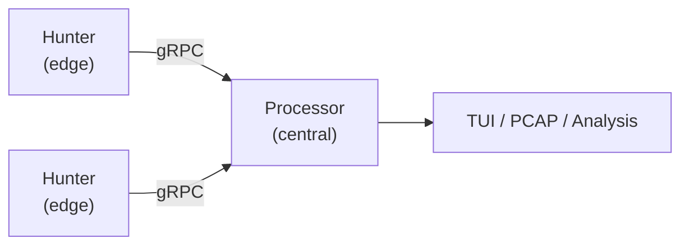

# Core Concepts

This chapter covers the foundational concepts you need to understand before capturing traffic with lippycat. If you're already familiar with packet capture (e.g., from tcpdump or Wireshark experience), you can skim this and move to [Installation & Setup](installation.md).

## Packets and Protocols

Network traffic is composed of **packets** — discrete units of data sent between hosts. Each packet contains nested protocol layers:

```
Ethernet → IP → TCP/UDP → Application (HTTP, SIP, DNS, ...)
```

lippycat captures packets at the link layer and dissects them through each protocol layer, extracting meaningful information depending on the protocol mode you're using.

### Protocols lippycat Analyzes

| Protocol | Subcommand | What It Captures |
|----------|------------|-----------------|
| DNS | `lc sniff dns` | Queries, responses, record types |
| TLS | `lc sniff tls` | Handshakes, certificates, cipher suites |
| HTTP | `lc sniff http` | Requests, responses, headers |
| Email | `lc sniff email` | SMTP/IMAP/POP3 sessions |
| VoIP | `lc sniff voip` | SIP signaling, RTP media streams |

## Network Interfaces

A **network interface** is the point where your machine connects to a network. Common examples:

- `eth0` / `ens33` — Wired Ethernet
- `wlan0` — Wireless
- `lo` — Loopback (local traffic only)
- `any` — Capture on all interfaces simultaneously

To see available interfaces:

```bash
lc list interfaces
```

### Capture Permissions

Capturing packets requires elevated privileges because it means reading all traffic on an interface, not just traffic destined for your application.

**Option 1: Run as root**
```bash
sudo lc sniff -i eth0
```

**Option 2: Grant capability (recommended for production)**
```bash
sudo setcap cap_net_raw+ep /usr/local/bin/lc
```

This grants only the specific capability needed, following the principle of least privilege.

## BPF Filters

**Berkeley Packet Filters (BPF)** let you tell the kernel which packets to capture, reducing CPU load by filtering at the lowest level before packets reach userspace.

```bash
# Only capture DNS traffic
lc sniff -i eth0 -f "port 53"

# Only traffic to/from a specific host
lc sniff -i eth0 -f "host 10.0.0.1"

# Combine filters
lc sniff -i eth0 -f "host 10.0.0.1 and port 5060"
```

BPF filters use a standard syntax shared with tcpdump and Wireshark. See [Appendix C: BPF Filter Reference](../appendices/bpf-reference.md) for common patterns.

## PCAP Format

**PCAP (Packet Capture)** is the standard file format for storing captured packets. Files written by lippycat can be opened in Wireshark, analyzed with tshark, or replayed with tcpreplay.

```bash
# Write captured packets to a file
lc sniff -i eth0 -w capture.pcap

# Read a PCAP file in the TUI
lc watch file capture.pcap
```

lippycat supports several PCAP writing modes:
- **Unified PCAP** — All packets in one file
- **Per-call PCAP** — One file per VoIP call (SIP Call-ID)
- **Auto-rotating PCAP** — New file after a size or time threshold

## Protocol Analysis

Beyond simple packet capture, lippycat performs **protocol analysis** — it understands the structure and semantics of the protocols it monitors:

- **DNS**: Parses query types, response codes, and record data
- **TLS**: Extracts SNI, certificate chains, cipher negotiation, and JA3/JA3S/JA4 fingerprints
- **VoIP**: Tracks SIP dialogs, correlates RTP streams, and computes call quality metrics
- **HTTP**: Reconstructs request/response pairs from TCP streams (with optional TLS decryption)
- **Email**: Tracks SMTP, IMAP, and POP3 sessions with sender/recipient correlation

This analysis happens in real time during capture and is displayed in both CLI and TUI modes.

## The Distributed Model

lippycat can operate as a **distributed system** for capturing traffic across multiple network segments:



- **Hunters** capture packets at the network edge and forward them via gRPC
- **Processors** receive, aggregate, and analyze packets from multiple hunters
- **Tap** combines both roles for single-machine deployments

This architecture is covered in detail in [Part III: Distributed Capture](../part3-distributed/architecture.md). For now, just know that all local capture concepts (interfaces, filters, protocols) apply equally in distributed mode.
