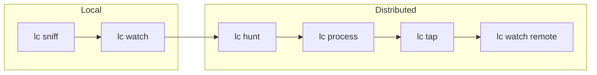

# Introduction

## What is lippycat?

lippycat is a network traffic capture and analysis tool built for modern infrastructure. It captures packets from network interfaces or PCAP files and provides both CLI and TUI (Terminal User Interface) modes for real-time monitoring and analysis.

Where traditional tools like tcpdump give you raw packet dumps and Wireshark requires a GUI, lippycat bridges the gap: protocol-aware analysis with the convenience of a terminal interface, plus distributed capture when a single machine isn't enough.

## Use Cases

**Network Monitoring**
Capture and analyze traffic on any interface. Filter by protocol, host, port, or custom BPF expressions. Write PCAP files for offline analysis.

**VoIP Analysis**
Track SIP calls end-to-end, correlate RTP streams, and write per-call PCAP files. Monitor call quality metrics and detect issues in real time.

**Security Monitoring**
Inspect TLS handshakes, detect protocol anomalies, and capture traffic for forensic analysis. Supports ESP-NULL decapsulation for encrypted tunnel inspection.

**Distributed Capture**
Deploy lightweight hunter nodes across network segments and aggregate traffic at a central processor. Monitor everything from a single TUI.

## Comparison with Similar Tools

| Feature | tcpdump | Wireshark | tshark | lippycat |
|---------|---------|-----------|--------|----------|
| CLI capture | Yes | No | Yes | Yes |
| Interactive TUI | No | GUI | No | Yes |
| Protocol analysis | Basic | Extensive | Extensive | Focused* |
| Distributed capture | No | No | No | Yes |
| Per-call VoIP PCAP | No | No | No | Yes |
| GPU acceleration | No | No | No | Yes |
| Remote monitoring | No | No | No | Yes |

*lippycat focuses on DNS, TLS, HTTP, email, and VoIP protocols with deep analysis for each.

**When to use lippycat over alternatives:**
- You need distributed capture across multiple network segments
- You want interactive terminal-based monitoring (no GUI required)
- You're analyzing VoIP traffic and want per-call PCAP files
- You need to deploy capture agents on headless servers

**When to use alternatives:**
- You need to dissect obscure or proprietary protocols (Wireshark)
- You need a quick one-liner packet dump (tcpdump)
- You need extensive protocol statistics (tshark)

## Command Overview

lippycat follows a consistent `[verb] [object]` pattern:

```
lc [verb] [object] [flags]
```

| Command | Purpose | Analogy |
|---------|---------|---------|
| `lc sniff` | CLI packet capture | Like tcpdump/tshark |
| `lc watch` | Interactive TUI | Like Wireshark (in a terminal) |
| `lc hunt` | Distributed edge capture | Capture agent |
| `lc process` | Central aggregation | Collection server |
| `lc tap` | Standalone capture + processing | hunt + process in one |
| `lc list` | List resources (interfaces, etc.) | |
| `lc show` | Display diagnostics | |
| `lc set` | Create or update resources (filters) | |
| `lc rm` | Remove resources (filters) | |

The learning path in this manual follows natural complexity:



Each command builds on concepts from the previous one, so working through the manual in order gives you the smoothest learning experience.
