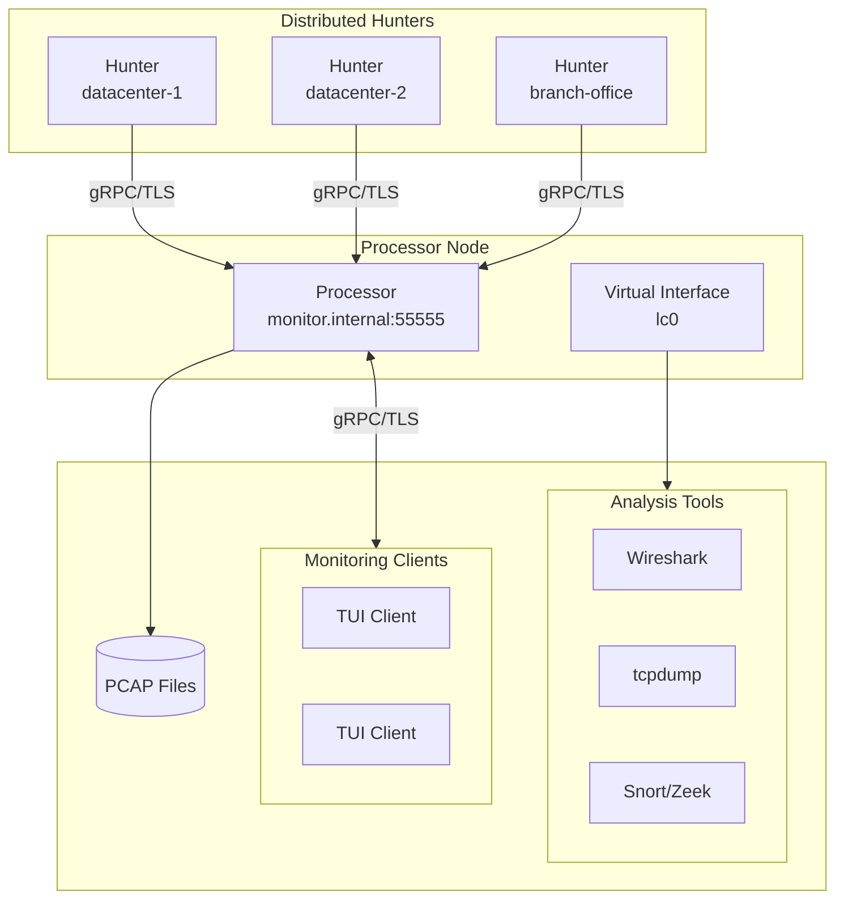

# Distributed Architecture Overview

> **This chapter is planned for a future release.** It will cover:
>
> - Why distribute capture across multiple machines
> - The hunter/processor model
> - Network topologies (hub-and-spoke, hierarchical)
> - Security considerations for distributed deployments
>
> For current documentation, see `docs/DISTRIBUTED_MODE.md` in the repository.

