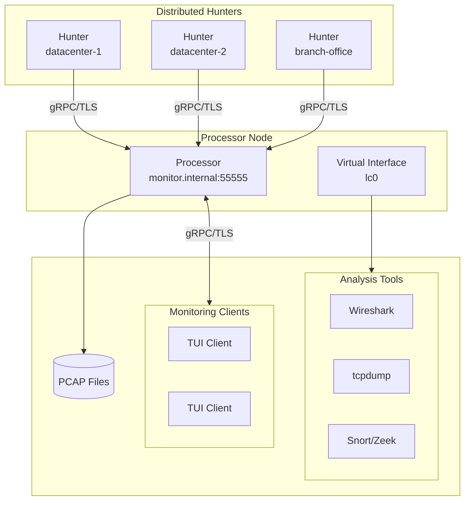
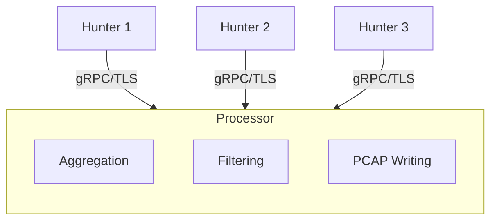
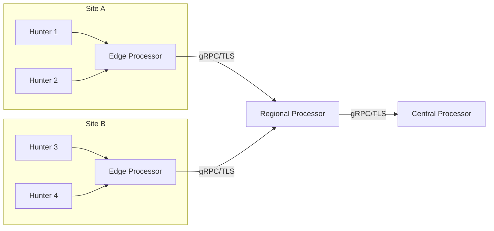
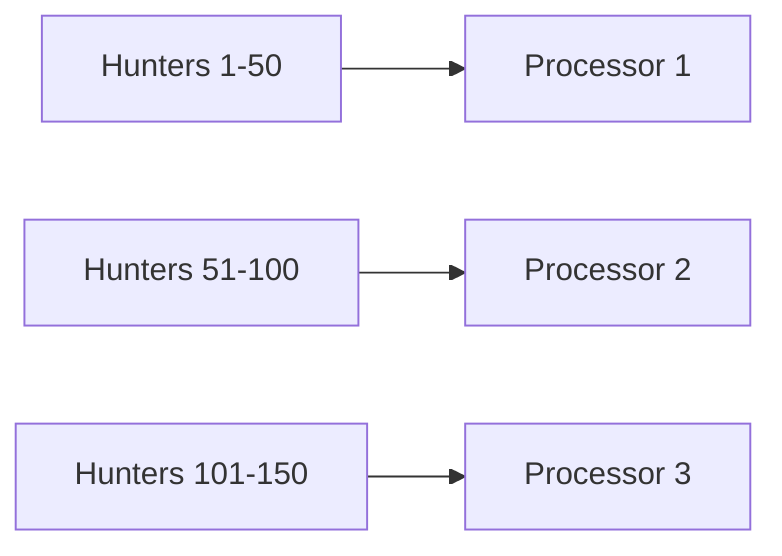
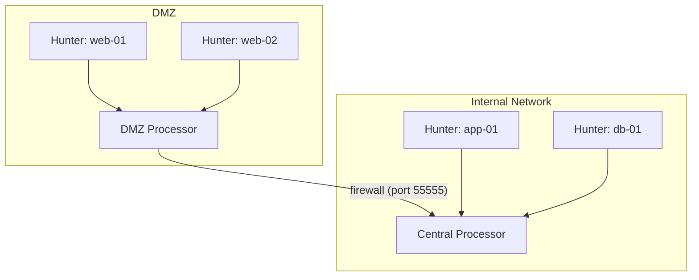

# Distributed Architecture Overview

lippycat's distributed mode lets you capture traffic across multiple network segments and aggregate it to a central point for analysis. This chapter explains the architecture, when to use it, and how to choose the right deployment topology.

## Why Distribute Capture?

A single capture point only sees traffic on its own network segment. In real-world networks, interesting traffic flows through multiple segments — data centers, branch offices, DMZs, cloud regions. Distributed capture solves three problems:

1. **Multi-segment visibility**: Deploy hunters wherever traffic flows. A central processor aggregates everything into a single view.
2. **Scalability**: Spread capture load across many lightweight agents instead of one overloaded machine.
3. **Separation of concerns**: Capture in restricted zones (DMZ, production), analyze from a monitoring zone. Hunters need `CAP_NET_RAW`; the processor doesn't.

## The Hunter/Processor Model

lippycat's distributed architecture has two node types:

- **Hunters** capture packets at the network edge and forward them to a processor via gRPC. They're lightweight (~50MB RAM) and designed to run on every network segment you want to monitor.
- **Processors** receive packets from multiple hunters, perform protocol analysis, write PCAP files, and serve TUI clients for real-time monitoring.



**Data flow**: Hunters batch packets (default: 64 per batch) and stream them to the processor over gRPC. The processor writes to PCAP, broadcasts to TUI subscribers, injects into virtual interfaces, and optionally forwards upstream.

There's also a third node type:

- **Tap** combines hunter and processor in a single process. It captures locally and provides all processor capabilities without gRPC overhead between capture and processing. See [Chapter 9](tap.md) for details.

## Network Topologies

### Hub-and-Spoke

The simplest topology. All hunters connect directly to one processor:



**When to use**: Small to medium deployments (up to ~50 hunters), single site, simple requirements.

```bash
# Processor
lc process --listen :55555 --write-file /var/capture/all.pcap \
  --tls-cert server.crt --tls-key server.key

# Hunters
sudo lc hunt --processor processor:55555 -i eth0 --tls-ca ca.crt
```

### Hierarchical

Multi-tier architecture for geographic or network segmentation. Edge processors aggregate locally and forward to regional or central processors:



**When to use**: Multi-site deployments, geographic distribution, DMZ/internal segmentation, gradual aggregation with filtering at each tier.

```bash
# Central processor
lc process --listen :55555 --write-file /var/capture/central.pcap \
  --tls-cert server.crt --tls-key server.key

# Regional processor (forwards to central)
lc process --listen :55555 --processor central:55555 \
  --tls-cert server.crt --tls-key server.key --tls-ca ca.crt

# Edge processor (forwards to regional)
lc process --listen :55555 --processor regional:55555 \
  --tls-cert server.crt --tls-key server.key --tls-ca ca.crt
```

Hierarchy depth is limited to 10 levels. Keep it at 3 or fewer for optimal performance (each hop adds ~500ms to management operations).

### Multi-Processor

Distribute hunters across multiple independent processors for load distribution:



**When to use**: Very large deployments where a single processor can't handle all traffic, or when you want independent monitoring domains.

### DMZ Segmentation

Capture from both DMZ and internal networks using hierarchical forwarding through the firewall:



The DMZ processor forwards aggregated traffic through a single firewall port to the internal processor, which merges it with internal captures. This means:

- Hunters in the DMZ never need direct access to the internal network
- Only one firewall rule is needed (DMZ processor → internal processor on port 55555)
- The internal processor has a unified view of both zones

**When to use**: Security-sensitive environments where capture spans trust boundaries.

## Security Model

All gRPC connections use **TLS by default**. You must explicitly pass `--insecure` to disable encryption (blocked when `LIPPYCAT_PRODUCTION=true`).

Three security modes are available:

| Mode | Processor Flags | Hunter Flags | Protection |
|------|----------------|--------------|------------|
| **Server TLS** | `--tls-cert`, `--tls-key` | `--tls-ca` | Encrypted, hunter verifies processor |
| **Mutual TLS** | `--tls-cert`, `--tls-key`, `--tls-ca`, `--tls-client-auth` | `--tls-cert`, `--tls-key`, `--tls-ca` | Encrypted, both sides verify each other |
| **Insecure** | `--insecure` | `--insecure` | No encryption (testing only) |

**Recommendation**: Use mutual TLS in production. It prevents unauthorized hunters from connecting to your processor.

For certificate generation and management, see [Chapter 13: Security](../part5-advanced/security.md).

## Choosing the Right Mode

Not every deployment needs the full distributed architecture. Here's a decision framework:

| Scenario | Recommended Mode | Why |
|----------|-----------------|-----|
| Quick packet inspection | `lc sniff` | CLI output, no infrastructure needed |
| Interactive analysis on one machine | `lc watch live` | TUI with local capture |
| VoIP monitoring, single machine | `lc tap voip` | Per-call PCAP, TUI, no gRPC setup |
| Capture from 2+ network segments | `lc hunt` + `lc process` | Only way to see traffic from multiple segments |
| Edge node with local TUI + central aggregation | `lc tap` with `--processor` | Standalone capture with upstream forwarding |
| Large-scale multi-site monitoring | Hierarchical processors | Regional aggregation before central |

**Migration path**: Start with `sniff` or `tap` on a single machine. When you need multi-segment visibility, deploy hunters and a processor. The flag knowledge transfers — most `sniff` flags work on `hunt` too (see [Chapter 7](hunt.md)).

## Capacity Planning

### Hunters

| Resource | Typical Usage | Notes |
|----------|--------------|-------|
| Memory | ~50MB | Increases with buffer size and VoIP call buffers |
| CPU | Minimal | Depends on packet rate and GPU acceleration |
| Network | Depends on traffic | VoIP hunters reduce bandwidth by 90%+ with selective forwarding |

### Processors

| Resource | Typical Usage | Notes |
|----------|--------------|-------|
| Memory | ~5-10MB per hunter | Plus ~2-5MB per TUI subscriber |
| CPU | Minimal per hunter | Protocol detection adds some overhead |
| Disk I/O | Depends on PCAP writing | SSD/NVMe recommended for high packet rates |
| Network | Sum of hunter traffic | Plus TUI subscriber traffic |

**Rules of thumb**:
- Default `--max-hunters` is 100; adjust based on available RAM
- Each hunter streams ~10,000 packets/sec at peak
- End-to-end latency is typically <100ms
- Heartbeat interval is 5 seconds; stale hunters are cleaned up after 5 minutes

## What Comes Next

- [Chapter 7: Edge Capture with `lc hunt`](hunt.md) — deploying and configuring hunters
- [Chapter 8: Central Aggregation with `lc process`](process.md) — setting up processors
- [Chapter 9: Standalone Mode with `lc tap`](tap.md) — when you want both in one binary
- [Chapter 13: Security](../part5-advanced/security.md) — TLS/mTLS certificate setup
