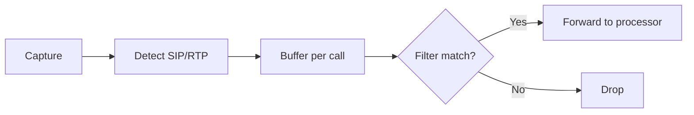

# Edge Capture with `lc hunt`

Hunters are lightweight capture agents that run at the network edge. If you've used `lc sniff` ([Chapter 4](../part2-local-capture/sniff.md)), you already know most of what you need — hunting is sniffing that forwards to a processor instead of writing locally.

## From Sniff to Hunt

The transition from local capture to distributed capture is small. Compare:

```bash
# What you learned with sniff:
sudo lc sniff voip -i eth0 --sip-user alicent -w calls.pcap

# The same thing, but forwarded to a processor:
sudo lc hunt voip -i eth0 --sip-user alicent --processor central:55555 --tls-ca ca.crt
```

The capture flags (`-i`, `-f`, `--sip-user`, `--udp-only`, `--sip-port`) carry over. What changes is the output: instead of `-w` writing a local PCAP, `--processor` sends packets to a remote processor. The processor handles PCAP writing, TUI serving, and analysis (see [Chapter 8](process.md)).

### What Stays the Same

| Flag | Sniff | Hunt | Same? |
|------|-------|------|-------|
| `-i, --interface` | Network interface(s) | Network interface(s) | Yes |
| `-f, --filter` | BPF filter | BPF filter | Yes |
| `-p, --promisc` | Promiscuous mode | Promiscuous mode | Yes |
| `--esp-null` | ESP-NULL decapsulation | ESP-NULL decapsulation | Yes |
| `--esp-icv-size` | ESP ICV size | ESP ICV size | Yes |
| `--udp-only` | UDP-only capture (VoIP) | UDP-only capture (VoIP) | Yes |
| `--sip-port` | SIP port restriction (VoIP) | SIP port restriction (VoIP) | Yes |
| `--rtp-port-range` | RTP port range (VoIP) | RTP port range (VoIP) | Yes |
| `--gpu-backend` | GPU acceleration | GPU acceleration | Yes |

### What's New

| Flag | Purpose |
|------|---------|
| `-P, --processor` | Processor address (host:port) — **required** |
| `-I, --id` | Hunter identifier (default: hostname) |
| `-b, --buffer-size` | Packet buffer size (default: 10000) |
| `--batch-size` | Packets per gRPC batch (default: 64) |
| `--batch-timeout` | Batch send timeout in ms (default: 100) |
| `--batch-queue-size` | Batch queue buffer (default: 1000) |
| `--tls-cert`, `--tls-key`, `--tls-ca` | TLS certificates |
| `--insecure` | Disable TLS (testing only) |
| `--disk-buffer` | Enable disk overflow buffer |

### Your First Distributed Capture

Start a processor (see [Chapter 8](process.md) for full details):

```bash
# Terminal 1: Start processor
lc process --listen :55555 --write-file /tmp/captured.pcap \
  --tls-cert server.crt --tls-key server.key
```

Start a hunter:

```bash
# Terminal 2: Start hunter
sudo lc hunt --processor localhost:55555 -i eth0 --tls-ca ca.crt
```

The hunter captures packets on `eth0`, batches them, and streams them to the processor via gRPC. The processor writes everything to `captured.pcap`.

For quick local testing without TLS:

```bash
# Processor (insecure, testing only)
lc process --listen :55555 --write-file /tmp/captured.pcap --insecure

# Hunter (insecure, testing only)
sudo lc hunt --processor localhost:55555 -i eth0 --insecure
```

## Protocol-Specific Hunters

Like `sniff`, `hunt` has protocol subcommands that add specialized filtering and analysis.

### VoIP Hunter (`hunt voip`)

The VoIP hunter is the most commonly used mode. It captures SIP/RTP traffic with intelligent call buffering — packets are held locally until a call matches the processor's filters, then forwarded. Unmatched calls are dropped at the edge, reducing bandwidth by 90%+.

```bash
# VoIP hunter with TLS
sudo lc hunt voip --processor processor:55555 -i eth0 --tls-ca ca.crt

# VoIP hunter with BPF optimization (UDP-only, specific SIP port)
sudo lc hunt voip --processor processor:55555 -i eth0 \
  --udp-only --sip-port 5060 --tls-ca ca.crt

# VoIP hunter with custom RTP port range
sudo lc hunt voip --processor processor:55555 -i eth0 \
  --rtp-port-range 8000-9000 --tls-ca ca.crt

# VoIP hunter with mutual TLS
sudo lc hunt voip --processor processor:55555 -i eth0 \
  --tls-cert hunter.crt --tls-key hunter.key --tls-ca ca.crt
```

**How call buffering works**:



1. Hunter captures SIP and RTP packets
2. Packets are buffered locally, grouped by SIP Call-ID
3. Filter subscription receives filters from the processor (SIP user, phone number, IP)
4. Buffered packets are matched against filters
5. Only matched calls are forwarded — SIP signaling and associated RTP media

Filters are managed centrally by the processor and pushed to hunters. Hunters don't configure filters locally. See [Chapter 8](process.md) for filter management.

### DNS Hunter (`hunt dns`)

Captures DNS queries and responses for forwarding to the processor.

```bash
# DNS hunter
sudo lc hunt dns --processor processor:55555 -i eth0 --tls-ca ca.crt

# DNS hunter, UDP-only with custom ports
sudo lc hunt dns --processor processor:55555 -i eth0 \
  --dns-port 53,5353 --udp-only --tls-ca ca.crt
```

**DNS-specific flags**: `--dns-port` (default: 53), `--udp-only`.

### HTTP Hunter (`hunt http`)

Captures HTTP traffic with optional host/path/method filtering at the edge.

```bash
# HTTP hunter with host filtering
sudo lc hunt http --processor processor:55555 -i eth0 \
  --host "*.example.com" --http-port 80,8080 --tls-ca ca.crt
```

**HTTP-specific flags**: `--http-port`, `--host`, `--path`, `--method`.

### TLS Hunter (`hunt tls`)

Captures TLS handshakes for fingerprint analysis (JA3/JA3S/JA4).

```bash
# TLS hunter on multiple ports
sudo lc hunt tls --processor processor:55555 -i eth0 \
  --tls-port 443,8443 --tls-ca ca.crt
```

**TLS-specific flags**: `--tls-port` (default: 443).

### Email Hunter (`hunt email`)

Captures SMTP, IMAP, and POP3 traffic with address filtering.

```bash
# Email hunter, SMTP only with sender filtering
sudo lc hunt email --processor processor:55555 -i eth0 \
  --protocol smtp --sender "*@suspicious.com" --tls-ca ca.crt
```

**Email-specific flags**: `--protocol` (smtp/imap/pop3/all), `--smtp-port`, `--imap-port`, `--pop3-port`, `--address`, `--sender`, `--recipient`.

## Resilience and Flow Control

Hunters are designed to survive network disruptions and processor outages.

### Flow Control

The processor sends flow control signals to hunters via heartbeat responses:

| State | Meaning | Hunter Response |
|-------|---------|-----------------|
| `CONTINUE` | Normal operation | Send at full rate |
| `SLOW` | Processor queue 30-70% full | Increase batch timeout |
| `PAUSE` | Processor queue >90% full | Stop sending, buffer locally |
| `RESUME` | Queue below threshold | Resume normal operation |

Flow control is based on the processor's PCAP write queue utilization. Slow TUI clients do not trigger flow control — they receive selective packet drops instead.

### Automatic Reconnection

When the connection to the processor is lost, the hunter reconnects automatically:

| Attempt | Backoff | Total Time |
|---------|---------|------------|
| 1 | 1s | 1s |
| 2 | 2s | 3s |
| 3 | 4s | 7s |
| 4 | 8s | 15s |
| 5 | 16s | 31s |
| 6 | 32s | 63s |
| 7-10 | 60s | ~5 minutes |

During reconnection, packet capture continues. Packets are buffered up to `--buffer-size` (default: 10,000 packets). Once the buffer is full, new packets are dropped.

### Disk Overflow Buffer

For extended disconnections (hours, days), enable the disk overflow buffer:

```bash
sudo lc hunt --processor processor:55555 -i eth0 \
  --disk-buffer --disk-buffer-max-mb 2048 --tls-ca ca.crt
```

When the memory queue fills, batches overflow to disk. When the connection is restored, disk batches feed back into the memory queue (FIFO ordering, oldest first).

- `--disk-buffer` — enable disk overflow
- `--disk-buffer-dir` — buffer directory (default: `/var/tmp/lippycat-buffer`)
- `--disk-buffer-max-mb` — maximum disk usage in MB (default: 1024)

### Circuit Breaker

When the processor is down for an extended period, the circuit breaker prevents connection thrashing:

- Opens after 5 consecutive connection failures
- Waits 30 seconds before allowing retry
- Half-open state: allows limited test connections before full recovery

## Performance Tuning

### Batch Configuration

Batching controls how packets are aggregated before sending. Larger batches reduce gRPC overhead but increase latency:

```bash
# Low latency (real-time monitoring)
sudo lc hunt --processor processor:55555 -i eth0 \
  --batch-size 16 --batch-timeout 50 --tls-ca ca.crt

# High throughput (bulk capture)
sudo lc hunt --processor processor:55555 -i eth0 \
  --batch-size 256 --batch-timeout 500 --tls-ca ca.crt

# Balanced (default)
sudo lc hunt --processor processor:55555 -i eth0 \
  --batch-size 64 --batch-timeout 100 --tls-ca ca.crt
```

| Profile | Batch Size | Timeout | Use Case |
|---------|-----------|---------|----------|
| Low latency | 16-32 | 50-100ms | Real-time analysis |
| Balanced | 64-128 | 100-200ms | General monitoring |
| High throughput | 256-512 | 500-1000ms | Bulk capture, archival |

### GPU Acceleration

Enable GPU-accelerated VoIP pattern matching at the edge:

```bash
# Auto-detect best backend
sudo lc hunt --processor processor:55555 -i eth0 \
  --enable-voip-filter --gpu-backend auto --tls-ca ca.crt

# Force CUDA (NVIDIA GPUs)
sudo lc hunt --processor processor:55555 -i eth0 \
  --enable-voip-filter --gpu-backend cuda --gpu-batch-size 200 --tls-ca ca.crt

# CPU SIMD only (no GPU required)
sudo lc hunt --processor processor:55555 -i eth0 \
  --enable-voip-filter --gpu-backend cpu-simd --tls-ca ca.crt
```

GPU acceleration is most valuable at high packet rates (>10,000 pps) with many concurrent SIP calls. See [Chapter 14: Performance](../part5-advanced/performance.md) for benchmarks.

### BPF Filter Optimization

For VoIP hunters on TCP-heavy networks, use BPF flags to skip TCP traffic and focus on SIP/RTP:

```bash
# UDP-only mode (bypass TCP, reduces CPU significantly)
sudo lc hunt voip --processor processor:55555 -i eth0 \
  --udp-only --tls-ca ca.crt

# Restrict to specific SIP port
sudo lc hunt voip --processor processor:55555 -i eth0 \
  --sip-port 5060 --tls-ca ca.crt

# Combined: UDP-only with specific SIP port
sudo lc hunt voip --processor processor:55555 -i eth0 \
  --udp-only --sip-port 5060 --tls-ca ca.crt
```

### Pattern Matching Algorithm

For large filter sets, the Aho-Corasick algorithm provides ~265x faster matching than linear scan:

```bash
# Auto-select (Aho-Corasick for 100+ patterns, linear otherwise)
sudo lc hunt --processor processor:55555 -i eth0 \
  --pattern-algorithm auto --tls-ca ca.crt

# Force Aho-Corasick for smaller filter sets
sudo lc hunt --processor processor:55555 -i eth0 \
  --pattern-algorithm aho-corasick --tls-ca ca.crt
```

## Configuration File

All hunt flags can be set in `~/.config/lippycat/config.yaml`:

```yaml
hunter:
  processor_addr: "processor.example.com:55555"
  id: "edge-hunter-01"
  interfaces:
    - eth0
    - eth1
  bpf_filter: "port 5060 or portrange 10000-20000"
  buffer_size: 10000
  batch_size: 64
  batch_timeout_ms: 100
  batch_queue_size: 1000

  voip:
    udp_only: false
    sip_ports: "5060"
    rtp_port_ranges: "10000-32768"

  tls:
    cert_file: "/etc/lippycat/certs/hunter.crt"
    key_file: "/etc/lippycat/certs/hunter.key"
    ca_file: "/etc/lippycat/certs/ca.crt"
```

Flag values take precedence over config file values.
