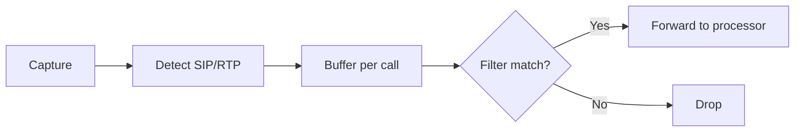

# Edge Capture with `lc hunt`

Hunters are lightweight capture agents that run at the network edge. If you've used `lc sniff` ([Chapter 4](../part2-local-capture/sniff.md)), you already know most of what you need — hunting is sniffing that forwards to a processor instead of writing locally.

## From Sniff to Hunt

The transition from local capture to distributed capture is small. Compare:

What you learned with `sniff`:

```bash
sudo lc sniff voip -i eth0 --sip-user alicent -w calls.pcap
```

The distributed equivalent starts by creating a filter:

```bash
lc set filter -P central:55555 --tls-ca ca.crt \
  --type sip_user --pattern alicent
```

Then start the hunter:

```bash
sudo lc hunt voip -i eth0 --processor central:55555 --tls-ca ca.crt
```

Most capture flags (`-i`, `-f`, `--sip-port`, `--rtp-port-range`) carry over. What changes is filtering and output: VoIP call filters are managed centrally on the processor with `lc set filter`, and `--processor` sends matching packets to that processor. The processor handles PCAP writing, TUI serving, and analysis (see [Chapter 8](process.md)).

### What Stays the Same

| Flag               | Sniff                           | Hunt                            | Same? |
| ------------------ | ------------------------------- | ------------------------------- | ----- |
| `-i, --interface`  | Network interface(s)            | Network interface(s)            | Yes   |
| `-f, --filter`     | BPF filter                      | BPF filter                      | Yes   |
| `-p, --promisc`    | Promiscuous mode                | Promiscuous mode                | Yes   |
| `--esp-null`       | ESP-NULL decapsulation          | ESP-NULL decapsulation          | Yes   |
| `--esp-heuristic`  | ESP-NULL detection by content   | ESP-NULL detection by content   | Yes   |
| `--esp-icv-size`   | ESP ICV size                    | ESP ICV size                    | Yes   |
| `--sip-user`       | Local SIP-user filter           | Processor-managed filter        | No    |
| `--sip-port`       | SIP port restriction (VoIP)     | SIP port restriction (VoIP)     | Yes   |
| `--rtp-port-range` | RTP port range (VoIP)           | RTP port range (VoIP)           | Yes   |
| `--gpu-backend`    | GPU acceleration in CUDA builds | GPU acceleration in CUDA builds | Yes   |

### What's New

| Flag                                  | Purpose                                                                        |
| ------------------------------------- | ------------------------------------------------------------------------------ |
| `-P, --processor`                     | Processor address (host:port) — **required**                                   |
| `-I, --id`                            | Hunter identifier (default: hostname)                                          |
| `-b, --buffer-size`                   | Packet buffer size (default: 10000)                                            |
| `--sip-buffer-size`                   | SIP priority-lane size (default: 0, automatically matches `--buffer-size`)      |
| `--batch-size`                        | Packets per gRPC batch (default: 64)                                           |
| `--batch-timeout`                     | Batch send timeout in ms (default: 100)                                        |
| `--batch-queue-size`                  | Batch queue buffer (default: 1000)                                             |
| `--tls-cert`, `--tls-key`, `--tls-ca` | TLS certificates                                                               |
| `--insecure`                          | Disable TLS (testing only)                                                     |
| `--disk-buffer`                       | Enable disk overflow buffer                                                    |
| `--no-filter-policy`                  | Whether to forward all or no packets when no filters exist (`deny` by default) |
| `--debug-listen`                      | Optional pprof listener for diagnostics                                        |

### Your First Distributed Capture

Start a processor (see [Chapter 8](process.md) for full details):

In Terminal 1, start the processor:

```bash
lc process --listen :55555 --write-file /tmp/captured.pcap \
  --tls-cert server.crt --tls-key server.key
```

In Terminal 2, start a hunter:

```bash
sudo lc hunt --processor localhost:55555 -i eth0 --tls-ca ca.crt
```

The hunter captures packets on `eth0`, batches them, and streams them to the processor via gRPC. The processor writes everything to `captured.pcap`.

## Packet or Event Forwarding

Hunters default to `--forward-mode packets` for compatibility. The processor
receives raw packets, owns protocol analysis, and can provide PCAP output,
packet-oriented TUI views, virtual-interface injection, and later reanalysis.

With `--forward-mode events`, analysis moves to the hunter. Only normalized
connection, DNS, TLS, HTTP, SMTP, RADIUS, and file-metadata events cross the
network;
raw packets and file content do not. The central processor can log and display
the negotiated events, but cannot reconstruct packet evidence, rerun analysis,
or provide packet-dependent output for that producer.

```bash
sudo lc hunt -P processor:55555 -i eth0 --forward-mode events \
  --event-delivery-profile reliable \
  --event-spool-dir /var/lib/lippycat/event-spool --tls-ca ca.crt
```

The default reliable profile retains unacknowledged batches in a recoverable
edge spool. `memory-only` lowers disk use but acknowledged queue admissions may
be lost if the processor crashes. Configure byte/age limits and choose
`drop_oldest` or `drop_new`; loss remains visible in hunter status.

### Operating the reliable event spool

Give each hunter its own spool directory and monitor both its configured limit
and filesystem free space. Encoded record payloads are limited to 4 MiB even
when total spool storage is unlimited; if an event or its exact loss report
cannot be stored, forwarding stops instead of hiding the loss. For recovery
behavior and the safe response to startup or durability errors, see
[Event spool storage and recovery](../part4-administration/operations.md#event-spool-storage-and-recovery).

Event capability and analysis policy are negotiated. Incompatibility fails
closed unless `--event-fallback-to-packets` explicitly permits raw-packet
fallback. Keep that flag off where event mode is a privacy boundary. Existing
packet-only nodes remain compatible because packet mode is the default.

Metadata is not anonymous: URLs, mail addresses, DNS names, certificates, and
file attributes may be sensitive. Use TLS/mTLS, authorize node identities,
restrict and encrypt spool storage, and apply retention limits.

For quick local testing without TLS:

Start the processor in insecure mode (testing only):

```bash
lc process --listen :55555 --write-file /tmp/captured.pcap --insecure
```

Then start the hunter in insecure mode (testing only):

```bash
sudo lc hunt --processor localhost:55555 -i eth0 --insecure
```

## Protocol-Specific Hunters

Like `sniff`, `hunt` has protocol subcommands that add specialized filtering and analysis.

### VoIP Hunter (`hunt voip`)

The VoIP hunter is the most commonly used mode. It captures SIP/RTP traffic with intelligent call buffering — packets are held locally until a call matches the processor's filters, then forwarded. Unmatched calls are dropped at the edge, reducing bandwidth by 90%+.

VoIP hunter with TLS:

```bash
sudo lc hunt voip --processor processor:55555 -i eth0 --tls-ca ca.crt
```

VoIP hunter with BPF optimization for a specific SIP port:

```bash
sudo lc hunt voip --processor processor:55555 -i eth0 \
  --sip-port 5060 --tls-ca ca.crt
```

VoIP hunter with a custom RTP port range:

```bash
sudo lc hunt voip --processor processor:55555 -i eth0 \
  --rtp-port-range 8000-9000 --tls-ca ca.crt
```

VoIP hunter with mutual TLS:

```bash
sudo lc hunt voip --processor processor:55555 -i eth0 \
  --tls-cert hunter.crt --tls-key hunter.key --tls-ca ca.crt
```

**How call buffering works**:


```mermaid
flowchart LR
    C[Capture] --> D[Detect SIP/RTP]
    D --> B[Buffer per call]
    B --> M{Filter match?}
    M -->|Yes| F[Forward to processor]
    M -->|No| X[Drop]
```

1. Hunter captures SIP and RTP packets
2. Packets are buffered locally, grouped by SIP Call-ID
3. Filter subscription receives filters from the processor (SIP user, phone number, IP)
4. Buffered packets are matched against filters
5. Only matched calls are forwarded — SIP signaling and associated RTP media

Filters are managed centrally by the processor and pushed to hunters. Hunters don't configure call filters locally. Use `lc set filter` / `lc rm filter` for live filter changes; see [Chapter 10](../part4-administration/cli-admin.md) for CLI administration.

### DNS Hunter (`hunt dns`)

Captures DNS queries and responses for forwarding to the processor.

DNS hunter:

```bash
sudo lc hunt dns --processor processor:55555 -i eth0 --tls-ca ca.crt
```

UDP-only DNS hunter with custom ports:

```bash
sudo lc hunt dns --processor processor:55555 -i eth0 \
  --dns-port 53,5353 --udp-only --tls-ca ca.crt
```

**DNS-specific flags**: `--dns-port` (default: 53), `--udp-only`.

### HTTP Hunter (`hunt http`)

Captures HTTP traffic with optional host/path/method filtering at the edge.

HTTP hunter with host filtering:

```bash
sudo lc hunt http --processor processor:55555 -i eth0 \
  --host "*.example.com" --http-port 80,8080 --tls-ca ca.crt
```

**HTTP-specific flags**: `--http-port`, `--host`, `--path`, `--method`.

### TLS Hunter (`hunt tls`)

Captures TLS handshakes for fingerprint analysis (JA3/JA3S/JA4).

TLS hunter on multiple ports:

```bash
sudo lc hunt tls --processor processor:55555 -i eth0 \
  --tls-port 443,8443 --tls-ca ca.crt
```

**TLS-specific flags**: `--tls-port` (default: 443).

### Email Hunter (`hunt email`)

Captures SMTP, IMAP, and POP3 traffic with address filtering.

SMTP-only email hunter with sender filtering:

```bash
sudo lc hunt email --processor processor:55555 -i eth0 \
  --protocol smtp --sender "*@suspicious.com" --tls-ca ca.crt
```

**Email-specific flags**: `--protocol` (smtp/imap/pop3/all), `--smtp-port`, `--imap-port`, `--pop3-port`, `--address`, `--sender`, `--recipient`.

### RADIUS Hunter (`hunt radius`)

Captures visible UDP RADIUS authentication and accounting traffic, applies
exact identity criteria at the edge, and forwards selected packets and their
validated observation and provenance metadata to the processor. Routine display
and structured-log projections redact credential-bearing attributes:

```bash
sudo lc hunt radius --processor processor:55555 -i mirror0 \
  --radius-username 'alice@example.test' --tls-ca ca.crt
```

The RADIUS subcommand shares its port, identity, scope, and bounded-correlation
flags with `sniff radius` and `tap radius`. See
[RADIUS capture and POI](../part5-advanced/radius.md) for the complete flag table
and distributed deployment constraints.

## Resilience and Flow Control

Hunters are designed to survive network disruptions and processor outages.

### Flow Control

The processor sends flow control signals to hunters via heartbeat responses:

| State      | Meaning                     | Hunter Response              |
| ---------- | --------------------------- | ---------------------------- |
| `CONTINUE` | Normal operation            | Send at full rate            |
| `SLOW`     | Processor queue 30-70% full | Increase batch timeout       |
| `PAUSE`    | Processor queue >90% full   | Stop sending, buffer locally |
| `RESUME`   | Queue below threshold       | Resume normal operation      |

Flow control is based on the processor's PCAP write queue utilization. Slow TUI clients do not trigger flow control — they receive selective packet drops instead.

### Automatic Reconnection

When the connection to the processor is lost, the hunter reconnects automatically:

| Attempt | Backoff | Total Time |
| ------- | ------- | ---------- |
| 1       | 1s      | 1s         |
| 2       | 2s      | 3s         |
| 3       | 4s      | 7s         |
| 4       | 8s      | 15s        |
| 5       | 16s     | 31s        |
| 6       | 32s     | 63s        |
| 7-10    | 60s     | ~5 minutes |

During reconnection, packet capture continues. Regular and SIP-priority input
lanes are bounded separately, followed by a bounded merged-output lane. The SIP
lane automatically matches `--buffer-size` unless `--sip-buffer-size` is set to
a positive override. Larger queues add burst headroom and memory use; they do
not make sustained overload lossless.

### Disk Overflow Buffer

For extended disconnections (hours, days), enable the disk overflow buffer:

```bash
sudo lc hunt --processor processor:55555 -i eth0 \
  --disk-buffer --disk-buffer-max-mb 2048 --tls-ca ca.crt
```

When the memory queue fills, batches overflow to disk. When the connection is restored, disk batches feed back into the memory queue (FIFO ordering, oldest first).

- `--disk-buffer` — enable disk overflow
- `--disk-buffer-dir` — buffer directory (default: `/var/tmp/lippycat-buffer`)
- `--disk-buffer-max-mb` — maximum disk usage in MB (default: 1024)

### Circuit Breaker

When the processor is down for an extended period, the circuit breaker prevents connection thrashing:

- Opens after 5 consecutive connection failures
- Waits 30 seconds before allowing retry
- Half-open state: allows limited test connections before full recovery

## Performance Tuning

### Capture Buffer Pressure

Use the per-lane length and capacity gauges to identify whether the regular,
SIP-priority, or merged-output lane is saturated. Interpret the SIP counters as
successive outcomes:

| Counter | Meaning |
| --- | --- |
| `sip_priority_classified` | Packets recognized and routed through the SIP-priority path, including packets later demoted or finally dropped. |
| `capture_buffer_sip_demotions` | Classified SIP packets retained in the regular lane after the priority lane filled. Demotions are not packet loss. |
| `capture_buffer_sip_drops` | Classified SIP packets rejected by both input lanes and therefore lost. |

Persistent growth in the output lane points to downstream processing or
forwarding throughput rather than an input-capacity problem alone.

### Batch Configuration

Batching controls how packets are aggregated before sending. Larger batches reduce gRPC overhead but increase latency:

For low-latency, real-time monitoring:

```bash
sudo lc hunt --processor processor:55555 -i eth0 \
  --batch-size 16 --batch-timeout 50 --tls-ca ca.crt
```

For high-throughput bulk capture:

```bash
sudo lc hunt --processor processor:55555 -i eth0 \
  --batch-size 256 --batch-timeout 500 --tls-ca ca.crt
```

For the balanced default profile:

```bash
sudo lc hunt --processor processor:55555 -i eth0 \
  --batch-size 64 --batch-timeout 100 --tls-ca ca.crt
```

| Profile         | Batch Size | Timeout    | Use Case               |
| --------------- | ---------- | ---------- | ---------------------- |
| Low latency     | 16-32      | 50-100ms   | Real-time analysis     |
| Balanced        | 64-128     | 100-200ms  | General monitoring     |
| High throughput | 256-512    | 500-1000ms | Bulk capture, archival |

### GPU Acceleration

These flags are available in CUDA builds.

Enable GPU-accelerated VoIP pattern matching at the edge:

To auto-detect the best backend:

```bash
sudo lc hunt --processor processor:55555 -i eth0 \
  --enable-voip-filter --gpu-backend auto --tls-ca ca.crt
```

To force CUDA on NVIDIA GPUs:

```bash
sudo lc hunt --processor processor:55555 -i eth0 \
  --enable-voip-filter --gpu-backend cuda --gpu-batch-size 200 --tls-ca ca.crt
```

To use CPU SIMD without requiring a GPU:

```bash
sudo lc hunt --processor processor:55555 -i eth0 \
  --enable-voip-filter --gpu-backend cpu-simd --tls-ca ca.crt
```

GPU acceleration is most valuable at high packet rates (>10,000 pps) with many concurrent SIP calls. See [Chapter 14: Performance](../part5-advanced/performance.md) for benchmarks.

### BPF Filter Optimization

For VoIP hunters on TCP-heavy networks, use BPF flags to skip TCP traffic and focus on SIP/RTP:

To restrict capture to a specific SIP port:

```bash
sudo lc hunt voip --processor processor:55555 -i eth0 \
  --sip-port 5060 --tls-ca ca.crt
```

To restrict both the SIP port and RTP range:

```bash
sudo lc hunt voip --processor processor:55555 -i eth0 \
  --sip-port 5060 --rtp-port-range 10000-20000 --tls-ca ca.crt
```

The older VoIP `--udp-only` flag is still accepted for compatibility but hidden and deprecated because it can miss TCP SIP traffic.

### Pattern Matching Algorithm

For large filter sets, the Aho-Corasick algorithm provides ~265x faster matching than linear scan:

To auto-select Aho-Corasick for 100 or more patterns and linear matching otherwise:

```bash
sudo lc hunt --processor processor:55555 -i eth0 \
  --pattern-algorithm auto --tls-ca ca.crt
```

To force Aho-Corasick for smaller filter sets:

```bash
sudo lc hunt --processor processor:55555 -i eth0 \
  --pattern-algorithm aho-corasick --tls-ca ca.crt
```

## Configuration File

All hunt flags can be set in `~/.config/lippycat/config.yaml`:

```yaml
hunter:
  processor_addr: "processor.example.com:55555"
  id: "edge-hunter-01"
  interfaces:
    - eth0
    - eth1
  bpf_filter: "port 5060 or portrange 10000-20000"
  buffer_size: 10000
  batch_size: 64
  batch_timeout_ms: 100
  batch_queue_size: 1000

  voip:
    udp_only: false
    sip_ports: "5060"
    rtp_port_ranges: "10000-32768"

  tls:
    cert_file: "/etc/lippycat/certs/hunter.crt"
    key_file: "/etc/lippycat/certs/hunter.key"
    ca_file: "/etc/lippycat/certs/ca.crt"
```

Flag values take precedence over config file values.
