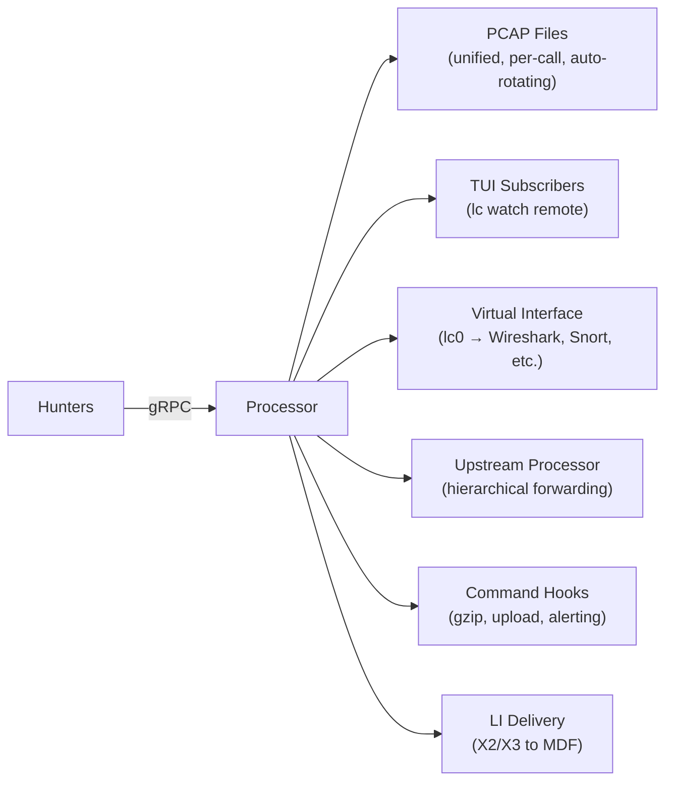
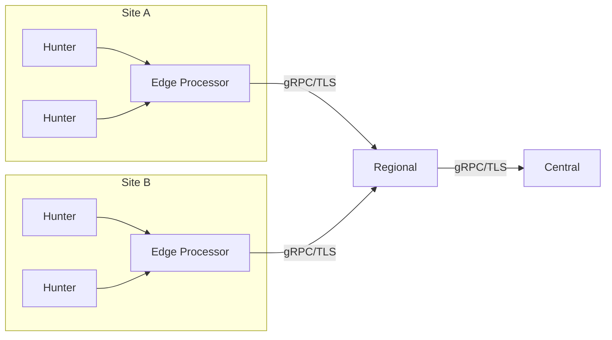

# Central Aggregation with `lc process`

Processors are the central hub of the distributed architecture. They receive packets from hunters, perform protocol analysis, write PCAP files, and serve TUI clients for real-time monitoring. This chapter covers everything you need to run a processor.

## Processor Basics

### Starting a Processor

A processor needs a listen address and TLS certificates:

```bash
# Minimal processor with TLS
lc process --listen :55555 \
  --tls-cert server.crt --tls-key server.key

# Processor with PCAP writing
lc process --listen 0.0.0.0:55555 \
  --write-file /var/capture/packets.pcap \
  --tls-cert server.crt --tls-key server.key

# For local testing without TLS
lc process --listen :55555 --insecure
```

Hunters connect to the processor automatically. No configuration is needed on the processor side to accept a specific hunter — any hunter with the correct TLS credentials can connect.

### Key Flags

| Flag | Default | Description |
|------|---------|-------------|
| `-l, --listen` | `:55555` | Listen address for hunter and TUI connections |
| `-I, --id` | hostname | Processor identifier |
| `-m, --max-hunters` | 100 | Maximum concurrent hunter connections |
| `--max-subscribers` | 100 | Maximum TUI subscribers (0 = unlimited) |
| `-s, --stats` | true | Display periodic statistics |
| `-d, --enable-detection` | true | Enable protocol detection on received packets |

### Hunter Management

When hunters connect, the processor:
1. Registers the hunter and assigns it to the connection pool
2. Starts receiving packet batches via gRPC streaming
3. Sends heartbeat responses with flow control signals
4. Distributes active filters to the hunter

Hunter health is monitored via heartbeats (5-second interval). Stale hunters are cleaned up after 5 minutes of no heartbeat.

## Output Channels

Every packet a processor receives can be sent to multiple destinations simultaneously. These output channels are independent — enable any combination:



| Channel | Flag(s) | Description |
|---------|---------|-------------|
| **Unified PCAP** | `-w` | All packets to a single file |
| **Per-Call PCAP** | `--per-call-pcap` | Separate files per VoIP call (SIP + RTP) |
| **Auto-Rotating PCAP** | `--auto-rotate-pcap` | Non-VoIP packets to time/size-rotated files |
| **TUI subscribers** | (always on) | Real-time streaming to `lc watch remote` clients |
| **Virtual interface** | `-V` | Inject into a tap/tun device for external tools |
| **Upstream forwarding** | `-P` | Forward to another processor (hierarchical mode) |
| **Command hooks** | `--pcap-command`, `--voip-command` | Run scripts on PCAP close or call completion |
| **LI delivery** | `--li-enabled` | X2/X3 PDUs to MDF (requires `-tags li` build) |

`lc tap` supports all the same output channels (see [Standalone Mode with `lc tap`](tap.md)).

The following sections cover each channel in detail. For LI delivery, see [Lawful Interception](../part5-advanced/lawful-interception.md).

## PCAP Writing Modes

Processors support three independent PCAP writing modes. All three can be active simultaneously.

### Unified PCAP

Write all received packets to a single continuous file:

```bash
lc process --listen :55555 \
  --write-file /var/capture/all-traffic.pcap \
  --tls-cert server.crt --tls-key server.key
```

**Use cases**: Compliance/audit trails, forensic analysis, traffic replay.

### Per-Call PCAP (VoIP)

Write separate SIP and RTP PCAP files for each VoIP call:

```bash
lc process --listen :55555 \
  --per-call-pcap \
  --per-call-pcap-dir /var/capture/calls \
  --per-call-pcap-pattern "{timestamp}_{callid}.pcap" \
  --tls-cert server.crt --tls-key server.key
```

For each call, two files are created:

```
20250123_143022_abc123_sip.pcap    # SIP signaling
20250123_143022_abc123_rtp.pcap    # RTP media
```

**Pattern placeholders**: `{callid}`, `{from}`, `{to}`, `{timestamp}`.

Files rotate independently when reaching 100MB. Per-call PCAP only applies to VoIP traffic; non-VoIP packets are handled by the other writers.

**Use cases**: VoIP call recording, per-call quality analysis, selective archival.

### Auto-Rotating PCAP

Write non-VoIP packets to auto-rotating files based on activity:

```bash
lc process --listen :55555 \
  --auto-rotate-pcap \
  --auto-rotate-pcap-dir /var/capture/bursts \
  --auto-rotate-idle-timeout 30s \
  --auto-rotate-max-size 100M \
  --tls-cert server.crt --tls-key server.key
```

Rotation triggers:
- **Idle timeout**: close file after 30 seconds of inactivity (configurable)
- **File size**: rotate when file reaches 100MB (configurable)
- **Duration**: rotate after 1 hour maximum

Output:

```
20250123_143022.pcap    # First burst
20250123_144530.pcap    # Next burst after 30s idle
```

**Use cases**: Network traffic bursts, session-based capture, bandwidth monitoring.

### Combining Modes

All three modes are independent. Enable them together for comprehensive capture:

```bash
lc process --listen :55555 \
  --write-file /var/capture/all.pcap \
  --per-call-pcap --per-call-pcap-dir /var/capture/calls \
  --auto-rotate-pcap --auto-rotate-pcap-dir /var/capture/bursts \
  --tls-cert server.crt --tls-key server.key
```

VoIP packets are routed to the per-call writer. Non-VoIP packets go to the auto-rotate writer. All packets go to the unified writer.

## Command Hooks

Execute custom commands when PCAP files are written or VoIP calls complete.

### PCAP Completion Hook

Runs when any PCAP file is closed:

```bash
# Compress PCAP files
lc process --listen :55555 --per-call-pcap \
  --pcap-command 'gzip %pcap%' \
  --tls-cert server.crt --tls-key server.key

# Upload to cloud storage
lc process --listen :55555 --per-call-pcap \
  --pcap-command 'aws s3 cp %pcap% s3://captures/' \
  --tls-cert server.crt --tls-key server.key
```

**Placeholder**: `%pcap%` — full path to the PCAP file.

### VoIP Call Completion Hook

Runs when a VoIP call ends (after a 5-second grace period for late packets):

```bash
lc process --listen :55555 --per-call-pcap \
  --voip-command '/opt/scripts/process-call.sh %callid% %dirname%' \
  --tls-cert server.crt --tls-key server.key
```

**Placeholders**:

| Placeholder | Description |
|-------------|-------------|
| `%callid%` | SIP Call-ID |
| `%dirname%` | Directory containing the call's PCAP files |
| `%caller%` | Caller (SIP From user) |
| `%called%` | Called party (SIP To user) |
| `%calldate%` | Call start time (RFC3339 format) |

### DNS Tunneling Hook

Runs when DNS tunneling is detected (processor or `tap dns` mode):

```bash
lc process --listen :55555 \
  --tunneling-command 'echo "ALERT: %domain% score=%score%" >> /var/log/tunneling.log' \
  --tunneling-threshold 0.7 \
  --tunneling-debounce 5m \
  --tls-cert server.crt --tls-key server.key
```

**Placeholders**: `%domain%`, `%score%`, `%entropy%`, `%queries%`, `%srcips%`, `%hunter%`, `%timestamp%`.

### Hook Execution Details

- Commands execute asynchronously — they never block packet processing
- Commands run via shell (`sh -c`)
- `--command-timeout` controls execution timeout (default: 30s)
- `--command-concurrency` limits parallel executions (default: 10)
- Failed commands are logged but don't affect processing

## Filter Management

Processors manage filters that control which packets hunters forward. This is especially important for VoIP hunters, where filters determine which calls are captured.

### Filter File

Filters are stored in a YAML file:

```bash
lc process --listen :55555 \
  --filter-file /etc/lippycat/filters.yaml \
  --tls-cert server.crt --tls-key server.key
```

Default location: `~/.config/lippycat/filters.yaml`.

**Filter file format**:

```yaml
filters:
  - id: "filter-001"
    type: "sip_user"
    pattern: "alicent@example.com"
    action: "forward"
    enabled: true

  - id: "filter-002"
    type: "phone_number"
    pattern: "*456789"
    action: "forward"
    enabled: true

  - id: "filter-003"
    type: "ip_address"
    pattern: "192.168.1.0/24"
    action: "forward"
    enabled: false

  - id: "filter-004"
    type: "dns_domain"
    pattern: "*.malware-domain.com"
    action: "forward"
    enabled: true

  - id: "filter-005"
    type: "tls_sni"
    pattern: "*.example.com"
    action: "forward"
    enabled: true
```

### Filter Types

Filters cover all supported protocol categories:

| Category | Common Types | Example Pattern |
|----------|-------------|-----------------|
| **VoIP** | `sip_user`, `phone_number`, `call_id`, `imsi`, `imei` | `alicent@example.com` |
| **DNS** | `dns_domain` | `*.malware-domain.com` |
| **TLS** | `tls_sni`, `tls_ja3`, `tls_ja4` | `*.example.com` |
| **HTTP** | `http_host`, `http_url` | `api.example.com` |
| **Email** | `email_address`, `email_subject` | `*@example.com` |
| **Universal** | `ip_address`, `bpf` | `10.0.1.0/24` |

For the complete list of filter types, wildcard patterns, and matching details, see [Appendix E: Filter Type Reference](../appendices/filter-reference.md).

### Filter Distribution

When filters are loaded, the processor automatically distributes them to all connected hunters. Hunters receive filter updates via gRPC streaming and apply them to their local packet processing. Currently, filter changes require editing the YAML file and restarting the processor.

## Advanced Topologies

### Hierarchical Mode

Processors can forward traffic to upstream processors, creating multi-tier architectures:

```bash
# Edge processor (receives from hunters, forwards to regional)
lc process --listen :55555 \
  --processor regional-processor:55555 \
  --tls-cert server.crt --tls-key server.key --tls-ca ca.crt

# Regional processor (receives from edge, forwards to central)
lc process --listen :55555 \
  --processor central-processor:55555 \
  --tls-cert server.crt --tls-key server.key --tls-ca ca.crt

# Central processor (final aggregation)
lc process --listen :55555 \
  --write-file /var/capture/all-traffic.pcap \
  --tls-cert server.crt --tls-key server.key
```



Each processor in the chain can write PCAP locally in addition to forwarding upstream.

### Virtual Interface

Expose aggregated traffic from all connected hunters on a virtual network interface, enabling integration with third-party tools:

```bash
# Processor with virtual interface
lc process --listen :55555 --virtual-interface \
  --tls-cert server.crt --tls-key server.key

# Monitor with Wireshark
wireshark -i lc0

# Or run IDS on aggregated stream
snort -i lc0 -c /etc/snort/snort.conf
```

Virtual interface flags: `--virtual-interface`, `--vif-name` (default: `lc0`), `--vif-type` (tap/tun), `--vif-buffer-size`.

Requires `CAP_NET_ADMIN` capability.

## Configuration File

All processor flags can be set in `~/.config/lippycat/config.yaml`:

```yaml
processor:
  listen_addr: "0.0.0.0:55555"
  id: "prod-processor-01"
  max_hunters: 100
  max_subscribers: 100
  write_file: "/var/capture/packets.pcap"
  enable_detection: true
  filter_file: "/etc/lippycat/filters.yaml"

  per_call_pcap:
    enabled: true
    output_dir: "/var/capture/calls"
    file_pattern: "{timestamp}_{callid}.pcap"

  auto_rotate_pcap:
    enabled: true
    output_dir: "/var/capture/bursts"
    idle_timeout: "30s"
    max_size: "100M"

  pcap_command: "gzip %pcap%"
  voip_command: "/opt/scripts/process-call.sh %callid% %dirname%"
  command_timeout: "30s"
  command_concurrency: 10

  tls:
    cert_file: "/etc/lippycat/certs/server.crt"
    key_file: "/etc/lippycat/certs/server.key"
    ca_file: "/etc/lippycat/certs/ca.crt"
    client_auth: true
```

For production deployment procedures (systemd services, monitoring, health checks), see [Chapter 12: Operations Runbook](../part4-administration/operations.md).
