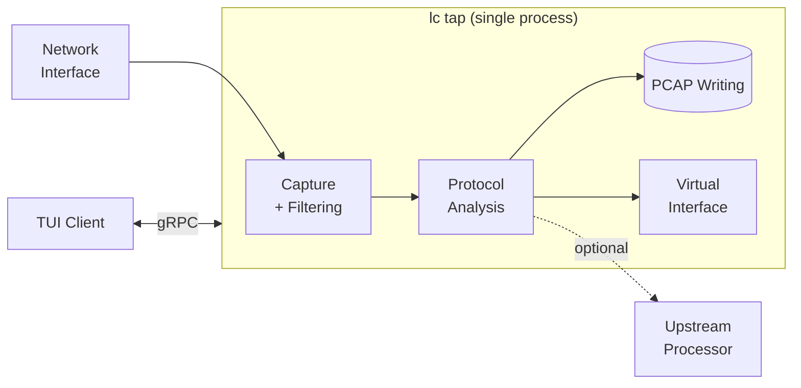
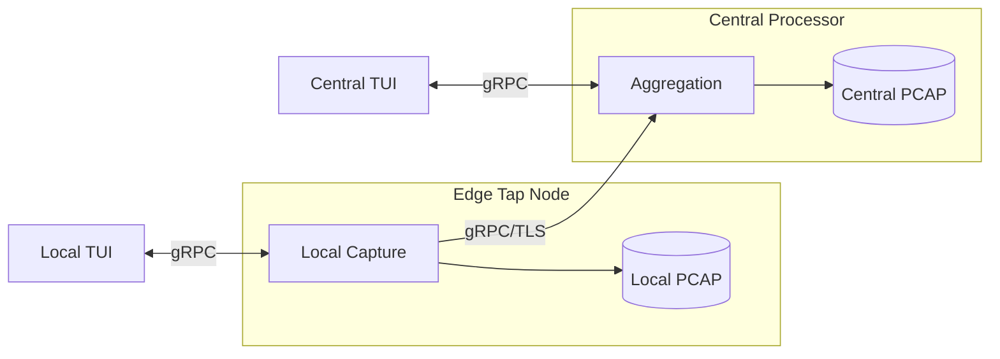

# Standalone Mode with `lc tap`

Tap mode combines local packet capture with full processor capabilities in a single process. It's the right choice when you want per-call PCAP, TUI serving, command hooks, or upstream forwarding — but don't need the complexity of separate hunter and processor nodes.

**The formula**: `tap = process + hunt - gRPC`

Everything `hunt` can do (capture, GPU filtering, protocol detection) and everything `process` can do (PCAP writing, TUI serving, command hooks, virtual interface) — without the gRPC transport between them.



## When to Use Tap

| Scenario | Use | Why |
|----------|-----|-----|
| Quick packet inspection | `lc sniff` | Simplest, CLI output only |
| VoIP monitoring on one machine | `lc tap voip` | Per-call PCAP, TUI, no infrastructure |
| Capture + TUI on one machine | `lc tap` | Full processor features locally |
| Edge node with local + central capture | `lc tap --processor` | Standalone + upstream forwarding |
| Multi-segment distributed capture | `lc hunt` + `lc process` | Multiple capture points required |

The key question: **do you need to capture from multiple machines?** If yes, use hunt + process. If no, tap is simpler.

## Basic Usage

TLS is enabled by default for the management interface (TUI connections):

```bash
# Standalone capture with TLS
sudo lc tap -i eth0 --tls-cert server.crt --tls-key server.key

# For local testing without TLS
sudo lc tap -i eth0 --insecure

# Connect TUI to tap node
lc watch remote --addr localhost:55555 --tls-ca ca.crt
# Or without TLS:
lc watch remote --addr localhost:55555 --insecure
```

## Protocol Subcommands

Like `sniff` and `hunt`, `tap` has protocol-specific subcommands.

### VoIP (`tap voip`)

The most common tap mode. Per-call PCAP is enabled by default:

```bash
# VoIP capture with SIP user filtering
sudo lc tap voip -i eth0 --sip-user alicent --insecure

# VoIP capture with TLS and per-call PCAP directory
sudo lc tap voip -i eth0 \
  --per-call-pcap-dir /var/voip/calls \
  --tls-cert server.crt --tls-key server.key

# UDP-only VoIP capture (bypass TCP reassembly)
sudo lc tap voip -i eth0 --udp-only --sip-port 5060 --insecure

# High-performance VoIP capture
sudo lc tap voip -i eth0 --tcp-performance-mode high_performance --insecure
```

Per-call PCAP creates separate SIP and RTP files for each call:

```
20250123_143022_abc123_sip.pcap    # SIP signaling
20250123_143022_abc123_rtp.pcap    # RTP media
```

VoIP command hooks work the same as on the processor:

```bash
sudo lc tap voip -i eth0 \
  --voip-command '/opt/scripts/process-call.sh %callid% %dirname%' \
  --insecure
```

### DNS (`tap dns`)

DNS capture with tunneling detection and alerting:

```bash
# DNS capture with tunneling alerts
sudo lc tap dns -i eth0 \
  --tunneling-command 'echo "ALERT: %domain% score=%score%" >> /var/log/tunneling.log' \
  --tunneling-threshold 0.7 \
  --insecure

# DNS capture with custom ports
sudo lc tap dns -i eth0 --dns-port 53,5353 --udp-only --insecure
```

### HTTP (`tap http`)

HTTP capture with host, path, and method filtering:

```bash
# HTTP capture with host filtering
sudo lc tap http -i eth0 --host "*.example.com" --insecure

# HTTP capture with HTTPS decryption
sudo lc tap http -i eth0 --tls-keylog /tmp/sslkeys.log --insecure
```

### TLS (`tap tls`)

TLS handshake capture with JA3/JA3S/JA4 fingerprinting:

```bash
# TLS capture with SNI filtering
sudo lc tap tls -i eth0 --sni "*.example.com" --insecure
```

### Email (`tap email`)

SMTP, IMAP, and POP3 capture with address filtering:

```bash
# Email capture, SMTP only
sudo lc tap email -i eth0 --protocol smtp --insecure

# Email capture with sender filtering
sudo lc tap email -i eth0 --sender "*@suspicious.com" --insecure
```

## PCAP Writing

Tap supports all three PCAP modes from the processor (see [Chapter 8](process.md) for details):

```bash
# Unified PCAP
sudo lc tap -i eth0 --write-file /var/capture/all.pcap --insecure

# Per-call PCAP (VoIP, enabled by default for tap voip)
sudo lc tap voip -i eth0 \
  --per-call-pcap --per-call-pcap-dir /var/capture/calls --insecure

# Auto-rotating PCAP
sudo lc tap -i eth0 \
  --auto-rotate-pcap --auto-rotate-pcap-dir /var/capture/bursts \
  --auto-rotate-idle-timeout 30s --auto-rotate-max-size 100M --insecure
```

Command hooks (`--pcap-command`, `--voip-command`) work identically to the processor.

## TUI Serving

Tap nodes serve a management gRPC API on `--listen` (default: `:55555`), allowing TUI clients to connect for real-time monitoring:

```bash
# Start tap with TLS
sudo lc tap voip -i eth0 --tls-cert server.crt --tls-key server.key

# Connect TUI from another terminal
lc watch remote --addr tap-host:55555 --tls-ca ca.crt
```

For local development, use `--insecure` on both tap and TUI:

```bash
sudo lc tap voip -i eth0 --insecure
lc watch remote --addr localhost:55555 --insecure
```

## Upstream Forwarding

Tap nodes can forward captured traffic to a central processor, acting as edge nodes in a hierarchical deployment:

```bash
# Edge tap: captures locally AND forwards to central
sudo lc tap voip -i eth0 \
  --processor central-processor:55555 \
  --tls-cert edge.crt --tls-key edge.key --tls-ca ca.crt
```

This gives you the best of both worlds: local PCAP writing and TUI access at the edge, plus central aggregation.



## Virtual Interface

Expose filtered traffic to third-party tools via a virtual network interface:

```bash
# Capture and expose on virtual interface
sudo lc tap voip -i eth0 --virtual-interface --insecure

# Monitor with Wireshark
wireshark -i lc0

# Or run tcpdump
tcpdump -i lc0 -w filtered.pcap
```

Requires `CAP_NET_ADMIN` capability. See `--vif-name`, `--vif-type`, `--vif-buffer-size` for configuration.

## Configuration File

All tap flags can be set in `~/.config/lippycat/config.yaml`:

```yaml
tap:
  interfaces:
    - eth0
  bpf_filter: ""
  buffer_size: 10000
  batch_size: 100
  batch_timeout_ms: 100
  listen_addr: ":55555"
  id: "edge-tap-01"
  processor_addr: ""  # Empty for standalone, set for upstream forwarding

  per_call_pcap:
    enabled: true
    output_dir: "/var/capture/calls"
    file_pattern: "{timestamp}_{callid}.pcap"

  auto_rotate_pcap:
    enabled: false
    output_dir: "/var/capture/bursts"
    idle_timeout: "30s"
    max_size: "100M"

  pcap_command: "gzip %pcap%"
  voip_command: ""
  command_timeout: "30s"
  command_concurrency: 10

  tls:
    cert_file: "/etc/lippycat/certs/server.crt"
    key_file: "/etc/lippycat/certs/server.key"

  voip:
    sip_user: ""
    udp_only: false
    sip_ports: ""
    tcp_performance_mode: "balanced"
```
