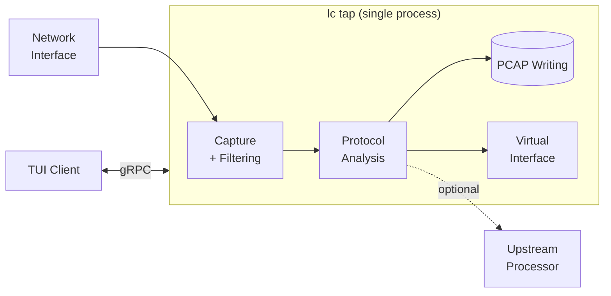
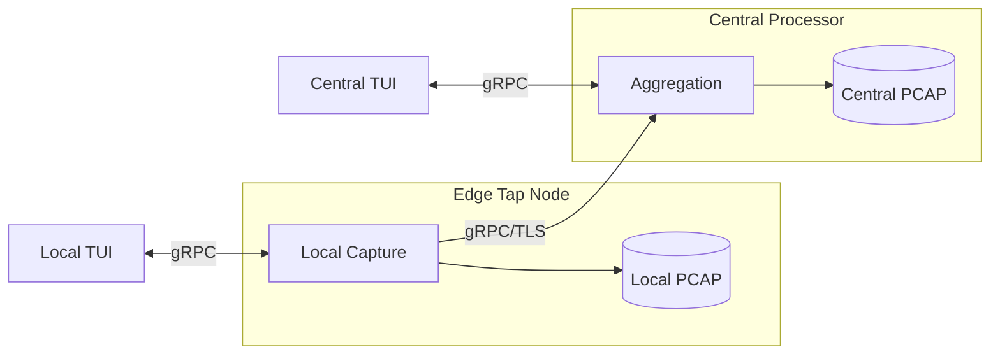

# Standalone Mode with `lc tap`

Tap mode combines local packet capture with full processor capabilities in a single process. It's the right choice when you want per-call PCAP, TUI serving, command hooks, or upstream forwarding — but don't need the complexity of separate hunter and processor nodes.

**The formula**: `tap = process + hunt - gRPC`

Everything `hunt` can do (capture, GPU filtering, protocol detection) and everything `process` can do (PCAP writing, TUI serving, command hooks, virtual interface) — without the gRPC transport between them.


```mermaid
flowchart LR
    subgraph Tap["lc tap (single process)"]
        direction LR
        C[Capture<br>+ Filtering] --> A[Protocol<br>Analysis]
        A --> W[(PCAP Writing)]
        A --> V[Virtual<br>Interface]
    end

    NIC["Network<br>Interface"] --> C
    TUI[TUI Client] <-->|gRPC| Tap
    A -.->|optional| UP[Upstream<br>Processor]
```

## When to Use Tap

| Scenario                               | Use                      | Why                                   |
| -------------------------------------- | ------------------------ | ------------------------------------- |
| Quick packet inspection                | `lc sniff`               | Simplest, CLI output only             |
| VoIP monitoring on one machine         | `lc tap voip`            | Per-call PCAP, TUI, no infrastructure |
| Capture + TUI on one machine           | `lc tap`                 | Full processor features locally       |
| Edge node with local + central capture | `lc tap --processor`     | Standalone + upstream forwarding      |
| Multi-segment distributed capture      | `lc hunt` + `lc process` | Multiple capture points required      |

The key question: **do you need to capture from multiple machines?** If yes, use hunt + process. If no, tap is simpler.

## Upstream Forwarding Modes and Local Evidence

When `--processor` is set, `--forward-mode packets` is the compatibility
default. It sends raw packets so the upstream can create PCAPs, serve packet
views, inject a virtual interface, and perform canonical analysis.

`--forward-mode events` instead performs canonical analysis at the tap and
sends only normalized metadata. Raw packet bytes and file content never enter
the event transport. Packet-dependent upstream features are therefore
unavailable, but the tap's local PCAP writers, rotation, per-call output, and
post-write hooks continue to work:

```bash
sudo lc tap -i eth0 -P central:55555 --forward-mode events \
  --auto-rotate-pcap --auto-rotate-pcap-dir /var/lib/lippycat/pcap \
  --event-spool-dir /var/lib/lippycat/event-spool --tls-ca ca.crt
```

Use this topology to retain forensic evidence at the edge while centralizing
less revealing metadata. Reliable event delivery uses a recoverable spool;
`memory-only` can lose queue-admitted events on processor crash. Protect both
PCAP and event spools with restricted permissions, encryption and retention
limits. Event negotiation fails closed unless
`--event-fallback-to-packets` explicitly permits fallback. The default packet
mode remains interoperable with packet-only upstream versions.

### Operating the reliable upstream event spool

The default maximum encoded record payload is 4 MiB, including attached loss
reports. That bound still applies when the total logical spool byte limit is unlimited,
and admission also checks the transport's event, loss-entry, and loss-range
limits. The upstream processor enforces `--event-ingress-max-batch-bytes` at or
above this shared 4 MiB contract. Oversized events are rejected before publication,
with exact loss coverage retained. When the coverage cannot fit beside normal
events it is sent in bounded loss-only batches. If storage cannot persist the
event or its exact loss report, upstream forwarding fails stopped instead of
silently acknowledging loss.
Pending fragmented coverage is limited to 65,536 normalized ranges or
count-only losses and 16 MiB of encoded statistics. Exhausting either metadata
budget fails admission explicitly until durable loss carriers drain, preventing
unbounded manifest growth.

Immutable records are tracked by a versioned active-set manifest checkpoint and
a checksummed mutation journal. These metadata files, rather than all files
found in the directory, define pending delivery. Startup replays complete
committed transactions, ignores only an incomplete final append, and migrates
only a
fully valid and unambiguous legacy record directory. Corruption, missing
referenced records, unsafe manifest entries, unsupported versions, and mixed
legacy sessions stop startup and leave the evidence intact.

Only one tap process may own a spool directory. Do not share it or manipulate
individual files while the tap runs. A journal or checkpoint result that may be
visible but is not known durable puts the spool into an uncertain state and
blocks sending, mutation, and cleanup. Stop the tap and reopen the same
directory so recovery resolves the visible complete transaction. Do not erase
files or reuse the affected sequence.

The configured byte limit counts **logical bytes** in active pending records.
**Physical bytes** also count retryable orphan and temporary files, so disk use
may exceed the logical limit after a committed ACK or eviction encounters a
cleanup failure. These orphans are not pending and are never resent; startup
and later safe mutations retry their removal. Monitor filesystem free space
separately from the spool limit.

Startup errors identify the failed path and operation. Stop a competing owner
first. Otherwise preserve the whole directory, repair permissions or restore it
as one unit, and restart. Moving it aside starts with an empty spool and is
appropriate only after explicitly accepting all outstanding event ranges as
lost.

## Basic Usage

### Structured protocol logs

Tap shares the processor's structured-log pipeline. Parent flags are inherited
by `tap dns`, `tap http`, and the other protocol subcommands:

```bash
sudo lc tap dns -i eth0 --insecure \
  --log-dir /var/log/lippycat --log-streams conn,dns
```

Logging is disabled by default. When forwarding upstream, the default
`--log-emit-stage terminal` emits only at the terminal processor. See
[Structured Protocol Logs](../part5-advanced/structured-protocol-logs.md) for field schemas,
TSV/JSONL behavior, rotation, lower-bound observations, and privacy controls.

TLS is enabled by default for the management interface (TUI connections):

Standalone capture with TLS:

```bash
sudo lc tap -i eth0 --tls-cert server.crt --tls-key server.key
```

For local testing without TLS:

```bash
sudo lc tap -i eth0 --insecure
```

Connect the TUI to the tap node:

```bash
lc watch remote -P tap-host:55555 --tls-ca ca.crt
```

Alternatively, connect without TLS:

```bash
lc watch remote -P localhost:55555 --insecure
```

`lc watch remote` can connect directly with `--processor` (`-P`) or read target processors and tap nodes from a nodes YAML file. See [Remote TUI Monitoring](../part4-administration/watch-remote.md) for the file format and default search paths.

## Protocol Subcommands

Like `sniff` and `hunt`, `tap` has protocol-specific subcommands.

### VoIP (`tap voip`)

The most common tap mode. Per-call PCAP is enabled by default:

VoIP capture with SIP user filtering:

```bash
sudo lc tap voip -i eth0 --sip-user alicent --insecure
```

VoIP capture with TLS and a per-call PCAP directory:

```bash
sudo lc tap voip -i eth0 \
  --per-call-pcap-dir /var/voip/calls \
  --tls-cert server.crt --tls-key server.key
```

VoIP capture narrowed to a SIP port:

```bash
sudo lc tap voip -i eth0 --sip-port 5060 --insecure
```

High-performance VoIP capture:

```bash
sudo lc tap voip -i eth0 --tcp-performance-mode high_performance --insecure
```

Per-call PCAP creates separate SIP and RTP files for each call:

```
20250123_143022_abc123_sip.pcap    # SIP signaling
20250123_143022_abc123_rtp.pcap    # RTP media
```

VoIP command hooks work the same as on the processor:

```bash
sudo lc tap voip -i eth0 \
  --voip-command '/opt/scripts/process-call.sh %callid% %dirname%' \
  --insecure
```

### DNS (`tap dns`)

DNS capture with tunneling detection and alerting:

DNS capture with tunneling alerts:

```bash
sudo lc tap dns -i eth0 \
  --tunneling-command 'echo "ALERT: %domain% score=%score%" >> /var/log/tunneling.log' \
  --tunneling-threshold 0.7 \
  --insecure
```

DNS capture with custom ports:

```bash
sudo lc tap dns -i eth0 --dns-port 53,5353 --udp-only --insecure
```

### HTTP (`tap http`)

HTTP capture with host, path, and method filtering:

HTTP capture with host filtering:

```bash
sudo lc tap http -i eth0 --host "*.example.com" --insecure
```

HTTP capture with HTTPS decryption:

```bash
sudo lc tap http -i eth0 --tls-keylog /tmp/sslkeys.log --insecure
```

### TLS (`tap tls`)

TLS handshake capture with JA3/JA3S/JA4 fingerprinting:

TLS capture with SNI filtering:

```bash
sudo lc tap tls -i eth0 --sni "*.example.com" --insecure
```

### Email (`tap email`)

SMTP, IMAP, and POP3 capture with address filtering:

SMTP-only email capture:

```bash
sudo lc tap email -i eth0 --protocol smtp --insecure
```

Email capture with sender filtering:

```bash
sudo lc tap email -i eth0 --sender "*@suspicious.com" --insecure
```

## PCAP Writing

Tap supports all three PCAP modes from the processor (see [Chapter 8](process.md) for details):

Unified PCAP:

```bash
sudo lc tap -i eth0 --write-file /var/capture/all.pcap --insecure
```

Per-call PCAP, which is enabled by default for `tap voip`:

```bash
sudo lc tap voip -i eth0 \
  --per-call-pcap --per-call-pcap-dir /var/capture/calls --insecure
```

Auto-rotating PCAP:

```bash
sudo lc tap -i eth0 \
  --auto-rotate-pcap --auto-rotate-pcap-dir /var/capture/bursts \
  --auto-rotate-idle-timeout 30s --auto-rotate-max-size 100M --insecure
```

Command hooks (`--pcap-command`, `--voip-command`) work identically to the processor.

## TUI Serving

Tap nodes serve a management gRPC API on `--listen` (default: `:55555`), allowing TUI clients to connect for real-time monitoring:

Start the tap with TLS:

```bash
sudo lc tap voip -i eth0 --tls-cert server.crt --tls-key server.key
```

Connect the TUI from another terminal:

```bash
lc watch remote -P tap-host:55555 --tls-ca ca.crt
```

For local development, use `--insecure` on both tap and TUI:

```bash
sudo lc tap voip -i eth0 --insecure
```

```bash
lc watch remote -P localhost:55555 --insecure
```

## Upstream Forwarding

Tap nodes can forward captured traffic to a central processor, acting as edge nodes in a hierarchical deployment:

An edge tap captures locally and forwards to the central processor:

```bash
sudo lc tap voip -i eth0 \
  --processor central-processor:55555 \
  --tls-cert edge.crt --tls-key edge.key --tls-ca ca.crt
```

This gives you the best of both worlds: local PCAP writing and TUI access at the edge, plus central aggregation.


```mermaid
flowchart LR
    subgraph Edge["Edge Tap Node"]
        T[Local Capture]
        LP[(Local PCAP)]
        T --> LP
    end

    subgraph Central["Central Processor"]
        P[Aggregation]
        CP[(Central PCAP)]
        P --> CP
    end

    T -->|gRPC/TLS| P
    TUI1[Local TUI] <-->|gRPC| T
    TUI2[Central TUI] <-->|gRPC| P
```

## Virtual Interface

Expose filtered traffic to third-party tools via a virtual network interface:

Capture and expose traffic on a virtual interface:

```bash
sudo lc tap voip -i eth0 --virtual-interface --insecure
```

Monitor with Wireshark:

```bash
wireshark -i lc0
```

Alternatively, run tcpdump:

```bash
tcpdump -i lc0 -w filtered.pcap
```

Requires `CAP_NET_ADMIN` capability. See `--vif-name`, `--vif-type`, `--vif-buffer-size` for configuration.

## Configuration File

All tap flags can be set in `~/.config/lippycat/config.yaml`:

```yaml
tap:
  interfaces:
    - eth0
  bpf_filter: ""
  buffer_size: 10000
  batch_size: 100
  batch_timeout_ms: 100
  listen_addr: ":55555"
  id: "edge-tap-01"
  processor_addr: "" # Empty for standalone, set for upstream forwarding

  per_call_pcap:
    enabled: true
    output_dir: "/var/capture/calls"
    file_pattern: "{timestamp}_{callid}.pcap"

  auto_rotate_pcap:
    enabled: false
    output_dir: "/var/capture/bursts"
    idle_timeout: "30s"
    max_size: "100M"

  pcap_command: "gzip %pcap%"
  voip_command: ""
  command_timeout: "30s"
  command_concurrency: 10

  tls:
    cert_file: "/etc/lippycat/certs/server.crt"
    key_file: "/etc/lippycat/certs/server.key"

  voip:
    sip_user: ""
    udp_only: false
    sip_ports: ""
    tcp_performance_mode: "balanced"
    tcp_reassembly_shards: 1
```

## RADIUS

Use `lc sniff radius`, `lc hunt radius`, or `lc tap radius` for visible UDP
authentication and accounting capture. `lc process` stays protocol-neutral and
existing watch commands display RADIUS metadata. Ordinary capture does not need
an LI build or X1 task. Exact account, MAC and scoped line predicates are shared
across commands; optional raw format-11 X2 delivery requires a current authorized
X2Only task in an LI build.

The [RADIUS operations chapter](../part5-advanced/radius.md) covers command and
configuration examples, scope isolation, NatParas mappings, state limits and
MDF setup. Synthetic direct hunt/process verification has passed with upgraded
peers; relay-origin X2 authorization is unsupported. External operator known-line
verification and receiving-MDF agreement remain pending.
