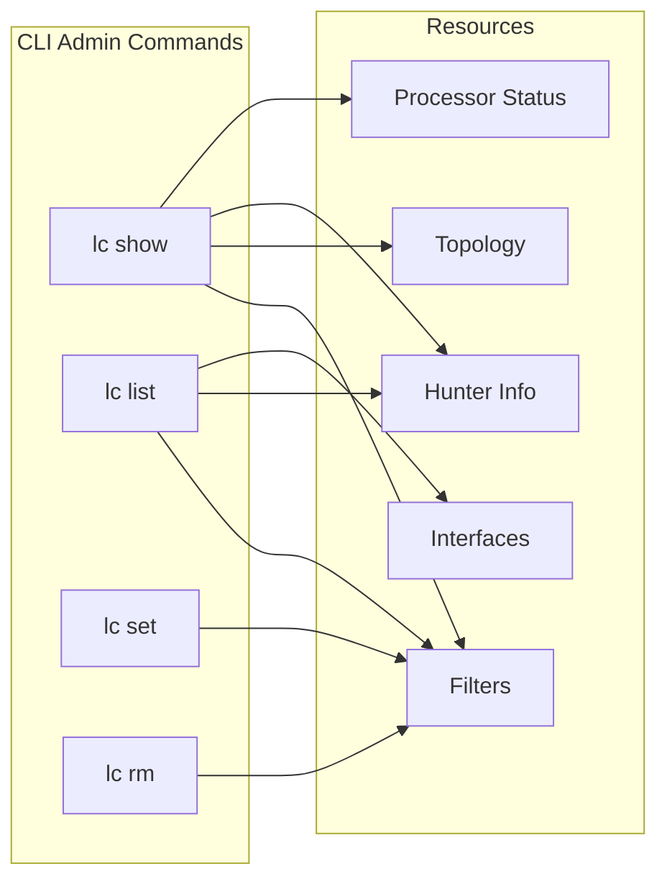

# CLI Administration

lippycat provides a set of CLI commands for managing and inspecting distributed deployments. These commands follow a consistent verb-object pattern and output JSON for easy scripting.



All remote commands connect to a processor via gRPC and share a common set of connection flags. Local commands (`show config`, `list interfaces`) run without a processor connection.

## Connection Flags

Every remote command supports these flags. **TLS is enabled by default** — you must explicitly pass `--insecure` to disable it.

| Flag | Description |
|------|-------------|
| `-P, --processor` | Processor address (host:port) — **required** for remote commands |
| `--tls-ca` | CA certificate file |
| `--tls-cert` | Client certificate (for mTLS) |
| `--tls-key` | Client private key (for mTLS) |
| `--tls-skip-verify` | Skip certificate verification (testing only) |
| `--insecure` | Disable TLS entirely (testing only) |

These flags can also be set in the config file under `remote`:

```yaml
remote:
  processor: "processor.example.com:55555"
  insecure: false
  tls:
    ca: "/etc/lippycat/certs/ca.crt"
    cert: "/etc/lippycat/certs/client.crt"
    key: "/etc/lippycat/certs/client.key"
    skip_verify: false
```

## Inspecting with `lc show`

The `show` command retrieves information from a running processor. All subcommands except `show config` require `-P`.

### `show status`

Display processor health and aggregate statistics:

```bash
lc show status -P processor:55555 --tls-ca ca.crt
```

```json
{
  "processor_id": "central-proc",
  "status": "healthy",
  "total_hunters": 3,
  "healthy_hunters": 3,
  "warning_hunters": 0,
  "error_hunters": 0,
  "total_packets_received": 1250000,
  "total_packets_forwarded": 0,
  "total_filters": 5,
  "upstream_processor": ""
}
```

### `show hunter`

Display details for a specific hunter:

```bash
# Specific hunter
lc show hunter --id edge-01 -P processor:55555 --tls-ca ca.crt
```

```json
[
  {
    "hunter_id": "edge-01",
    "hostname": "capture-node-1",
    "remote_addr": "10.0.1.10:45678",
    "status": "healthy",
    "connected_duration_sec": 3600,
    "interfaces": ["eth0"],
    "stats": {
      "packets_captured": 500000,
      "packets_matched": 12500,
      "packets_forwarded": 12500,
      "packets_dropped": 0,
      "buffer_bytes": 1048576,
      "active_filters": 3
    },
    "capabilities": {
      "filter_types": ["sip_user", "ip_address"],
      "gpu_acceleration": true,
      "af_xdp": false
    }
  }
]
```

### `show topology`

Display the complete distributed topology tree. Useful for verifying hierarchical deployments:

```bash
lc show topology -P processor:55555 --tls-ca ca.crt
```

```json
{
  "processor_id": "central-proc",
  "address": ":55555",
  "status": "healthy",
  "hierarchy_depth": 0,
  "reachable": true,
  "hunters": ["..."],
  "downstream_processors": [
    {
      "processor_id": "region-east",
      "address": "10.0.2.1:55555",
      "status": "healthy",
      "hierarchy_depth": 1,
      "reachable": true,
      "hunters": ["..."]
    }
  ]
}
```

### `show filter`

Display details for a specific filter:

```bash
lc show filter --id myfilter -P processor:55555 --tls-ca ca.crt
```

### `show config`

Display local configuration. This is the only `show` subcommand that doesn't require a processor connection:

```bash
lc show config
lc show config --json
```

## Listing with `lc list`

### `list interfaces`

Discover network interfaces available for capture. This is a local command — no processor connection needed:

```bash
lc list interfaces
```

```
Network interfaces suitable for VoIP monitoring:
  eth0 - Ethernet adapter
  wlan0 - Wireless adapter
  enp0s3 - PCI Ethernet
```

The command filters out interfaces not useful for monitoring (loopback, Docker/container, VM, USB/Bluetooth, tunnel interfaces). Full listing requires root privileges:

```bash
sudo lc list interfaces
```

### `list hunters`

List connected hunters on a remote processor:

```bash
# All connected hunters
lc list hunters -P processor:55555 --tls-ca ca.crt
```

### `list filters`

List filters configured on a remote processor:

```bash
# All filters
lc list filters -P processor:55555 --tls-ca ca.crt

# Filters for a specific hunter
lc list filters -P processor:55555 --tls-ca ca.crt --hunter hunter-1
```

## Creating Filters with `lc set`

The `set filter` command creates or updates filters on a processor (upsert semantics). It operates in two modes: inline and file.

### Inline Mode

Specify filter properties directly via flags:

```bash
# SIP user filter
lc set filter -P processor:55555 --tls-ca ca.crt \
  --type sip_user --pattern "alicent@example.com"

# DNS domain wildcard
lc set filter -P processor:55555 --tls-ca ca.crt \
  --type dns_domain --pattern "*.malware-domain.com"

# TLS JA3 fingerprint
lc set filter -P processor:55555 --tls-ca ca.crt \
  --type tls_ja3 --pattern e7d705a3286e19ea42f587b344ee6865

# IP CIDR range
lc set filter -P processor:55555 --tls-ca ca.crt \
  --type ip_address --pattern "192.168.1.0/24"

# With custom ID and description
lc set filter -P processor:55555 --tls-ca ca.crt \
  --id voip-monitor-01 \
  --type sip_user --pattern "*456789" \
  --description "Monitor calls to 456789"

# Target specific hunters
lc set filter -P processor:55555 --tls-ca ca.crt \
  --type sip_user --pattern "robb@example.com" \
  --hunters edge-01,edge-02
```

If `--id` is omitted, a UUID is auto-generated.

### File Mode (Batch)

Import multiple filters from a YAML file:

```bash
lc set filter -P processor:55555 --tls-ca ca.crt -f filters.yaml
```

The YAML file uses the same format as the processor's filter file (see [Chapter 8: Filter Management](../part3-distributed/process.md#filter-management)).

### Filter Types

| Category | Common Types | Example Pattern |
|----------|-------------|-----------------|
| **VoIP** | `sip_user`, `phone_number`, `call_id`, `imsi`, `imei` | `alicent@example.com` |
| **DNS** | `dns_domain` | `*.example.com` |
| **TLS** | `tls_sni`, `tls_ja3`, `tls_ja4` | `*.example.com` |
| **HTTP** | `http_host`, `http_url` | `*.example.com` |
| **Email** | `email_address`, `email_subject` | `*@suspicious.com` |
| **Universal** | `ip_address`, `bpf` | `192.168.1.0/24` |

For the complete list of all filter types, descriptions, wildcard patterns, and matching details, see [Appendix E: Filter Type Reference](../appendices/filter-reference.md).

### `set filter` Flags

| Flag | Description |
|------|-------------|
| `--id` | Filter ID (auto-generated UUID if omitted) |
| `-t, --type` | Filter type (see table above) — required in inline mode |
| `--pattern` | Filter pattern — required in inline mode |
| `--description` | Optional description |
| `--enabled` | Enable the filter (default: true) |
| `--hunters` | Target specific hunter IDs (comma-separated) |
| `-f, --file` | YAML file for batch import |

## Removing Filters with `lc rm`

### Single Filter

```bash
lc rm filter --id myfilter -P processor:55555 --tls-ca ca.crt
```

### Batch Deletion

Delete multiple filters from a file of IDs (one per line):

```bash
lc rm filter -f filter-ids.txt -P processor:55555 --tls-ca ca.crt
```

The file format is simple — one filter ID per line, with `#` comments and blank lines ignored:

```
# VoIP filters to remove
voip-monitor-01
voip-monitor-02

# DNS filter
dns-tunnel-detector
```

## JSON Output and Exit Codes

All remote commands output JSON to stdout (results) and stderr (errors). Output is pretty-printed when writing to a terminal, compact when piped.

### Exit Codes

| Code | Meaning |
|------|---------|
| 0 | Success |
| 1 | General error |
| 2 | Connection error |
| 3 | Validation error |
| 4 | Resource not found |

### Error Format

```json
{"error": "processor address is required", "code": "UNAVAILABLE"}
```

## Scripting Examples

### Health Check Script

```bash
#!/bin/bash
status=$(lc show status -P processor:55555 --tls-ca /etc/lippycat/ca.crt \
  2>/dev/null | jq -r '.status')
if [ "$status" = "healthy" ]; then
    echo "OK"
else
    echo "UNHEALTHY: $status"
    exit 1
fi
```

### Monitor Hunter Count

```bash
watch -n 5 'lc show status -P processor:55555 --tls-ca ca.crt | \
  jq "{total: .total_hunters, healthy: .healthy_hunters}"'
```

### Export Topology Snapshot

```bash
lc show topology -P processor:55555 --tls-ca ca.crt \
  > topology-$(date +%Y%m%d).json
```

### Filter Lifecycle

```bash
# Create a filter
lc set filter -P processor:55555 --tls-ca ca.crt \
  --id suspect-01 --type sip_user --pattern "*456789"

# Verify it exists
lc show filter --id suspect-01 -P processor:55555 --tls-ca ca.crt

# List all filters
lc list filters -P processor:55555 --tls-ca ca.crt

# Remove when done
lc rm filter --id suspect-01 -P processor:55555 --tls-ca ca.crt
```
