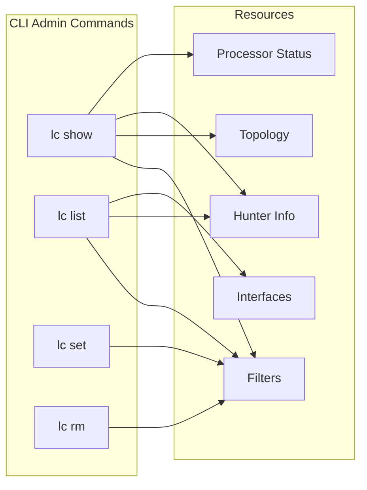

# CLI Administration {#cli-administration}

lippycat provides a set of CLI commands for managing and inspecting distributed deployments. These commands follow a consistent verb-object pattern and output JSON for easy scripting.

<!-- i18n:skip -->


```mermaid
flowchart LR
    subgraph Commands["CLI Admin Commands"]
        direction TB
        Show["lc show"]
        List["lc list"]
        Set["lc set"]
        Rm["lc rm"]
    end

    subgraph Targets["Resources"]
        direction TB
        Proc[Processor Status]
        Hunters[Hunter Info]
        Filters[Filters]
        Topo[Topology]
        Ifaces[Interfaces]
    end

    Show --> Proc
    Show --> Hunters
    Show --> Topo
    Show --> Filters
    List --> Ifaces
    List --> Hunters
    List --> Filters
    Set --> Filters
    Rm --> Filters
```

All remote commands connect to a processor via gRPC and share a common set of connection flags. Local commands (`show config`, `list interfaces`) run without a processor connection.

The example results below use illustrative values. Interface names and descriptions depend on the host; optional JSON fields depend on the deployment and available telemetry.

## Connection Flags {#connection-flags}

Every remote command supports these flags. **TLS is enabled by default** — you must explicitly pass `--insecure` to disable it.

| Flag                | Description                                                      |
| ------------------- | ---------------------------------------------------------------- |
| `-P, --processor`   | Processor address (host:port) — **required** for remote commands |
| `--tls-ca`          | CA certificate file                                              |
| `--tls-cert`        | Client certificate (for mTLS)                                    |
| `--tls-key`         | Client private key (for mTLS)                                    |
| `--tls-skip-verify` | Skip certificate verification (testing only)                     |
| `--insecure`        | Disable TLS entirely (testing only)                              |

These flags can also be set in the config file under `remote`:

<!-- i18n:skip -->

```yaml
remote:
  processor: "processor.example.com:55555"
  insecure: false
  tls:
    ca: "/etc/lippycat/certs/ca.crt"
    cert: "/etc/lippycat/certs/client.crt"
    key: "/etc/lippycat/certs/client.key"
    skip_verify: false
```

## Inspecting with `lc show` {#inspecting-with-lc-show}

The `show` command retrieves information from a running processor. All subcommands except `show config` require `-P`.

### `show status` {#show-status}

Display processor health and aggregate statistics:

<!-- i18n:skip -->

```bash
lc show status -P processor:55555 --tls-ca ca.crt
```

<!-- i18n:skip -->

```json
{
  "storage": {
    "filters": {
      "mode": "yaml",
      "state": "ready",
      "last_outcome": "committed",
      "commits": 3
    }
  },
  "processor_id": "central-proc",
  "status": "healthy",
  "total_hunters": 1,
  "healthy_hunters": 1,
  "warning_hunters": 0,
  "error_hunters": 0,
  "total_packets_received": 12500,
  "total_packets_forwarded": 0,
  "total_filters": 3
}
```

### `show hunter` {#show-hunter}

Display details for a specific hunter:

<!-- i18n:skip -->

```bash
lc show hunter --id edge-01 -P processor:55555 --tls-ca ca.crt
```

<!-- i18n:skip -->

```json
{
  "hunter_id": "edge-01",
  "hostname": "capture-node-1",
  "remote_addr": "10.0.1.10:45678",
  "status": "healthy",
  "connected_duration_sec": 3600,
  "interfaces": ["eth0"],
  "stats": {
    "packets_captured": 500000,
    "packets_matched": 12500,
    "packets_forwarded": 12500,
    "packets_dropped": 0,
    "capture_buffer_regular_drops": 0,
    "capture_buffer_sip_drops": 0,
    "capture_buffer_sip_demotions": 0,
    "batch_channel_drops": 0,
    "capture_buffer_regular_len": 0,
    "capture_buffer_regular_capacity": 1000,
    "capture_buffer_sip_len": 0,
    "capture_buffer_sip_capacity": 100,
    "capture_buffer_output_len": 0,
    "capture_buffer_output_capacity": 100,
    "buffer_bytes": 1048576,
    "active_filters": 3,
    "cpu_percent": 12.5,
    "memory_rss_bytes": 67108864,
    "rtp_ownership_unresolved": 0,
    "rtp_ownership_ambiguous": 0,
    "identity_inheritance_suppressed": 0,
    "tcp_established_idle_retentions": 0,
    "tcp_pre_rearm_discarded_chunks": 0,
    "tcp_rearm_rejected_chunks": 0
  },
  "capabilities": {
    "filter_types": ["sip_user", "ip_address"],
    "max_buffer_size": 67108864,
    "gpu_acceleration": true,
    "af_xdp": false
  }
}
```

### `show topology` {#show-topology}

Display the complete distributed topology tree. Useful for verifying hierarchical deployments:

<!-- i18n:skip -->

```bash
lc show topology -P processor:55555 --tls-ca ca.crt
```

<!-- i18n:skip -->

```json
{
  "processor_id": "central-proc",
  "address": ":55555",
  "status": "healthy",
  "hierarchy_depth": 0,
  "reachable": true,
  "hunters": [
    {
      "hunter_id": "edge-01",
      "hostname": "capture-node-1",
      "remote_addr": "10.0.1.10:45678",
      "status": "healthy",
      "connected_duration_sec": 3600,
      "interfaces": ["eth0"],
      "stats": {
        "packets_captured": 500000,
        "packets_matched": 12500,
        "packets_forwarded": 12500,
        "packets_dropped": 0,
        "capture_buffer_regular_drops": 0,
        "capture_buffer_sip_drops": 0,
        "capture_buffer_sip_demotions": 0,
        "batch_channel_drops": 0,
        "capture_buffer_regular_len": 0,
        "capture_buffer_regular_capacity": 1000,
        "capture_buffer_sip_len": 0,
        "capture_buffer_sip_capacity": 100,
        "capture_buffer_output_len": 0,
        "capture_buffer_output_capacity": 100,
        "buffer_bytes": 1048576,
        "active_filters": 3,
        "cpu_percent": 12.5,
        "memory_rss_bytes": 67108864,
        "rtp_ownership_unresolved": 0,
        "rtp_ownership_ambiguous": 0,
        "identity_inheritance_suppressed": 0,
        "tcp_established_idle_retentions": 0,
        "tcp_pre_rearm_discarded_chunks": 0,
        "tcp_rearm_rejected_chunks": 0
      },
      "capabilities": {
        "filter_types": ["sip_user", "ip_address"],
        "max_buffer_size": 67108864,
        "gpu_acceleration": true,
        "af_xdp": false
      }
    }
  ],
  "downstream_processors": [
    {
      "processor_id": "region-east",
      "address": "10.0.2.1:55555",
      "status": "healthy",
      "upstream_processor": "central-proc:55555",
      "hierarchy_depth": 1,
      "reachable": true
    }
  ]
}
```

### `show filter` {#show-filter}

Display details for a specific filter:

<!-- i18n:skip -->

```bash
lc show filter --id myfilter -P processor:55555 --tls-ca ca.crt
```

### `show config` {#show-config}

Display local configuration as JSON. This is the only `show` subcommand that doesn't require a processor connection:

<!-- i18n:skip -->

```bash
lc show config
```

## Listing with `lc list` {#listing-with-lc-list}

### `list interfaces` {#list-interfaces}

Discover network interfaces available for capture. This is a local command — no processor connection needed:

<!-- i18n:skip -->

```bash
lc list interfaces
```

<!-- i18n:skip -->

```
Warning: Running without root privileges. Some interfaces may not be accessible.
Consider running with 'sudo' for full interface access.

Network interfaces suitable for VoIP monitoring:
  eth0 - Ethernet adapter
  wlan0 - Wireless adapter
  enp0s3 - PCI Ethernet

Note: Interface selection should comply with your organization's network monitoring policies.
Only monitor interfaces you have explicit permission to access.
```

The command filters out interfaces not useful for monitoring (loopback, Docker/container, VM, USB/Bluetooth, tunnel interfaces). Full listing requires root privileges:

<!-- i18n:skip -->

```bash
sudo lc list interfaces
```

### `list hunters` {#list-hunters}

List connected hunters on a remote processor:

List all connected hunters:

<!-- i18n:skip -->

```bash
lc list hunters -P processor:55555 --tls-ca ca.crt
```

### `list filters` {#list-filters}

List filters configured on a remote processor:

List all filters:

<!-- i18n:skip -->

```bash
lc list filters -P processor:55555 --tls-ca ca.crt
```

List filters for a specific hunter:

<!-- i18n:skip -->

```bash
lc list filters -P processor:55555 --tls-ca ca.crt --hunter hunter-1
```

## Creating Filters with `lc set` {#creating-filters-with-lc-set}

The `set filter` command creates or updates filters on a processor (upsert semantics). It operates in two modes: inline and file.

### Inline Mode {#inline-mode}

Specify filter properties directly via flags:

Create a SIP user filter:

<!-- i18n:skip -->

```bash
lc set filter -P processor:55555 --tls-ca ca.crt \
  --type sip_user --pattern "alicent@example.com"
```

Create a DNS domain wildcard filter:

<!-- i18n:skip -->

```bash
lc set filter -P processor:55555 --tls-ca ca.crt \
  --type dns_domain --pattern "*.malware-domain.com"
```

Create a TLS JA3 fingerprint filter:

<!-- i18n:skip -->

```bash
lc set filter -P processor:55555 --tls-ca ca.crt \
  --type tls_ja3 --pattern e7d705a3286e19ea42f587b344ee6865
```

Create an IP CIDR range filter:

<!-- i18n:skip -->

```bash
lc set filter -P processor:55555 --tls-ca ca.crt \
  --type ip_address --pattern "192.168.1.0/24"
```

Create an exact RADIUS account filter with an explicit revision:

<!-- i18n:skip -->

```bash
lc set filter -P processor:55555 --tls-ca ca.crt \
  --type radius_username --pattern 'alice@example.test' --revision 1
```

MAC filters require the exact supported interpretation profile:

<!-- i18n:skip -->

```bash
lc set filter -P processor:55555 --tls-ca ca.crt \
  --type radius_mac --pattern '02-00-00-00-00-01' --revision 1 \
  --radius-mac-profile calling-station-id-uppercase-hyphen-v1
```

Create a filter with a custom ID and description:

<!-- i18n:skip -->

```bash
lc set filter -P processor:55555 --tls-ca ca.crt \
  --id voip-monitor-01 \
  --type sip_user --pattern "*456789" \
  --description "Monitor calls to 456789"
```

Target specific hunters:

<!-- i18n:skip -->

```bash
lc set filter -P processor:55555 --tls-ca ca.crt \
  --type sip_user --pattern "robb@example.com" \
  --hunters edge-01,edge-02
```

If `--id` is omitted, a UUID is auto-generated.

### File Mode (Batch) {#file-mode-batch}

Import multiple filters from a YAML file:

<!-- i18n:skip -->

```bash
lc set filter -P processor:55555 --tls-ca ca.crt -f filters.yaml
```

The YAML file uses the same format as the processor's filter file. Compound
RADIUS criteria must use file mode; see the
[RADIUS filter schema and example](../appendices/filter-reference.md#radius-filters).

### Filter Types {#filter-types}

| Category      | Common Types                                                           | Example Pattern       |
| ------------- | ---------------------------------------------------------------------- | --------------------- |
| **VoIP**      | `sip_user`, `phone_number`, `call_id`, `imsi`, `imei`                  | `alicent@example.com` |
| **DNS**       | `dns_domain`                                                           | `*.example.com`       |
| **TLS**       | `tls_sni`, `tls_ja3`, `tls_ja4`                                        | `*.example.com`       |
| **HTTP**      | `http_host`, `http_url`                                                | `*.example.com`       |
| **Email**     | `email_address`, `email_subject`                                       | `*@suspicious.com`    |
| **RADIUS**    | `radius_username`, `radius_mac`, `radius_attribute`, `radius_compound` | `alice@example.test`  |
| **Universal** | `ip_address`, `bpf`                                                    | `192.168.1.0/24`      |

For the complete list of all filter types, descriptions, wildcard patterns, and matching details, see [Appendix E: Filter Type Reference](../appendices/filter-reference.md).

### `set filter` Flags {#set-filter-flags}

| Flag                        | Description                                                |
| --------------------------- | ---------------------------------------------------------- |
| `--id`                      | Filter ID (auto-generated UUID if omitted)                 |
| `-t, --type`                | Filter type (see table above) — required in inline mode    |
| `--pattern`                 | Filter pattern — required in inline mode                   |
| `--description`             | Optional description                                       |
| `--enabled`                 | Enable the filter (default: true)                          |
| `--hunters`                 | Target specific hunter IDs (comma-separated)               |
| `-f, --file`                | YAML file for batch import                                 |
| `--revision`                | RADIUS filter revision; increment when changing the filter |
| `--radius-mac-profile`      | Required interpretation profile for `radius_mac`           |
| `--radius-operator-scope`   | Operator/NAS deployment scope                              |
| `--radius-profile-revision` | Deployment profile revision                                |
| `--radius-origin-node`      | Restrict RADIUS scope to an origin node                    |
| `--radius-source`           | Restrict RADIUS scope to a capture source                  |

## Removing Filters with `lc rm` {#removing-filters-with-lc-rm}

### Single Filter {#single-filter}

<!-- i18n:skip -->

```bash
lc rm filter --id myfilter -P processor:55555 --tls-ca ca.crt
```

### Batch Deletion {#batch-deletion}

Delete multiple filters from a file of IDs (one per line):

<!-- i18n:skip -->

```bash
lc rm filter -f filter-ids.txt -P processor:55555 --tls-ca ca.crt
```

The file format is simple — one filter ID per line, with `#` comments and blank lines ignored:

<!-- i18n:skip -->

```
# VoIP filters to remove
voip-monitor-01
voip-monitor-02

# DNS filter
dns-tunnel-detector
```

## JSON Output and Exit Codes {#json-output-and-exit-codes}

All remote commands output JSON to stdout (results) and stderr (errors). Output is pretty-printed when writing to a terminal, compact when piped.

### Exit Codes {#exit-codes}

| Code | Meaning            |
| ---- | ------------------ |
| 0    | Success            |
| 1    | General error      |
| 2    | Connection error   |
| 3    | Validation error   |
| 4    | Resource not found |

### Error Format {#error-format}

<!-- i18n:skip -->

```json
{
  "error": "processor address is required (use --processor or set remote.processor in config)",
  "code": "UNAVAILABLE"
}
```

## Scripting Examples {#scripting-examples}

### Health Check Script {#health-check-script}

<!-- i18n:skip -->

```bash
#!/bin/bash
status=$(lc show status -P processor:55555 --tls-ca /etc/lippycat/ca.crt \
  2>/dev/null | jq -r '.status')
if [ "$status" = "healthy" ]; then
    echo "OK"
else
    echo "UNHEALTHY: $status"
    exit 1
fi
```

### Monitor Hunter Count {#monitor-hunter-count}

<!-- i18n:skip -->

```bash
watch -n 5 'lc show status -P processor:55555 --tls-ca ca.crt | \
  jq "{total: .total_hunters, healthy: .healthy_hunters}"'
```

### Export Topology Snapshot {#export-topology-snapshot}

<!-- i18n:skip -->

```bash
lc show topology -P processor:55555 --tls-ca ca.crt \
  > topology-$(date +%Y%m%d).json
```

### Filter Lifecycle {#filter-lifecycle}

Create a filter:

<!-- i18n:skip -->

```bash
lc set filter -P processor:55555 --tls-ca ca.crt \
  --id suspect-01 --type sip_user --pattern "*456789"
```

Verify that it exists:

<!-- i18n:skip -->

```bash
lc show filter --id suspect-01 -P processor:55555 --tls-ca ca.crt
```

List all filters:

<!-- i18n:skip -->

```bash
lc list filters -P processor:55555 --tls-ca ca.crt
```

Remove the filter when done:

<!-- i18n:skip -->

```bash
lc rm filter --id suspect-01 -P processor:55555 --tls-ca ca.crt
```
