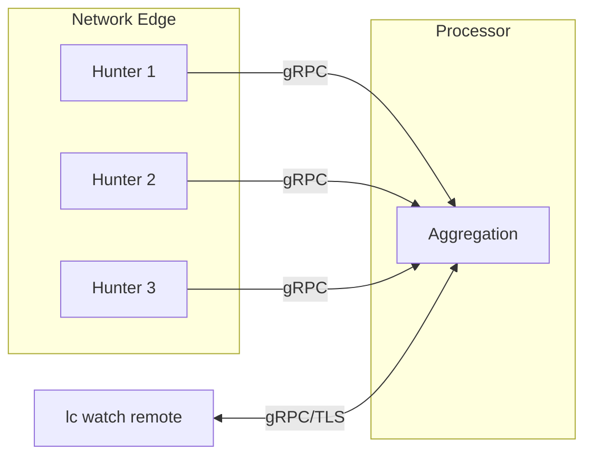

# Remote TUI Monitoring

The TUI's remote mode (`lc watch remote`) connects to processors and displays live packet data from distributed hunters. It gives you a single pane of glass across multiple network segments without running capture locally.



## Quick Start

```bash
# Connect using a nodes file
lc watch remote --nodes-file nodes.yaml

# Or use the default location (~/.config/lippycat/nodes.yaml)
lc watch remote

# With TLS
lc watch remote --tls-ca ca.crt

# With mutual TLS
lc watch remote --tls-ca ca.crt --tls-cert client.crt --tls-key client.key

# For local testing
lc watch remote --insecure
```

## Node File Configuration

The nodes file tells the TUI which processors and hunters to connect to.

### File Location

The TUI searches for `nodes.yaml` in this order:

1. Path given by `--nodes-file`
2. `~/.config/lippycat/nodes.yaml`
3. `./nodes.yaml` (current directory)

### Format

```yaml
processors:
  - name: main-processor
    address: processor.example.com:55555
    tls:
      enabled: true
      ca_file: /etc/lippycat/certs/ca.crt
      cert_file: /etc/lippycat/certs/client.crt
      key_file: /etc/lippycat/certs/client.key
      skip_verify: false

  - name: backup-processor
    address: 192.168.1.101:55555
```

### Configuration Fields

| Field | Required | Description |
|-------|----------|-------------|
| `name` | Yes | Display name for the node |
| `address` | Yes | Address in `host:port` format |
| `tls.enabled` | No | Enable TLS for this node |
| `tls.ca_file` | No | CA certificate path |
| `tls.cert_file` | No | Client certificate path (mTLS) |
| `tls.key_file` | No | Client private key path (mTLS) |
| `tls.skip_verify` | No | Skip certificate verification (testing only) |
| `subscribed_hunters` | No | List of hunter IDs to subscribe to |

Each node can have its own TLS configuration, allowing mixed environments (e.g., production with mTLS, dev with insecure).

## TUI Navigation

### Global Keys

| Key | Action |
|-----|--------|
| `Tab` | Switch between tabs |
| `1`-`6` | Jump to tab (1=Packets, 2=Details, 3=Nodes, etc.) |
| `Space` | Pause/resume packet display |
| `q` / `Ctrl+C` | Quit |
| `?` | Help |

### Packet View

| Key | Action |
|-----|--------|
| `j` / `k` / `↑` / `↓` | Navigate packets |
| `g` / `Home` | Jump to first packet |
| `G` / `End` | Jump to last packet |
| `Enter` | View packet details |
| `Ctrl+S` | Save packets to PCAP file |

### Nodes View

| Key | Action |
|-----|--------|
| `↑` / `↓` or `j` / `k` | Navigate node list |
| `Enter` | Connect to processor / edit input |
| `s` | Open hunter subscription selector |
| `d` | Unsubscribe from hunter or remove processor |
| `Esc` | Close modal / exit input |

### Calls View (VoIP)

| Key | Action |
|-----|--------|
| `j` / `k` | Navigate calls |
| `Enter` | View call details |

## Nodes Tab

The Nodes tab shows connected processors and their hunters in a tree view:

```
┌─ Nodes ────────────────────────────────────────────┐
│                                                    │
│  Processor: main-processor (192.168.1.100:55555)   │
│  ├─ edge-hunter-01 (10.0.1.10)                     │
│  │  Status: ACTIVE | Packets: 1,234 | Dropped: 0   │
│  │  Interfaces: eth0                               │
│  │                                                 │
│  └─ edge-hunter-02 (10.0.1.11)                     │
│     Status: ACTIVE | Packets: 5,678 | Dropped: 2   │
│     Interfaces: eth1, wlan0                        │
│                                                    │
│  [Enter node address to add...]                    │
└────────────────────────────────────────────────────┘
```

Each hunter displays:
- **Status**: ACTIVE, IDLE, or DISCONNECTED
- **Packets**: captured, matched, forwarded, dropped
- **Active filters**: number of filters applied
- **Interfaces**: network interfaces being monitored
- **Last heartbeat**: time since last health check

### Adding Nodes Interactively

You can add nodes without editing the nodes file:

1. Navigate to the Nodes tab (`3`)
2. Select the input field and press `Enter`
3. Type the processor address (e.g., `192.168.1.100:55555`)
4. Press `Enter` to connect

## Hunter Subscription Management

By default, connecting to a processor streams packets from all its hunters. Hunter subscriptions let you focus on specific network segments.

### Subscribing to Hunters

1. Navigate to a processor in the Nodes tab
2. Press `s` to open the hunter selector modal
3. Use `↑`/`↓` or `j`/`k` to navigate hunters
4. Press `Enter` to toggle selection (highlighted in cyan)
5. Press `Enter` on "Confirm Selection" to apply
6. Press `Esc` to cancel

### Unsubscribing

- **Single hunter**: Navigate to the hunter and press `d`
- **All hunters**: Open the selector (`s`), deselect all, confirm

### Benefits

- Reduces bandwidth — only subscribed hunters stream packets to your TUI
- Focus on specific segments without noise from others
- Multiple TUI clients can have independent subscriptions to the same processor

## Filter Management

The TUI provides interactive filter management for connected processors and their hunters. Filters control which traffic hunters capture and forward — they are the primary mechanism for targeting specific calls, domains, or hosts across a distributed deployment. Filters can be applied globally (all hunters) or targeted to specific hunters.

### Managing Filters from the TUI

From the Nodes tab, press `f` to open the filter management view. This lets you:

- **View active filters** on the connected processor
- **Create new filters** with type and pattern
- **Enable/disable filters** without deleting them
- **Delete filters** you no longer need

Filter changes take effect immediately — the processor pushes updated filters to all connected hunters.

### Filter Types

The TUI supports all filter types available via the CLI:

| Category | Types | Example Pattern |
|----------|-------|-----------------|
| VoIP | `sip_user`, `sip_uri`, `phone_number`, `call_id`, `codec`, `imsi`, `imei` | `alicent@example.com` |
| DNS | `dns_domain` | `*.malware-domain.com` |
| TLS | `tls_sni`, `tls_ja3`, `tls_ja3s`, `tls_ja4` | `*.example.com` |
| HTTP | `http_host`, `http_url` | `api.example.com` |
| Email | `email_address`, `email_subject` | `*@example.com` |
| Universal | `ip_address`, `bpf` | `10.0.1.0/24` |

### CLI Alternative

For scripted or batch filter operations, use the CLI commands instead (see [CLI Administration](cli-admin.md)):

```bash
# List current filters
lc list filters -P processor:55555 --tls-ca ca.crt

# Create a filter
lc set filter -P processor:55555 --tls-ca ca.crt \
  --type sip_user --pattern "alicent@example.com"

# Show filter details
lc show filter --id myfilter -P processor:55555 --tls-ca ca.crt

# Delete a filter
lc rm filter --id myfilter -P processor:55555 --tls-ca ca.crt
```

## TLS Configuration

### Command-Line Flags

```bash
# Server TLS (verify processor certificate)
lc watch remote --tls-ca ca.crt

# Mutual TLS (both sides authenticate)
lc watch remote --tls-ca ca.crt --tls-cert client.crt --tls-key client.key

# Skip verification (encrypted but no identity check, testing only)
lc watch remote --tls-skip-verify

# No TLS at all (testing only, blocked in production mode)
lc watch remote --insecure
```

### Per-Node TLS in Nodes File

When connecting to multiple processors with different certificate authorities:

```yaml
processors:
  - name: production
    address: prod-processor.internal:55555
    tls:
      enabled: true
      ca_file: /etc/lippycat/certs/prod-ca.crt
      cert_file: /etc/lippycat/certs/prod-client.crt
      key_file: /etc/lippycat/certs/prod-client.key

  - name: staging
    address: staging-processor.internal:55555
    tls:
      enabled: true
      ca_file: /etc/lippycat/certs/staging-ca.crt
```

### Config File

TLS defaults can be set in the config file:

```yaml
watch:
  tls:
    enabled: true
    ca_file: "/etc/lippycat/certs/ca.crt"
    cert_file: ""
    key_file: ""
```

Per-node TLS in `nodes.yaml` overrides these defaults.

## Multi-Node Monitoring

### Multi-Site Deployment

```yaml
processors:
  - name: nyc-processor
    address: nyc-monitor.company.com:55555
    tls:
      enabled: true
      ca_file: /etc/lippycat/certs/ca.crt

  - name: london-processor
    address: lon-monitor.company.com:55555
    tls:
      enabled: true
      ca_file: /etc/lippycat/certs/ca.crt
```

### Network Segmentation

Monitor different zones from a single TUI:

```yaml
processors:
  - name: dmz-processor
    address: 192.168.1.10:55555

  - name: internal-processor
    address: 10.0.0.50:55555

  - name: guest-wifi-processor
    address: 172.16.0.20:55555
```

### Pre-Selected Hunter Subscriptions

Limit which hunters you receive data from at startup:

```yaml
processors:
  - name: main-processor
    address: processor.example.com:55555
    subscribed_hunters:
      - "edge-hunter-01"
      - "edge-hunter-03"
```

## Troubleshooting

### "Failed to connect to node"

```bash
# Verify the processor is running and listening
ss -tlnp | grep 55555

# Test network connectivity
nc -zv processor-host 55555

# Check firewall rules
sudo iptables -L -n | grep 55555
```

### No Packets Displayed

- Check that hunters are actually connected to the processor: `lc list hunters -P processor:55555 --tls-ca ca.crt`
- Verify traffic exists on the hunter's interface: `sudo tcpdump -i eth0 -c 10`
- Check if you're subscribed to any hunters (press `s` in Nodes tab)
- Try without BPF filters to rule out over-filtering

### Frequent Disconnections

- Check network stability: `ping -c 100 processor-host`
- Monitor processor resource usage: `top -p $(pgrep lippycat)`
- Increase system connection limits: `ulimit -n 4096`
- Review processor logs for errors

## Performance Notes

The remote TUI is lightweight — it only renders data, not capture:

| Resource | Typical Usage |
|----------|--------------|
| CPU | ~1-5% (display rendering) |
| Memory | ~50-100MB (depends on buffer size) |
| Network | Minimal (receives processed data) |

Adjust `--buffer-size` to control memory usage (default: 10,000 packets).

### Recommended Limits

- **Processors per TUI**: 5-10 for responsive UI
- **Total hunters visible**: 50-100 depending on network latency
