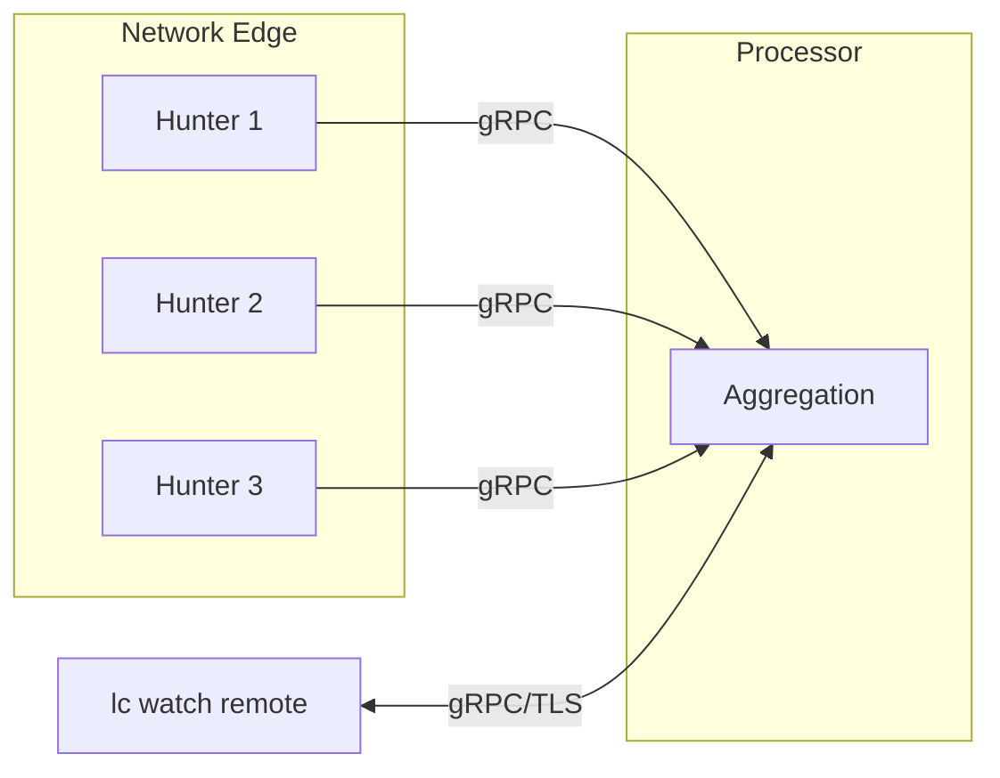

# Remote TUI Monitoring {#remote-tui-monitoring}

The TUI's remote mode (`lc watch remote`) connects to processors and displays live packet data from distributed hunters. It gives you a single pane of glass across multiple network segments without running capture locally.

<!-- i18n:skip -->


```mermaid
flowchart LR
    subgraph Edge["Network Edge"]
        H1[Hunter 1]
        H2[Hunter 2]
        H3[Hunter 3]
    end

    subgraph Central["Processor"]
        P[Aggregation]
    end

    H1 -->|gRPC| P
    H2 -->|gRPC| P
    H3 -->|gRPC| P
    TUI["lc watch remote"] <-->|gRPC/TLS| P
```

## Quick Start {#quick-start}

Connect directly to one processor:

<!-- i18n:skip -->

```bash
lc watch remote -P processor.example.com:55555 --tls-ca ca.crt
```

Connect using a nodes file:

<!-- i18n:skip -->

```bash
lc watch remote --nodes-file nodes.yaml
```

Alternatively, use the default location at `~/.config/lippycat/nodes.yaml`:

<!-- i18n:skip -->

```bash
lc watch remote
```

Connect with TLS:

<!-- i18n:skip -->

```bash
lc watch remote -P processor.example.com:55555 --tls-ca ca.crt
```

Connect with mutual TLS:

<!-- i18n:skip -->

```bash
lc watch remote -P processor.example.com:55555 --tls-ca ca.crt --tls-cert client.crt --tls-key client.key
```

For local testing:

<!-- i18n:skip -->

```bash
lc watch remote -P localhost:55555 --insecure
```

## Node File Configuration {#node-file-configuration}

Use `--processor` (`-P`) when you want to connect to a single processor or tap node directly. Use `--nodes-file` when you want the TUI to load one or more processors from YAML at startup. You can provide both; the TUI will queue connections from both sources.

The nodes file tells the TUI which processors and hunters to connect to.

### File Location {#file-location}

The TUI searches for `nodes.yaml` in this order:

1. Path given by `--nodes-file`
2. `~/.config/lippycat/nodes.yaml`
3. `./nodes.yaml` (current directory)

### Format {#format}

<!-- i18n:skip -->

```yaml
processors:
  - name: main-processor
    address: processor.example.com:55555
    tls:
      enabled: true
      ca_file: /etc/lippycat/certs/ca.crt
      cert_file: /etc/lippycat/certs/client.crt
      key_file: /etc/lippycat/certs/client.key
      skip_verify: false

  - name: backup-processor
    address: 192.168.1.101:55555
```

### Configuration Fields {#configuration-fields}

| Field                | Required | Description                                  |
| -------------------- | -------- | -------------------------------------------- |
| `name`               | Yes      | Display name for the node                    |
| `address`            | Yes      | Address in `host:port` format                |
| `tls.enabled`        | No       | Enable TLS for this node                     |
| `tls.ca_file`        | No       | CA certificate path                          |
| `tls.cert_file`      | No       | Client certificate path (mTLS)               |
| `tls.key_file`       | No       | Client private key path (mTLS)               |
| `tls.skip_verify`    | No       | Skip certificate verification (testing only) |
| `subscribed_hunters` | No       | List of hunter IDs to subscribe to           |

Each node can have its own TLS configuration, allowing mixed environments (e.g., production with mTLS, dev with insecure).

## TUI Navigation {#tui-navigation}

### Global Keys {#global-keys}

| Key                     | Action                                                             |
| ----------------------- | ------------------------------------------------------------------ |
| `Tab`                   | Switch between tabs                                                |
| `Alt+1` through `Alt+5` | Jump to tab (1=Capture, 2=Nodes, 3=Statistics, 4=Settings, 5=Help) |
| `Space`                 | Pause/resume packet display                                        |
| `q` / `Ctrl+C`          | Quit                                                               |
| `?`                     | Help                                                               |

### Packet View {#packet-view}

The packet list and detail panel include decoded, credential-redacted RADIUS
metadata received from hunters and tap nodes; RADIUS does not require a separate
watch subcommand.

| Key                   | Action                    |
| --------------------- | ------------------------- |
| `j` / `k` / `↑` / `↓` | Navigate packets          |
| `g` / `Home`          | Jump to first packet      |
| `G` / `End`           | Jump to last packet       |
| `Enter`               | View packet details       |
| `Ctrl+S`              | Save packets to PCAP file |

### Nodes View {#nodes-view}

| Key                    | Action                                      |
| ---------------------- | ------------------------------------------- |
| `↑` / `↓` or `j` / `k` | Navigate node list                          |
| `Enter`                | Connect to processor / edit input           |
| `s`                    | Open hunter subscription selector           |
| `d`                    | Unsubscribe from hunter or remove processor |
| `Esc`                  | Close modal / exit input                    |

### Calls View (VoIP) {#calls-view-voip}

| Key       | Action            |
| --------- | ----------------- |
| `j` / `k` | Navigate calls    |
| `Enter`   | View call details |

## Nodes Tab {#nodes-tab}

The Nodes tab shows connected processors and their hunters in a tree view:

<!-- i18n:skip -->

```
┌─ Nodes ────────────────────────────────────────────┐
│                                                    │
│  Processor: main-processor (192.168.1.100:55555)   │
│  ├─ edge-hunter-01 (10.0.1.10)                     │
│  │  Status: ACTIVE | Packets: 1,234 | Dropped: 0   │
│  │  Interfaces: eth0                               │
│  │                                                 │
│  └─ edge-hunter-02 (10.0.1.11)                     │
│     Status: ACTIVE | Packets: 5,678 | Dropped: 2   │
│     Interfaces: eth1, wlan0                        │
│                                                    │
│  [Enter node address to add...]                    │
└────────────────────────────────────────────────────┘
```

Each hunter displays:

- **Status**: ACTIVE, IDLE, or DISCONNECTED
- **Packets**: captured, matched, forwarded, dropped
- **Active filters**: number of filters applied
- **Interfaces**: network interfaces being monitored
- **Last heartbeat**: time since last health check

### Change Cues {#node-change-cues}

CPU and RAM use persistent text colors based on utilization: the normal theme
foreground below 70%, Solarized orange (`#cb4b16`) from 70%, and Solarized red
(`#dc322f`) from 90%. Escalation requires three distinct actual metrics samples;
repeated snapshots and redraws do not count. Elevated color clears below 65% and
high color below 85%. These presentation thresholds do not change node health.
CPU/RAM values no longer flash or show change arrows.

The displayed CPU percentage remains raw process usage: 100% means one core, so
values can exceed 100%. Color classification divides that percentage by the
reported effective CPU capacity in cores, including fractional quotas. Capacity
reflects visible CPU affinity and cgroup quota constraints, including restrictive
ancestors; it is not a guaranteed CPU reservation. RAM color compares process RSS
with the reported cgroup memory limit. This is an approximate process-to-limit
ratio: it excludes other memory charged to the cgroup.

Both metrics share the validated percentage thresholds
`watch.nodes_resources.elevated` (default 70) and `watch.nodes_resources.high`
(default 90). Values must be finite and satisfy 0 < elevated < high <= 100;
invalid pairs are logged and replaced by both defaults. The default clearing gap
is five percentage points. For low or closely spaced custom thresholds, the gap
shrinks to half the elevated threshold or half the distance between thresholds,
whichever is smaller. Missing capacity or memory limits, invalid metrics, and disconnected
nodes use neutral text. Additive capacity and sample-timestamp telemetry fields
preserve compatibility: older clients ignore them, while older nodes or
intermediaries may omit them. Without an actual metrics sample timestamp,
resource colors stay neutral even when values can still be displayed.

Packet totals share one subtle activity marker per node. Advancing captured or
forwarded totals briefly use a green (`#859900`) background only when the rounded
displayed total changes; counter resets establish a new baseline without a
highlight. Filter changes use a neutral blue (`#268bd2`) background with a signed
delta. These temporary cells use Solarized base3 (`#fdf6e3`) text. `NEW` and
`RECOVERED` mark observed lifecycle transitions. Initial snapshots and
subscription changes establish a baseline without join alerts. Idle counters do
not imply stale or disconnected nodes.

The table and graph share the same cues. A stationary recent-event line shows the
latest lifecycle or health transition, its age, and any additional events in the
preceding 30 seconds. It disappears after 30 seconds and is omitted on very short
terminals. Counter and filter cues last about one second and lifecycle markers
about five seconds, expiring on the next UI tick even while capture is paused.

In remote **Settings**, select **Nodes highlighting** and press `Enter` to switch
between `normal` (default) and `quiet`. Quiet mode retains persistent CPU/RAM
foreground colors, labels, status, and recent events while suppressing temporary
counter, filter, and lifecycle backgrounds and border accents. The change takes
effect immediately without restarting capture and is saved as
`watch.nodes_highlighting` in the configuration file.

### Adding Nodes Interactively {#adding-nodes-interactively}

You can add nodes without editing the nodes file:

1. Navigate to the Nodes tab (`Alt+2`)
2. Select the input field and press `Enter`
3. Type the processor address (e.g., `192.168.1.100:55555`)
4. Press `Enter` to connect

## Hunter Subscription Management {#hunter-subscription-management}

By default, connecting to a processor streams packets from all its hunters. Hunter subscriptions let you focus on specific network segments.

### Subscribing to Hunters {#subscribing-to-hunters}

1. Navigate to a processor in the Nodes tab
2. Press `s` to open the hunter selector modal
3. Use `↑`/`↓` or `j`/`k` to navigate hunters
4. Press `Enter` to toggle selection (highlighted in cyan)
5. Press `Enter` on "Confirm Selection" to apply
6. Press `Esc` to cancel

### Unsubscribing {#unsubscribing}

- **Single hunter**: Navigate to the hunter and press `d`
- **All hunters**: Open the selector (`s`), deselect all, confirm

### Benefits {#benefits}

- Reduces bandwidth — only subscribed hunters stream packets to your TUI
- Focus on specific segments without noise from others
- Multiple TUI clients can have independent subscriptions to the same processor

## Filter Management {#filter-management}

The TUI provides interactive filter management for connected processors and their hunters. Filters control which traffic hunters capture and forward — they are the primary mechanism for targeting specific calls, domains, or hosts across a distributed deployment. Filters can be applied globally (all hunters) or targeted to specific hunters.

### Managing Filters from the TUI {#managing-filters-from-the-tui}

From the Nodes tab, press `f` to open the filter management view. This lets you:

- **View active filters** on the connected processor
- **Create new filters** with type and pattern
- **Enable/disable filters** without deleting them
- **Delete filters** you no longer need

Filter changes take effect immediately — the processor pushes updated filters to all connected hunters.

The interactive editor handles the simple VoIP, DNS, TLS, HTTP, email, and
universal filter types. It can display and delete existing RADIUS filters, but
creating, editing, enabling, disabling, or revising them requires `lc set filter`
so their structured scope and revision data are preserved.

### Filter Types {#filter-types}

The TUI editor supports VoIP, DNS, TLS, HTTP, email, and universal filters.
RADIUS creation and modification remain CLI/YAML-only. See
[Appendix E: Filter Type Reference](../appendices/filter-reference.md) for the
complete CLI-managed type list.

### CLI Alternative {#cli-alternative}

For scripted or batch filter operations, use the CLI commands instead (see [CLI Administration](cli-admin.md)):

List current filters:

<!-- i18n:skip -->

```bash
lc list filters -P processor:55555 --tls-ca ca.crt
```

Create a filter:

<!-- i18n:skip -->

```bash
lc set filter -P processor:55555 --tls-ca ca.crt \
  --type sip_user --pattern "alicent@example.com"
```

Show filter details:

<!-- i18n:skip -->

```bash
lc show filter --id myfilter -P processor:55555 --tls-ca ca.crt
```

Delete a filter:

<!-- i18n:skip -->

```bash
lc rm filter --id myfilter -P processor:55555 --tls-ca ca.crt
```

## TLS Configuration {#tls-configuration}

### Command-Line Flags {#command-line-flags}

Use server TLS to verify the processor certificate:

<!-- i18n:skip -->

```bash
lc watch remote -P processor.example.com:55555 --tls-ca ca.crt
```

Use mutual TLS so both sides authenticate:

<!-- i18n:skip -->

```bash
lc watch remote -P processor.example.com:55555 --tls-ca ca.crt --tls-cert client.crt --tls-key client.key
```

Skip verification for an encrypted connection without an identity check (testing only):

<!-- i18n:skip -->

```bash
lc watch remote -P processor.example.com:55555 --tls-skip-verify
```

Disable TLS entirely for testing. Production mode blocks this option:

<!-- i18n:skip -->

```bash
lc watch remote -P localhost:55555 --insecure
```

### Per-Node TLS in Nodes File {#per-node-tls-in-nodes-file}

When connecting to multiple processors with different certificate authorities:

<!-- i18n:skip -->

```yaml
processors:
  - name: production
    address: prod-processor.internal:55555
    tls:
      enabled: true
      ca_file: /etc/lippycat/certs/prod-ca.crt
      cert_file: /etc/lippycat/certs/prod-client.crt
      key_file: /etc/lippycat/certs/prod-client.key

  - name: staging
    address: staging-processor.internal:55555
    tls:
      enabled: true
      ca_file: /etc/lippycat/certs/staging-ca.crt
```

### Config File {#config-file}

TLS defaults can be set in the config file:

<!-- i18n:skip -->

```yaml
watch:
  tls:
    enabled: true
    ca_file: "/etc/lippycat/certs/ca.crt"
    cert_file: ""
    key_file: ""
```

Per-node TLS in `nodes.yaml` overrides these defaults.

## Multi-Node Monitoring {#multi-node-monitoring}

### Multi-Site Deployment {#multi-site-deployment}

<!-- i18n:skip -->

```yaml
processors:
  - name: nyc-processor
    address: nyc-monitor.company.com:55555
    tls:
      enabled: true
      ca_file: /etc/lippycat/certs/ca.crt

  - name: london-processor
    address: lon-monitor.company.com:55555
    tls:
      enabled: true
      ca_file: /etc/lippycat/certs/ca.crt
```

### Network Segmentation {#network-segmentation}

Monitor different zones from a single TUI:

<!-- i18n:skip -->

```yaml
processors:
  - name: dmz-processor
    address: 192.168.1.10:55555

  - name: internal-processor
    address: 10.0.0.50:55555

  - name: guest-wifi-processor
    address: 172.16.0.20:55555
```

### Pre-Selected Hunter Subscriptions {#pre-selected-hunter-subscriptions}

Limit which hunters you receive data from at startup:

<!-- i18n:skip -->

```yaml
processors:
  - name: main-processor
    address: processor.example.com:55555
    subscribed_hunters:
      - "edge-hunter-01"
      - "edge-hunter-03"
```

## Troubleshooting {#troubleshooting}

### "Failed to connect to node" {#failed-to-connect-to-node}

Verify that the processor is running and listening:

<!-- i18n:skip -->

```bash
ss -tlnp | grep 55555
```

Test network connectivity:

<!-- i18n:skip -->

```bash
nc -zv processor-host 55555
```

Check firewall rules:

<!-- i18n:skip -->

```bash
sudo iptables -L -n | grep 55555
```

### No Packets Displayed {#no-packets-displayed}

- Check that hunters are actually connected to the processor: `lc list hunters -P processor:55555 --tls-ca ca.crt`
- Verify traffic exists on the hunter's interface: `sudo tcpdump -i eth0 -c 10`
- Check if you're subscribed to any hunters (press `s` in Nodes tab)
- Try without BPF filters to rule out over-filtering

### Frequent Disconnections {#frequent-disconnections}

- Check network stability: `ping -c 100 processor-host`
- Monitor processor resource usage: `top -p $(pgrep lippycat)`
- Increase system connection limits: `ulimit -n 4096`
- Review processor logs for errors

## Performance Notes {#performance-notes}

The remote TUI is lightweight — it only renders data, not capture:

| Resource | Typical Usage                      |
| -------- | ---------------------------------- |
| CPU      | ~1-5% (display rendering)          |
| Memory   | ~50-100MB (depends on buffer size) |
| Network  | Minimal (receives processed data)  |

Adjust `--buffer-size` to control memory usage (default: 10,000 packets).

### Recommended Limits {#recommended-limits}

- **Processors per TUI**: 5-10 for responsive UI
- **Total hunters visible**: 50-100 depending on network latency
