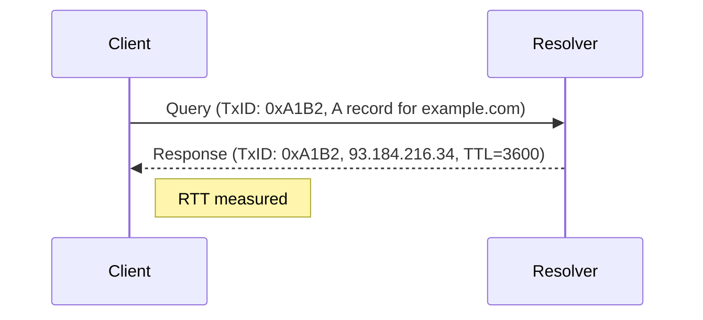

# DNS Analysis

The DNS analyzer correlates queries with their responses and measures resolution latency.

## Query/Response Correlation

lippycat matches DNS queries to their responses using the transaction ID (a 16-bit identifier in the DNS header). When a response is correlated, the `QueryResponseTimeMs` field shows the round-trip time in milliseconds.



Start DNS capture:

```bash
sudo lc sniff dns -i eth0
```

Filter by domain:

```bash
# Exact domain
sudo lc sniff dns -i eth0 --domain example.com

# Wildcard matching
sudo lc sniff dns -i eth0 --domain "*.example.com"
```

Load domain patterns from a file for bulk monitoring:

```bash
sudo lc sniff dns -i eth0 --domains-file watchlist.txt
```

## DNS Metadata Fields

Each DNS packet includes structured metadata:

| Field           | Description                         | JSON Path                      |
| --------------- | ----------------------------------- | ------------------------------ |
| Transaction ID  | Query/response correlator           | `.DNSData.TransactionID`       |
| Query Name      | Domain being queried                | `.DNSData.QueryName`           |
| Query Type      | Record type (A, AAAA, MX, etc.)     | `.DNSData.QueryType`           |
| Response Code   | NOERROR, NXDOMAIN, SERVFAIL, etc.   | `.DNSData.ResponseCode`        |
| Answers         | Array of answer records             | `.DNSData.Answers[]`           |
| RTT             | Query-to-response latency (ms)      | `.DNSData.QueryResponseTimeMs` |
| Tunneling Score | DNS tunneling probability (0.0-1.0) | `.DNSData.TunnelingScore`      |

## Common DNS Investigations

**Find slow DNS resolutions:**

```bash
sudo lc sniff dns -i eth0 2>/dev/null | \
  jq -r 'select(.DNSData.IsResponse and .DNSData.QueryResponseTimeMs > 100) |
    [.Timestamp, .DNSData.QueryName, (.DNSData.QueryResponseTimeMs|tostring) + "ms"] |
    @tsv'
```

**Monitor NXDOMAIN responses (non-existent domains):**

```bash
sudo lc sniff dns -i eth0 2>/dev/null | \
  jq -r 'select(.DNSData.ResponseCode == "NXDOMAIN") |
    [.Timestamp, .SrcIP, .DNSData.QueryName] | @tsv'
```

**Track specific record types:**

```bash
# MX record lookups (email server discovery)
sudo lc sniff dns -i eth0 2>/dev/null | \
  jq -r 'select(.DNSData.QueryType == "MX") |
    [.Timestamp, .DNSData.QueryName, (.DNSData.Answers[]?.Data // "pending")] |
    @tsv'

# TXT records (often used for SPF, DKIM, domain verification)
sudo lc sniff dns -i eth0 2>/dev/null | \
  jq 'select(.DNSData.QueryType == "TXT")'
```

## DNS Tunneling Detection

lippycat includes entropy-based DNS tunneling detection. Tunneling encodes data in DNS queries, producing domain names with unusually high entropy (randomness). The analyzer scores each query from 0.0 (normal) to 1.0 (highly suspicious):

```bash
# Flag potential DNS tunneling
sudo lc sniff dns -i eth0 --detect-tunneling 2>/dev/null | \
  jq -r 'select(.DNSData.TunnelingScore > 0.7) |
    [.Timestamp, .SrcIP, .DNSData.QueryName,
     "score=" + (.DNSData.TunnelingScore|tostring)] | @tsv'
```

High-entropy queries (long, random-looking subdomains) combined with high query volume to a single domain are strong indicators of DNS tunneling or data exfiltration.
