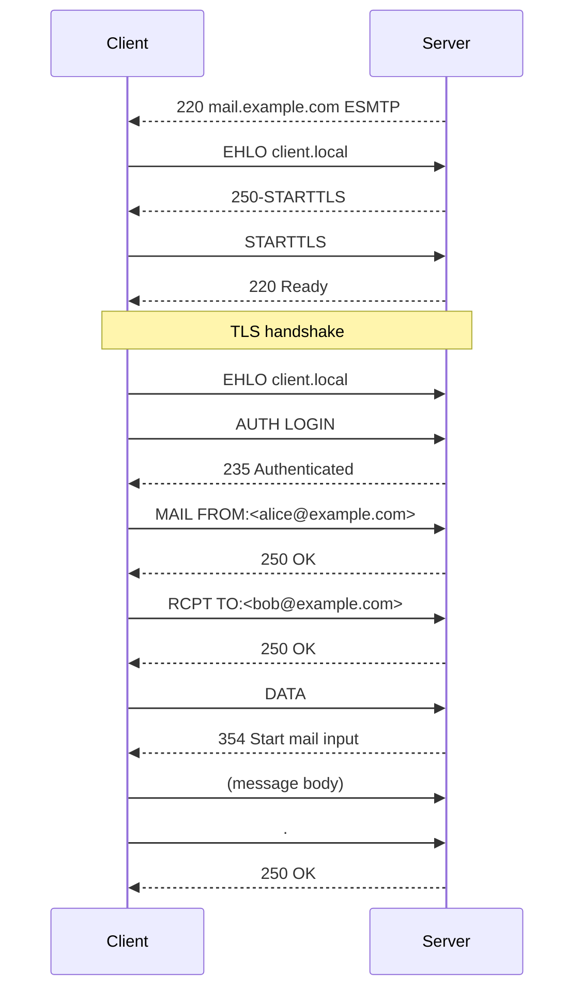

# Email Protocol Analysis

The email analyzer supports SMTP, IMAP, and POP3 with session tracking and transaction correlation.

## SMTP Analysis

SMTP capture tracks the envelope transaction: EHLO, MAIL FROM, RCPT TO, DATA, and server responses. lippycat detects STARTTLS negotiation and authentication attempts.



Start email capture:

```bash
# All email protocols
sudo lc sniff email -i eth0

# SMTP only
sudo lc sniff email -i eth0 --protocol smtp

# Filter by address
sudo lc sniff email -i eth0 --address alice@example.com

# Filter by sender or recipient specifically
sudo lc sniff email -i eth0 --sender alice@example.com
sudo lc sniff email -i eth0 --recipient bob@example.com
```

## Email Metadata Fields

| Field            | Description                    | JSON Path                    |
| ---------------- | ------------------------------ | ---------------------------- |
| Protocol         | SMTP, IMAP, or POP3            | `.EmailData.Protocol`        |
| MAIL FROM        | Sender address                 | `.EmailData.MailFrom`        |
| RCPT TO          | Recipient addresses            | `.EmailData.RcptTo`          |
| Subject          | Message subject                | `.EmailData.Subject`         |
| Command          | Current SMTP/IMAP/POP3 command | `.EmailData.Command`         |
| Response Code    | Server response code           | `.EmailData.ResponseCode`    |
| STARTTLS Offered | Server supports STARTTLS       | `.EmailData.STARTTLSOffered` |
| Auth Method      | Authentication type used       | `.EmailData.AuthMethod`      |
| Session ID       | Correlation identifier         | `.EmailData.SessionID`       |

## IMAP and POP3

IMAP and POP3 capture tracks mailbox operations:

```bash
# IMAP only
sudo lc sniff email -i eth0 --protocol imap

# Custom ports
sudo lc sniff email -i eth0 --imap-port "143,993" --pop3-port "110,995"
```

IMAP-specific fields include the command tag, selected mailbox, message UIDs, and flags. POP3 fields include message numbers and sizes.

## Common Email Investigations

**Detect unencrypted SMTP sessions:**

```bash
sudo lc sniff email -i eth0 --protocol smtp 2>/dev/null | \
  jq -r 'select(.EmailData.Command == "EHLO" and
    .EmailData.STARTTLSOffered == false) |
    [.Timestamp, .SrcIP, .DstIP, "No STARTTLS"] | @tsv'
```

**Monitor authentication attempts:**

```bash
sudo lc sniff email -i eth0 2>/dev/null | \
  jq -r 'select(.EmailData.AuthMethod != null and .EmailData.AuthMethod != "") |
    [.Timestamp, .SrcIP, .EmailData.Protocol, .EmailData.AuthMethod,
     .EmailData.AuthUser] | @tsv'
```

**Track mail flow:**

```bash
sudo lc sniff email -i eth0 --protocol smtp 2>/dev/null | \
  jq -r 'select(.EmailData.Command == "MAIL" or .EmailData.Command == "RCPT") |
    [.Timestamp, .EmailData.MailFrom // "", (.EmailData.RcptTo | join(","))] |
    @tsv'
```
