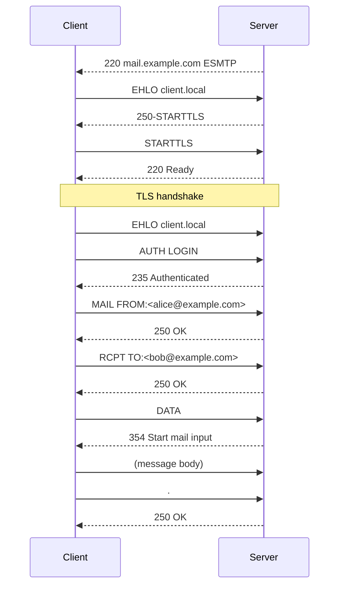

# Email Protocol Analysis {#email-protocol-analysis}

The email analyzer supports SMTP, IMAP, and POP3 with session tracking and transaction correlation.

## SMTP Analysis {#smtp-analysis}

SMTP capture tracks the envelope transaction: EHLO, MAIL FROM, RCPT TO, DATA, and server responses. lippycat detects STARTTLS negotiation and authentication attempts.

<!-- i18n:skip -->


```mermaid
sequenceDiagram
    participant Client
    participant Server

    Server-->>Client: 220 mail.example.com ESMTP
    Client->>Server: EHLO client.local
    Server-->>Client: 250-STARTTLS
    Client->>Server: STARTTLS
    Server-->>Client: 220 Ready
    Note over Client,Server: TLS handshake
    Client->>Server: EHLO client.local
    Client->>Server: AUTH LOGIN
    Server-->>Client: 235 Authenticated
    Client->>Server: MAIL FROM:<alice@example.com>
    Server-->>Client: 250 OK
    Client->>Server: RCPT TO:<bob@example.com>
    Server-->>Client: 250 OK
    Client->>Server: DATA
    Server-->>Client: 354 Start mail input
    Client->>Server: (message body)
    Client->>Server: .
    Server-->>Client: 250 OK
```

Start email capture:

For all email protocols:

<!-- i18n:skip -->

```bash
sudo lc sniff email -i eth0
```

For SMTP only:

<!-- i18n:skip -->

```bash
sudo lc sniff email -i eth0 --protocol smtp
```

To filter by address:

<!-- i18n:skip -->

```bash
sudo lc sniff email -i eth0 --address alice@example.com
```

To filter by sender specifically:

<!-- i18n:skip -->

```bash
sudo lc sniff email -i eth0 --sender alice@example.com
```

To filter by recipient specifically:

<!-- i18n:skip -->

```bash
sudo lc sniff email -i eth0 --recipient bob@example.com
```

## Email Metadata Fields {#email-metadata-fields}

| Field            | Description                    | JSON Path                    |
| ---------------- | ------------------------------ | ---------------------------- |
| Protocol         | SMTP, IMAP, or POP3            | `.EmailData.Protocol`        |
| MAIL FROM        | Sender address                 | `.EmailData.MailFrom`        |
| RCPT TO          | Recipient addresses            | `.EmailData.RcptTo`          |
| Subject          | Message subject                | `.EmailData.Subject`         |
| Command          | Current SMTP/IMAP/POP3 command | `.EmailData.Command`         |
| Response Code    | Server response code           | `.EmailData.ResponseCode`    |
| STARTTLS Offered | Server supports STARTTLS       | `.EmailData.STARTTLSOffered` |
| Auth Method      | Authentication type used       | `.EmailData.AuthMethod`      |
| Session ID       | Correlation identifier         | `.EmailData.SessionID`       |

## IMAP and POP3 {#imap-and-pop3}

IMAP and POP3 capture tracks mailbox operations:

For IMAP only:

<!-- i18n:skip -->

```bash
sudo lc sniff email -i eth0 --protocol imap
```

For custom ports:

<!-- i18n:skip -->

```bash
sudo lc sniff email -i eth0 --imap-port "143,993" --pop3-port "110,995"
```

IMAP-specific fields include the command tag, selected mailbox, message UIDs, and flags. POP3 fields include message numbers and sizes.

## Common Email Investigations {#common-email-investigations}

**Detect unencrypted SMTP sessions:**

<!-- i18n:skip -->

```bash
sudo lc sniff email -i eth0 --protocol smtp 2>/dev/null | \
  jq -r 'select(.EmailData.Command == "EHLO" and
    .EmailData.STARTTLSOffered == false) |
    [.Timestamp, .SrcIP, .DstIP, "No STARTTLS"] | @tsv'
```

**Monitor authentication attempts:**

<!-- i18n:skip -->

```bash
sudo lc sniff email -i eth0 2>/dev/null | \
  jq -r 'select(.EmailData.AuthMethod != null and .EmailData.AuthMethod != "") |
    [.Timestamp, .SrcIP, .EmailData.Protocol, .EmailData.AuthMethod,
     .EmailData.AuthUser] | @tsv'
```

**Track mail flow:**

<!-- i18n:skip -->

```bash
sudo lc sniff email -i eth0 --protocol smtp 2>/dev/null | \
  jq -r 'select(.EmailData.Command == "MAIL" or .EmailData.Command == "RCPT") |
    [.Timestamp, .EmailData.MailFrom // "", (.EmailData.RcptTo | join(","))] |
    @tsv'
```
