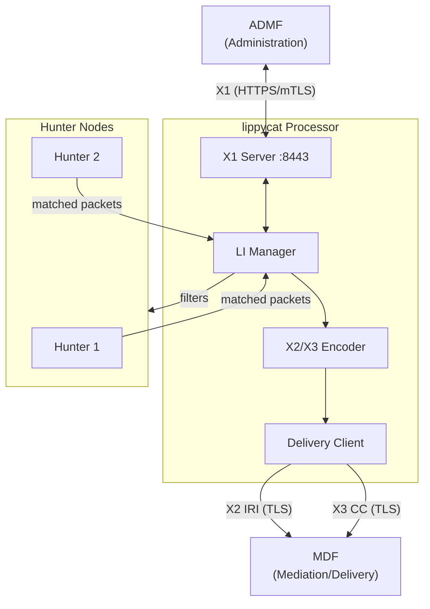
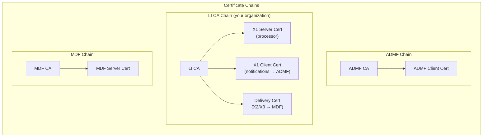
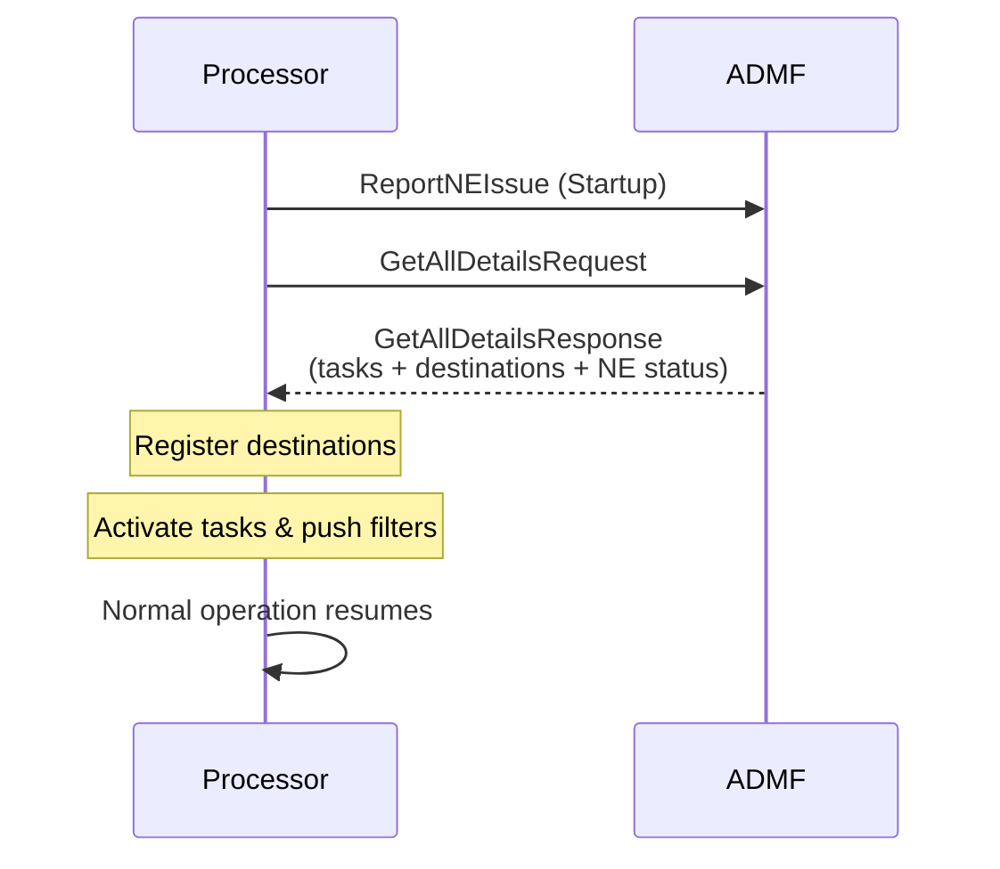
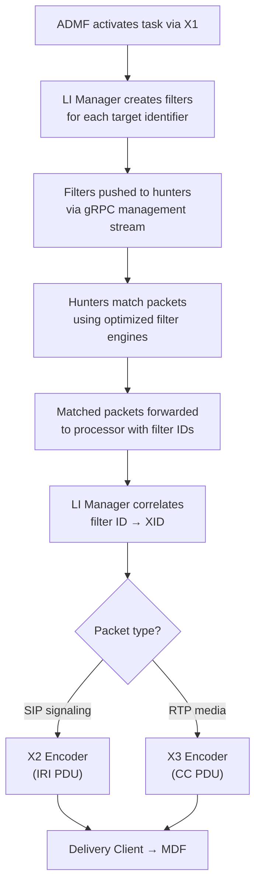

# Lawful Interception

lippycat implements ETSI-standard lawful interception (LI) interfaces, allowing authorized interception of communications when deployed as part of a lawful interception infrastructure. This chapter covers the architecture, deployment, and operation of LI capabilities for operators who need to integrate lippycat with ADMF (Administration Function) and MDF (Mediation/Delivery Function) systems.

> **Important.** Lawful interception is subject to strict legal requirements in all jurisdictions. Deploying LI capabilities without proper legal authorization is illegal. Ensure that your organization has the necessary legal framework, oversight processes, and audit controls in place before enabling LI features.

## ETSI Interface Overview

lippycat implements three ETSI interfaces defined in TS 103 221-1 and TS 103 221-2:

| Interface | Purpose | Protocol | Specification |
|-----------|---------|----------|---------------|
| **X1** | Administration (ADMF to NE) | XML/HTTPS | TS 103 221-1 |
| **X2** | IRI delivery (signaling metadata) | Binary TLV/TLS | TS 103 221-2 |
| **X3** | CC delivery (communication content) | Binary TLV/TLS | TS 103 221-2 |

The **X1** interface carries administrative commands: the ADMF sends task activation, modification, and deactivation requests to the processor (acting as the Network Element). The **X2** interface delivers Intercept Related Information (IRI) -- signaling events such as call setup, answer, and teardown. The **X3** interface delivers Content of Communication (CC) -- the actual media payloads such as RTP audio.

### Architecture

The following diagram shows how the ADMF, lippycat processor, and MDF interact:



The flow works as follows:

1. The ADMF sends an interception task to the processor via the X1 interface (or the processor queries the ADMF for existing tasks on startup -- see [ADMF State Synchronization](#admf-state-synchronization)).
2. The LI Manager translates the task's target identifiers into capture filters and pushes them to connected hunters.
3. Hunters match packets against those filters at the edge and forward matching traffic to the processor.
4. The processor encodes matched SIP signaling as X2 IRI PDUs and RTP media as X3 CC PDUs.
5. The delivery client sends encoded PDUs to the designated MDF endpoints over TLS.

## Build Requirements

LI support is controlled by the `li` build tag. Standard builds exclude all LI code through dead code elimination -- no LI types, handlers, or configuration paths exist in non-LI binaries.

```bash
# Build processor with LI support
make processor-li

# Build complete suite with LI support
make build-li

# Build tap with LI support (standalone capture + LI delivery)
make tap-li

# Verify that non-LI builds contain no LI code
make verify-no-li
```

Hunters do not need LI support. They perform edge filtering using the same filter infrastructure regardless of whether the filters originate from LI tasks or manual configuration. Only the processor (or tap in standalone mode) needs the `li` build tag because it hosts the X1 server and X2/X3 delivery client.

## Configuration and Deployment

### Enabling LI

LI is enabled with the `--li-enabled` flag on the processor. At minimum, you need the X1 server certificates for ADMF communication and delivery certificates for MDF communication.

```bash
lc process --listen :55555 \
  --tls-cert server.crt --tls-key server.key \
  --li-enabled \
  --li-x1-listen :8443 \
  --li-x1-tls-cert /etc/lippycat/li/x1-server.crt \
  --li-x1-tls-key /etc/lippycat/li/x1-server.key \
  --li-x1-tls-ca /etc/lippycat/li/admf-ca.crt \
  --li-admf-endpoint https://admf.example.com:8443 \
  --li-admf-tls-cert /etc/lippycat/li/x1-client.crt \
  --li-admf-tls-key /etc/lippycat/li/x1-client.key \
  --li-admf-tls-ca /etc/lippycat/li/admf-ca.crt \
  --li-delivery-tls-cert /etc/lippycat/li/delivery.crt \
  --li-delivery-tls-key /etc/lippycat/li/delivery.key \
  --li-delivery-tls-ca /etc/lippycat/li/mdf-ca.crt
```

The same configuration can be expressed in YAML. This is the recommended approach for production deployments:

```yaml
# /etc/lippycat/config.yaml
processor:
  listen_addr: ":55555"
  tls:
    enabled: true
    cert_file: "/etc/lippycat/certs/server.crt"
    key_file: "/etc/lippycat/certs/server.key"

  li:
    enabled: true

    # X1 server — receives task requests from ADMF
    x1_listen_addr: ":8443"
    x1_tls_cert: "/etc/lippycat/li/x1-server.crt"
    x1_tls_key: "/etc/lippycat/li/x1-server.key"
    x1_tls_ca: "/etc/lippycat/li/admf-ca.crt"

    # X1 client — sends notifications to ADMF and queries state
    admf_endpoint: "https://admf.example.com:8443"
    admf_tls_cert: "/etc/lippycat/li/x1-client.crt"
    admf_tls_key: "/etc/lippycat/li/x1-client.key"
    admf_tls_ca: "/etc/lippycat/li/admf-ca.crt"
    admf_keepalive: "30s"

    # ADMF state synchronization
    admf_sync_on_startup: true    # Query ADMF for state on startup
    admf_sync_timeout: "30s"      # Timeout for startup sync
    admf_reconcile_interval: "0"  # Periodic reconciliation (0 = disabled)

    # X2/X3 delivery — sends intercept data to MDF
    delivery_tls_cert: "/etc/lippycat/li/delivery.crt"
    delivery_tls_key: "/etc/lippycat/li/delivery.key"
    delivery_tls_ca: "/etc/lippycat/li/mdf-ca.crt"
    delivery_tls_pinned_cert:
      - "sha256:A1B2C3D4E5F6..."  # Optional: pin MDF certificates
```

### LI Certificate Setup

LI interfaces require mutual TLS (mTLS) on all connections. This means the processor must present a client certificate when connecting to the ADMF and MDF, and it must verify the certificates presented by those systems. Three separate certificate chains are involved:



The certificates required on the processor side are:

| Certificate | Flag | Purpose |
|-------------|------|---------|
| X1 Server Cert + Key | `--li-x1-tls-cert`, `--li-x1-tls-key` | Serve the X1 HTTPS endpoint |
| ADMF CA | `--li-x1-tls-ca` | Verify ADMF client certificates |
| X1 Client Cert + Key | `--li-admf-tls-cert`, `--li-admf-tls-key` | Authenticate to ADMF for notifications |
| ADMF Server CA | `--li-admf-tls-ca` | Verify ADMF server certificate |
| Delivery Cert + Key | `--li-delivery-tls-cert`, `--li-delivery-tls-key` | Authenticate to MDF for X2/X3 delivery |
| MDF CA | `--li-delivery-tls-ca` | Verify MDF server certificates |

All certificates must use RSA 2048+ or ECDSA P-256+ keys with SHA-256 or stronger hashing. TLS 1.2 is the minimum supported version on all LI interfaces.

For general TLS concepts and certificate generation, refer to [Chapter 13: Security](security.md). The key difference for LI is that you maintain separate CA chains for the ADMF, your organization's LI certificates, and the MDF -- these are typically operated by different entities.

**File permissions.** Private keys must be readable only by the process owner:

```bash
chmod 600 /etc/lippycat/li/*.key
chmod 644 /etc/lippycat/li/*.crt
chmod 700 /etc/lippycat/li/
chown root:root /etc/lippycat/li/*
```

**Certificate pinning.** For additional assurance on the X2/X3 delivery path, you can pin the MDF server certificate by its SHA-256 fingerprint:

```bash
# Obtain the fingerprint
openssl x509 -in mdf-server.crt -noout -fingerprint -sha256 | \
  sed 's/://g' | cut -d= -f2

# Configure pinning
--li-delivery-tls-pinned-cert sha256:A1B2C3D4E5F6...
```

When pinning is configured, the delivery client will reject any MDF certificate that does not match a pinned fingerprint, even if the certificate is otherwise valid under the configured CA.

## X1 Administration Interface

The X1 interface is the control plane between the ADMF and the processor. The ADMF uses it to manage interception tasks and delivery destinations; the processor uses it to send status notifications back to the ADMF.

### Supported Operations

| Operation | Direction | Description |
|-----------|-----------|-------------|
| Ping | ADMF to NE | Health check |
| CreateDestination | ADMF to NE | Register an MDF endpoint for delivery |
| ModifyDestination | ADMF to NE | Update an MDF endpoint |
| RemoveDestination | ADMF to NE | Remove an MDF endpoint |
| ActivateTask | ADMF to NE | Start an interception task |
| ModifyTask | ADMF to NE | Update task targets, destinations, or delivery type |
| DeactivateTask | ADMF to NE | Stop an interception task |
| GetTaskDetails | ADMF to NE | Query current task status |
| GetAllDetails | NE to ADMF | Query all tasks, destinations, and NE status |
| GetAllTaskDetails | NE to ADMF | Query all task details |

All requests use XML encoding per ETSI TS 103 221-1. For example, an `ActivateTask` request includes the task identifier (XID), target identifiers, destination IDs, and the delivery type:

```xml
<activateTaskRequest>
  <x1RequestMessage>
    <admfIdentifier>ADMF-001</admfIdentifier>
    <x1TransactionId>550e8400-e29b-41d4-a716-446655440000</x1TransactionId>
    <messageTimestamp>2025-12-27T10:30:00Z</messageTimestamp>
    <version>v1.13.1</version>
  </x1RequestMessage>
  <taskDetails>
    <xId>a1b2c3d4-e5f6-7890-abcd-ef1234567890</xId>
    <targetIdentifiers>
      <targetIdentifier>
        <sipUri>sip:alicent@example.com</sipUri>
      </targetIdentifier>
    </targetIdentifiers>
    <listOfDIDs>
      <dId>d1e2f3g4-h5i6-7890-jklm-nop123456789</dId>
    </listOfDIDs>
    <deliveryType>X2andX3</deliveryType>
    <implicitDeactivationAllowed>true</implicitDeactivationAllowed>
  </taskDetails>
</activateTaskRequest>
```

### Task Lifecycle

Tasks progress through the following states:

| State | Description |
|-------|-------------|
| Pending | Task received but `StartTime` has not yet been reached |
| Active | Actively intercepting matching traffic |
| Suspended | Temporarily paused by the ADMF |
| Deactivated | Explicitly stopped via `DeactivateTask` or implicit expiration |
| Failed | A fatal error prevented continued interception |

When `implicitDeactivationAllowed` is set to `true`, the processor will automatically deactivate the task when its `EndTime` is reached and notify the ADMF. When set to `false`, only an explicit `DeactivateTask` request or a fatal error can end the task.

Tasks can be modified while active. The following fields are modifiable via `ModifyTask`:

- Target identifiers (adds or removes filter criteria)
- Destination IDs (changes delivery endpoints)
- Delivery type (switches between X2Only, X3Only, X2andX3)
- End time
- Implicit deactivation setting

The XID and StartTime cannot be modified after activation.

### Delivery Types

Each task specifies what information to deliver:

| Type | X2 (IRI) | X3 (CC) | Use Case |
|------|----------|---------|----------|
| X2Only | Yes | No | Signaling metadata only (call records, registration events) |
| X3Only | No | Yes | Content only (media streams) |
| X2andX3 | Yes | Yes | Both signaling and content (full interception) |

### ADMF Notifications

The processor sends notifications to the ADMF to report operational status:

| Notification | Trigger |
|--------------|---------|
| Startup | Processor started with LI enabled |
| Shutdown | Processor shutting down gracefully |
| KeepAlive | Periodic heartbeat (configurable interval) |
| TaskProgress | Task activation progress updates |
| ErrorReport | Task execution errors |
| DeliveryNotification | X2/X3 delivery issues to MDF |
| ImplicitDeactivation | Task auto-expired due to EndTime |

Configure the keepalive interval with `--li-admf-keepalive`:

```bash
--li-admf-keepalive 30s   # Send keepalive every 30 seconds
--li-admf-keepalive 0     # Disable keepalive
```

### ADMF State Synchronization

When lippycat restarts, all in-memory task and destination state is lost. To recover without waiting for the ADMF to re-push each task individually, the processor queries the ADMF for current state on startup using the standard `GetAllDetails` operation defined in ETSI TS 103 221-1.

**Startup sync** is enabled by default. After sending the startup notification, the processor calls `GetAllDetails` on the ADMF, which returns all tasks and destinations assigned to this network element. The processor registers each destination and activates each task, recreating the full filter and delivery state automatically.



The sync is designed for graceful degradation:

- **ADMF unreachable:** The sync times out (default 30 seconds) and the processor continues startup. The ADMF can push tasks later via `ActivateTask`.
- **ADMF does not support GetAllDetails:** Some minimal ADMF implementations only support pushing state. When the ADMF returns an `UnsupportedOperation` error, the processor logs a warning and continues normally.
- **Individual task failures:** If a specific task or destination fails to activate (for example, due to an unsupported target type), it is skipped with a warning and the remaining items are processed.

**Configuration flags:**

| Flag | Type | Default | Description |
|------|------|---------|-------------|
| `--li-admf-sync-on-startup` | bool | `true` | Query ADMF for state on startup |
| `--li-admf-sync-timeout` | duration | `30s` | Timeout for the startup sync request |
| `--li-admf-reconcile-interval` | duration | `0` | Periodic reconciliation interval (0 = disabled) |

To disable startup sync (for example, in environments where the ADMF always pushes state):

```bash
--li-admf-sync-on-startup=false
```

**Periodic reconciliation** can be enabled to guard against configuration drift during long uptimes. When configured, the processor periodically queries the ADMF and compares the response with its local state:

- Tasks present in the ADMF but missing locally are activated.
- Tasks present locally but missing from the ADMF are logged as warnings (they are not automatically deactivated, since this could indicate a transient ADMF issue).

```bash
--li-admf-reconcile-interval 5m   # Reconcile every 5 minutes
```

YAML configuration:

```yaml
processor:
  li:
    admf_sync_on_startup: true
    admf_sync_timeout: "30s"
    admf_reconcile_interval: "0"   # Disabled by default
```

### X1 Error Codes

When the processor cannot fulfil an X1 request, it returns a structured error:

| Code | Name | Description |
|------|------|-------------|
| 100 | GenericError | General processing error |
| 101 | RequestSyntaxError | Invalid XML in request |
| 300 | XIDAlreadyExists | A task with this XID is already active |
| 301 | XIDNotFound | No task found for the given XID |
| 302 | DIDAlreadyExists | A destination with this DID is already registered |
| 303 | DIDNotFound | No destination found for the given DID |
| 400 | DeliveryNotPossible | Cannot reach MDF for delivery |
| 401 | TargetNotSupported | Target identifier type not supported |
| 402 | DeliveryTypeNotSupported | Requested delivery type not available |

## X2/X3 Delivery

Intercepted data is delivered to MDF endpoints using binary TLV (Type-Length-Value) encoding per ETSI TS 103 221-2.

### X2 IRI Events

X2 PDUs carry signaling metadata derived from SIP messages:

| IRI Event | SIP Trigger | Description |
|-----------|-------------|-------------|
| SessionBegin | INVITE | A call has been initiated |
| SessionAnswer | 200 OK to INVITE | The call was answered |
| SessionEnd | BYE | The call was terminated |
| SessionAttempt | CANCEL, 4xx, 5xx, 6xx | A call attempt failed |
| Registration | REGISTER | User registered with the network |
| RegistrationEnd | REGISTER (Expires: 0) | User deregistered |

Each X2 PDU includes structured attributes: timestamp, source/destination IP and port, SIP Call-ID, From/To headers, and a correlation number that links related events within the same session.

### X3 CC Content

X3 PDUs carry communication content:

| Content Type | Description |
|--------------|-------------|
| RTP Payload | Voice or video media packets |
| DTMF | Telephone keypad signals |

X3 PDUs include RTP-specific attributes (SSRC, sequence number, timestamp, payload type) and a stream ID that correlates back to the X2 session events.

### Delivery Performance

The delivery subsystem uses asynchronous queuing with backpressure to handle high throughput:

| Metric | Value |
|--------|-------|
| X2 encoding throughput | ~500K PDUs/s (~2 us per PDU) |
| X3 encoding throughput | ~1M PDUs/s (~1 us per PDU) |
| Delivery throughput (single destination) | ~100K PDUs/s |
| Delivery throughput (multiple destinations) | ~50K PDUs/s per destination |

Delivery uses connection pooling per MDF destination, batching (default: 100 PDUs per batch), and a bounded async queue (default: 10,000 items). When the queue fills, the system applies backpressure rather than dropping PDUs.

## Filter Integration

When the ADMF activates a task, the LI Manager translates target identifiers into lippycat's internal filter system. This uses the same optimized filter infrastructure described in earlier chapters on hunters ([Chapter 7](../part3-distributed/hunt.md)) and processors ([Chapter 8](../part3-distributed/process.md)).

### Target-to-Filter Mapping

| LI Target Type | X1 Element | Example | Filter System | Algorithm |
|----------------|------------|---------|---------------|-----------|
| SIP URI | `<sipUri>` | `sip:alicent@example.com` | FILTER_SIP_URI | Aho-Corasick pattern matching |
| TEL URI | `<telUri>` | `tel:+15551234567` | FILTER_PHONE_NUMBER | Bloom filter + suffix matching |
| E.164 Number | `<e164Number>` | `+15551234567` | FILTER_PHONE_NUMBER | Bloom filter + suffix matching |
| IPv4 Address | `<ipv4Address>` | `192.168.1.100` | FILTER_IP_ADDRESS | Hash map, O(1) lookup |
| IPv4 CIDR | `<ipv4Cidr>` | `10.0.0.0/8` | FILTER_IP_ADDRESS | Radix trie, O(prefix) lookup |
| IPv6 Address | `<ipv6Address>` | `2001:db8::1` | FILTER_IP_ADDRESS | Hash map, O(1) lookup |
| IPv6 CIDR | `<ipv6Cidr>` | `2001:db8::/32` | FILTER_IP_ADDRESS | Radix trie, O(prefix) lookup |
| NAI | `<nai>` | `user@realm.example.com` | FILTER_SIP_URI | Aho-Corasick pattern matching |

### Filter Flow

The end-to-end path from task activation to PDU delivery is:



Each filter created by the LI Manager is assigned an internal ID with the format `li-{xid_prefix}-{index}` (for example, `li-a1b2c3d4-0`). When packets matching these filters arrive at the processor, the LI Manager looks up the corresponding XID and routes the data through the appropriate encoder and delivery path.

When a task is deactivated, the associated filters are removed from all hunters, and matching stops immediately.

## Operational Considerations

### Network Isolation

LI infrastructure should be deployed on a dedicated management network, separate from production traffic and regular monitoring. The X1 endpoint (default port 8443) and X2/X3 delivery connections should not be accessible from general network segments. Use firewall rules to restrict access to authorized ADMF and MDF addresses only.

### Certificate Rotation

LI certificates should have short validity periods (one year or less) and be rotated before expiration. Monitor certificate expiration as part of your regular operations:

```bash
# Check if a certificate expires within 30 days
openssl x509 -in /etc/lippycat/li/x1-server.crt -noout -checkend 2592000
```

To rotate certificates:

1. Generate new certificates (or obtain them from your organizational PKI).
2. Update the processor configuration to reference the new certificate files.
3. Perform a graceful restart of the processor. Active tasks are automatically restored: the processor sends a shutdown notification, and on restart queries the ADMF via `GetAllDetails` to restore all task and destination state (see [ADMF State Synchronization](#admf-state-synchronization)).
4. Verify connectivity to ADMF and MDF after restart.

For production environments, consider using a Hardware Security Module (HSM) for private key storage and an automated certificate lifecycle management system.

### Audit Logging

All LI operations are recorded in the processor's structured logs. Key log fields for LI events include:

| Field | Description |
|-------|-------------|
| `xid` | Task identifier |
| `did` | Destination identifier |
| `filter_id` | Internal filter identifier |
| `packets_matched` | Count of matched packets |

These logs should be forwarded to a secure, tamper-evident log management system as part of your organization's LI audit requirements.

### Standalone Mode with Tap

For deployments where a separate hunter-processor topology is not needed, the `tap` node can be built with LI support:

```bash
make tap-li
```

In this configuration, the tap node captures packets locally and delivers X2/X3 PDUs directly to the MDF without gRPC overhead. This is useful for single-interface deployments or lab environments. All LI configuration flags work identically on the tap node.

## Troubleshooting

### X1 Server Not Starting

If the X1 HTTPS server fails to start:

1. Verify the processor was built with `-tags li` (use `make processor-li` or `make build-li`).
2. Check that TLS certificates are valid and not expired.
3. Confirm the CA certificate matches the ADMF client certificates.
4. Ensure the listen port (default 8443) is not already in use.

### X2/X3 Delivery Failures

If PDUs are not reaching the MDF:

1. Confirm that the MDF destination was registered via a `CreateDestination` request on X1.
2. Verify network connectivity to the MDF endpoint.
3. Check that the delivery client certificate is signed by a CA the MDF trusts.
4. Monitor the delivery queue depth -- a full queue indicates the MDF cannot keep up or is unreachable.

### Tasks Not Matching Traffic

If an active task produces no intercept data:

1. Verify the task status is `Active` (use `GetTaskDetails` via X1).
2. Check that the target format matches the traffic exactly (for example, a full SIP URI `sip:user@domain` versus just the user part).
3. Confirm that filters have been pushed to hunters (check processor logs for filter push events).
4. Verify that hunters are receiving traffic that matches the target identifiers.

### Debug Logging

Enable debug-level logging for detailed LI diagnostics:

```bash
LOG_LEVEL=debug lc process --li-enabled ...
```

To verify TLS connectivity to the X1 or delivery endpoints manually:

```bash
# Test X1 server
openssl s_client -connect localhost:8443 \
  -cert x1-client.crt -key x1-client.key \
  -CAfile li-ca.crt

# Test delivery to MDF
openssl s_client -connect mdf.example.com:443 \
  -cert delivery.crt -key delivery.key \
  -CAfile mdf-ca.crt
```
