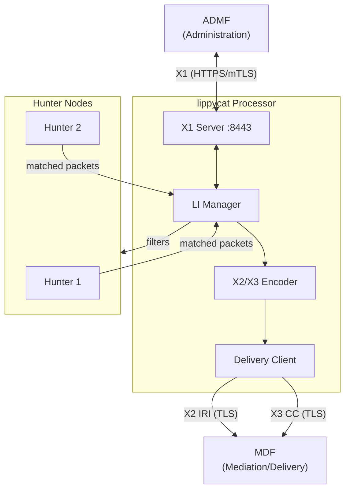
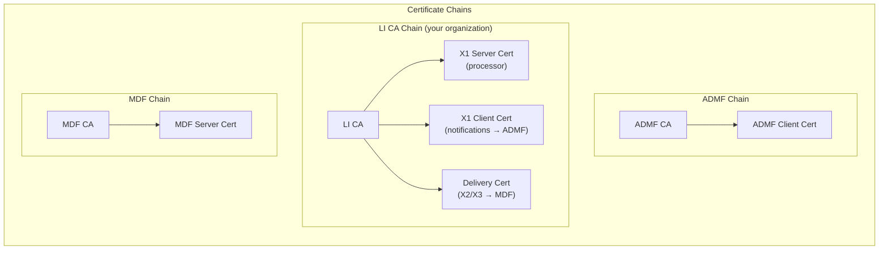
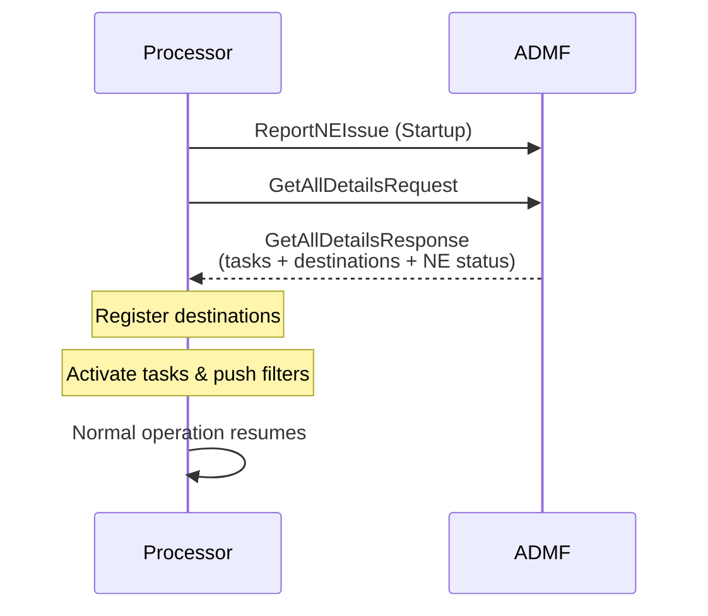
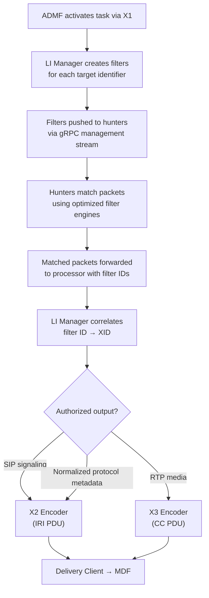

# Lawful Interception {#lawful-interception}

lippycat implements ETSI-standard lawful interception (LI) interfaces, allowing authorized interception of communications when deployed as part of a lawful interception infrastructure. This chapter covers the architecture, deployment, and operation of LI capabilities for operators who need to integrate lippycat with ADMF (Administration Function) and MDF (Mediation/Delivery Function) systems.

> **Important.** Lawful interception is subject to strict legal requirements in all jurisdictions. Deploying LI capabilities without proper legal authorization is illegal. Ensure that your organization has the necessary legal framework, oversight processes, and audit controls in place before enabling LI features.

## ETSI Interface Overview {#etsi-interface-overview}

lippycat implements three ETSI interfaces defined in TS 103 221-1 and TS 103 221-2:

| Interface | Purpose                             | Protocol       | Specification |
| --------- | ----------------------------------- | -------------- | ------------- |
| **X1**    | Administration (ADMF to NE)         | XML/HTTPS      | TS 103 221-1  |
| **X2**    | IRI delivery (signaling metadata)   | Binary TLV/TLS | TS 103 221-2  |
| **X3**    | CC delivery (communication content) | Binary TLV/TLS | TS 103 221-2  |

The **X1** interface carries administrative commands: the ADMF sends task activation, modification, and deactivation requests to the processor (acting as the Network Element). The **X2** interface delivers Intercept Related Information (IRI), including SIP signaling events. The **X3** interface delivers Content of Communication (CC) -- the actual media payloads such as RTP audio.

### Architecture {#architecture}

The following diagram shows how the ADMF, lippycat processor, and MDF interact:

<!-- i18n:skip -->


```mermaid
flowchart TB
    ADMF["ADMF<br/>(Administration)"]

    subgraph NE["lippycat Processor"]
        X1["X1 Server :8443"]
        LIM["LI Manager"]
        ENC["X2/X3 Encoder"]
        DC["Delivery Client"]
        X1 <--> LIM
        LIM --> ENC --> DC
    end

    subgraph Hunters["Hunter Nodes"]
        H1["Hunter 1"]
        H2["Hunter 2"]
    end

    MDF["MDF<br/>(Mediation/Delivery)"]

    ADMF <-->|"X1 (HTTPS/mTLS)"| X1
    LIM -->|"filters"| Hunters
    H1 -->|"matched packets"| LIM
    H2 -->|"matched packets"| LIM
    DC -->|"X2 IRI (TLS)"| MDF
    DC -->|"X3 CC (TLS)"| MDF
```

The flow works as follows:

1. The ADMF sends an interception task to the processor via the X1 interface (or the processor queries the ADMF for existing tasks on startup -- see [ADMF State Synchronization](#admf-state-synchronization)).
2. The LI Manager translates the task's target identifiers into capture filters and pushes them to connected hunters.
3. Hunters match packets against those filters at the edge and forward matching traffic to the processor.
4. The processor encodes matched SIP signaling and enabled, authorized protocol metadata as X2 IRI PDUs, and RTP media as X3 CC PDUs.
5. The delivery client sends encoded PDUs to the designated MDF endpoints over TLS.

## Build Requirements {#build-requirements}

LI support is controlled by the `li` build tag. Standard builds exclude all LI code through dead code elimination -- no LI types, handlers, or configuration paths exist in non-LI binaries.

Build the processor with LI support:

<!-- i18n:skip -->

```bash
make processor-li
```

Build the complete suite with LI support:

<!-- i18n:skip -->

```bash
make build-li
```

Build tap with LI support for standalone capture and LI delivery:

<!-- i18n:skip -->

```bash
make tap-li
```

Verify that non-LI builds contain no LI code:

<!-- i18n:skip -->

```bash
make verify-no-li
```

Hunters do not need LI support. They perform edge filtering using the same filter infrastructure regardless of whether the filters originate from LI tasks or manual configuration. Only the processor (or tap in standalone mode) needs the `li` build tag because it hosts the X1 server and X2/X3 delivery client.

## Configuration and Deployment {#configuration-and-deployment}

### Enabling LI {#enabling-li}

LI is enabled with the `--li-enabled` flag on the processor or tap. The X1 listen address, server certificate, server key, and ADMF client CA are mandatory; incomplete X1 TLS configuration causes startup to fail. Delivery certificates are also needed for MDF communication.

Initialize or migrate an encrypted managed-filter store before enabling LI.
Administrative persistence, when configured, also requires an initialized encrypted
snapshot with its own independent raw 32-byte key. Plaintext state is never loaded
by the runtime. Follow the
[storage setup and migration guide](https://github.com/endorses/lippycat/blob/main/docs/LI_INTEGRATION.md#encrypted-managed-storage)
with the node stopped. The following example assumes those snapshots already
exist. Empty `--li-state-file` disables administrative persistence where replay
does not require it.

<!-- i18n:skip -->

```bash
lc process --listen :55555 \
  --tls-cert server.crt --tls-key server.key \
  --li-enabled \
  --filter-file /var/lib/lippycat/filters.enc \
  --filter-store-key-id filters-1 --filter-store-key-file /etc/lippycat/keys/filters.key \
  --li-state-file /var/lib/lippycat/li-state.enc \
  --li-state-key-id state-1 --li-state-key-file /etc/lippycat/keys/li-state.key \
  --li-x1-listen :8443 \
  --li-x1-tls-cert /etc/lippycat/li/x1-server.crt \
  --li-x1-tls-key /etc/lippycat/li/x1-server.key \
  --li-x1-tls-ca /etc/lippycat/li/admf-ca.crt \
  --li-admf-endpoint https://admf.example.com:8443 \
  --li-admf-tls-cert /etc/lippycat/li/x1-client.crt \
  --li-admf-tls-key /etc/lippycat/li/x1-client.key \
  --li-admf-tls-ca /etc/lippycat/li/admf-ca.crt \
  --li-delivery-tls-cert /etc/lippycat/li/delivery.crt \
  --li-delivery-tls-key /etc/lippycat/li/delivery.key \
  --li-delivery-tls-ca /etc/lippycat/li/mdf-ca.crt
```

The same configuration can be expressed in YAML. This is the recommended approach for production deployments:

<!-- i18n:skip -->

```yaml
# /etc/lippycat/config.yaml
processor:
  listen_addr: ":55555"
  tls:
    enabled: true
    cert_file: "/etc/lippycat/certs/server.crt"
    key_file: "/etc/lippycat/certs/server.key"

  filter_file: "/var/lib/lippycat/filters.enc"
  filter_store:
    mode: auto
    key_id: "filters-1"
    key_file: "/etc/lippycat/keys/filters.key"

  li:
    enabled: true
    state_file: "/var/lib/lippycat/li-state.enc"
    state_key_id: "state-1"
    state_key_file: "/etc/lippycat/keys/li-state.key"

    # X1 server — receives task requests from ADMF
    x1_listen_addr: ":8443"
    x1_tls_cert: "/etc/lippycat/li/x1-server.crt"
    x1_tls_key: "/etc/lippycat/li/x1-server.key"
    x1_tls_ca: "/etc/lippycat/li/admf-ca.crt"

    # X1 client — sends notifications to ADMF and queries state
    admf_endpoint: "https://admf.example.com:8443"
    admf_tls_cert: "/etc/lippycat/li/x1-client.crt"
    admf_tls_key: "/etc/lippycat/li/x1-client.key"
    admf_tls_ca: "/etc/lippycat/li/admf-ca.crt"
    admf_keepalive: "30s"

    # ADMF state synchronization
    admf_sync_on_startup: true # Query ADMF for state on startup
    admf_sync_timeout: "30s" # Timeout for startup sync
    admf_reconcile_interval: "5m" # Periodic reconciliation (0 = disabled)

    # X2/X3 delivery — sends intercept data to MDF
    delivery_tls_cert: "/etc/lippycat/li/delivery.crt"
    delivery_tls_key: "/etc/lippycat/li/delivery.key"
    delivery_tls_ca: "/etc/lippycat/li/mdf-ca.crt"
    delivery_tls_pinned_cert:
      - "sha256:A1B2C3D4E5F6..." # Optional: pin MDF certificates
```

### LI Certificate Setup {#li-certificate-setup}

LI interfaces require mutual TLS (mTLS) on all connections. This means the processor must present a client certificate when connecting to the ADMF and MDF, and it must verify the certificates presented by those systems. Three separate certificate chains are involved:

<!-- i18n:skip -->


```mermaid
flowchart TB
    subgraph chains["Certificate Chains"]
        direction TB

        subgraph admf_chain["ADMF Chain"]
            ADMF_CA["ADMF CA"]
            ADMF_Cert["ADMF Client Cert"]
            ADMF_CA --> ADMF_Cert
        end

        subgraph li_chain["LI CA Chain (your organization)"]
            LI_CA["LI CA"]
            X1Srv["X1 Server Cert<br/>(processor)"]
            X1Cli["X1 Client Cert<br/>(notifications → ADMF)"]
            Deliv["Delivery Cert<br/>(X2/X3 → MDF)"]
            LI_CA --> X1Srv
            LI_CA --> X1Cli
            LI_CA --> Deliv
        end

        subgraph mdf_chain["MDF Chain"]
            MDF_CA["MDF CA"]
            MDF_Cert["MDF Server Cert"]
            MDF_CA --> MDF_Cert
        end
    end
```

The certificates required on the processor side are:

| Certificate          | Flag                                              | Purpose                                |
| -------------------- | ------------------------------------------------- | -------------------------------------- |
| X1 Server Cert + Key | `--li-x1-tls-cert`, `--li-x1-tls-key`             | Serve the X1 HTTPS endpoint            |
| ADMF CA              | `--li-x1-tls-ca`                                  | Verify ADMF client certificates        |
| X1 Client Cert + Key | `--li-admf-tls-cert`, `--li-admf-tls-key`         | Authenticate to ADMF for notifications |
| ADMF Server CA       | `--li-admf-tls-ca`                                | Verify ADMF server certificate         |
| Delivery Cert + Key  | `--li-delivery-tls-cert`, `--li-delivery-tls-key` | Authenticate to MDF for X2/X3 delivery |
| MDF CA               | `--li-delivery-tls-ca`                            | Verify MDF server certificates         |

All certificates must use RSA 2048+ or ECDSA P-256+ keys with SHA-256 or stronger hashing. The X1 server requires TLS 1.3 and a trusted ADMF client CA; it will not start if its listen address, certificate, key, or client CA is missing. The outbound X1 and X2/X3 interfaces require TLS 1.2 or newer.

For general TLS concepts and certificate generation, refer to [Chapter 13: Security](security.md). The key difference for LI is that you maintain separate CA chains for the ADMF, your organization's LI certificates, and the MDF -- these are typically operated by different entities.

**File permissions.** Private keys must be readable only by the process owner:

<!-- i18n:skip -->

```bash
chmod 600 /etc/lippycat/li/*.key
```

<!-- i18n:skip -->

```bash
chmod 644 /etc/lippycat/li/*.crt
```

<!-- i18n:skip -->

```bash
chmod 700 /etc/lippycat/li/
```

<!-- i18n:skip -->

```bash
chown root:root /etc/lippycat/li/*
```

**Certificate pinning.** For additional assurance on the X2/X3 delivery path, you can pin the MDF server certificate by its SHA-256 fingerprint:

Obtain the fingerprint:

<!-- i18n:skip -->

```bash
openssl x509 -in mdf-server.crt -noout -fingerprint -sha256 | \
  sed 's/://g' | cut -d= -f2
```

Configure pinning with the resulting fingerprint:

<!-- i18n:skip -->

```bash
--li-delivery-tls-pinned-cert sha256:A1B2C3D4E5F6...
```

When pinning is configured, the delivery client will reject any MDF certificate that does not match a pinned fingerprint, even if the certificate is otherwise valid under the configured CA.

## X1 Administration Interface {#x1-administration-interface}

The X1 interface is the control plane between the ADMF and the processor. The ADMF uses it to manage interception tasks and delivery destinations; the processor uses it to send status notifications back to the ADMF.

### Supported Operations {#supported-operations}

| Operation         | Direction  | Description                                         |
| ----------------- | ---------- | --------------------------------------------------- |
| Ping              | ADMF to NE | Health check                                        |
| CreateDestination | ADMF to NE | Register an MDF endpoint for delivery               |
| ModifyDestination | ADMF to NE | Update an MDF endpoint                              |
| RemoveDestination | ADMF to NE | Remove an MDF endpoint                              |
| ActivateTask      | ADMF to NE | Start an interception task                          |
| ModifyTask        | ADMF to NE | Update task targets, destinations, or delivery type |
| DeactivateTask    | ADMF to NE | Stop an interception task                           |
| GetTaskDetails    | ADMF to NE | Query current task status                           |
| GetAllDetails     | NE to ADMF | Query all tasks, destinations, and NE status        |
| GetAllTaskDetails | NE to ADMF | Query all task details                              |

All requests use XML encoding per ETSI TS 103 221-1. For example, an `ActivateTask` request includes the task identifier (XID), target identifiers, destination IDs, and the delivery type:

<!-- i18n:skip -->

```xml
<activateTaskRequest>
  <x1RequestMessage>
    <admfIdentifier>ADMF-001</admfIdentifier>
    <x1TransactionId>550e8400-e29b-41d4-a716-446655440000</x1TransactionId>
    <messageTimestamp>2025-12-27T10:30:00Z</messageTimestamp>
    <version>v1.13.1</version>
  </x1RequestMessage>
  <taskDetails>
    <xId>a1b2c3d4-e5f6-7890-abcd-ef1234567890</xId>
    <targetIdentifiers>
      <targetIdentifier>
        <sipUri>sip:alicent@example.com</sipUri>
      </targetIdentifier>
    </targetIdentifiers>
    <listOfDIDs>
      <dId>d1e2f3g4-h5i6-7890-jklm-nop123456789</dId>
    </listOfDIDs>
    <deliveryType>X2andX3</deliveryType>
    <implicitDeactivationAllowed>true</implicitDeactivationAllowed>
  </taskDetails>
</activateTaskRequest>
```

### Task Lifecycle {#task-lifecycle}

Tasks progress through the following states:

| State       | Description                                                    |
| ----------- | -------------------------------------------------------------- |
| Pending     | Task received but `StartTime` has not yet been reached         |
| Active      | Actively intercepting matching traffic                         |
| Suspended   | Temporarily paused by the ADMF                                 |
| Deactivated | Explicitly stopped via `DeactivateTask` or implicit expiration |
| Failed      | A fatal error prevented continued interception                 |

`GetTaskDetails` reports the schema-defined provisioning value
`awaitingProvisioning` for pending tasks, `failed` for failed tasks, and
`complete` for active, suspended, and deactivated tasks. No vendor-specific
task-status extension is emitted on X1.

When `implicitDeactivationAllowed` is set to `true`, the processor will automatically deactivate the task when its `EndTime` is reached and notify the ADMF. When set to `false`, only an explicit `DeactivateTask` request or a fatal error can end the task.

Tasks can be modified while active. The following fields are modifiable via `ModifyTask`:

- Target identifiers (adds or removes filter criteria)
- Destination IDs (changes delivery endpoints)
- Delivery type (switches between X2Only, X3Only, X2andX3)
- End time
- Implicit deactivation setting

The XID and StartTime cannot be modified after activation.

#### Idempotent retry and explicit reactivation {#idempotent-retry-and-explicit-reactivation}

Repeating an equivalent `ActivateTask` while a task is active or pending is an
idempotent retry. It does not reinstall filters, advance the activation
generation, or change the scheduled start boundary.

A deactivated task is retained temporarily as a tombstone and cannot resume
automatically. An explicit, authenticated `ActivateTask` can reactivate it only
when the protected interception identity is unchanged: the XID, delivery type,
and canonical set of target type/value pairs must match. Target order and exact
duplicates are insignificant. The new request may replace destination IDs,
mediation start and end times, and lifecycle options, subject to normal current
validation. Suspended and failed tasks remain ineligible for this operation.

Provision every replacement destination before reactivation and verify that
each supports the requested delivery type. On success, the processor preserves
the old deactivation in audit history, advances the activation generation, and
installs only the new filters. On validation or installation failure, the
tombstone remains non-enforcing and unchanged. If the response is lost, use
`GetTaskDetails` before retrying: an identical active/pending request is safe to
repeat; a `deactivated` result requires another explicit activation after the
underlying error is corrected.

### Delivery Types {#delivery-types}

Each task specifies what information to deliver:

| Type    | X2 (IRI) | X3 (CC) | Use Case                                                    |
| ------- | -------- | ------- | ----------------------------------------------------------- |
| X2Only  | Yes      | No      | Signaling metadata only (call records, registration events) |
| X3Only  | No       | Yes     | Content only (media streams)                                |
| X2andX3 | Yes      | Yes     | Both signaling and content (full interception)              |

### ADMF Notifications {#admf-notifications}

The processor sends notifications to the ADMF to report operational status:

| Notification         | Trigger                                    |
| -------------------- | ------------------------------------------ |
| Startup              | Processor started with LI enabled          |
| Shutdown             | Processor shutting down gracefully         |
| KeepAlive            | Periodic heartbeat (configurable interval) |
| TaskProgress         | Task activation progress updates           |
| ErrorReport          | Task execution errors                      |
| DeliveryNotification | X2/X3 delivery issues to MDF               |
| ImplicitDeactivation | Task auto-expired due to EndTime           |

Configure the keepalive interval with `--li-admf-keepalive`:

Send a keepalive every 30 seconds:

<!-- i18n:skip -->

```bash
--li-admf-keepalive 30s
```

Disable keepalives:

<!-- i18n:skip -->

```bash
--li-admf-keepalive 0
```

### ADMF State Synchronization {#admf-state-synchronization}

When lippycat restarts, all in-memory task and destination state is lost. To recover without waiting for the ADMF to re-push each task individually, the processor queries the ADMF for current state on startup using the standard `GetAllDetails` operation defined in ETSI TS 103 221-1.

**Startup sync** is enabled by default. After sending the startup notification, the processor calls `GetAllDetails` on the ADMF, which returns all tasks and destinations assigned to this network element. The processor registers each destination and activates each task, recreating the full filter and delivery state automatically.

<!-- i18n:skip -->


```mermaid
sequenceDiagram
    participant P as Processor
    participant A as ADMF
    P->>A: ReportNEIssue (Startup)
    P->>A: GetAllDetailsRequest
    A-->>P: GetAllDetailsResponse<br/>(tasks + destinations + NE status)
    Note over P: Register destinations
    Note over P: Activate tasks & push filters
    P->>P: Normal operation resumes
```

The sync is designed for graceful degradation:

- **ADMF unreachable:** The sync times out (default 30 seconds) and the processor continues startup. The ADMF can push tasks later via `ActivateTask`.
- **ADMF does not support GetAllDetails:** Some minimal ADMF implementations only support pushing state. When the ADMF returns an `UnsupportedOperation` error, the processor logs a warning and continues normally.
- **Individual task failures:** If a specific task or destination fails to activate (for example, due to an unsupported target type), it is skipped with a warning and the remaining items are processed.

**Configuration flags:**

| Flag                           | Type     | Default | Description                                          |
| ------------------------------ | -------- | ------- | ---------------------------------------------------- |
| `--li-admf-sync-on-startup`    | bool     | `true`  | Query ADMF for state on startup                      |
| `--li-admf-sync-timeout`       | duration | `30s`   | Timeout for the startup sync request                 |
| `--li-admf-reconcile-interval` | duration | `5m`    | Periodic ADMF reconciliation interval (0 = disabled) |

To disable startup sync (for example, in environments where the ADMF always pushes state):

<!-- i18n:skip -->

```bash
--li-admf-sync-on-startup=false
```

**Periodic reconciliation** guards against configuration drift during long uptimes, and is **enabled by default (5m)**. The processor periodically queries the ADMF and reconciles its local state against the response:

- Tasks present in the ADMF but missing locally are activated.
- Tasks present locally but missing from the ADMF are deactivated, and their filters removed. A `DeactivateTask` that never arrives would otherwise leave an intercept running with no authorisation and no expiry.

Teardown is deliberately conservative, because wrongly removing a live warrant is as serious as over-collecting. Nothing is removed when:

- the ADMF request fails (an outage never reaches the teardown path);
- any task in the response fails to parse, since the picture is then incomplete;
- the response contains zero tasks while tasks are active locally — the ADMF recovery procedure answers this way while its tables are rebuilt, so clearing the last task requires an explicit `DeactivateTask`.

A task must also be absent from two consecutive polls before it is removed (`ReconcileOrphanPolls`), which costs one interval of over-collection and removes single-poll flukes. Every automatic deactivation is logged at WARN with the XID.

The same reconciliation runs during startup sync, where it acts on the first response: filters persist to disk and are reloaded before the registry exists, so a stale filter would otherwise be re-armed on every restart. Filters not owned by LI are never touched.

Reconcile every five minutes (the default):

<!-- i18n:skip -->

```bash
--li-admf-reconcile-interval 5m
```

Disable reconciliation, so drift is never corrected:

<!-- i18n:skip -->

```bash
--li-admf-reconcile-interval 0
```

YAML configuration:

<!-- i18n:skip -->

```yaml
processor:
  li:
    admf_sync_on_startup: true
    admf_sync_timeout: "30s"
    admf_reconcile_interval: "5m" # 0 disables; drift is then never corrected
```

### X1 Error Codes {#x1-error-codes}

When the processor cannot fulfil an X1 request, it returns a structured error:

| Code | Name                     | Description                                                      |
| ---- | ------------------------ | ---------------------------------------------------------------- |
| 100  | GenericError             | General processing error; retained reactivation identity differs |
| 101  | RequestSyntaxError       | Invalid XML in request                                           |
| 300  | XIDAlreadyExists         | A task with this XID is already active                           |
| 301  | XIDNotFound              | No task found for the given XID                                  |
| 302  | DIDAlreadyExists         | A destination with this DID is already registered                |
| 303  | DIDNotFound              | No destination found for the given DID                           |
| 400  | DeliveryNotPossible      | Cannot reach MDF for delivery                                    |
| 401  | TargetNotSupported       | Target identifier type not supported                             |
| 402  | DeliveryTypeNotSupported | Requested delivery type not available                            |

When reactivation changes a protected target or delivery type, code 100 has the
stable description `retained task's interception identity differs` followed by
the XID. This is intentionally distinct from code 300: code 300 continues to
mean a conflicting definition for an active or pending XID. Operators should
investigate a code-100 identity mismatch rather than changing the interception
target under the retained XID.

## X2/X3 Delivery {#x2x3-delivery}

Intercepted data is delivered to MDF endpoints using binary TLV (Type-Length-Value) encoding per ETSI TS 103 221-2.

### Optional SIP call-leg correlation {#sip-call-leg-correlation}

Call-leg correlation is disabled by default. Enable selected rules under
`processor.li.correlation` or `tap.li.correlation` only after verifying the signaling
and MDF profile. A grouped call uses the FNV-1a ID of its first selected Call-ID for X2
and X3; the MDF owns the final CIN interpretation and deduplication. Grouping changes
only Correlation IDs and their dependent sequence contexts. Source packets, payloads,
matched tasks, authorization, direction and destinations remain unchanged.

A retained first decision always wins. For a new eligible initial transaction, the order
is trusted session headers (H) and parent Call-ID references (P), SDP origin (S),
address chaining with the same called identity (R1), exact calling/called identity pair
(R2), then address chaining with rewritten numbers. H/P disagreement, ambiguity or an exact association without a common active task leaves
the leg separate, without trying weaker evidence. Unusable or ambiguous S falls through;
ambiguous weaker matches leave the leg separate. Enable each method independently. Already published groups are never
merged retrospectively.

`session_headers` accepts arbitrary valid SIP header names, matched case-insensitively.
Session-ID selects the initiating UUID: local in a request, remote in a response.
Valid generic parameters, including quoted values and escapes, do not affect UUID
selection. Nil or malformed UUIDs and a syntactically unusable single header supply no
key, allowing weaker matching. P-Charging-Vector
selects `icid-value`. Proprietary headers compare their complete nonempty values exactly
after trimming surrounding whitespace; case and semicolons remain significant.
Repeated identical usable keys are accepted; distinct valid keys, repeated remote
parameters and conflicting repeated headers remain terminal ambiguity. `parent_call_id_headers` contains
trusted headers naming one exact, case-preserved retained parent Call-ID; unknown, later
or self-referencing parents cannot regroup a published child.

R1 compares initial INVITE transport addresses within `address_window` and before the
relevant final response. `node_aliases` is a list of disjoint address lists, each
representing one node; it does not rewrite calling or called identities. Compare
complete canonical identities, never number suffixes or deployment-specific digit
substitutions. R2 requires the exact pair within `number_window` and no address match; its capture-time
window is symmetric, including the boundary, so reversed arrival can match.
Rewritten-number R1 requires one eligible address candidate and no called-number
candidate. These heuristics can falsely group unrelated calls; missing observations and
A,C,B arrival in an A → B → C chain can leave one call split.

S compares the full SDP origin `(username, sess-id, nettype, addrtype,
unicast-address)`; version is revision metadata. Offer and answer roles remain separate;
an unknown role supplies no evidence. Distinct initial transactions update an
independent bounded history before matching. Reuse spanning more than
`sdp_origin_reuse_window`, or contradictory trusted values of the same header type,
suspends that origin. Retransmissions neither refresh observation TTL nor renew
suspension. Ordinary suspension deadlines are fixed; distinct use during a period renews it once
at expiry. The exact transaction set is bounded to 256 entries per origin and role.
Exhausting that set or the per-origin trusted-key bound quarantines only that origin;
any traffic, including retransmissions, restarts its traffic-free observation-TTL quiet
period because distinctness can no longer be established. This overload policy is
separate from ordinary suspension. Tracked-origin capacity exhaustion disables S
globally instead of evicting incomplete history. Candidate evidence carries an
observation generation: expiry, release or reset invalidates it permanently, and fresh
history cannot revive an older candidate.

Every group must retain a common active task generation across all member decisions.
Task edits, expiry and reactivation invalidate stale eligibility. Existing decisions
also pin X3-first and late-signaling legs. At startup, and after a decision cannot be
retained at capacity, `decision_horizon` blocks new adoption while restored adopted IDs
still apply. Transactions or forwarding delays beyond that horizon can defeat protection
of unpersisted standalone decisions. Activity, including RTP publication, refreshes
retention; terminal decisions use `terminal_grace`, and inactivity follows the
configured call lifecycle lifetime.

Common-task membership includes the administrative state incarnation as well as XID and
activation generation. Persistent deployments use the authenticated administrative store
incarnation; stateless deployments use a fresh runtime incarnation. Replacing
administrative storage or restarting without it therefore cannot make a reused XID and
generation join a stale restored group. Retained adopted decisions still reuse their
selected IDs, but new legs cannot join through stale task contexts.

An empty `store_file` disables restart persistence. Adopted decisions use a dedicated
authenticated encrypted store, separate from administrative LI state and journals.
Configure `store_key_file`, `store_key_id` and optional `store_read_keys` entries
`id=path`; use an independent 32-byte key and a protected directory. Initialize the
store offline with the node stopped. Corrupt or unauthenticated storage is a startup
error, not an empty replacement store.

<!-- i18n:skip -->
```bash
openssl rand -out /etc/lippycat/keys/li-correlation.key 32
lc migrate li-correlation --output /var/lib/lippycat/li-correlation.enc \
  --key-file /etc/lippycat/keys/li-correlation.key --key-id correlation-1 \
  --max-records 100000
```

Rotate this store offline with `lc migrate li-correlation rotate`, following the key
rotation syntax of `lc migrate li-state --source-format=encrypted`. Keep previous keys needed to read
retained records. Before publication, a committed write selects the adopted ID;
confirmed noncommit selects standalone. An uncertain write publishes the adopted ID and
retries without changing a published decision. A crash before uncertainty resolves may
lose that adoption: restart stability explicitly excludes this window. Publication
includes admission to a deliverable queue, reorder buffer or spool; successful network
transmission is not the boundary.

The following defaults leave every matching rule off. Add only trusted header names and
explicitly enable chosen rules. `sdp_origin_observation_ttl` must exceed
`sdp_origin_reuse_window`; durations and capacities must be positive. Configure the same
keys under `tap.li.correlation` for tap.

`wait_timeout` defaults to `5s` and fixes the wait deadline when an adoption is
reserved; later packets do not renew it. Deadline expiry or deferred-queue
pressure releases the reserved group ID as uncertain so correlation does not
discard the leg's product. Released IDs remain stable through late write outcomes;
authorization, cancellation and original product expiry still apply.

`shutdown_timeout` defaults to `10s` and supplies one shared correlation shutdown
budget for maintenance, pending decisions and close. It is independent of the
delivery-queue shutdown timeout. If filesystem I/O outlasts that budget, the
storage owner retains its file lock, descriptors and cryptographic usage ledger
until I/O finishes and it can close safely. Bounded shutdown does not cancel the
write or guarantee durability.

<!-- i18n:skip -->
```yaml
processor:
  li:
    correlation:
      session_headers: []
      parent_call_id_headers: []
      sdp_origin_matching: false
      sdp_origin_reuse_window: 30s
      sdp_origin_observation_ttl: 10m
      sdp_origin_suspend: 10m
      sdp_origin_max_tracked: 10000
      address_chaining: false
      address_chaining_rewritten: false
      number_chaining: false
      address_window: 2s
      number_window: 500ms
      node_aliases: []
      decision_horizon: 5m
      terminal_grace: 30s
      wait_timeout: 5s
      shutdown_timeout: 10s
      max_candidates: 10000
      max_records: 100000
      store_file: ""
      store_key_file: ""
      store_key_id: ""
      store_read_keys: []
```

`lc show status` exposes aggregate `li_call_correlation` telemetry when grouping is
enabled: adopted rules and standalone reasons, SDP observations, group-size buckets,
retained records and candidate/transaction/origin counts with configured limits,
suspended origins, blind-period cause and remaining nanoseconds, persistence status,
uncertain writes and unresolved writes. No Call-IDs, numbers, addresses or SIP header
values are included.

`unrecorded_decisions` counts reservation attempts lost at the record limit. Repeated
packets may increment it repeatedly; it is not a once-per-leg outcome count.

When a dedicated correlation store is owned, `li_call_correlation.storage` reports its
actual state, commit outcomes, faults, key IDs and cryptographic usage. This field is
absent for memory-only grouping; it never exposes store paths or key material.

Calling and called identities come from the complete extracted From/To URI, preferring
the address inside angle brackets. Extraction removes the `sip:`, `sips:` or `tel:`
scheme, URI/header parameters after `;` or `?`, and a single-colon SIP host port.
Comparison preserves the user or telephone value, including case and digits, and
lowercases only the host after `@`; IPv6 host spelling is preserved apart from case. It
never compares suffixes, strips telephone punctuation or applies operator-specific digit
rewrites.

SDP roles are learned from retained initial transactions. A retransmitted initial INVITE
can establish a previously missing offer without changing its first decision. A
response-only observation remains unknown; an observed request without SDP can establish
a delayed offer in a successful response. Its ACK answer requires a unique retained
Call-ID, From-tag and CSeq association, even when the ACK uses a new Via branch. Unknown
or ambiguous associations provide no S evidence. Raw SIP requires framed
`application/sdp` content; Content-Length bounds the body, so a following pipelined
message cannot become SDP evidence.

Restoring an adopted child preserves its original group ID and common-task context.
Seeing the original root Call-ID again intersects that retained context rather than
creating a broader group for the same ID. An empty intersection still preserves already
selected IDs but cannot admit another leg through correlation. Reactivated task
generations do not restore lost eligibility.

Matching windows use packet capture timestamps; a missing timestamp falls back to
processor time. Retention and observation expiry use processor time. Delayed batches
must still satisfy capture-time windows and retained deadlines; arbitrary forwarding
delay is not tolerated. Cleanup scans run during maintenance, while lookups reject
locally expired evidence between ticks.

A single store owner performs storage I/O outside the correlator decision mutex.
Each adoption has one fixed `wait_timeout` deadline, starting when its decision is
reserved. Its default is 5 seconds; additional SIP/RTP packets do not renew it.
Synchronous callers can cancel their wait without cancelling the physical write.
Retained unrelated IDs remain usable; new adoption while the owner is occupied stays
standalone. Pending or unresolved uncertain membership cannot authorize another join.

Processor and tap retain at most `max_candidates` deferred packets and 32 MiB of
accounted packet data outside the packet pipeline. At the wait deadline or when that
handoff reaches its count/byte bound, the reserved group ID is released as uncertain.
Earlier retained products drain in order; the packet causing pressure and subsequent
packets use that same ID instead of being rejected because of correlation capacity.
A new leg that cannot reserve deferred capacity stays standalone. Delivery still
rechecks authorization, call lifetime, destinations and product expiry using the
original admission time. Independent cancellation or downstream rejection can prevent
delivery; correlation does not extend product lifetime.

Once released, the selected ID cannot change even if the delayed write reports
NotCommitted. The physical owner remains exclusive until I/O returns; only then can
maintenance reconcile and retry the latest snapshot. Late completion cannot revive an
expired record, replace a newer decision or erase newer membership/retention changes.
Timeout does not imply a durable commit: a crash before uncertainty is resolved can
still lose an adopted ID's restart continuity.

`shutdown_timeout` defaults to 10 seconds and bounds the shared correlation shutdown
wait, including maintenance and close. Both timeout settings must be positive and are
independent of MDF socket timeouts, delivery drain deadlines, decision retention and
X3 maximum age. These defaults are operational policy, not throughput or latency gates.
Shutdown stops new work and suppresses cancelled handoffs before delivery components
stop. If its budget expires, independent processor cleanup continues with an error and
warning. The active storage operation cannot be forcibly interrupted: its owner keeps
file locks, descriptors, keys and the cryptographic usage ledger, then closes them once
I/O finishes. A bounded caller return does not claim those resources are already freed.
Repeated close calls share that eventual cleanup and cannot start competing writers.

Activity and terminal-retention changes are coalesced into the next maintenance write.
Canonical persisted content determines whether a snapshot changed; repeated activity
at the same timestamp does not force a write. A changed activity timestamp is persisted
as the actual latest activity at the next commit. Restore uses the last confirmed
durable snapshot, so a crash before the next commit can lose recent activity or
finalization updates and shorten or lengthen restored retention. Publication bookkeeping
runs after delivery admission locks are released and preserves partial destination acceptance.

Configured storage must be available, initialized, authenticated and correctly bound
at startup. Recover offline by restoring an authenticated backup and its required keys
or investigating the store fault while the node is stopped. Explicitly clearing
`store_file` selects store-free operation and loses restart continuity; startup never
automatically downgrades to that mode or replaces a damaged store.

First-time grouping requires an observed initial INVITE request or retained evidence
for that exact transaction. A response-only leg reserves standalone even when H or S
would otherwise match; CSeq values (including zero) and response To-tags cannot prove
that a response belongs to an initial INVITE. Responses to re-INVITEs, unknown
transactions and response-first capture do not change retained decisions.

`unresolved_writes` is an aggregate condition count: one per pending adopted decision
plus one when any uncertain snapshot remains unresolved. It does not count every dirty
record or historical write attempt. `uncertain_writes` counts observed uncertain outcomes.

`deferred_packets` and `deferred_bytes` report the current pending-packet handoff usage;
`deferred_rejected` is retained for status compatibility; count/byte pressure now
releases eligible products instead of incrementing it. `wait_timeouts` counts logical
adoption deadlines, `pressure_releases` counts early capacity releases and
`shutdown_timeouts` counts owners whose caller shutdown budget was exhausted.
These counts are separate from physical `uncertain_writes`; a timed-out write might
later report a definite outcome. Outcome reason keys remain stable across status
encoding; telemetry contains only aggregate counts.

### X2 IRI Delivery {#x2-iri-delivery}

X2 delivers SIP-derived IRI events, enabled protocol metadata, and raw RADIUS
messages. Delivery requires a current authorizing task and an enabled X2
destination; protocol-specific authorization requirements apply.

#### SIP-derived IRI events {#sip-derived-iri-events}

X2 PDUs carry signaling metadata derived from SIP messages:

| IRI Event       | SIP Trigger           | Description                      |
| --------------- | --------------------- | -------------------------------- |
| SessionBegin    | INVITE                | A call has been initiated        |
| SessionAnswer   | 200 OK to INVITE      | The call was answered            |
| SessionEnd      | BYE                   | The call was terminated          |
| SessionAttempt  | CANCEL, 4xx, 5xx, 6xx | A call attempt failed            |
| Registration    | REGISTER              | User registered with the network |
| RegistrationEnd | REGISTER (Expires: 0) | User deregistered                |

Each SIP-derived X2 PDU includes structured attributes: timestamp, source/destination IP and port, SIP Call-ID, From/To headers, and a correlation number that links related events within the same session.

#### RADIUS messages (format 11) {#radius-x2-delivery}

Ordinary `sniff radius`, `hunt radius`, and `tap radius` capture does not require
an LI build or X1 task. In an LI build, raw format-11 X2 delivery is a separate
authorized output and requires a current `X2Only` task whose scope matches the
capture deployment. See [RADIUS capture and POI](radius.md#tap-poi-and-mdf-setup)
for NatParas mappings, scope isolation, correlation state, and MDF setup.

RADIUS uses a dedicated format-11 encoder. Its payload contains the original
validated RADIUS message without Ethernet/IP/UDP encapsulation or trailing
padding. Payload Direction is Unknown, and the eight-byte Correlation ID
identifies an observed exchange rather than a subscriber session. This raw
output is separate from SIP-derived IRI and normalized protocol metadata.

Standalone tap and direct hunt/process deployments are supported. When
forwarding RADIUS packets directly from hunter to processor, use mutual TLS and
upgrade both peers to support authoritative capture-origin identity and filter
snapshots. Relay-origin X2
authorization is not supported. Before production deployment, verify target
mappings against a known subscriber line on the operator's network and agree
format-11, direction, correlation, duplicate, and orphan-handling conventions
with the receiving MDF.

### X3 CC Content {#x3-cc-content}

X3 PDUs carry communication content; X3 is not a structured-log transport:

| Content Type | Description                  |
| ------------ | ---------------------------- |
| RTP Payload  | Voice or video media packets |
| DTMF         | Telephone keypad signals     |

X3 PDUs include RTP-specific attributes (SSRC, sequence number, timestamp, payload type) and a stream ID that correlates back to the X2 session events.

#### Fail-closed call attribution {#fail-closed-call-attribution}

Identity-based X3 selection is inherited only after exact RTP endpoint resolution
proves a single active call. Shared or unknown endpoints do not use a recency
winner and do not combine filters from all candidate calls. The identity match is
suppressed. Direct IP-address and CIDR targets still match the packet endpoints,
so they remain valid even when call ownership is ambiguous.

Finalization closes the X3 path as well as per-call output. Buffered entries for
the finalized call generation are discarded, and later encoding or delivery is
rejected. Closed Call-IDs are retained for one hour by default in a bounded
100,000-entry tombstone registry. Reuse after expiry creates a new generation;
old buffered content cannot cross into it.

### Delivery Performance {#delivery-performance}

The delivery subsystem uses asynchronous queuing with backpressure to handle high throughput:

| Metric                                      | Value                        |
| ------------------------------------------- | ---------------------------- |
| X2 encoding throughput                      | ~500K PDUs/s (~2 us per PDU) |
| X3 encoding throughput                      | ~1M PDUs/s (~1 us per PDU)   |
| Delivery throughput (single destination)    | ~100K PDUs/s                 |
| Delivery throughput (multiple destinations) | ~50K PDUs/s per destination  |

Delivery uses connection pooling, one ordered dispatcher per MDF destination,
batching (default: 100 PDUs per batch), and a bounded queue per destination
(default: 10,000 items). PDUs remain queued while a destination reconnects and
are flushed in FIFO order after recovery. If a sustained outage fills a queue,
the oldest PDU is dropped and recorded in the destination delivery statistics.
Retries provide at-least-once delivery; an ambiguous TCP write can therefore
produce a duplicate at the MDF.

Fan-out to multiple MDF destinations is fail-closed but is not atomic across
destinations. The first destination accepts under the packet's existing task and
call admissions; each later destination rechecks them. If the task or call is
finalized during fan-out, an earlier MDF can receive the PDU while later MDFs
reject it. The rejection is counted in the applicable suppression or buffered-
discard telemetry.
Deployments requiring atomic cross-MDF delivery must coordinate it outside
lippycat and reconcile the per-destination sequence and drop statistics.

## Filter Integration {#filter-integration}

When the ADMF activates a task, the LI Manager translates target identifiers into lippycat's internal filter system. This uses the same optimized filter infrastructure described in earlier chapters on hunters ([Chapter 7](../part3-distributed/hunt.md)) and processors ([Chapter 8](../part3-distributed/process.md)).

### Target-to-Filter Mapping {#target-to-filter-mapping}

| LI Target Type | X1 Element      | Example                   | Filter System       | Algorithm                      |
| -------------- | --------------- | ------------------------- | ------------------- | ------------------------------ |
| SIP URI        | `<sipUri>`      | `sip:alicent@example.com` | FILTER_SIP_URI      | Aho-Corasick pattern matching  |
| TEL URI        | `<telUri>`      | `tel:+15551234567`        | FILTER_PHONE_NUMBER | Bloom filter + suffix matching |
| E.164 Number   | `<e164Number>`  | `+15551234567`            | FILTER_PHONE_NUMBER | Bloom filter + suffix matching |
| IPv4 Address   | `<ipv4Address>` | `192.168.1.100`           | FILTER_IP_ADDRESS   | Hash map, O(1) lookup          |
| IPv4 CIDR      | `<ipv4Cidr>`    | `10.0.0.0/8`              | FILTER_IP_ADDRESS   | Radix trie, O(prefix) lookup   |
| IPv6 Address   | `<ipv6Address>` | `2001:db8::1`             | FILTER_IP_ADDRESS   | Hash map, O(1) lookup          |
| IPv6 CIDR      | `<ipv6Cidr>`    | `2001:db8::/32`           | FILTER_IP_ADDRESS   | Radix trie, O(prefix) lookup   |
| NAI            | `<nai>`         | `user@realm.example.com`  | FILTER_SIP_URI      | Aho-Corasick pattern matching  |

### Filter Flow {#filter-flow}

The end-to-end path from task activation to PDU delivery is:

<!-- i18n:skip -->


```mermaid
flowchart TD
    A["ADMF activates task via X1"] --> B["LI Manager creates filters<br/>for each target identifier"]
    B --> C["Filters pushed to hunters<br/>via gRPC management stream"]
    C --> D["Hunters match packets<br/>using optimized filter engines"]
    D --> E["Matched packets forwarded<br/>to processor with filter IDs"]
    E --> F["LI Manager correlates<br/>filter ID → XID"]
    F --> G{"Authorized output?"}
    G -->|SIP signaling| H["X2 Encoder<br/>(IRI PDU)"]
    G -->|Normalized protocol metadata| H
    G -->|RTP media| I["X3 Encoder<br/>(CC PDU)"]
    H --> J["Delivery Client → MDF"]
    I --> J
```

Each filter created by the LI Manager is assigned an internal ID with the format `li-{xid_prefix}-{index}` (for example, `li-a1b2c3d4-0`). When packets matching these filters arrive at the processor, the LI Manager looks up the corresponding XID and routes SIP IRI, enabled normalized protocol metadata, and communication content through their appropriate delivery paths.

When a task is deactivated, the associated filters are removed from all hunters, and matching stops immediately.

## Operational Considerations {#operational-considerations}

### Network Isolation {#network-isolation}

LI infrastructure should be deployed on a dedicated management network, separate from production traffic and regular monitoring. The X1 endpoint (default port 8443) and X2/X3 delivery connections should not be accessible from general network segments. Use firewall rules to restrict access to authorized ADMF and MDF addresses only.

### Certificate Rotation {#certificate-rotation}

LI certificates should have short validity periods (one year or less) and be rotated before expiration. Monitor certificate expiration as part of your regular operations:

Check whether a certificate expires within 30 days:

<!-- i18n:skip -->

```bash
openssl x509 -in /etc/lippycat/li/x1-server.crt -noout -checkend 2592000
```

To rotate certificates:

1. Generate new certificates (or obtain them from your organizational PKI).
2. Update the processor configuration to reference the new certificate files.
3. Perform a graceful restart of the processor. Active tasks are automatically restored: the processor sends a shutdown notification, and on restart queries the ADMF via `GetAllDetails` to restore all task and destination state (see [ADMF State Synchronization](#admf-state-synchronization)).
4. Verify connectivity to ADMF and MDF after restart.

For production environments, consider using a Hardware Security Module (HSM) for private key storage and an automated certificate lifecycle management system.

### Audit Logging {#audit-logging}

All LI operations are recorded in the processor's structured logs. Key log fields for LI events include:

| Field             | Description                |
| ----------------- | -------------------------- |
| `xid`             | Task identifier            |
| `did`             | Destination identifier     |
| `filter_id`       | Internal filter identifier |
| `packets_matched` | Count of matched packets   |

These logs should be forwarded to a secure, tamper-evident log management system as part of your organization's LI audit requirements.

### Standalone Mode with Tap {#standalone-mode-with-tap}

For deployments where a separate hunter-processor topology is not needed, the `tap` node can be built with LI support:

<!-- i18n:skip -->

```bash
make tap-li
```

In this configuration, the tap node captures packets locally and delivers X2/X3 PDUs directly to the MDF without gRPC overhead. This is useful for single-interface deployments or lab environments. All LI configuration flags work identically on the tap node.

## Troubleshooting {#troubleshooting}

### X1 Server Not Starting {#x1-server-not-starting}

If the X1 HTTPS server fails to start:

1. Verify the processor was built with `-tags li` (use `make processor-li` or `make build-li`).
2. Check that TLS certificates are valid and not expired.
3. Confirm the CA certificate matches the ADMF client certificates.
4. Ensure the listen port (default 8443) is not already in use.

### X2/X3 Delivery Failures {#x2x3-delivery-failures}

If PDUs are not reaching the MDF:

1. Confirm that the MDF destination was registered via a `CreateDestination` request on X1.
2. Verify network connectivity to the MDF endpoint.
3. Check that the delivery client certificate is signed by a CA the MDF trusts.
4. Monitor the delivery queue depth -- a full queue indicates the MDF cannot keep up or is unreachable.

### RTP attribution and lifecycle signals {#rtp-attribution-and-lifecycle-signals}

Treat increasing media `ambiguous`/`unknown`,
`identity_inheritance_suppressed`, `inherited_provenance_rejected`,
`x3_finalized_or_stale_suppressed`, `x3_buffered_discarded`, and lifecycle tombstone
capacity-eviction counters as security signals. Ambiguity normally points to
shared media endpoints or incomplete SDP visibility. Finalized/stale-generation
rejections normally point to late batches, reorder delay, or Call-ID reuse.
Structured warnings are rate limited and expose only sanitized or hashed
identifiers; compare counter deltas to measure volume.

### Tasks Not Matching Traffic {#tasks-not-matching-traffic}

If an active task produces no intercept data:

1. Verify the task status is `Active` (use `GetTaskDetails` via X1).
2. Check that the target format matches the traffic exactly (for example, a full SIP URI `sip:user@domain` versus just the user part).
3. Confirm that filters have been pushed to hunters (check processor logs for filter push events).
4. Verify that hunters are receiving traffic that matches the target identifiers.

### Debug Logging {#debug-logging}

Enable debug-level logging for detailed LI diagnostics:

<!-- i18n:skip -->

```bash
LOG_LEVEL=debug lc process --li-enabled ...
```

To verify TLS connectivity to the X1 or delivery endpoints manually:

Test the X1 server:

<!-- i18n:skip -->

```bash
openssl s_client -connect localhost:8443 \
  -cert x1-client.crt -key x1-client.key \
  -CAfile li-ca.crt
```

Test delivery to the MDF:

<!-- i18n:skip -->

```bash
openssl s_client -connect mdf.example.com:443 \
  -cert delivery.crt -key delivery.key \
  -CAfile mdf-ca.crt
```

### Bounded delivery and restart recovery {#bounded-delivery-and-restart-recovery}

Processor and tap support independent X2/X3 encoded-byte limits via
`--li-delivery-x2-queue-bytes` and `--li-delivery-x3-queue-bytes`. Both byte and PDU
caps apply per destination and interface, including claimed writes. The optional
`--li-delivery-memory-budget-bytes` reserves capacity across destinations and
requires explicit byte caps. Size budgets as peak encoded bytes/second multiplied
by outage duration, with headroom and sufficient PDU capacity. Recovery bandwidth
must exceed live traffic. Other processor memory needs separate sizing.

`--li-delivery-x3-max-age=5m` expires X3 five minutes after local admission, including
reordering and retries, even while disconnected. The default is no expiry. X2 does
not inherit X3 age. Local write completion does not prove remote receipt.

Encrypted X2 persistence is opt-in through `--li-delivery-x2-spool-dir`, a positive
`--li-delivery-x2-spool-max-bytes` and `--li-delivery-x2-spool-key-file` containing
a private raw 32-byte AES key. X3 is memory-only unless its independent journal
is configured. Enqueue success is admission, not a durability acknowledgement;
a crash can lose not-yet-synced records. Full journals reject new product while
retaining persisted records.

Recovered X2 is held by default and requires explicit identity reconciliation and
authorization through the embedding control-plane API before replay. Reusing an
XID or destination UUID does not authorize old records. The CLI accepts an explicit private replay manifest after ADMF startup reconciliation. `--li-delivery-x2-spool-replay-policy=purge` explicitly removes
recovered records; keep the default `hold` unless discarding them is intended.
`lc show status` reports byte budgets, queue and in-flight bytes, expired product,
reason-labelled dropped bytes, and journal pending, persisted and held counts.
Existing deployments retain their prior limits until new options are configured.

Persistent X3 requires `--li-delivery-x3-spool-dir`, an explicit positive
`--li-delivery-x3-spool-max-bytes`, an independent private raw 32-byte key selected
by `--li-delivery-x3-spool-key-id` and `--li-delivery-x3-spool-key-file`, and a
positive `--li-delivery-x3-max-age`. Encrypted administrative state and ADMF startup
reconciliation are also required. Each store uses its own bounded capacity;
configure memory and disk budgets for both stores and continuing arrivals.

Normal call completion closes new capture for that call incarnation and retains
eligible durable backlog. Task withdrawal, destination replacement, and explicit
revocation block historical delivery. Original admission deadlines never restart
at call completion or process restart. A stopped process cannot delete expired
files; startup checks expiry before replay eligibility.

Recovered X3 defaults to `--li-delivery-x3-spool-replay-policy=hold`; `purge`
durably discards it. Export held identities with
`--li-delivery-x3-spool-export-manifest`, review them, and provide an exact
version-2 approval with `--li-delivery-x3-spool-replay-manifest`. Approval requires
a currently reconciled unchanged task activation and destination, matching state
and journal incarnations, original deadline and content identity. Replay sends
the original encoded bytes and sequence numbers. A local successful write cannot
prove MDF receipt, so an interrupted write can cause duplicate delivery. See the
[historical delivery procedure](../../../LI_INTEGRATION.md#persistent-x3-and-historical-delivery)
for reconciliation, approval, and recovery details.

`lc show status` exposes independent X2 and X3 journal counts, allocated bytes,
limits, expiry/revocation counters, and fixed storage fault codes. Storage commit
uncertainty and transport write uncertainty are distinct outcomes.

Independent PDU caps are available through `--li-delivery-x2-queue-size` and
`--li-delivery-x3-queue-size`; each defaults to zero, inheriting the legacy
`--li-delivery-queue-size` cap. `physical_queue_bytes` counts shared encoded payload
once, while `queue_bytes` counts every destination copy.
