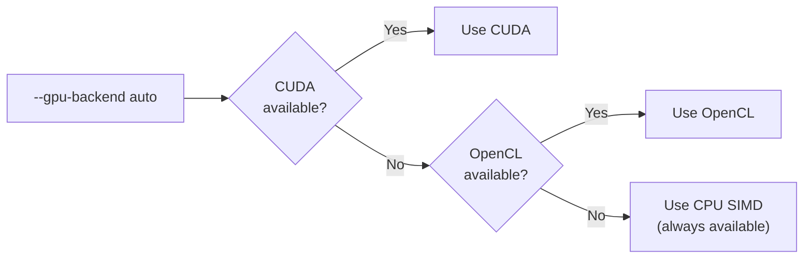

# Performance Optimization

lippycat ships with sensible defaults, but production deployments often benefit from tuning. This chapter walks through the performance levers available — starting with TCP performance profiles (the easiest win), progressing through GPU acceleration and pattern matching algorithms, and finishing with AF_XDP kernel-bypass capture for environments that need maximum throughput. Each section builds on the capture and distributed concepts covered in Parts II and III.

## TCP Performance Profiles

TCP performance profiles are pre-tuned parameter sets that configure 17-19 internal settings in one flag. They control TCP reassembly behavior, memory allocation, buffer strategies, and I/O threading. Unless you have specific requirements, choosing the right profile is the single most impactful optimization you can make.

### Choosing a Profile

Set the profile with `--tcp-performance-mode` on any capture command (`sniff`, `hunt`, `tap`):

```bash
sudo lc sniff voip -i eth0 --tcp-performance-mode balanced
```

The four profiles target different operating points:

| | Minimal | Balanced | High Performance | Low Latency |
|---|---|---|---|---|
| **Memory limit** | 25 MB | 100 MB | 500 MB | 200 MB |
| **Max buffers** | 500 | 5,000 | 20,000 | 2,000 |
| **Batch size** | 8 | 32 | 64 | 1 |
| **I/O threads** | 1 | NumCPU | NumCPU x 2 | NumCPU |
| **Buffer strategy** | Fixed | Adaptive | Ring | Fixed |
| **Backpressure** | Yes | Yes | No | No |
| **Auto-tuning** | No | Yes | Yes | No |

**Minimal** — For embedded devices (Raspberry Pi), test environments, or deployments with fewer than 10 concurrent calls. Uses fixed-size buffers and a single I/O thread to stay under 25 MB RAM. Backpressure is enabled to prevent memory exhaustion.

**Balanced** (default) — The right choice for most production deployments handling 10-100 concurrent calls with 2-8 GB of available RAM. Adaptive buffer sizing and auto-tuning let it adjust to traffic patterns at runtime.

**High Performance** — Data center deployments handling 100-1,000+ concurrent calls. Ring buffers, doubled I/O threads, and disabled backpressure maximize throughput at the cost of higher memory usage (up to 500 MB). Larger batch sizes increase per-packet latency slightly.

**Low Latency** — Real-time analysis, fraud detection, or call quality monitoring where sub-second processing matters. Batch size of 1 means every packet is processed immediately. Auto-tuning is disabled to keep behavior predictable.

### Overriding Individual Parameters

Profiles set a baseline. You can override any individual parameter on top:

```bash
# Balanced profile with more buffers for a bursty network
sudo lc sniff voip -i eth0 \
  --tcp-performance-mode balanced \
  --max-tcp-buffers 10000

# High performance with backpressure re-enabled for safety
sudo lc sniff voip -i eth0 \
  --tcp-performance-mode high_performance \
  --enable-backpressure

# Minimal profile with a longer stream timeout for slow SIP dialogs
sudo lc sniff voip -i eth0 \
  --tcp-performance-mode minimal \
  --tcp-stream-timeout 300s
```

The same parameters work in YAML configuration files:

```yaml
voip:
  tcp_performance_mode: "balanced"
  max_tcp_buffers: 10000
```

### Selecting a Profile for Distributed Nodes

In a distributed deployment ([Chapter 6](../part3-distributed/architecture.md)), hunters and processors have different tuning needs:

- **Hunters** do TCP reassembly at the edge. If the hunter is on a constrained host, use `minimal` or `balanced`. If the hunter sits on a high-bandwidth trunk, use `high_performance`.
- **Processors** receive already-reassembled packets over gRPC, so the TCP profile primarily affects any local capture the processor may do (relevant in tap mode, [Chapter 9](../part3-distributed/tap.md)).
- **Tap nodes** combine both roles. Match the profile to the local traffic volume.

## GPU Acceleration

GPU acceleration speeds up pattern matching and SIP header parsing by processing packets in batches. lippycat supports multiple backends with automatic fallback.

### Backend Selection

lippycat probes available backends in priority order and selects the best one:



Select a backend explicitly or let auto-detection choose:

```bash
# Auto-detect (recommended)
sudo lc sniff voip -i eth0 --gpu-backend auto

# Force a specific backend
sudo lc sniff voip -i eth0 --gpu-backend cuda
sudo lc sniff voip -i eth0 --gpu-backend opencl
sudo lc sniff voip -i eth0 --gpu-backend cpu-simd

# Disable acceleration entirely
sudo lc sniff voip -i eth0 --gpu-backend disabled
```

### Backend Requirements

| Backend | Hardware | Software | Status |
|---------|----------|----------|--------|
| **CUDA** | NVIDIA GPU, Compute 6.0+ (Pascal or newer) | CUDA Toolkit 11.0+, nvidia-driver 470+ | Build with `-tags cuda` |
| **OpenCL** | OpenCL 1.2+ GPU (NVIDIA, AMD, Intel) | OpenCL runtime, `ocl-icd-opencl-dev` | Build with OpenCL support |
| **CPU SIMD** | Any x86_64 CPU | None (built-in) | Always available |

The CPU SIMD backend uses AVX2 instructions when available, falling back to SSE4.2. It requires no special hardware or drivers and performs well on modern CPUs.

### Benchmark Results

Benchmarks measured on Intel i9-13900HX with 64 packets per batch:

| Operation | Throughput | Per-Packet Latency |
|-----------|-----------|-------------------|
| Pattern matching (GPU batch) | 29.7 Kpkts/s | 525 ns |
| Pattern matching (CPU SIMD) | 29.9 Kpkts/s | 530 ns |
| Call-ID extraction (GPU batch) | 19.4 Kpkts/s | 805 ns |
| Call-ID extraction (CPU SIMD) | 18.9 Kpkts/s | 830 ns |

CPU SIMD performance is comparable to GPU batching at moderate packet rates. The GPU backends show their advantage at very high packet rates (1M+ pps) where CPU cores become saturated with other work.

### Batch Size Tuning

Batch size controls the trade-off between throughput and latency:

```bash
# Low latency (real-time monitoring)
--gpu-batch-size 256

# Balanced (general production use)
--gpu-batch-size 1024

# Maximum throughput (high-volume capture)
--gpu-batch-size 4096
```

Larger batches amortize per-batch overhead but add latency (packets wait until the batch fills or a timeout fires). For VoIP monitoring where real-time visibility matters, stay at 256-1024. For bulk PCAP analysis or high-throughput edge capture, use 2048-4096.

### YAML Configuration

```yaml
gpu:
  enabled: true
  backend: "auto"
  device_id: 0
  max_batch_size: 1024
  pinned_memory: true
  stream_count: 4
```

## Pattern Matching Algorithms

When filtering traffic against large sets of SIP usernames, phone numbers, or other identifiers, the choice of pattern matching algorithm has a dramatic impact on performance.

### Algorithm Options

Set the algorithm with `--pattern-algorithm`:

| Algorithm | Time Complexity | Best For |
|-----------|----------------|----------|
| `auto` (default) | Adaptive | General use — selects the optimal algorithm at runtime |
| `linear` | O(n x m) | Small pattern sets (fewer than 100 patterns) |
| `aho-corasick` | O(n + m + z) | Large pattern sets (100+ patterns) |

Where *n* is input length, *m* is total pattern length, and *z* is the number of matches.

In `auto` mode, lippycat switches to Aho-Corasick when the pattern count reaches 100. Below that threshold, linear scan avoids the overhead of building the automaton.

### Performance at Scale

The difference becomes dramatic as pattern counts grow:

| Pattern Count | Linear Scan | Aho-Corasick | Speedup |
|---------------|-------------|--------------|---------|
| 10 | 1.2 us | 0.8 us | 1.5x |
| 100 | 12 us | 0.9 us | 13x |
| 1,000 | 120 us | 1.0 us | 120x |
| 10,000 | 1.2 ms | 1.1 us | ~1,100x |
| 100,000 | 12 ms | 1.3 us | ~9,200x |

Aho-Corasick match time remains nearly constant regardless of pattern count because all patterns are compiled into a finite automaton that processes each input byte exactly once.

### Configuration

```bash
# Auto-select (recommended for most deployments)
sudo lc sniff voip -i eth0 --pattern-algorithm auto

# Force Aho-Corasick for large filter lists
sudo lc hunt voip --processor central:55555 \
  --pattern-algorithm aho-corasick \
  --pattern-buffer-mb 128

# Linear scan for a handful of patterns
sudo lc sniff voip -i eth0 --pattern-algorithm linear
```

In YAML:

```yaml
voip:
  pattern_algorithm: "auto"
  pattern_buffer_mb: 64
```

Memory usage for Aho-Corasick is modest: 100,000 patterns averaging 20 characters each consume under 100 MB for the full automaton. For lawful interception workloads with tens of thousands of targets ([Chapter 17](lawful-interception.md)), Aho-Corasick is the only viable choice.

## BPF Filters

BPF (Berkeley Packet Filter) filters run in kernel space, discarding unwanted packets before they reach lippycat. This is the most efficient form of filtering because rejected packets never cross the kernel-userspace boundary.

```bash
# Capture only SIP traffic
sudo lc sniff voip -i eth0 -f "port 5060"

# SIP + RTP port range
sudo lc hunt voip --processor central:55555 \
  -i eth0 -f "port 5060 or portrange 10000-20000"

# Specific host
sudo lc sniff voip -i eth0 -f "host 192.168.1.100 and port 5060"
```

In VoIP deployments, the `--udp-only` flag is a shorthand for a BPF filter that excludes TCP entirely. On networks with heavy TCP traffic (web, database), this can reduce CPU load significantly:

```bash
sudo lc hunt voip --processor central:55555 \
  -i eth0 --udp-only --sip-port 5060
```

See [Appendix C: BPF Filter Reference](../appendices/bpf-reference.md) for the full filter syntax.

## Distributed Scaling

Distributed deployments ([Chapter 6](../part3-distributed/architecture.md)) introduce additional tuning dimensions: batch parameters control gRPC efficiency, VoIP filtering at the edge reduces bandwidth, and hierarchical topologies spread load across tiers.

### Hunter Batch Parameters

Hunters batch packets before sending them to the processor over gRPC. Tune `--batch-size` and `--batch-timeout` based on the latency-throughput trade-off you need:

```bash
# Low latency (real-time monitoring, few calls)
sudo lc hunt voip --processor central:55555 \
  --batch-size 16 --batch-timeout 50

# Balanced (production default)
sudo lc hunt voip --processor central:55555 \
  --batch-size 64 --batch-timeout 100

# High throughput (bulk capture, high call volume)
sudo lc hunt voip --processor central:55555 \
  --batch-size 256 --batch-timeout 500
```

Larger batches reduce gRPC overhead per packet but increase the maximum time a packet waits before transmission (the batch timeout, in milliseconds).

### Edge Filtering

One of the biggest performance wins in distributed mode is filtering at the edge. When hunters use VoIP-specific subcommands and GPU-accelerated filtering, they can reduce the volume of traffic forwarded to the processor by over 90%:

```bash
# Hunter with edge filtering and GPU acceleration
sudo lc hunt voip --processor central:55555 \
  --sip-user alicent \
  --gpu-backend auto \
  --udp-only --sip-port 5060
```

This hunter captures only VoIP traffic matching the `alicent` SIP user, discarding everything else before it reaches the network. The processor receives a fraction of the raw traffic.

### Processor Capacity

Processors track their internal load (PCAP write queue depth, upstream backlog) and signal flow control to hunters when overloaded:

| Queue Utilization | Flow Control Signal | Hunter Behavior |
|---|---|---|
| < 30% | CONTINUE | Normal sending |
| 30-70% | SLOW | Reduce batch rate |
| 70-90% | PAUSE | Stop sending |
| < 30% (after PAUSE) | RESUME | Resume sending |

If you see SLOW or PAUSE signals in processor logs ([Chapter 12](../part4-administration/operations.md)), the processor is becoming a bottleneck. Options:

1. Add more processors and split hunters across them.
2. Enable edge filtering to reduce inbound volume.
3. Use hierarchical mode: regional processors aggregate from local hunters, then forward to a central processor.

### Hierarchical Topologies

For large-scale deployments (50+ hunters), a two-tier hierarchy avoids overloading a single processor:

```
50 hunters --> 5 regional processors --> 1 central processor
```

Each regional processor handles 10 hunters and applies protocol analysis before forwarding summaries upstream. This reduces the central processor's load by an order of magnitude. See [Chapter 6](../part3-distributed/architecture.md) for topology configuration.

## AF_XDP High-Speed Capture

AF_XDP (Address Family eXpress Data Path) provides kernel-bypass packet capture with optional zero-copy mode. It is the most advanced capture method lippycat supports, designed for environments where standard `libpcap` capture cannot keep up.

### When to Use AF_XDP

Standard libpcap capture handles approximately 1M packets per second. AF_XDP raises that to 5-10M pps out of the box, and up to 10-20M pps with tuning. The latency improvement is equally significant:

| Capture Mode | Packet Rate | Latency |
|---|---|---|
| Standard (libpcap) | ~1M pps | 1-10 us |
| AF_XDP | 5-10M pps | 100-500 ns |
| AF_XDP zero-copy | 10-20M pps | 50-100 ns |

If you are capturing on 10GbE or faster interfaces, or if you see packet drops with standard capture under load, AF_XDP is worth the setup cost.

### Requirements

AF_XDP has stricter requirements than standard capture:

**Kernel:**
- Minimum: Linux 4.18
- Recommended: Linux 5.4+ (full feature support)
- Optimal: Linux 5.10+ (best performance, zero-copy improvements)

**NIC driver with XDP support:**

| Vendor | Driver | Speed |
|--------|--------|-------|
| Intel | ixgbe | 10 GbE |
| Intel | i40e | 40 GbE |
| Intel | ice | 100 GbE |
| Mellanox | mlx5 | 10-100 GbE |
| Broadcom | bnxt | 10-25 GbE |

Check your driver:

```bash
ethtool -i eth0 | grep driver
```

**Kernel configuration** (these must be compiled in, not as modules):

```
CONFIG_XDP_SOCKETS=y
CONFIG_BPF=y
CONFIG_BPF_SYSCALL=y
CONFIG_BPF_JIT=y
```

Verify:

```bash
grep XDP_SOCKETS /boot/config-$(uname -r)
```

**Libraries:**

```bash
# Debian/Ubuntu
sudo apt-get install libelf-dev libbpf-dev

# RHEL/CentOS
sudo yum install elfutils-libelf-devel libbpf-devel
```

**Capabilities:**

```bash
# Option 1: Run as root
sudo lc sniff voip -i eth0

# Option 2: Grant capabilities to the binary
sudo setcap cap_net_admin,cap_net_raw=eip /usr/local/bin/lc
```

### Configuration

Enable AF_XDP in YAML:

```yaml
capture:
  interface: eth0
  use_xdp: true
  xdp_queue_id: 0

xdp:
  umem_size: 8388608      # 8 MB
  num_frames: 8192
  frame_size: 2048
  rx_ring_size: 4096
  tx_ring_size: 4096
  fill_ring_size: 4096
  comp_ring_size: 4096
  batch_size: 128
  enable_stats: true
```

Ring sizes must be powers of 2. Start with 4096 and adjust based on observed drop rates.

### NIC Tuning

Disable hardware offloads that interfere with XDP:

```bash
sudo ethtool -K eth0 gro off lro off tso off gso off
```

Increase NIC ring buffers:

```bash
sudo ethtool -G eth0 rx 4096 tx 4096
```

Enable multi-queue for parallel processing:

```bash
# Check available queues
ethtool -l eth0

# Set to maximum
sudo ethtool -L eth0 combined 4
```

### CPU and Memory Tuning

For maximum AF_XDP performance, pin the capture process to the same NUMA node as the NIC and configure the CPU governor:

```bash
# Find the NIC's NUMA node
cat /sys/class/net/eth0/device/numa_node

# Pin lippycat to that NUMA node
numactl --cpunodebind=0 --membind=0 sudo lc sniff voip -i eth0

# Set CPU governor to performance
sudo cpupower frequency-set -g performance
```

Pin NIC interrupts to dedicated CPU cores:

```bash
# Find IRQ numbers
grep eth0 /proc/interrupts

# Pin to CPU core 0
echo 1 > /proc/irq/<irq_number>/smp_affinity
```

Enable huge pages for UMEM allocations:

```bash
# Allocate 512 x 2 MB huge pages (1 GB total)
echo 512 > /sys/kernel/mm/hugepages/hugepages-2048kB/nr_hugepages

# Increase locked memory limits
# Add to /etc/security/limits.conf:
# * soft memlock unlimited
# * hard memlock unlimited
```

### Verifying AF_XDP is Active

```bash
# Check verbose output for capture mode
sudo lc sniff voip -i eth0 --verbose 2>&1 | grep -i xdp
# Expected: "Capture statistics: mode=AF_XDP ..."

# List loaded XDP programs
sudo bpftool prog show type xdp

# Monitor XDP statistics from the NIC
ethtool -S eth0 | grep xdp
```

If AF_XDP is unavailable (wrong kernel, unsupported driver), lippycat falls back to standard libpcap capture automatically and logs a warning.

## Environment-Specific Tuning

Different deployment environments call for different combinations of the techniques above. Here are tested configurations for common scenarios.

### Embedded Systems (Raspberry Pi, ARM SBCs)

```bash
sudo lc sniff voip -i eth0 \
  --tcp-performance-mode minimal \
  --gpu-backend disabled \
  --buffer-size 5000 \
  --memory-optimization
```

Expect 10-50 concurrent calls. The `minimal` profile keeps memory under 25 MB. Disable GPU acceleration (no benefit on ARM without SIMD extensions). Enable `--memory-optimization` to aggressively reclaim buffers.

### Virtual Machines

```bash
sudo lc sniff voip -i eth0 \
  --tcp-performance-mode balanced \
  --gpu-backend cpu-simd \
  --buffer-size 10000
```

CPU SIMD works well in VMs — avoid GPU passthrough unless the VM already has it configured. AF_XDP generally does not work in VMs because the virtual NIC driver lacks XDP support. Adjust buffer sizes based on the RAM allocated to the VM.

### Bare Metal Servers

```bash
sudo lc sniff voip -i eth0 \
  --tcp-performance-mode high_performance \
  --gpu-backend auto \
  --buffer-size 50000 \
  --max-tcp-buffers 20000
```

On dedicated hardware with 8+ GB RAM and a modern CPU, use the `high_performance` profile and let GPU auto-detection choose the best backend. If you have an NVIDIA GPU and have built with `-tags cuda`, CUDA will be selected automatically. For 10GbE+ interfaces, add AF_XDP as described above.

### Kubernetes / Containers

```yaml
# Pod resource limits
resources:
  limits:
    memory: "4Gi"
    cpu: "4"
  requests:
    memory: "2Gi"
    cpu: "2"
```

```bash
lc sniff voip -i eth0 \
  --tcp-performance-mode balanced \
  --gpu-backend cpu-simd \
  --max-tcp-buffers 5000
```

Match the TCP profile to the container's memory limit — the `balanced` profile's 100 MB fits comfortably within a 2 GB container. GPU passthrough to containers is possible but complex; CPU SIMD is the practical choice. AF_XDP requires host networking and `CAP_NET_ADMIN`, which may conflict with container security policies.

### Distributed Hunter on Constrained Edge

For hunters deployed on small edge devices that forward to a central processor:

```bash
sudo lc hunt voip --processor central:55555 \
  --tcp-performance-mode minimal \
  --gpu-backend cpu-simd \
  --batch-size 32 --batch-timeout 200 \
  --udp-only --sip-port 5060 \
  --tls-ca ca.crt
```

The `minimal` profile keeps memory low. BPF filtering (`--udp-only`) reduces capture load. Small batch sizes keep memory usage predictable. CPU SIMD still provides pattern matching acceleration without GPU hardware.

## Memory Profiling

When tuning, it helps to observe actual memory usage. Enable pprof for Go's built-in memory profiler:

```bash
export LIPPYCAT_PPROF_ENABLED=true
sudo lc sniff voip -i eth0

# In another terminal, capture a heap profile
go tool pprof http://localhost:6060/debug/pprof/heap
```

For quick checks without pprof:

```bash
# Watch memory usage over time
watch -n 10 'ps -o rss,vsz,comm -p $(pgrep -f "lc (sniff|hunt|process|tap)")'
```

If memory grows continuously, check for:
- TCP stream timeout too high (stale buffers not released)
- Buffer count too high for available RAM
- Missing `--memory-optimization` flag on constrained systems

## Quick Reference

| Goal | What to Tune |
|---|---|
| Reduce memory usage | `--tcp-performance-mode minimal`, `--memory-optimization`, `--max-tcp-buffers` |
| Increase throughput | `--tcp-performance-mode high_performance`, `--gpu-backend auto`, AF_XDP |
| Reduce latency | `--tcp-performance-mode low_latency`, `--gpu-batch-size 256` |
| Scale across segments | Distribute hunters, filter at edge, hierarchical processors |
| Handle large filter lists | `--pattern-algorithm aho-corasick`, `--pattern-buffer-mb 128` |
| Capture at 10GbE+ | AF_XDP with NIC tuning, NUMA pinning, huge pages |
