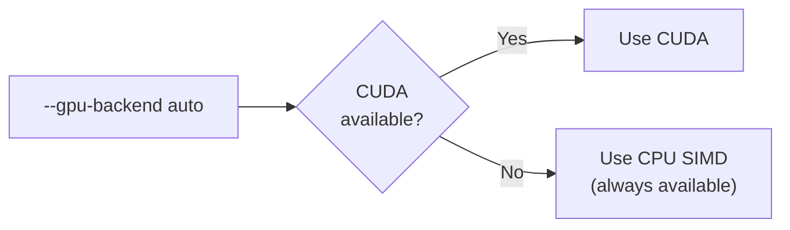

# Performance Optimization

lippycat ships with sensible defaults, but production deployments often benefit from tuning. This chapter walks through the performance levers available — starting with TCP performance profiles (the easiest win), progressing through GPU acceleration and pattern matching algorithms. Each section builds on the capture and distributed concepts covered in Parts II and III.

## TCP Performance Profiles

TCP performance profiles are pre-tuned parameter sets that configure 17-19 internal settings in one flag. They control TCP reassembly behavior, memory allocation, buffer strategies, and I/O threading. Unless you have specific requirements, choosing the right profile is the single most impactful optimization you can make.

### Choosing a Profile

Set the profile with `--tcp-performance-mode` on commands that perform local SIP-over-TCP reassembly. `sniff voip` uses `balanced`, `throughput`, `latency`, and `memory`; `tap voip` uses `minimal`, `balanced`, `high_performance`, and `low_latency`.

```bash
sudo lc sniff voip -i eth0 --tcp-performance-mode balanced
```

For `tap voip`, the four profiles target different operating points:

| | Minimal | Balanced | High Performance | Low Latency |
|---|---|---|---|---|
| **Memory limit** | 25 MB | 100 MB | 500 MB | 200 MB |
| **Max buffers** | 500 | 5,000 | 20,000 | 2,000 |
| **Batch size** | 8 | 32 | 64 | 1 |
| **I/O threads** | 1 | NumCPU | NumCPU x 2 | NumCPU |
| **Buffer strategy** | Fixed | Adaptive | Ring | Fixed |
| **Backpressure** | Yes | Yes | No | No |
| **Auto-tuning** | No | Yes | Yes | No |

**Minimal** — For embedded devices (Raspberry Pi), test environments, or deployments with fewer than 10 concurrent calls. Uses fixed-size buffers and a single I/O thread to stay under 25 MB RAM. Backpressure is enabled to prevent memory exhaustion.

**Balanced** (default) — The right choice for most production deployments handling 10-100 concurrent calls with 2-8 GB of available RAM. Adaptive buffer sizing and auto-tuning let it adjust to traffic patterns at runtime.

**High Performance** — Data center deployments handling 100-1,000+ concurrent calls. Ring buffers, doubled I/O threads, and disabled backpressure maximize throughput at the cost of higher memory usage (up to 500 MB). Larger batch sizes increase per-packet latency slightly.

**Low Latency** — Real-time analysis, fraud detection, or call quality monitoring where sub-second processing matters. Batch size of 1 means every packet is processed immediately. Auto-tuning is disabled to keep behavior predictable.

### Overriding Individual Parameters

Profiles set a baseline. You can override any individual parameter on top:

```bash
# Balanced profile with more buffers for a bursty network
sudo lc sniff voip -i eth0 \
  --tcp-performance-mode balanced \
  --max-tcp-buffers 10000

# High performance with backpressure re-enabled for safety
sudo lc sniff voip -i eth0 \
  --tcp-performance-mode throughput \
  --enable-backpressure

# Memory profile with a longer stream timeout for slow SIP dialogs
sudo lc sniff voip -i eth0 \
  --tcp-performance-mode memory \
  --tcp-stream-timeout 300s
```

The same parameters work in YAML configuration files:

```yaml
voip:
  tcp_performance_mode: "balanced"
  max_tcp_buffers: 10000
```

### Selecting a Profile for Distributed Nodes

In a distributed deployment ([Chapter 6](../part3-distributed/architecture.md)), hunters and processors have different tuning needs:

- **Hunters** use SIP TCP idle-timeout tuning and processor-managed filters, but do not expose `--tcp-performance-mode`.
- **Processors** receive already-reassembled packets over gRPC, so the TCP profile primarily affects any local capture the processor may do (relevant in tap mode, [Chapter 9](../part3-distributed/tap.md)).
- **Tap nodes** combine both roles. Match the profile to the local traffic volume.

## GPU Acceleration

GPU acceleration speeds up capture-side application-filter matching against values already extracted by the protocol parsers. It does not parse SIP or extract Call-IDs; those operations remain on the CPU.

### Backend Selection

lippycat probes available backends in priority order and selects the best one:


```mermaid
flowchart LR
    Auto["--gpu-backend auto"] --> CUDA{CUDA\navailable?}
    CUDA -->|Yes| UseCUDA[Use CUDA]
    CUDA -->|No| SIMD["Use CPU SIMD\n(always available)"]
```

Select a backend explicitly or let auto-detection choose:

```bash
# Auto-detect (recommended)
sudo lc sniff voip -i eth0 --gpu-backend auto

# Force a specific backend
sudo lc sniff voip -i eth0 --gpu-backend cuda
sudo lc sniff voip -i eth0 --gpu-backend cpu-simd

# Disable acceleration entirely
sudo lc sniff voip -i eth0 --gpu-backend disabled
```

For `sniff voip`, `hunt`, and `tap`, these GPU flags are registered only in CUDA builds. `watch live` exposes its own GPU flags in standard builds.

### Backend Requirements

| Backend | Hardware | Software | Status |
|---------|----------|----------|--------|
| **CUDA** | NVIDIA GPU, Compute 6.0+ (Pascal or newer) | CUDA Toolkit 11.0+, nvidia-driver 470+ | Build with `-tags cuda` |
| **CPU SIMD** | Any x86_64 CPU | None (built-in) | Always available |

The CPU SIMD backend uses AVX2 instructions when available, falling back to SSE4.2. It requires no special hardware or drivers and performs well on modern CPUs.

The `opencl` value remains accepted for configuration compatibility, but the OpenCL backend is not implemented. Auto-detection skips it, and an explicit selection falls back to CPU matching after initialization fails.

### Benchmark Results

Benchmarks measured on Intel i9-13900HX with 64 packets per batch:

| Operation | Throughput | Per-Packet Latency |
|-----------|-----------|-------------------|
| Pattern matching (GPU batch) | 29.7 Kpkts/s | 525 ns |
| Pattern matching (CPU SIMD) | 29.9 Kpkts/s | 530 ns |
CPU SIMD performance is comparable to GPU batching at moderate packet rates. Treat these pattern-matching microbenchmarks as comparative figures rather than end-to-end SIP parsing throughput.

### Batch Size Tuning

Batch size controls the trade-off between throughput and latency:

```bash
# Low latency (real-time monitoring)
--gpu-batch-size 256

# Balanced (general production use)
--gpu-batch-size 1024

# Maximum throughput (high-volume capture)
--gpu-batch-size 4096
```

Larger batches amortize per-batch overhead but add latency (packets wait until the batch fills or a timeout fires). For VoIP monitoring where real-time visibility matters, stay at 256-1024. For bulk PCAP analysis or high-throughput edge capture, use 2048-4096.

### YAML Configuration

```yaml
gpu:
  enabled: true
  backend: "auto"
  device_id: 0
  max_batch_size: 1024
  pinned_memory: true
  stream_count: 4
```

## Pattern Matching Algorithms

When filtering traffic against large sets of SIP usernames, phone numbers, or other identifiers, the choice of pattern matching algorithm has a dramatic impact on performance.

### Algorithm Options

Set the algorithm with `--pattern-algorithm`:

| Algorithm | Time Complexity | Best For |
|-----------|----------------|----------|
| `auto` (default) | Adaptive | General use — selects the optimal algorithm at runtime |
| `linear` | O(n x m) | Small pattern sets (fewer than 100 patterns) |
| `aho-corasick` | O(n + m + z) | Large pattern sets (100+ patterns) |

Where *n* is input length, *m* is total pattern length, and *z* is the number of matches.

In `auto` mode, lippycat switches to Aho-Corasick when the pattern count reaches 100. Below that threshold, linear scan avoids the overhead of building the automaton.

### Performance at Scale

The difference becomes dramatic as pattern counts grow:

| Pattern Count | Linear Scan | Aho-Corasick | Speedup |
|---------------|-------------|--------------|---------|
| 10 | 1.2 us | 0.8 us | 1.5x |
| 100 | 12 us | 0.9 us | 13x |
| 1,000 | 120 us | 1.0 us | 120x |
| 10,000 | 1.2 ms | 1.1 us | ~1,100x |
| 100,000 | 12 ms | 1.3 us | ~9,200x |

Aho-Corasick match time remains nearly constant regardless of pattern count because all patterns are compiled into a finite automaton that processes each input byte exactly once.

### Configuration

```bash
# Auto-select (recommended for most deployments)
sudo lc sniff voip -i eth0 --pattern-algorithm auto

# Force Aho-Corasick for large filter lists
sudo lc hunt voip --processor central:55555 \
  --pattern-algorithm aho-corasick \
  --pattern-buffer-mb 128

# Linear scan for a handful of patterns
sudo lc sniff voip -i eth0 --pattern-algorithm linear
```

In YAML:

```yaml
voip:
  pattern_algorithm: "auto"
  pattern_buffer_mb: 64
```

Memory usage for Aho-Corasick is modest: 100,000 patterns averaging 20 characters each consume under 100 MB for the full automaton. For lawful interception workloads with tens of thousands of targets ([Chapter 17](lawful-interception.md)), Aho-Corasick is the only viable choice.

## BPF Filters

BPF (Berkeley Packet Filter) filters run in kernel space, discarding unwanted packets before they reach lippycat. This is the most efficient form of filtering because rejected packets never cross the kernel-userspace boundary.

```bash
# Capture only SIP traffic
sudo lc sniff voip -i eth0 -f "port 5060"

# SIP + RTP port range
sudo lc hunt voip --processor central:55555 \
  -i eth0 -f "port 5060 or portrange 10000-20000"

# Specific host
sudo lc sniff voip -i eth0 -f "host 192.168.1.100 and port 5060"
```

In VoIP deployments, explicit SIP and RTP port constraints are the safest way to reduce userspace load without dropping SIP-over-TCP:

```bash
sudo lc hunt voip --processor central:55555 \
  -i eth0 --sip-port 5060 --rtp-port-range 10000-20000
```

See [Appendix C: BPF Filter Reference](../appendices/bpf-reference.md) for the full filter syntax.

## Distributed Scaling

Distributed deployments ([Chapter 6](../part3-distributed/architecture.md)) introduce additional tuning dimensions: batch parameters control gRPC efficiency, VoIP filtering at the edge reduces bandwidth, and hierarchical topologies spread load across tiers.

### Hunter Batch Parameters

Hunters batch packets before sending them to the processor over gRPC. Tune `--batch-size` and `--batch-timeout` based on the latency-throughput trade-off you need:

```bash
# Low latency (real-time monitoring, few calls)
sudo lc hunt voip --processor central:55555 \
  --batch-size 16 --batch-timeout 50

# Balanced (production default)
sudo lc hunt voip --processor central:55555 \
  --batch-size 64 --batch-timeout 100

# High throughput (bulk capture, high call volume)
sudo lc hunt voip --processor central:55555 \
  --batch-size 256 --batch-timeout 500
```

Larger batches reduce gRPC overhead per packet but increase the maximum time a packet waits before transmission (the batch timeout, in milliseconds).

### Edge Filtering

One of the biggest performance wins in distributed mode is filtering at the edge. When hunters use VoIP-specific subcommands and GPU-accelerated filtering, they can reduce the volume of traffic forwarded to the processor by over 90%:

```bash
# Hunter with edge filtering and GPU acceleration
lc set filter -P central:55555 --tls-ca ca.crt \
  --type sip_user --pattern alicent

sudo lc hunt voip --processor central:55555 \
  --sip-port 5060 \
  --rtp-port-range 10000-20000
```

The processor pushes the `alicent` SIP-user filter to the hunter. The hunter buffers calls at the edge and forwards only matching calls, so the processor receives a fraction of the raw traffic.

### Processor Capacity

Processors track their internal load (PCAP write queue depth, upstream backlog) and signal flow control to hunters when overloaded:

| Queue Utilization | Flow Control Signal | Hunter Behavior |
|---|---|---|
| < 30% | CONTINUE | Normal sending |
| 30-70% | SLOW | Reduce batch rate |
| 70-90% | PAUSE | Stop sending |
| < 30% (after PAUSE) | RESUME | Resume sending |

If you see SLOW or PAUSE signals in processor logs ([Chapter 12](../part4-administration/operations.md)), the processor is becoming a bottleneck. Options:

1. Add more processors and split hunters across them.
2. Enable edge filtering to reduce inbound volume.
3. Use hierarchical mode: regional processors aggregate from local hunters, then forward to a central processor.

### Hierarchical Topologies

For large-scale deployments (50+ hunters), a two-tier hierarchy avoids overloading a single processor:

```
50 hunters --> 5 regional processors --> 1 central processor
```

Each regional processor handles 10 hunters and applies protocol analysis before forwarding summaries upstream. This reduces the central processor's load by an order of magnitude. See [Chapter 6](../part3-distributed/architecture.md) for topology configuration.

## Environment-Specific Tuning

Different deployment environments call for different combinations of the techniques above. Here are tested configurations for common scenarios.

### Embedded Systems (Raspberry Pi, ARM SBCs)

```bash
sudo lc sniff voip -i eth0 \
  --tcp-performance-mode memory \
  --memory-optimization
```

Expect 10-50 concurrent calls. The `memory` profile keeps TCP buffers conservative. Enable `--memory-optimization` to aggressively reclaim buffers.

### Virtual Machines

```bash
sudo lc sniff voip -i eth0 \
  --tcp-performance-mode balanced \
  --max-tcp-buffers 5000
```

Adjust TCP buffer limits based on the RAM allocated to the VM.

### Bare Metal Servers

```bash
sudo lc sniff voip -i eth0 \
  --tcp-performance-mode throughput \
  --max-tcp-buffers 20000
```

On dedicated hardware with 8+ GB RAM and a modern CPU, use the `throughput` profile. If you have an NVIDIA GPU and have built with `-tags cuda`, add `--gpu-backend auto` to let CUDA or SIMD selection pick the best backend. For 10GbE+ interfaces, distribute capture across additional hunters.

### Kubernetes / Containers

```yaml
# Pod resource limits
resources:
  limits:
    memory: "4Gi"
    cpu: "4"
  requests:
    memory: "2Gi"
    cpu: "2"
```

```bash
lc sniff voip -i eth0 \
  --tcp-performance-mode balanced \
  --max-tcp-buffers 5000
```

Match the TCP profile to the container's memory limit — the `balanced` profile's 100 MB fits comfortably within a 2 GB container. GPU passthrough to containers is possible but complex.

### Distributed Hunter on Constrained Edge

For hunters deployed on small edge devices that forward to a central processor:

```bash
sudo lc hunt voip --processor central:55555 \
  --batch-size 32 --batch-timeout 200 \
  --sip-port 5060 --rtp-port-range 10000-20000 \
  --tls-ca ca.crt
```

SIP/RTP port constraints reduce capture load without dropping TCP SIP. Small batch sizes keep memory usage predictable. If you are using a CUDA build, add `--enable-voip-filter --gpu-backend cpu-simd` for accelerated edge matching without GPU hardware.

## Memory Profiling

When tuning, it helps to observe actual memory usage. Enable pprof for Go's built-in memory profiler:

```bash
sudo lc tap voip -i eth0 --debug-listen 127.0.0.1:6060

# In another terminal, capture a heap profile
go tool pprof http://localhost:6060/debug/pprof/heap
```

The `--debug-listen` flag is available on `tap`, `process`, and `hunt`, and
accepts loopback addresses by default. To expose pprof on a non-loopback
address, add `--debug-allow-non-loopback`. Existing deployments can keep using
`LC_PPROF_ADDR=127.0.0.1:6060` when the flag is omitted.

For quick checks without pprof:

```bash
# Watch memory usage over time
watch -n 10 'ps -o rss,vsz,comm -p $(pgrep -f "lc (sniff|hunt|process|tap)")'
```

If memory grows continuously, check for:
- TCP stream timeout too high (stale buffers not released)
- Buffer count too high for available RAM
- Missing `--memory-optimization` flag on constrained systems

## Quick Reference

| Goal | What to Tune |
|---|---|
| Reduce memory usage | `--tcp-performance-mode minimal`, `--memory-optimization`, `--max-tcp-buffers` |
| Increase throughput | `--tcp-performance-mode throughput` for `sniff voip`, `--tcp-performance-mode high_performance` for `tap voip` |
| Reduce latency | `--tcp-performance-mode latency` for `sniff voip`, `--tcp-performance-mode low_latency` for `tap voip` |
| Scale across segments | Distribute hunters, filter at edge, hierarchical processors |
| Handle large filter lists | `--pattern-algorithm aho-corasick`, `--pattern-buffer-mb 128` |
| Capture at 10GbE+ | scale out with additional hunters |
