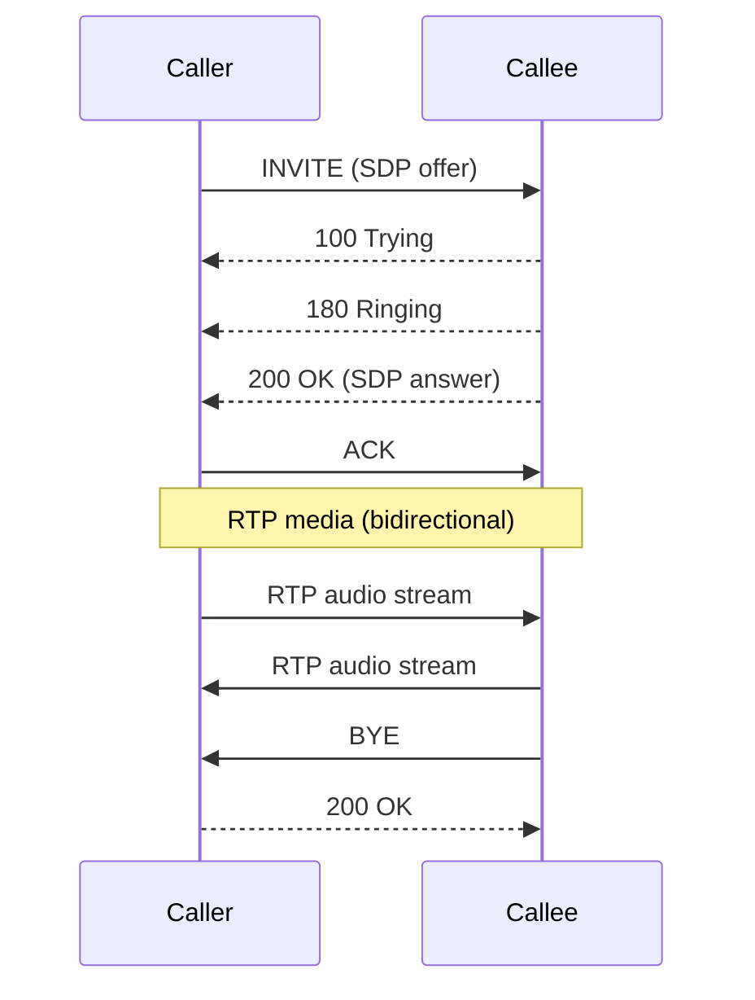
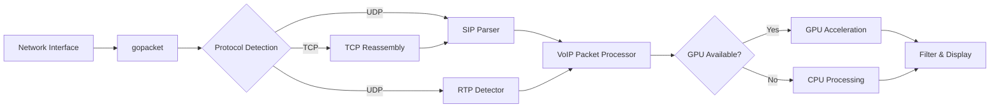
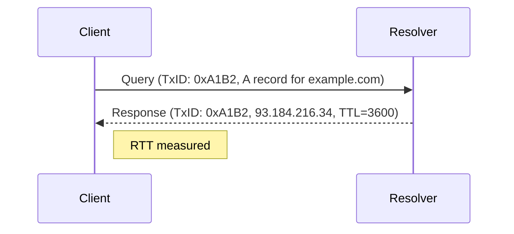
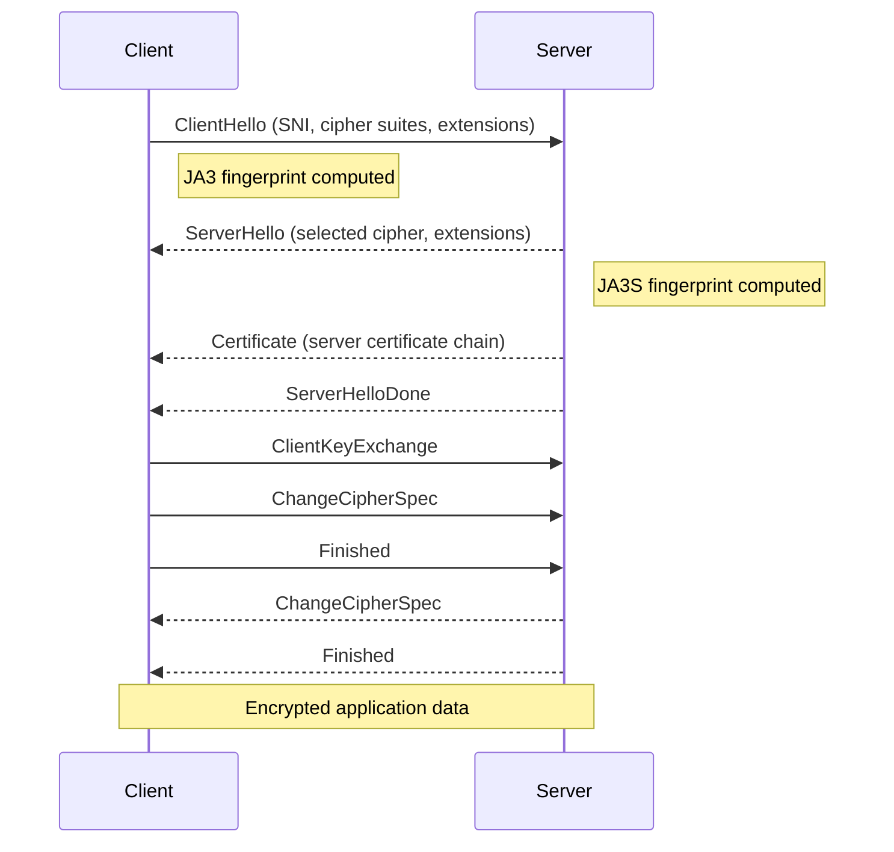
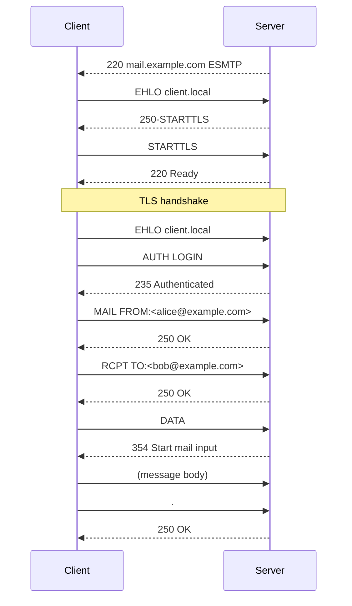

# Protocol Deep Dives

lippycat includes dedicated protocol analyzers that go beyond simple packet capture. Each protocol subcommand (`lc sniff dns`, `lc sniff tls`, `lc sniff http`, `lc sniff email`, `lc sniff voip`) activates a specialized parser that extracts structured metadata, correlates related packets, and enables protocol-aware filtering. This chapter explores how each analyzer works and how to use it effectively.

All protocol analyzers output JSON by default. The examples in this chapter use `jq` to extract fields from the JSON output. For an introduction to protocol subcommands and their flags, see [CLI Capture with `lc sniff`](../part2-local-capture/sniff.md).

## VoIP: SIP and RTP Analysis

VoIP analysis is lippycat's most mature protocol mode. It tracks SIP signaling dialogs, correlates RTP media streams with their controlling SIP sessions, and supports per-call PCAP extraction for offline analysis.

### SIP Signaling Flow

SIP (Session Initiation Protocol) uses a request/response model to establish, modify, and tear down voice and video calls. lippycat tracks the full dialog lifecycle. A typical successful call follows this sequence:



lippycat parses each SIP message and extracts:

| Field | Description | JSON Path |
|-------|-------------|-----------|
| Call-ID | Unique dialog identifier | `.VoIPData.CallID` |
| Method | SIP request method | `.VoIPData.Method` |
| Status | Response code (e.g., 200) | `.VoIPData.Status` |
| From / To | SIP URI endpoints | `.VoIPData.From`, `.VoIPData.To` |
| From-Tag / To-Tag | Dialog correlation tags | `.VoIPData.FromTag`, `.VoIPData.ToTag` |
| User | Username extracted from URI | `.VoIPData.User` |
| Content-Type | Body type (e.g., `application/sdp`) | `.VoIPData.ContentType` |

**SIP methods lippycat recognizes:** INVITE, ACK, BYE, CANCEL, REGISTER, OPTIONS, PRACK, UPDATE, INFO, REFER, SUBSCRIBE, NOTIFY, MESSAGE, PUBLISH.

### Capturing SIP Traffic

Basic VoIP capture shows all SIP and RTP traffic on an interface:

```bash
sudo lc sniff voip -i eth0
```

Filter by SIP user to focus on specific endpoints:

```bash
# Single user
sudo lc sniff voip -i eth0 -u alicent

# Multiple users
sudo lc sniff voip -i eth0 -u "alicent,robb"

# Wildcard suffix match (all numbers ending in 456789)
sudo lc sniff voip -i eth0 -u "*456789"
```

Extract call setup information with `jq`:

```bash
# Show all INVITE requests with caller and callee
sudo lc sniff voip -i eth0 2>/dev/null | \
  jq -r 'select(.VoIPData.Method == "INVITE") |
    [.Timestamp, .VoIPData.From, .VoIPData.To, .VoIPData.CallID] |
    @tsv'

# Track call state transitions for a specific Call-ID
sudo lc sniff voip -i eth0 2>/dev/null | \
  jq -r 'select(.VoIPData.CallID == "abc123@pbx.local") |
    [.Timestamp, .VoIPData.Method // ("Response " + (.VoIPData.Status|tostring))] |
    @tsv'
```

### SIP Transport: UDP vs TCP

SIP runs over both UDP and TCP. UDP is more common for signaling, but TCP is used for large messages (e.g., SIP with SDP that exceeds the MTU) and is required for TLS-encrypted SIP (SIPS).

By default, lippycat captures both UDP and TCP SIP traffic. TCP SIP requires stream reassembly, which adds CPU overhead. On networks with heavy TCP traffic that is not SIP, you can skip TCP processing entirely:

```bash
# UDP-only mode -- generates optimized BPF filter excluding TCP
sudo lc sniff voip -i eth0 -U -S 5060
```

When TCP SIP is needed, choose a performance profile to tune reassembly parameters (see [CLI Capture with `lc sniff`](../part2-local-capture/sniff.md#tcp-performance-modes)):

```bash
sudo lc sniff voip -i eth0 -M throughput
```

### RTP and SRTP Media Streams

Once a SIP dialog is established, media flows as RTP (Real-time Transport Protocol) packets. lippycat detects RTP streams by identifying packets within configured port ranges (default: 10000-32768) that match the RTP header structure.

Each RTP packet carries metadata that lippycat extracts:

| Field | Description | JSON Path |
|-------|-------------|-----------|
| SSRC | Synchronization Source identifier | `.VoIPData.SSRC` |
| Sequence Number | Packet ordering | `.VoIPData.SequenceNum` |
| Timestamp | Media timing | `.VoIPData.Timestamp` |
| Payload Type | Codec identifier | `.VoIPData.PayloadType` |
| Codec | Codec name (from SDP) | `.VoIPData.Codec` |

lippycat correlates RTP streams with their controlling SIP dialog using the Call-ID. When RTP packets arrive before the corresponding SIP INVITE (which happens when capture starts mid-call), lippycat creates a synthetic call record and merges it when the SIP signaling appears.

**Monitoring RTP streams:**

```bash
# Show active RTP streams with SSRC and codec
sudo lc sniff voip -i eth0 2>/dev/null | \
  jq -r 'select(.VoIPData.IsRTP) |
    [.SrcIP, .DstIP, .VoIPData.SSRC, .VoIPData.Codec, .VoIPData.SequenceNum] |
    @tsv'

# Detect RTP sequence gaps (potential packet loss)
sudo lc sniff voip -i eth0 2>/dev/null | \
  jq -r 'select(.VoIPData.IsRTP) |
    [.VoIPData.SSRC, .VoIPData.SequenceNum] | @tsv' | \
  awk -F'\t' '{
    if (prev[$1] != "" && $2 != (prev[$1]+1) % 65536)
      print "Gap: SSRC="$1, "expected="(prev[$1]+1)%65536, "got="$2;
    prev[$1] = $2
  }'
```

**Custom RTP port ranges:**

If your PBX uses non-standard RTP ports, specify the range explicitly:

```bash
sudo lc sniff voip -i eth0 -R 8000-9000
sudo lc sniff voip -i eth0 -R "8000-9000,40000-50000"
```

### Call Quality Metrics

RTP sequence numbers and timestamps enable call quality analysis. While lippycat captures the raw RTP metadata, you can derive standard quality metrics from the JSON output:

**Packet Loss**: Detected by gaps in the RTP sequence number. The sequence number is a 16-bit counter that increments by one for each packet, wrapping at 65535.

**Jitter**: Variation in inter-packet arrival time. Calculate by comparing the expected inter-arrival interval (based on RTP timestamps) against actual arrival times.

**MOS (Mean Opinion Score)**: An estimated voice quality rating from 1.0 (bad) to 5.0 (excellent). MOS is derived from the R-factor, which accounts for codec, packet loss, jitter, and delay. A MOS above 4.0 is considered good quality.

Example: calculate packet loss percentage per SSRC from a PCAP file:

```bash
lc sniff voip -r call-recording.pcap 2>/dev/null | \
  jq -r 'select(.VoIPData.IsRTP) |
    [.VoIPData.SSRC, .VoIPData.SequenceNum] | @tsv' | \
  awk -F'\t' '
    { count[$1]++; seq[$1] = $2 }
    END {
      for (ssrc in count) {
        # Expected = max_seq - min_seq + 1 (approximate)
        loss = 1 - (count[ssrc] / (count[ssrc] + 0.001))
        printf "SSRC=%s packets=%d\n", ssrc, count[ssrc]
      }
    }'
```

For production call quality monitoring, export RTP data to a dedicated monitoring system or use the TUI's real-time call view (see [Interactive Capture with `lc watch`](../part2-local-capture/watch-local.md)).

### Per-Call PCAP Workflow

Per-call PCAP writing creates separate capture files for each VoIP call, making it straightforward to archive, replay, or share individual call recordings.

The per-call PCAP feature is available on processor and tap nodes. It creates two files per call:

```
20250123_143022_abc123_sip.pcap    # SIP signaling packets
20250123_143022_abc123_rtp.pcap    # RTP media packets
```

**Standalone capture with per-call PCAP (tap mode):**

```bash
sudo lc tap voip -i eth0 \
  --per-call-pcap \
  --per-call-pcap-dir /var/voip/calls \
  --per-call-pcap-pattern "{timestamp}_{callid}.pcap" \
  --insecure
```

**Distributed capture with per-call PCAP (processor):**

```bash
lc process --listen :55555 \
  --per-call-pcap \
  --per-call-pcap-dir /var/capture/calls \
  --pcap-command 'gzip %pcap%' \
  --tls-cert server.crt --tls-key server.key
```

The `--pcap-command` hook runs when each PCAP file is closed, enabling automatic compression, upload, or archival. The `--voip-command` hook runs when an entire call completes (both SIP and RTP files are finalized):

```bash
lc process --listen :55555 \
  --per-call-pcap --per-call-pcap-dir /var/capture/calls \
  --pcap-command 'gzip %pcap%' \
  --voip-command '/opt/scripts/process-call.sh %callid% %dirname%' \
  --tls-cert server.crt --tls-key server.key
```

Pattern placeholders for filenames: `{callid}`, `{from}`, `{to}`, `{timestamp}`.

The PCAP grace period (`--pcap-grace-period`, default 5 seconds) controls how long lippycat waits after the last packet before closing a call's PCAP files. This accommodates late-arriving RTP packets and retransmissions.

For full per-call PCAP configuration, see [Central Aggregation with `lc process`](../part3-distributed/process.md#per-call-pcap-voip) and [Standalone Mode with `lc tap`](../part3-distributed/tap.md).

### VoIP Data Flow

Understanding how packets move through the VoIP analyzer helps with troubleshooting and performance tuning:



UDP SIP packets are parsed directly. TCP SIP packets go through the reassembly engine first (configured by `--tcp-performance-mode`). RTP packets are detected by header structure within the configured port range. The VoIP Packet Processor correlates RTP streams with SIP dialogs using the Call-ID. GPU acceleration, when available, offloads pattern matching for SIP user filtering.

## DNS Analysis

The DNS analyzer correlates queries with their responses and measures resolution latency.

### Query/Response Correlation

lippycat matches DNS queries to their responses using the transaction ID (a 16-bit identifier in the DNS header). When a response is correlated, the `QueryResponseTimeMs` field shows the round-trip time in milliseconds.



Start DNS capture:

```bash
sudo lc sniff dns -i eth0
```

Filter by domain:

```bash
# Exact domain
sudo lc sniff dns -i eth0 --domain example.com

# Wildcard matching
sudo lc sniff dns -i eth0 --domain "*.example.com"
```

Load domain patterns from a file for bulk monitoring:

```bash
sudo lc sniff dns -i eth0 --domains-file watchlist.txt
```

### DNS Metadata Fields

Each DNS packet includes structured metadata:

| Field | Description | JSON Path |
|-------|-------------|-----------|
| Transaction ID | Query/response correlator | `.DNSData.TransactionID` |
| Query Name | Domain being queried | `.DNSData.QueryName` |
| Query Type | Record type (A, AAAA, MX, etc.) | `.DNSData.QueryType` |
| Response Code | NOERROR, NXDOMAIN, SERVFAIL, etc. | `.DNSData.ResponseCode` |
| Answers | Array of answer records | `.DNSData.Answers[]` |
| RTT | Query-to-response latency (ms) | `.DNSData.QueryResponseTimeMs` |
| Tunneling Score | DNS tunneling probability (0.0-1.0) | `.DNSData.TunnelingScore` |

### Common DNS Investigations

**Find slow DNS resolutions:**

```bash
sudo lc sniff dns -i eth0 2>/dev/null | \
  jq -r 'select(.DNSData.IsResponse and .DNSData.QueryResponseTimeMs > 100) |
    [.Timestamp, .DNSData.QueryName, (.DNSData.QueryResponseTimeMs|tostring) + "ms"] |
    @tsv'
```

**Monitor NXDOMAIN responses (non-existent domains):**

```bash
sudo lc sniff dns -i eth0 2>/dev/null | \
  jq -r 'select(.DNSData.ResponseCode == "NXDOMAIN") |
    [.Timestamp, .SrcIP, .DNSData.QueryName] | @tsv'
```

**Track specific record types:**

```bash
# MX record lookups (email server discovery)
sudo lc sniff dns -i eth0 2>/dev/null | \
  jq -r 'select(.DNSData.QueryType == "MX") |
    [.Timestamp, .DNSData.QueryName, (.DNSData.Answers[]?.Data // "pending")] |
    @tsv'

# TXT records (often used for SPF, DKIM, domain verification)
sudo lc sniff dns -i eth0 2>/dev/null | \
  jq 'select(.DNSData.QueryType == "TXT")'
```

### DNS Tunneling Detection

lippycat includes entropy-based DNS tunneling detection. Tunneling encodes data in DNS queries, producing domain names with unusually high entropy (randomness). The analyzer scores each query from 0.0 (normal) to 1.0 (highly suspicious):

```bash
# Flag potential DNS tunneling
sudo lc sniff dns -i eth0 --detect-tunneling 2>/dev/null | \
  jq -r 'select(.DNSData.TunnelingScore > 0.7) |
    [.Timestamp, .SrcIP, .DNSData.QueryName,
     "score=" + (.DNSData.TunnelingScore|tostring)] | @tsv'
```

High-entropy queries (long, random-looking subdomains) combined with high query volume to a single domain are strong indicators of DNS tunneling or data exfiltration.

## TLS Inspection

The TLS analyzer inspects handshake messages without decrypting traffic. It extracts connection metadata from ClientHello and ServerHello messages, including SNI, cipher suites, and TLS fingerprints.

### TLS Handshake Analysis



lippycat captures and parses the unencrypted handshake messages at the start of every TLS connection.

Start TLS capture:

```bash
sudo lc sniff tls -i eth0
```

Filter by Server Name Indication (SNI):

```bash
# Specific domain
sudo lc sniff tls -i eth0 --sni example.com

# Wildcard
sudo lc sniff tls -i eth0 --sni "*.example.com"

# Bulk filtering from file
sudo lc sniff tls -i eth0 --sni-file domains.txt
```

### JA3 and JA3S Fingerprinting

JA3 creates a fingerprint of a TLS client by hashing the following fields from the ClientHello message:

```
TLS Version | Cipher Suites | Extensions | Elliptic Curves | EC Point Formats
```

These fields are concatenated and MD5-hashed to produce a 32-character fingerprint. Because different applications construct their ClientHello differently (different cipher suite orderings, different extensions), the JA3 fingerprint identifies the client software regardless of IP address.

JA3S applies the same concept to the ServerHello, fingerprinting the server's response (TLS version, selected cipher suite, extensions).

lippycat computes both automatically:

| Field | Description | JSON Path |
|-------|-------------|-----------|
| JA3 String | Raw fingerprint input | `.TLSData.JA3String` |
| JA3 Fingerprint | MD5 hash | `.TLSData.JA3Fingerprint` |
| JA3S String | Raw server fingerprint input | `.TLSData.JA3SString` |
| JA3S Fingerprint | MD5 hash | `.TLSData.JA3SFingerprint` |
| JA4 Fingerprint | Modern fingerprint format | `.TLSData.JA4Fingerprint` |

**Filter by known fingerprint:**

```bash
# Capture traffic matching a known malware JA3 fingerprint
sudo lc sniff tls -i eth0 --ja3 "e7d705a3286e19ea42f587b344ee6865"

# Load multiple fingerprints from a threat intelligence file
sudo lc sniff tls -i eth0 --ja3-file known-bad-ja3.txt
```

**Build a fingerprint inventory:**

```bash
# List unique JA3 fingerprints with SNI
sudo lc sniff tls -i eth0 2>/dev/null | \
  jq -r 'select(.TLSData.HandshakeType == "ClientHello") |
    [.SrcIP, .TLSData.SNI, .TLSData.JA3Fingerprint] | @tsv' | \
  sort -u
```

### TLS Metadata Fields

| Field | Description | JSON Path |
|-------|-------------|-----------|
| Handshake Type | ClientHello, ServerHello, Certificate | `.TLSData.HandshakeType` |
| TLS Version | Negotiated version (e.g., "TLS 1.3") | `.TLSData.Version` |
| SNI | Server Name Indication | `.TLSData.SNI` |
| Cipher Suites | Offered cipher suites (ClientHello) | `.TLSData.CipherSuites` |
| Selected Cipher | Chosen cipher suite (ServerHello) | `.TLSData.SelectedCipher` |
| ALPN Protocols | Application protocols (e.g., h2, http/1.1) | `.TLSData.ALPNProtocols` |
| Handshake Time | ClientHello to ServerHello latency (ms) | `.TLSData.HandshakeTimeMs` |
| Risk Score | Security risk assessment (0.0-1.0) | `.TLSData.RiskScore` |

### Common TLS Investigations

**Detect weak TLS versions:**

```bash
sudo lc sniff tls -i eth0 2>/dev/null | \
  jq -r 'select(.TLSData.Version == "TLS 1.0" or .TLSData.Version == "TLS 1.1") |
    [.Timestamp, .SrcIP, .DstIP, .TLSData.SNI, .TLSData.Version] | @tsv'
```

**Correlate ClientHello with ServerHello:**

lippycat correlates handshake pairs when `--track-connections` is enabled (the default). Correlated pairs include the handshake latency:

```bash
sudo lc sniff tls -i eth0 2>/dev/null | \
  jq -r 'select(.TLSData.CorrelatedPeer) |
    [.Timestamp, .TLSData.SNI, (.TLSData.HandshakeTimeMs|tostring) + "ms"] |
    @tsv'
```

**High-risk connections:**

```bash
sudo lc sniff tls -i eth0 2>/dev/null | \
  jq -r 'select(.TLSData.RiskScore > 0.5) |
    [.Timestamp, .SrcIP, .TLSData.SNI, .TLSData.Version,
     "risk=" + (.TLSData.RiskScore|tostring)] | @tsv'
```

## HTTP Analysis

The HTTP analyzer reconstructs request/response pairs from TCP streams and measures response latency.

### Request/Response Correlation

lippycat tracks HTTP conversations by correlating requests with their responses on the same TCP connection. When correlation succeeds, the `RequestResponseTimeMs` field shows the server response time.

Start HTTP capture:

```bash
sudo lc sniff http -i eth0
```

Filter by host, path, method, or status code:

```bash
# Filter by host
sudo lc sniff http -i eth0 --host "*.example.com"

# Filter by path pattern
sudo lc sniff http -i eth0 --path "/api/*"

# Only POST and PUT requests
sudo lc sniff http -i eth0 --method "POST,PUT"

# Error responses only
sudo lc sniff http -i eth0 --status "4xx,5xx"

# Combine filters
sudo lc sniff http -i eth0 --host api.example.com --method POST --status "5xx"
```

### HTTP Metadata Fields

| Field | Description | JSON Path |
|-------|-------------|-----------|
| Method | GET, POST, PUT, DELETE, etc. | `.HTTPData.Method` |
| Path | URL path | `.HTTPData.Path` |
| Host | Host header | `.HTTPData.Host` |
| Status Code | Response status | `.HTTPData.StatusCode` |
| Content-Type | Response content type | `.HTTPData.ContentType` |
| User-Agent | Client identifier | `.HTTPData.UserAgent` |
| Response Time | Request-to-response latency (ms) | `.HTTPData.RequestResponseTimeMs` |

### Common HTTP Investigations

**Find slow API responses:**

```bash
sudo lc sniff http -i eth0 2>/dev/null | \
  jq -r 'select(.HTTPData.Type == "response" and .HTTPData.RequestResponseTimeMs > 500) |
    [.Timestamp, .HTTPData.Host, .HTTPData.Path,
     (.HTTPData.StatusCode|tostring),
     (.HTTPData.RequestResponseTimeMs|tostring) + "ms"] | @tsv'
```

**Monitor error rates:**

```bash
sudo lc sniff http -i eth0 2>/dev/null | \
  jq -r 'select(.HTTPData.Type == "response") |
    (.HTTPData.StatusCode|tostring|.[0:1]) + "xx"' | \
  sort | uniq -c | sort -rn
```

**Content type analysis:**

```bash
sudo lc sniff http -i eth0 2>/dev/null | \
  jq -r 'select(.HTTPData.ContentType != null and .HTTPData.ContentType != "") |
    .HTTPData.ContentType' | \
  sort | uniq -c | sort -rn
```

### HTTPS Decryption

For HTTPS traffic, lippycat can decrypt application data if you provide a TLS key log file (SSLKEYLOGFILE):

```bash
sudo lc sniff http -i eth0 --tls-keylog /tmp/sslkeys.log
```

This requires the application to export session keys. See [Security](security.md) for details on TLS decryption setup.

### Body Capture

By default, HTTP body content is not captured. Enable it for content inspection:

```bash
sudo lc sniff http -i eth0 --capture-body --max-body-size 65536
```

For keyword matching across many requests, use the Aho-Corasick bulk matcher:

```bash
sudo lc sniff http -i eth0 --capture-body --keywords-file suspicious-terms.txt
```

## Email Protocol Analysis

The email analyzer supports SMTP, IMAP, and POP3 with session tracking and transaction correlation.

### SMTP Analysis

SMTP capture tracks the envelope transaction: EHLO, MAIL FROM, RCPT TO, DATA, and server responses. lippycat detects STARTTLS negotiation and authentication attempts.



Start email capture:

```bash
# All email protocols
sudo lc sniff email -i eth0

# SMTP only
sudo lc sniff email -i eth0 --protocol smtp

# Filter by address
sudo lc sniff email -i eth0 --address alice@example.com

# Filter by sender or recipient specifically
sudo lc sniff email -i eth0 --sender alice@example.com
sudo lc sniff email -i eth0 --recipient bob@example.com
```

### Email Metadata Fields

| Field | Description | JSON Path |
|-------|-------------|-----------|
| Protocol | SMTP, IMAP, or POP3 | `.EmailData.Protocol` |
| MAIL FROM | Sender address | `.EmailData.MailFrom` |
| RCPT TO | Recipient addresses | `.EmailData.RcptTo` |
| Subject | Message subject | `.EmailData.Subject` |
| Command | Current SMTP/IMAP/POP3 command | `.EmailData.Command` |
| Response Code | Server response code | `.EmailData.ResponseCode` |
| STARTTLS Offered | Server supports STARTTLS | `.EmailData.STARTTLSOffered` |
| Auth Method | Authentication type used | `.EmailData.AuthMethod` |
| Session ID | Correlation identifier | `.EmailData.SessionID` |

### IMAP and POP3

IMAP and POP3 capture tracks mailbox operations:

```bash
# IMAP only
sudo lc sniff email -i eth0 --protocol imap

# Custom ports
sudo lc sniff email -i eth0 --imap-port "143,993" --pop3-port "110,995"
```

IMAP-specific fields include the command tag, selected mailbox, message UIDs, and flags. POP3 fields include message numbers and sizes.

### Common Email Investigations

**Detect unencrypted SMTP sessions:**

```bash
sudo lc sniff email -i eth0 --protocol smtp 2>/dev/null | \
  jq -r 'select(.EmailData.Command == "EHLO" and
    .EmailData.STARTTLSOffered == false) |
    [.Timestamp, .SrcIP, .DstIP, "No STARTTLS"] | @tsv'
```

**Monitor authentication attempts:**

```bash
sudo lc sniff email -i eth0 2>/dev/null | \
  jq -r 'select(.EmailData.AuthMethod != null and .EmailData.AuthMethod != "") |
    [.Timestamp, .SrcIP, .EmailData.Protocol, .EmailData.AuthMethod,
     .EmailData.AuthUser] | @tsv'
```

**Track mail flow:**

```bash
sudo lc sniff email -i eth0 --protocol smtp 2>/dev/null | \
  jq -r 'select(.EmailData.Command == "MAIL" or .EmailData.Command == "RCPT") |
    [.Timestamp, .EmailData.MailFrom // "", (.EmailData.RcptTo | join(","))] |
    @tsv'
```

## Working with JSON Output

All protocol analyzers share the same JSON output structure based on `PacketDisplay`. Every packet has common fields (timestamp, source/destination IP and port, protocol, length) plus an optional protocol-specific metadata object (`VoIPData`, `DNSData`, `TLSData`, `HTTPData`, or `EmailData`).

### stdout/stderr Separation

lippycat follows Unix conventions: packet data goes to stdout, log messages go to stderr. This means you can pipe packet data cleanly while still seeing logs:

```bash
# Pipe packets to jq, logs still visible on terminal
sudo lc sniff dns -i eth0 | jq '.DNSData.QueryName'

# Redirect logs to a file, pipe packets to processing
sudo lc sniff dns -i eth0 2>dns-capture.log | jq '.DNSData.QueryName'

# Discard logs entirely
sudo lc sniff dns -i eth0 2>/dev/null | jq '.DNSData.QueryName'
```

### Cross-Protocol Analysis

Because all protocols share the same base fields, you can capture without a protocol subcommand and filter by protocol-specific metadata in `jq`:

```bash
# General capture, then filter for DNS and TLS
sudo lc sniff -i eth0 2>/dev/null | \
  jq -r 'if .DNSData then
    "DNS: " + .DNSData.QueryName
  elif .TLSData then
    "TLS: " + (.TLSData.SNI // "no-sni")
  else empty end'
```

### Saving and Replaying

Combine JSON output with PCAP writing for both structured analysis and full packet fidelity:

```bash
# Write PCAP and JSON simultaneously
sudo lc sniff dns -i eth0 -w dns-traffic.pcap 2>/dev/null > dns-analysis.jsonl

# Replay the PCAP later with a different protocol analyzer
lc sniff tls -r dns-traffic.pcap
```

The PCAP file contains the raw packets and can be re-analyzed with any protocol subcommand or opened in Wireshark.
