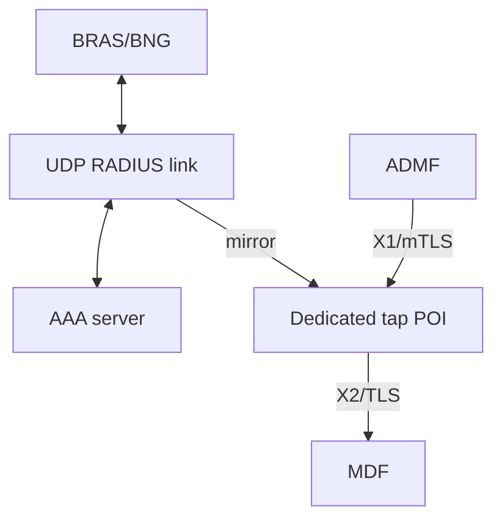

# RADIUS capture and tap POI operations

`lc sniff radius`, `lc hunt radius`, and `lc tap radius` share UDP decoding,
exact ordinary predicates, capture profiles, and bounded request association.
Ordinary capture requires neither an LI build nor an activated X1 task.
`lc process` remains protocol-neutral; use existing `lc watch live`, `watch file`,
and `watch remote` commands to view RADIUS metadata.

Local tap and directly authenticated hunt/process RADIUS paths have passed
synthetic release verification, including filter snapshots, reconnect scope
isolation, ordinary outputs and decoded X2 parity. Upgrade both hunter and
processor for authoritative filter snapshots. Relays preserve ordinary traffic
but do not convey capture-origin authority for X2. Production known-line
verification and receiving-MDF acceptance remain pending; repository fixtures
are synthetic.

## Capture topology and supported scope

Mirror the visible BRAS/BNG-to-AAA UDP link into a dedicated POI interface:



Observe both request and response directions on the same isolated capture feed.
Defaults include UDP 1812 and 1813; configured ports add to these defaults.
IPv4 and IPv6 Access-Request (1), Access-Accept (2), Access-Reject (3),
Accounting-Request (4), Accounting-Response (5), and Access-Challenge (11) are
supported. TCP, RadSec/TLS, DTLS, encrypted inner traffic, CoA, Disconnect, and
other message codes are unsupported. No shared secret is accepted or needed.
Every IPv4 fragment and IPv6 Fragment header, including atomic fragments, is
excluded from RADIUS analysis and attribution. Generic packet outputs may retain
fragments if their capture BPF admits them; port-only BPF cannot promise that.

Operator scope and profile revision describe an administrator-established
uniqueness boundary. Interface names, IP endpoints, NAS attributes and BPF filters
do not prove operator isolation. A proxy feed must be isolated to that boundary;
reject line targeting on a mixed feed whose concrete line values are not unique.
Transport client/server endpoints remain separate from packet-carried NAS fields.
Capture restart/reopen begins a fresh epoch; old evidence cannot cross that gap.

Response association is observational, not authenticator verification. Without a
secret, neither Response Authenticator nor the eight-bit Identifier proves
ownership. Unique inheritance requires one compatible observed request in the
same capture scope and tuple. Competing requests, expired state and capacity loss
suppress inheritance. A challenge does not authorize the next exchange, and
authentication does not authorize later identity-free accounting. Responses seen
before their requests are not buffered or retrospectively authorized.

## Distributed trust and filter synchronization

For RADIUS X2, connect the hunter directly using mutual TLS. Its verified client
certificate SAN must match its hunter ID; that ID must also match the observation
origin. Server-only TLS and insecure transport support ordinary capture but do
not authorize X2. Upstream processors preserve original bytes, capture scope and
attribution evidence, but a relay certificate proves only the relay identity.
Deliver X2 at the directly connected POI; relay-origin authorization is not part
of this release.

Upgraded hunters request an authoritative filter snapshot when subscribing.
The processor captures current policy and attaches the update stream atomically;
the hunter replaces its entire registration policy before applying later live
updates. Empty snapshots remove deleted filters. A missed update caused by a full
queue closes that subscription so reconnect can obtain current policy.

Legacy peers retain their existing update protocol. An upgraded hunter treats
legacy ADD updates as replacements, but an old processor cannot communicate
registration-gap deletions as an authoritative snapshot. Upgrade both endpoints
for distributed RADIUS release guarantees; older peers without RADIUS capability
cannot receive RADIUS filters. Legacy raw packets remain available to ordinary
outputs and cannot authorize X2 without validated current evidence.

Request association remains local to one hunter, interface and capture epoch.
Recreating capture/forwarding state starts a new epoch, while already queued
observations retain their original scope. A request lost in transport can still
have a response authorized from unique capture-side evidence, subject to current
processor task admission; a request never observed at capture cannot.

## Ordinary capture

```bash
# Decode an offline recording; no LI build or task is required.
lc sniff radius -r radius.pcap --format text

# Observe an exact complete User-Name, including realm and case.
sudo lc sniff radius -i mirror0 --radius-username 'alice@example.test'

# Capture additional service ports and write the optional observation stream.
sudo lc tap radius -i mirror0 --insecure --radius-port 1645,1646 \
  --log-dir ./logs --log-streams radius

# Ordinary distributed capture; X2 additionally requires authenticated origin.
sudo lc hunt radius -i mirror0 --processor processor.example:55555 \
  --tls-ca ca.crt --radius-username 'alice@example.test'
```

Ordinary predicates are conjunctive: all supplied username, MAC, AVP and resolved
line criteria must match the same fully validated message, or the complete
request predicate must remain current for a uniquely associated response.
This conjunction belongs to the ordinary command policy. On tap and hunt,
independently configured dynamic filter/task groups can also select traffic;
selection is the union of complete matching groups. A dynamic group can therefore
forward traffic outside the ordinary command predicate. Groups never combine
partial criteria, and ordinary matches do not authorize LI.

Different packets never contribute partial criteria. Repeated attributes can
satisfy separate criteria without concatenation. Username matching is exact,
case-sensitive UTF-8 byte matching: no trimming, wildcard, realm stripping or
Unicode normalization. Text targets require 1–253 UTF-8 bytes.

For `sniff radius`, structured logs run after ordinary selection and share the
same capture observation, scope and association as CLI/packet outputs. Rejected
ordinary matches produce no structured records; competitors still reach the
correlator before selection, and validation is counted only once.

PCAP writing, upstream forwarding, watch subscribers, virtual-interface output,
structured logs and LI delivery keep their own enablement and queues. Enabling
X2 does not enable packet files or logs; enabling `--log-dir` does not authorize
LI. RADIUS does not use VoIP per-call files. Routine text, JSON and logs redact
credentials, authenticators and unallowlisted attributes; explicit PCAP and X2
outputs retain original validated bytes according to their output contracts.

## Shared flags and configuration

All three protocol commands use the same `radius.*` YAML keys. Environment names
are `LIPPYCAT_RADIUS_` followed by the uppercase key. Flags override environment,
which overrides YAML, which overrides defaults. For example,
`--radius-transaction-timeout 20s`, `radius.transaction_timeout: 20s` and
`LIPPYCAT_RADIUS_TRANSACTION_TIMEOUT=20s` select the same setting.

| Flag                            | YAML key below `radius` | Default / accepted value                                                  |
| ------------------------------- | ----------------------- | ------------------------------------------------------------------------- |
| `--radius-port`                 | `ports`                 | Additional UDP ports, 1–65535; 1812/1813 always included                  |
| `--radius-username`             | `username`              | Empty; exact complete User-Name                                           |
| `--radius-mac`                  | `mac`                   | Empty; six uppercase hyphen-separated octets                              |
| `--radius-attribute`            | `attribute`             | Repeatable complete hex AVP                                               |
| `--radius-mac-profile`          | `mac_profile`           | Empty; explicitly select `calling-station-id-uppercase-hyphen-v1` for MAC |
| `--radius-line-profile`         | `line_profile`          | Empty; `nas-port-id` or `agent-circuit-id`                                |
| `--radius-line-id`              | `line_id`               | Empty; concrete attribute value, never an inventory key                   |
| `--radius-operator-scope`       | `operator_scope`        | `local`; explicit deployment boundary required for scoped targeting       |
| `--radius-profile-revision`     | `profile_revision`      | `unconfigured`; explicit revision required with scoped targeting          |
| `--radius-protocol-scope`       | `protocol_scope`        | `auth-accounting-udp`, the only supported scope                           |
| `--radius-transaction-timeout`  | `transaction_timeout`   | `30s`; 1–300 seconds from first request                                   |
| `--radius-quiet-guard`          | `quiet_guard`           | `30s`; cannot be shorter than request lifetime                            |
| `--radius-cleanup-interval`     | `cleanup_interval`      | `1s`; expiry is also checked synchronously                                |
| `--radius-max-candidates`       | `max_candidates`        | 65536; 1–1048576 request instances                                        |
| `--radius-max-per-key`          | `max_per_key`           | 4; 1–16 candidates per tuple                                              |
| `--radius-max-suppression-keys` | `max_suppression_keys`  | 65536; 1–1048576 guard keys                                               |
| `--radius-candidate-bytes`      | `candidate_bytes`       | 67108864; 1–1024 MiB, supplied in bytes                                   |
| `--radius-total-bytes`          | `total_bytes`           | 100663296; 2–2048 MiB, greater than candidate budget                      |

Invalid ranges and incompatible profile/target combinations fail configuration;
limits are not silently clamped. Retransmissions do not extend the request
lifetime. Capacity losses retain quiet guards; if necessary guard state cannot
fit, inheritance stops globally until a full quiet period. Direct matching and
independently selected outputs remain available.

```yaml
radius:
  ports: [1645, 1646]
  protocol_scope: auth-accounting-udp
  username: alice@example.test
  mac_profile: calling-station-id-uppercase-hyphen-v1
  mac: 02-00-00-00-00-01
  line_profile: nas-port-id
  line_id: line-a
  operator_scope: operator-a/nas-a
  profile_revision: v1
  transaction_timeout: 30s
  quiet_guard: 30s
  max_candidates: 65536
  max_per_key: 4
  candidate_bytes: 67108864
  total_bytes: 100663296
```

## NatParas, line mappings, and X1 targets

NatParas administrative values must be resolved before X1 provisioning. lippycat
does not query subscriber inventory or infer account-to-line relationships.

| Administrative input                                 | X1 criterion                                  | Example                                              |
| ---------------------------------------------------- | --------------------------------------------- | ---------------------------------------------------- |
| `userName` that is a valid, already-NFC NAI          | `nai`                                         | `alice@example.test`                                 |
| Other `userName`, including opaque bytes             | `radiusAttribute` with User-Name AVP (type 1) | `0114616C696365406578616D706C652E74657374`           |
| `lineID` resolved to NAS-Port-Id                     | `radiusAttribute` with type 87 AVP            | `57086C696E652D61` (`line-a`)                        |
| `lineID` resolved to Agent-Circuit-Id                | `radiusAttribute` with vendor 3561/type 1 VSA | `1A1100000DE9010B636972637569742D61` (`circuit-a`)   |
| Subscriber MAC under the selected capture convention | `macAddress`                                  | X1 `02:00:00:00:00:01`; captured `02-00-00-00-00-01` |

`nas-port-id` and `agent-circuit-id` select alternative concrete attributes; they
are not an automatic OR. `--radius-line-id line-a` with `nas-port-id` creates the
complete type-87 predicate within the explicitly supplied scope/revision.
Upstream inventory must supply a concrete value and its uniqueness boundary.
The same `line-a` can exist in two operators, so it cannot be treated as globally
unique. Production enablement requires operator records for the emitting NAS,
exact value bytes, MAC convention and scope, verified against a non-sensitive
known-line capture. Repository operator-a/operator-b fixtures intentionally reuse
line values and do not establish a production mapping agreement.

Complete AVPs include type and length octets. Hex accepts either case with only
leading/trailing XML whitespace, and serializes in uppercase. User-Name and
NAS-Port-Id targets contain 1–253 value bytes. Agent-Circuit-Id targets contain
1–63 bytes and exactly one vendor sub-attribute; vendor ID is `00000DE9`.
Reject wrong lengths, internal whitespace, `0x`, separators, empty values,
concatenated AVPs, extra target VSA sub-attributes, other vendors/types, unresolved
line profiles, and missing scope. Captured repeated/grouped valid attributes
remain independently matchable; target encoding does not rewrite packet bytes.

MAC capture interpretation uses only attribute 31, Calling-Station-Id, in the
explicit uppercase hyphen convention. Lowercase, colon, dotted, suffix-decorated
or padded captured values yield no MAC identity. Ethernet and NAS addresses are
never subscriber-MAC fallbacks. X1 NAI does not match SIP; SIP needs `sipUri`.
All task criteria are ANDed within one task and scope; mixed RADIUS/SIP/IP,
OR/negated and unsupported NAS-scope criteria are rejected as a whole.

See the [identity contract](https://github.com/endorses/lippycat/blob/main/docs/design/radius-identity-contract.md) for exact binary
rules and the [LI deployment guide](https://github.com/endorses/lippycat/blob/main/docs/LI_INTEGRATION.md#radius-x1-authorization-and-nai-migration)
for activation, modification, restart and current-generation admission behavior.

## Tap POI and MDF setup

Build with `make tap-li` or `make build-li` for X1/X2 flags. Ordinary RADIUS
commands remain available in non-LI builds. Configure a dedicated capture scope,
mutual TLS for X1 and MDF delivery, a stable unique ProcessorID, and durable LI
state before provisioning an X2Only task and an explicitly X2-enabled destination.
The MDF endpoint is provisioned through X1 destination administration; it is not
an ordinary capture target.

The LI-only bindings are shared by `tap` and `process`:

| Flag                                 | YAML key                           | Default                                                       |
| ------------------------------------ | ---------------------------------- | ------------------------------------------------------------- |
| `--li-radius-operator-scope`         | `li.radius.operator_scope`         | Empty; explicit scope required for RADIUS tasks               |
| `--li-radius-profile-revision`       | `li.radius.profile_revision`       | Empty; explicit revision required                             |
| `--li-radius-origin-node`            | `li.radius.origin_node`            | Empty; optional origin restriction                            |
| `--li-radius-source`                 | `li.radius.source`                 | Empty; optional interface/source restriction                  |
| `--li-radius-mac-profile`            | `li.radius.mac_profile`            | Empty; explicit supported profile required for MAC targets    |
| `--li-radius-transaction-timeout`    | `li.radius.transaction_timeout`    | `30s`; 1s–5m, must match capture lifetime                     |
| `--li-radius-correlation-state-file` | `li.radius.correlation_state_file` | Empty; falls back to LI state path plus `.radius-correlation` |

These keys use `LIPPYCAT_LI_RADIUS_*` environment variables, such as
`LIPPYCAT_LI_RADIUS_OPERATOR_SCOPE`. Capture `radius.operator_scope` and
`radius.profile_revision` must match the explicit LI deployment binding.
Configure the LI MAC profile for X1 MAC targets; the ordinary profile does not
implicitly activate LI. The parent directory of durable state must already exist.
`--li-radius-transaction-timeout` must equal `--radius-transaction-timeout` on
`tap radius`; processor deployments must configure the same lifetime as their
hunter capture deployment. A mismatch on local tap rejects startup.

```bash
sudo lc tap radius -i mirror0 --id poi-a \
  --tls-cert server.crt --tls-key server.key --tls-ca capture-ca.crt \
  --radius-operator-scope operator-a/nas-a --radius-profile-revision v1 \
  --li-enabled --li-state-file /var/lib/lippycat/poi-a-li.json \
  --li-radius-operator-scope operator-a/nas-a --li-radius-profile-revision v1 \
  --li-radius-origin-node poi-a-local --li-radius-source mirror0 \
  --li-radius-mac-profile calling-station-id-uppercase-hyphen-v1 \
  --li-x1-listen :8443 \
  --li-x1-tls-cert x1.crt --li-x1-tls-key x1.key --li-x1-tls-ca admf-ca.crt \
  --li-delivery-tls-cert delivery.crt --li-delivery-tls-key delivery.key \
  --li-delivery-tls-ca mdf-ca.crt
```

The local tap capture origin is the processor ID plus `-local`, so this example
binds origin `poi-a-local`. The X2 NFID/IPID identity remains `poi-a`.

This starts the configured POI; provision the scoped target and X2 destination
through X1 before delivery can occur. Existing `--log-dir`, PCAP and virtual
interface options can be enabled independently. RADIUS X3 and combined X2/X3
requests are rejected. The correlation map remains bounded at 65,536 entries and
16 MiB; allocation failure rejects X2 rather than minting inconsistent IDs.

The raw X2 payload uses format 11 and exactly the declared RADIUS message,
excluding Ethernet/IP/UDP and trailing padding. Payload Direction is Unknown.
The eight-byte nonzero Correlation ID represents an observed exchange, not a
subscriber session or the RADIUS Identifier. Retransmissions and uniquely
associated responses reuse it within retained request lifetime; direct orphan
matches receive observation-scoped IDs. Each captured matching datagram may be
delivered, including mirror duplicates. No durable exactly-once promise is made.

Receiving-MDF agreement must cover format 11, Unknown direction, exchange lifetime,
eight-byte correlation, duplicates and orphan handling. Synthetic receiver tests
are local evidence; external interoperability and operator acceptance are pending.
Use separate ProcessorIDs for independent encoders, preserve correlation storage
across restart, and change identity if storage is reset. Storage/encoding failure
suppresses X2 while ordinary outputs continue. See
[raw RADIUS X2 delivery](https://github.com/endorses/lippycat/blob/main/docs/LI_INTEGRATION.md#raw-radius-x2-delivery) for state ownership
and [the observation contract](https://github.com/endorses/lippycat/blob/main/docs/design/radius-observation-contract.md) for association.

## Operational counters

Structured INFO messages expose bounded counter snapshots. `RADIUS capture
counters` is owned by the capture runtime per epoch; it is emitted on first
traffic, approximately minutely while traffic continues, and at shutdown or an
epoch boundary. Downstream byte revalidation does not increment origin counters.

| Fields                                                                         | Owner and unit                                                                                                                    |
| ------------------------------------------------------------------------------ | --------------------------------------------------------------------------------------------------------------------------------- |
| `valid`, `malformed`, `fragmented`, `unsupported`                              | Ingress: attempted observations, one validation outcome per attempt                                                               |
| `requests`, `matched_requests`                                                 | Capture correlator/matcher: request observations, including retransmissions; matched counts complete direct ordinary/task matches |
| `correlated_responses`, `unmatched_responses`, `ambiguous_responses`           | Correlator: response observations classified unique, missing, or ambiguous                                                        |
| `expired_responses`, `incompatible_responses`, `capacity_suppressed_responses` | Correlator: response observations rejected from unique inheritance for the named reason                                           |
| `stale_references`                                                             | Correlator: inherited owner references rejected as no longer current                                                              |
| `state_exhaustion`                                                             | Correlator: state-loss events, not packet counts                                                                                  |

`RADIUS X2 counters` is owned by the authoritative processor for its lifetime.
`stale_generations` counts callback-generation lease failures; `allocation_errors`
and `encoding_errors` count failed allocation/encoding attempts. `encoded` counts
encoded PDUs; `queue_accepted` and `queue_errors` count X2 queue submission
outcomes; `skipped` counts products not submitted. A queue acceptance is not proof
of TLS delivery. The shared LI delivery statistics own destination delivery,
retry and failure attempts across protocols; do not interpret them as
RADIUS-only packet totals or sum them with capture observations. The LI manager
separately reports `radius_stale_references` in its shutdown statistics, counting
rejected task-owner references at admission. See
[LI delivery monitoring](https://github.com/endorses/lippycat/blob/main/docs/LI_INTEGRATION.md) for the existing delivery statistics.

A growing malformed count means attempted input failed structural validation;
ambiguous/expired/capacity-suppressed responses have no inherited owner. Increasing
state exhaustion indicates incomplete association despite continued direct
matching. Stale rejection after task changes is expected to remove obsolete
ownership. Output queue drops measure sink loss independently from decoder and
association health. Counters do not expose account, line or task IDs as labels.
