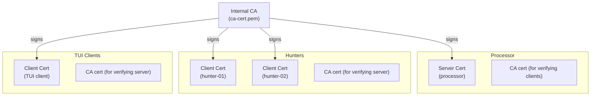
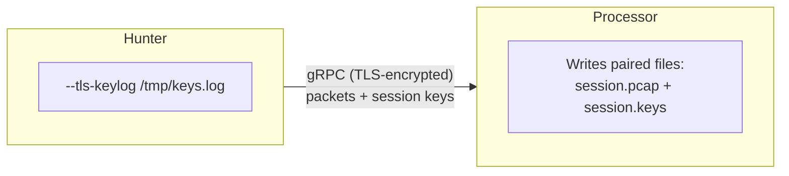

# Security

Lippycat captures and transports sensitive network traffic — SIP credentials, RTP media streams, internal IP addresses, and potentially regulated data. This chapter covers the security controls available to protect that data in transit, at rest, and in logs. It assumes you have a working distributed deployment as described in [Part III](../part3-distributed/architecture.md) and are preparing it for production.

## TLS for Distributed Mode

All gRPC connections in the distributed architecture — hunter to processor, processor to processor, TUI to processor — require TLS by default. Without it, captured packets travel in cleartext between nodes.

### Security Modes

Lippycat supports three TLS modes:

| Mode | Authentication | Use Case |
|------|---------------|----------|
| **Server TLS** | Processor proves identity to clients | Encrypt traffic, verify processor identity |
| **Mutual TLS (mTLS)** | Both sides prove identity | Production deployments (recommended) |
| **Insecure** | None | Local testing only |

### Certificate Requirements by Node Type

Each node type needs different certificates depending on the TLS mode:

| Node | Server TLS | Mutual TLS |
|------|-----------|------------|
| **Processor** | `--tls-cert`, `--tls-key` | `--tls-cert`, `--tls-key`, `--tls-ca`, `--tls-client-auth` |
| **Hunter** | `--tls-ca` | `--tls-cert`, `--tls-key`, `--tls-ca` |
| **Tap** | `--tls-cert`, `--tls-key` (for TUI serving) | Same as processor (serves TUI clients) |
| **TUI (`watch remote`)** | `--tls-ca` | `--tls-cert`, `--tls-key`, `--tls-ca` |

### Generating Certificates with OpenSSL

Modern Go requires Subject Alternative Names (SANs) on all certificates. Certificates using only Common Name (CN) will be rejected. The following procedure generates a CA, a server certificate for the processor, and a client certificate for hunters.

#### Step 1: Create a Certificate Authority

```bash
mkdir -p /etc/lippycat/certs && cd /etc/lippycat/certs

# Generate CA key and self-signed certificate
openssl req -x509 -newkey rsa:4096 -days 3650 -nodes \
  -keyout ca-key.pem -out ca-cert.pem \
  -subj "/C=US/ST=State/L=City/O=YourOrg/CN=Lippycat CA"
```

#### Step 2: Generate the Processor (Server) Certificate

```bash
# Private key
openssl genrsa -out server-key.pem 4096

# Certificate signing request
openssl req -new -key server-key.pem -out server-req.pem \
  -subj "/CN=processor.example.com"

# Extensions file — SANs are required
cat > server-ext.conf <<EOF
subjectAltName = DNS:processor.example.com,DNS:localhost,IP:127.0.0.1
extendedKeyUsage = serverAuth
EOF

# Sign with the CA
openssl x509 -req -in server-req.pem -days 365 \
  -CA ca-cert.pem -CAkey ca-key.pem -CAcreateserial \
  -out server-cert.pem -extfile server-ext.conf
```

Replace `processor.example.com` with the hostname or IP hunters will use to connect. Add multiple SANs if the processor is reachable by several names:

```
subjectAltName = DNS:processor.example.com,DNS:processor,IP:10.0.1.100,IP:127.0.0.1
```

#### Step 3: Generate a Hunter (Client) Certificate

For mTLS, each hunter needs its own certificate:

```bash
openssl genrsa -out hunter01-key.pem 4096

openssl req -new -key hunter01-key.pem -out hunter01-req.pem \
  -subj "/CN=hunter-01.example.com"

cat > client-ext.conf <<EOF
extendedKeyUsage = clientAuth
EOF

openssl x509 -req -in hunter01-req.pem -days 365 \
  -CA ca-cert.pem -CAkey ca-key.pem -CAcreateserial \
  -out hunter01-cert.pem -extfile client-ext.conf
```

#### Step 4: Set Permissions and Clean Up

```bash
chmod 600 *-key.pem
chmod 644 *-cert.pem
rm -f *.conf *-req.pem
```

### Starting Nodes with TLS

With certificates in place, start the distributed deployment:

```bash
# Processor — server TLS
lc process --listen 0.0.0.0:55555 \
  --tls-cert /etc/lippycat/certs/server-cert.pem \
  --tls-key /etc/lippycat/certs/server-key.pem

# Hunter — verify processor identity
sudo lc hunt voip -i eth0 \
  --processor processor.example.com:55555 \
  --tls-ca /etc/lippycat/certs/ca-cert.pem
```

For production with mTLS (covered in the next section), add client authentication flags.

## Mutual TLS (mTLS)

Server TLS encrypts the channel and lets clients verify the processor, but any client can connect. Mutual TLS adds the reverse — the processor verifies hunter identity using client certificates. This is the recommended configuration for production.

### Trust Model



All certificates are signed by the same CA. Each node trusts any certificate signed by that CA. To revoke a hunter, stop issuing it certificates and restart the processor — the revoked hunter can no longer present a valid client certificate.

### Enabling mTLS

```bash
# Processor — require client certificates
lc process --listen 0.0.0.0:55555 \
  --tls-cert /etc/lippycat/certs/server-cert.pem \
  --tls-key /etc/lippycat/certs/server-key.pem \
  --tls-client-auth \
  --tls-ca /etc/lippycat/certs/ca-cert.pem

# Hunter — present client certificate
sudo lc hunt voip -i eth0 \
  --processor processor.example.com:55555 \
  --tls-cert /etc/lippycat/certs/hunter01-cert.pem \
  --tls-key /etc/lippycat/certs/hunter01-key.pem \
  --tls-ca /etc/lippycat/certs/ca-cert.pem

# TUI client — also presents a client certificate
lc watch remote --nodes-file nodes.yaml \
  --tls-cert /etc/lippycat/certs/tui-cert.pem \
  --tls-key /etc/lippycat/certs/tui-key.pem \
  --tls-ca /etc/lippycat/certs/ca-cert.pem
```

### Configuration File

For production deployments, store TLS settings in the configuration file rather than on the command line. This keeps key paths out of process listings and shell history:

```yaml
# /etc/lippycat/config.yaml — processor
processor:
  listen_addr: "0.0.0.0:55555"
  tls:
    cert_file: "/etc/lippycat/certs/server-cert.pem"
    key_file: "/etc/lippycat/certs/server-key.pem"
    ca_file: "/etc/lippycat/certs/ca-cert.pem"
    client_auth: true
```

```yaml
# /etc/lippycat/config.yaml — hunter
hunter:
  processor_addr: "processor.example.com:55555"
  tls:
    cert_file: "/etc/lippycat/certs/hunter01-cert.pem"
    key_file: "/etc/lippycat/certs/hunter01-key.pem"
    ca_file: "/etc/lippycat/certs/ca-cert.pem"
```

### Commercial CAs

If the processor uses a certificate from a well-known CA (Let's Encrypt, DigiCert, etc.), hunters do not need `--tls-ca` — the system trust store already includes the issuing CA:

```bash
# No --tls-ca needed with commercial certificates
sudo lc hunt voip -i eth0 --processor processor.example.com:55555
```

This simplifies hunter deployment but does not provide client authentication. Combine with mTLS if you need to restrict which hunters can connect.

## Certificate Lifecycle

### Monitoring Expiration

Check certificate validity dates and set up automated monitoring:

```bash
# Check a certificate's dates
openssl x509 -in /etc/lippycat/certs/server-cert.pem -noout -dates

# Verify SANs are present (Go requires them)
openssl x509 -in /etc/lippycat/certs/server-cert.pem -noout -text \
  | grep -A1 "Subject Alternative Name"
```

Add a cron job or monitoring check to alert before certificates expire:

```bash
# /etc/cron.daily/check-lippycat-certs
#!/bin/bash
CERT="/etc/lippycat/certs/server-cert.pem"
DAYS_LEFT=$(( ($(date -d "$(openssl x509 -in "$CERT" -noout -enddate \
  | cut -d= -f2)" +%s) - $(date +%s)) / 86400 ))

if [ "$DAYS_LEFT" -lt 30 ]; then
    echo "lippycat server certificate expires in $DAYS_LEFT days" | \
      mail -s "Certificate Expiry Warning" ops@example.com
fi
```

### Rotating Certificates

To rotate certificates without dropping connections:

1. Generate a new certificate signed by the same CA.
2. Update the configuration file with the new paths.
3. Reload the service gracefully:

```bash
# Generate replacement
openssl genrsa -out server-key-new.pem 4096
openssl req -new -key server-key-new.pem -out server-req-new.pem \
  -subj "/CN=processor.example.com"
openssl x509 -req -in server-req-new.pem -days 365 \
  -CA ca-cert.pem -CAkey ca-key.pem -CAcreateserial \
  -out server-cert-new.pem -extfile server-ext.conf

# Swap in place
mv server-cert-new.pem server-cert.pem
mv server-key-new.pem server-key.pem

# Reload
systemctl reload lippycat-processor

# Verify
openssl s_client -connect processor:55555 -showcerts </dev/null 2>/dev/null \
  | openssl x509 -noout -dates
```

Hunters will reconnect automatically using the new server certificate, provided it is signed by the same CA.

### Revoking a Certificate

Lippycat does not currently implement CRL or OCSP checking. To revoke a compromised certificate:

1. Remove the compromised certificate from the node.
2. Restart the processor to disconnect the affected hunter.
3. Generate a new certificate for the replacement node.
4. If the CA key was compromised, regenerate the entire CA and re-issue all certificates.

## Production Mode

Setting the `LIPPYCAT_PRODUCTION` environment variable blocks insecure operation:

```bash
export LIPPYCAT_PRODUCTION=true
```

With this set, any attempt to use `--insecure` is rejected at startup:

```
FATAL: --insecure flag is not allowed in production mode (LIPPYCAT_PRODUCTION=true)
```

This prevents operators from accidentally disabling TLS in production. Set it in the systemd unit file for each node:

```ini
# /etc/systemd/system/lippycat-processor.service
[Service]
Environment="LIPPYCAT_PRODUCTION=true"
ExecStart=/usr/local/bin/lc process --listen :55555 --config /etc/lippycat/config.yaml
```

Without `--insecure` and without TLS certificates, nodes refuse to start — there is no silent fallback to cleartext.

### Insecure Mode

For local development and testing, `--insecure` disables TLS entirely. Both sides of the connection must use it:

```bash
lc process --listen :55555 --insecure
sudo lc hunt voip -i eth0 --processor localhost:55555 --insecure
```

A prominent warning banner is displayed on startup:

```
═══════════════════════════════════════════════════════════════
  SECURITY WARNING: TLS ENCRYPTION DISABLED
  Packet data will be transmitted in CLEARTEXT
  This mode should ONLY be used in trusted networks
  TLS is enabled by default — remove --insecure for production
═══════════════════════════════════════════════════════════════
```

### TLS Performance

TLS adds minimal overhead on modern hardware with AES-NI support:

| Metric | Impact |
|--------|--------|
| CPU | ~2-5% overhead |
| Throughput | 95-98% of plaintext throughput |
| Latency | +1-5 ms initial handshake, <1 ms per packet |
| Memory | ~50 KB per connection for session state |

There is no reason to disable TLS for performance.

## Decrypting Captured TLS Traffic

The previous sections covered TLS for lippycat's own gRPC connections. This section covers a different use case: decrypting TLS-encrypted traffic that lippycat has *captured* — HTTPS, SMTPS, IMAPS, and other TLS-wrapped protocols flowing through the monitored network.

### How It Works

TLS decryption requires session keys exported by the client or server application using the `SSLKEYLOGFILE` mechanism. These keys are stored in NSS Key Log Format, a de facto standard supported by Wireshark, browsers, and many server-side applications.

Because modern TLS uses forward secrecy (ephemeral Diffie-Hellman), keys must be captured at runtime during the TLS handshake. After-the-fact decryption with only the server's private key is not possible.

### Application Support

Most modern applications support key logging:

| Category | Application | Mechanism |
|----------|-------------|-----------|
| Web servers | Apache 2.4.49+, Caddy v2.6+, nginx Plus R33+ | `SSLKEYLOGFILE` env var or directive |
| Browsers | Firefox, Chrome/Chromium | `SSLKEYLOGFILE` env var |
| CLI tools | curl, wget, OpenSSL s_client | `SSLKEYLOGFILE` env var |
| Languages | Go (`tls.Config.KeyLogWriter`), Python, Node.js | Native API or env var |

### CLI Usage

Point lippycat at a key log file produced by the target application:

```bash
# Live capture with key log — standalone
sudo lc sniff http -i eth0 --tls-keylog /tmp/sslkeys.log

# Live capture with key log — tap mode
sudo lc tap http -i eth0 --tls-keylog /tmp/sslkeys.log

# Real-time key injection via named pipe
mkfifo /tmp/sslkeys.pipe
sudo lc tap http -i eth0 --tls-keylog-pipe /tmp/sslkeys.pipe &
SSLKEYLOGFILE=/tmp/sslkeys.pipe ./myserver
```

### Distributed Key Forwarding

In distributed mode, hunters automatically forward TLS session keys to the processor alongside captured packets:



```bash
# Hunter — capture with key log
sudo lc hunt http -i eth0 \
  --processor central:55555 \
  --tls-keylog /tmp/sslkeys.log \
  --tls-ca ca.crt

# Processor — store keys alongside PCAPs
lc process --listen :55555 \
  --tls-keylog-dir /var/capture/keys \
  --tls-cert server.crt --tls-key server.key
```

### Offline Analysis

Re-analyze stored captures with the paired key log:

```bash
# CLI analysis
lc sniff http -r /var/capture/session.pcap --tls-keylog /var/capture/keys/session.keys

# TUI analysis
lc watch file -r /var/capture/session.pcap --tls-keylog /var/capture/keys/session.keys
```

### Wireshark Integration

Lippycat's key log files are fully compatible with Wireshark:

1. Open the PCAP file in Wireshark.
2. Go to **Edit > Preferences > Protocols > TLS**.
3. Set **(Pre)-Master-Secret log filename** to the key log file.
4. Click **Apply** — decrypted content is now visible.

For distributed captures, the processor writes paired files that you can hand directly to Wireshark:

```
/var/capture/session.pcap        # Encrypted traffic
/var/capture/keys/session.keys   # Session keys
```

### Limitations

- **Key log required** — forward secrecy means there is no way to decrypt without session keys.
- **No private-key-only decryption** — RSA key exchange (non-ephemeral) is rare and obsolete.
- **Timing matters** — keys must arrive before or shortly after the TLS handshake.
- **Same-machine access** — the key log file must be readable by the capturing node.

### Protecting Key Log Files

Key log files contain session secrets that can decrypt all associated captured traffic. Treat them with the same care as private keys:

```bash
chmod 600 /var/capture/keys/*.keys
chown lippycat:lippycat /var/capture/keys/
```

In distributed mode, keys are protected in transit by the gRPC TLS channel between hunter and processor.

## Data Protection Features

Beyond transport encryption, lippycat includes several features for protecting sensitive data at rest and in logs.

### Call-ID Sanitization

SIP Call-IDs often contain user identifiers, domain names, or session tokens. When written to log files, this can lead to privacy breaches. Call-ID sanitization uses SHA-256 hashing to produce consistent but anonymized identifiers:

```
Original:   john.doe@company.com-session-12345
Sanitized:  john.d...a1b2c3d4
```

The sanitized form is deterministic — the same Call-ID always produces the same hash — so you can still correlate log entries across components.

```yaml
# /etc/lippycat/config.yaml
voip:
  security:
    sanitize_call_ids: true
    call_id_hash_length: 8       # Hash prefix length (4-16 bytes)
    call_id_max_log_length: 16   # Call-IDs longer than this are sanitized
```

Enable this in all environments. The performance impact is negligible (<1 microsecond per Call-ID).

### PCAP Encryption

PCAP files contain complete packet payloads — SIP credentials, RTP media, authentication data. Lippycat can encrypt PCAP files at rest using AES-256-GCM with PBKDF2 key derivation.

```yaml
voip:
  security:
    enable_pcap_encryption: true
  encryption:
    enabled: true
    key_file: "/etc/lippycat/keys/pcap.key"
    algorithm: "aes-256-gcm"
    pbkdf2_iterations: 100000     # Minimum 10,000; 100,000+ recommended
```

If the key file does not exist, lippycat generates one automatically with `0600` permissions. For production, generate and manage the key manually:

```bash
# Generate a 256-bit encryption key
openssl rand -out /etc/lippycat/keys/pcap.key 32
chmod 600 /etc/lippycat/keys/pcap.key
chown lippycat:lippycat /etc/lippycat/keys/pcap.key
```

**Key rotation:** Stop lippycat, rename the old key, and restart. A new key is generated automatically. Keep the old key if you need to decrypt previously written files.

**Performance:** AES-256-GCM adds roughly 5-10% CPU overhead and ~1-2% storage overhead (nonce and authentication tag per block). Hardware AES-NI acceleration reduces this significantly.

### PCAP File Permissions

All PCAP files are created with `0600` permissions (owner read/write only). This applies to unified PCAPs, per-call PCAPs, and auto-rotating PCAPs. No configuration is needed — this is the default behavior.

Set up the output directory with matching restrictions:

```bash
sudo mkdir -p /var/lib/lippycat/pcaps
sudo chmod 700 /var/lib/lippycat/pcaps
sudo chown lippycat:lippycat /var/lib/lippycat/pcaps
```

Even with PCAP encryption enabled, file permissions provide defense-in-depth by preventing unauthorized access to encrypted files.

### Content-Length Bounds Validation

SIP messages include a `Content-Length` header. Without validation, a malicious or malformed message specifying an enormous value can cause memory exhaustion. Lippycat validates Content-Length values during TCP SIP message parsing with multiple layers of protection:

- String length limited to 10 characters (prevents integer overflow during parsing)
- Configurable maximum value (default 1 MB)
- Configurable maximum total message size (default 2 MB)

```yaml
voip:
  security:
    max_content_length: 1048576     # 1 MB — reasonable for production
    max_message_size: 2097152       # 2 MB — reasonable for production
```

For high-security environments, tighten these limits:

```yaml
voip:
  security:
    max_content_length: 65536       # 64 KB
    max_message_size: 131072        # 128 KB
```

Violations are logged as warnings with the offending value and source, allowing you to detect scanning or attack attempts.

## Virtual Interface Security

As described in [Chapter 4](../part2-local-capture/sniff.md), lippycat can create virtual TAP/TUN interfaces for feeding filtered packets to downstream tools like Wireshark or Snort. This requires elevated privileges.

### Least-Privilege Setup

The recommended approach uses Linux file capabilities to grant only the `CAP_NET_ADMIN` capability:

```bash
# Grant the minimum required capability
sudo setcap cap_net_admin+ep /usr/local/bin/lc

# Verify
getcap /usr/local/bin/lc
# /usr/local/bin/lc = cap_net_admin+ep

# Now runs without sudo
lc sniff voip -i eth0 --virtual-interface
```

### Privilege Dropping

When running as root is unavoidable, lippycat can drop to an unprivileged user after creating the interface:

```bash
sudo lc sniff voip -i eth0 \
  --virtual-interface \
  --vif-drop-privileges lippycat
```

The process creates the interface as root, then drops to the `lippycat` user's UID/GID. The packet injection loop runs unprivileged.

### Network Namespace Isolation

For production deployments with strict security requirements, run the virtual interface in an isolated network namespace:

```bash
# Create namespace
sudo ip netns add lippycat-isolated

# Run with namespace isolation
sudo lc sniff voip -i eth0 \
  --virtual-interface \
  --vif-netns lippycat-isolated

# Only tools in the namespace can see the interface
sudo ip netns exec lippycat-isolated wireshark -i lc0
```

The interface is invisible to the host network stack, preventing unauthorized sniffing.

### Containerized Deployment

For Docker or Kubernetes, grant `CAP_NET_ADMIN` without running the entire container as root:

```bash
# Docker
docker run --cap-add=NET_ADMIN lippycat:latest
```

```yaml
# Kubernetes
securityContext:
  capabilities:
    add:
    - NET_ADMIN
  runAsNonRoot: true
  runAsUser: 1000
```

## Security Checklist

Before putting a deployment into production, verify the following:

**Transport:**
- [ ] TLS enabled on all gRPC connections (no `--insecure` flags)
- [ ] `LIPPYCAT_PRODUCTION=true` set in systemd unit files
- [ ] mTLS enabled with `--tls-client-auth` on the processor
- [ ] Certificates include SANs (not just CN)
- [ ] Certificate expiration monitoring in place

**Data at rest:**
- [ ] PCAP output directories have `0700` permissions
- [ ] PCAP encryption enabled for sensitive deployments
- [ ] Encryption key stored on a secure filesystem with `0600` permissions
- [ ] Key log files (`--tls-keylog`) protected with `0600` permissions

**Application:**
- [ ] Call-ID sanitization enabled in configuration
- [ ] Content-Length bounds configured appropriately
- [ ] Virtual interfaces use file capabilities (not root)
- [ ] Private keys not committed to version control

**Operations:**
- [ ] Configuration files use `0600` permissions (contain key paths)
- [ ] Certificate rotation procedure documented and tested
- [ ] Log access audited for key log files

## Compliance Notes

These security features support common compliance frameworks:

| Requirement | Relevant Features |
|-------------|-------------------|
| **GDPR** — encryption of personal data | TLS transport, PCAP encryption, Call-ID sanitization |
| **HIPAA** — PHI safeguards | TLS transport, PCAP encryption, file permissions |
| **PCI DSS** — Requirement 4 (encrypt in transit) | TLS/mTLS for all gRPC connections |
| **SOX** — data integrity controls | GCM authenticated encryption, mTLS |
| **NIST 800-53** — SC-8 (transmission confidentiality) | TLS transport encryption |

## Troubleshooting

### "certificate relies on legacy Common Name field, use SANs instead"

The certificate was generated without Subject Alternative Names. Regenerate it with a `subjectAltName` extension as shown in [Generating Certificates with OpenSSL](#generating-certificates-with-openssl).

Verify SANs are present on an existing certificate:

```bash
openssl x509 -in server-cert.pem -noout -text | grep -A1 "Subject Alternative Name"
```

### "TLS is disabled but --insecure flag not set"

No TLS certificates were provided and `--insecure` was not set. Either provide certificates or explicitly allow insecure mode for testing.

### "No client certificate provided"

The processor requires mTLS (`--tls-client-auth`) but the hunter did not present a client certificate. Add `--tls-cert` and `--tls-key` on the hunter side.

### "Failed to verify certificate"

Certificate validation failed. Common causes:

```bash
# Check if the certificate is expired
openssl x509 -in cert.pem -noout -enddate

# Check if the hostname matches the SANs
openssl x509 -in cert.pem -noout -text | grep -A2 "Subject Alternative Name"

# Verify the certificate chain
openssl verify -CAfile ca-cert.pem server-cert.pem
```

### TLS decryption not working

1. Verify the key log file exists and contains entries.
2. Check that keys were captured during the TLS handshake (keys cannot be generated after the fact).
3. In distributed mode, confirm the hunter has `--tls-keylog` set and the processor has `--tls-keylog-dir` configured.
4. For Wireshark, ensure the key log format starts with `CLIENT_RANDOM` or `CLIENT_HANDSHAKE_TRAFFIC_SECRET`.
