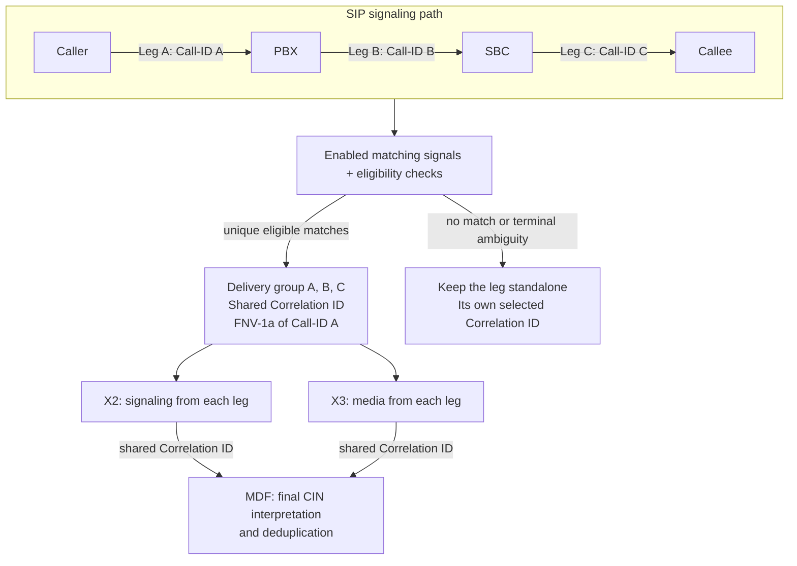
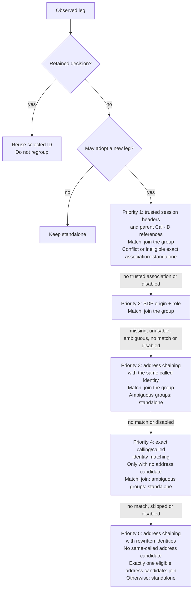

# SIP Call-Leg Correlation (LI) {#sip-call-leg-correlation}

A call passing through a PBX or session border controller can appear as several
SIP legs with different Call-IDs. Optional LI call-leg correlation lets a
processor or tap recognize related legs and select one shared X2/X3 Correlation
ID for them. Each leg keeps its own SIP identity and source packets.

This page explains LI delivery grouping. See
[VoIP: SIP and RTP Analysis](voip.md) for SIP dialog tracking and RTP
association, and [Lawful Interception](lawful-interception.md#x2x3-delivery) for
the surrounding authorization and delivery setup. Monitoring/TUI call grouping
is a separate mechanism and does not use this LI matching hierarchy.

## From separate legs to one delivery group {#delivery-group-overview}

The example shows three observed legs of one call. A PBX and an SBC originate
new legs, so Call-ID alone cannot link the entire path. When enabled evidence
identifies one eligible group, lippycat joins the new leg to it. The first
selected Call-ID supplies the group's Correlation ID. In this example, leg A is
selected first; the letters are illustrative identifiers.

<!-- i18n:skip -->



Grouping preserves a common active LI task generation across all members. It
does not authorize another leg or broaden an interception task. X2 and X3 retain
their own products and use the shared ID; lippycat does not allocate the MDF's
final CIN. If a leg already has a retained decision, later evidence cannot move
it to another group. Published groups are never merged retrospectively.

## Signals and their priority {#correlation-signals}

Each matching method is independently configurable and disabled by default. The
table lists the order for a new eligible initial transaction. Trusted session
headers and parent Call-ID references form one tier: lippycat checks their
agreement before considering weaker signals.

| Priority | Signal                                                | What must agree                                                                                                                               | Configuration                                                  |
| -------- | ----------------------------------------------------- | --------------------------------------------------------------------------------------------------------------------------------------------- | -------------------------------------------------------------- |
| 1        | Trusted session headers and parent Call-ID references | Extracted session key of the same header type, or an exact retained parent Call-ID; all trusted associations must identify one eligible group | `session_headers`, `parent_call_id_headers`                    |
| 2        | SDP origin matching                                   | Full origin tuple and the same offer/answer role, with usable retained origin history                                                         | `sdp_origin_matching`                                          |
| 3        | Address chaining with the same called identity        | Adjacent signaling addresses, overlapping setup, capture-time window and exact called identity                                                | `address_chaining`, `address_window`, `node_aliases`           |
| 4        | Exact calling/called identity matching                | Exact pair inside a symmetric capture-time window, with no eligible address-chain candidate                                                   | `number_chaining`, `number_window`                             |
| 5        | Address chaining with rewritten identities            | Exactly one eligible address-chain candidate and no address candidate with the same called identity                                           | `address_chaining_rewritten`, `address_window`, `node_aliases` |

For trusted session-header matching, `session_headers` can name Session-ID,
P-Charging-Vector or a proprietary header. The standard headers use their
specific UUID or `icid-value` extraction; proprietary headers use the complete
trimmed value. Parent Call-ID matching uses `parent_call_id_headers` to name
headers that explicitly carry another leg's Call-ID. Configuration order does
not make one trusted header override a conflicting one.

SDP origin matching uses SDP's `o=` origin, not media addresses from `c=` or
`m=` lines. Address chaining compares signaling transport addresses, optionally
treating configured aliases as one node. Address chaining with the same called
identity and exact calling/called identity matching compare complete canonical
SIP identities rather than telephone-number suffixes. SDP reuse protections and
the exact extraction rules are described below.

## How the decision is made {#correlation-decision-flow}

A retained decision takes precedence over every signal. A new leg needs an
observed initial INVITE request before it can join a group. Response-only
capture and an X3-first leg cannot use later evidence to replace their retained
standalone decisions. New adoption also depends on retained state, capacity, the
decision horizon and storage availability.

The diagram shows the retained-decision check, eligibility check and matching
sequence. Every candidate must be live and belong to a resolved group sharing an
active task context with the new leg. Disabled methods are skipped. A successful
match stops the search; signals are not added together as a confidence score.

<!-- i18n:skip -->



Conflicting trusted evidence stops matching rather than falling through to a
heuristic. Missing or ambiguous SDP evidence permits weaker matching. Address
chaining with the same called identity and exact calling/called identity
matching treat multiple eligible groups as ambiguous. Address chaining with
rewritten identities requires exactly one address candidate even when several
candidates would belong to the same group. A parent reference that cannot be
resolved also stops matching. The address and identity heuristics can group
unrelated calls, so enable them only after checking the signaling behavior of
the deployment.

## Matching and eligibility reference {#matching-eligibility-reference}

Call-leg correlation is disabled by default. Enable selected rules under
`processor.li.correlation` or `tap.li.correlation` only after verifying the
signaling and MDF profile. A grouped call uses the FNV-1a ID of its first
selected Call-ID for X2 and X3; the MDF owns the final CIN interpretation and
deduplication. Grouping changes only Correlation IDs and their dependent
sequence contexts. Source packets, payloads, matched tasks, authorization,
direction and destinations remain unchanged.

A retained first decision always wins. For a new eligible initial transaction,
the order is trusted session headers and parent Call-ID references, SDP origin
matching, address chaining with the same called identity, exact calling/called
identity matching, then address chaining with rewritten identities. Disagreement
or ambiguity in trusted headers or parent references, or an exact association
without a common active task, leaves the leg separate without trying weaker
evidence. Unusable or ambiguous SDP origin evidence falls through; ambiguous
weaker matches leave the leg separate. Enable each method independently. Already
published groups are never merged retrospectively.

`session_headers` accepts arbitrary valid SIP header names, matched
case-insensitively. Session-ID selects the initiating UUID: local in a request,
remote in a response. Valid generic parameters, including quoted values and
escapes, do not affect UUID selection. Nil or malformed UUIDs and a
syntactically unusable single header supply no key, allowing weaker matching.
P-Charging-Vector selects `icid-value`. Proprietary headers compare their
complete nonempty values exactly after trimming surrounding whitespace; case and
semicolons remain significant. Repeated identical usable keys are accepted;
distinct valid keys, repeated remote parameters and conflicting repeated headers
remain terminal ambiguity. `parent_call_id_headers` contains trusted headers
naming one exact, case-preserved retained parent Call-ID; unknown, later or
self-referencing parents cannot regroup a published child.

Address chaining compares initial INVITE transport addresses within
`address_window` and before the relevant final response. `node_aliases` is a
list of disjoint address lists, each representing one node; it does not rewrite
calling or called identities. Compare complete canonical identities, never
number suffixes or deployment-specific digit substitutions. Exact calling/called
identity matching requires the exact pair within `number_window` and no address
match; its capture-time window is symmetric, including the boundary, so reversed
arrival can match. Address chaining with rewritten identities requires one
eligible address candidate and no called-number candidate. These heuristics can
falsely group unrelated calls; missing observations and A,C,B arrival in an A →
B → C chain can leave one call split.

SDP origin matching compares the full SDP origin
`(username, sess-id, nettype, addrtype, unicast-address)`; version is revision
metadata. Offer and answer roles remain separate; an unknown role supplies no
evidence. Distinct initial transactions update an independent bounded history
before matching. Reuse spanning more than `sdp_origin_reuse_window`, or
contradictory trusted values of the same header type, suspends that origin.
Retransmissions neither refresh observation TTL nor renew suspension. Ordinary
suspension deadlines are fixed; distinct use during a period renews it once at
expiry. The exact transaction set is bounded to 256 entries per origin and role.
Exhausting that set or the per-origin trusted-key bound quarantines only that
origin; any traffic, including retransmissions, restarts its traffic-free
observation-TTL quiet period because distinctness can no longer be established.
This overload policy is separate from ordinary suspension. Tracked-origin
capacity exhaustion disables SDP-origin matching globally instead of evicting
incomplete history. Candidate evidence carries an observation generation:
expiry, release or reset invalidates it permanently, and fresh history cannot
revive an older candidate.

Every group must retain a common active task generation across all member
decisions. Task edits, expiry and reactivation invalidate stale eligibility.
Existing decisions also pin X3-first and late-signaling legs. At startup, and
after a decision cannot be retained at capacity, `decision_horizon` blocks new
adoption while restored adopted IDs still apply. Transactions or forwarding
delays beyond that horizon can defeat protection of unpersisted standalone
decisions. Activity, including RTP publication, refreshes retention; terminal
decisions use `terminal_grace`, and inactivity follows the configured call
lifecycle lifetime.

Common-task membership includes the administrative state incarnation as well as
XID and activation generation. Persistent deployments use the authenticated
administrative store incarnation; stateless deployments use a fresh runtime
incarnation. Replacing administrative storage or restarting without it therefore
cannot make a reused XID and generation join a stale restored group. Retained
adopted decisions still reuse their selected IDs, but new legs cannot join
through stale task contexts.

### Dedicated store and restart continuity {#correlation-store}

An empty `store_file` disables restart persistence. Adopted decisions use a
dedicated authenticated encrypted store, separate from administrative LI state
and journals. Configure `store_key_file`, `store_key_id` and optional
`store_read_keys` entries `id=path`; use an independent 32-byte key and a
protected directory. Initialize the store offline with the node stopped. Corrupt
or unauthenticated storage is a startup error, not an empty replacement store.

<!-- i18n:skip -->

```bash
openssl rand -out /etc/lippycat/keys/li-correlation.key 32
lc migrate li-correlation --output /var/lib/lippycat/li-correlation.enc \
  --key-file /etc/lippycat/keys/li-correlation.key --key-id correlation-1 \
  --max-records 100000
```

Rotate this store offline with `lc migrate li-correlation rotate`, following the
key rotation syntax of `lc migrate li-state --source-format=encrypted`. Keep
previous keys needed to read retained records. Before publication, a committed
write selects the adopted ID; confirmed noncommit selects standalone. An
uncertain write publishes the adopted ID and retries without changing a
published decision. A crash before uncertainty resolves may lose that adoption:
restart stability explicitly excludes this window. Publication includes
admission to a deliverable queue, reorder buffer or spool; successful network
transmission is not the boundary.

### Configuration {#correlation-configuration}

The following defaults leave every matching rule off. Add only trusted header
names and explicitly enable chosen rules. `sdp_origin_observation_ttl` must
exceed `sdp_origin_reuse_window`; durations and capacities must be positive.
Configure the same keys under `tap.li.correlation` for tap.

`wait_timeout` defaults to `5s` and fixes the wait deadline when an adoption is
reserved; later packets do not renew it. Deadline expiry or deferred-queue
pressure releases the reserved group ID as uncertain so correlation does not
discard the leg's product. Released IDs remain stable through late write
outcomes; authorization, cancellation and original product expiry still apply.

`shutdown_timeout` defaults to `10s` and supplies one shared correlation
shutdown budget for maintenance, pending decisions and close. It is independent
of the delivery-queue shutdown timeout. If filesystem I/O outlasts that budget,
the storage owner retains its file lock, descriptors and cryptographic usage
ledger until I/O finishes and it can close safely. Bounded shutdown does not
cancel the write or guarantee durability.

<!-- i18n:skip -->

```yaml
processor:
  li:
    correlation:
      session_headers: []
      parent_call_id_headers: []
      sdp_origin_matching: false
      sdp_origin_reuse_window: 30s
      sdp_origin_observation_ttl: 10m
      sdp_origin_suspend: 10m
      sdp_origin_max_tracked: 10000
      address_chaining: false
      address_chaining_rewritten: false
      number_chaining: false
      address_window: 2s
      number_window: 500ms
      node_aliases: []
      decision_horizon: 5m
      terminal_grace: 30s
      wait_timeout: 5s
      shutdown_timeout: 10s
      max_candidates: 10000
      max_records: 100000
      store_file: ""
      store_key_file: ""
      store_key_id: ""
      store_read_keys: []
```

### Status and evidence lifecycle {#correlation-status}

`lc show status` exposes aggregate `li_call_correlation` telemetry when grouping
is enabled: adopted rules and standalone reasons, SDP observations, group-size
buckets, retained records and candidate/transaction/origin counts with
configured limits, suspended origins, blind-period cause and remaining
nanoseconds, persistence status, uncertain writes and unresolved writes. No
Call-IDs, numbers, addresses or SIP header values are included.

`unrecorded_decisions` counts reservation attempts lost at the record limit.
Repeated packets may increment it repeatedly; it is not a once-per-leg outcome
count.

When a dedicated correlation store is owned, `li_call_correlation.storage`
reports its actual state, commit outcomes, faults, key IDs and cryptographic
usage. This field is absent for memory-only grouping; it never exposes store
paths or key material.

Calling and called identities come from the complete extracted From/To URI,
preferring the address inside angle brackets. Extraction removes the `sip:`,
`sips:` or `tel:` scheme, URI/header parameters after `;` or `?`, and a
single-colon SIP host port. Comparison preserves the user or telephone value,
including case and digits, and lowercases only the host after `@`; IPv6 host
spelling is preserved apart from case. It never compares suffixes, strips
telephone punctuation or applies operator-specific digit rewrites.

SDP roles are learned from retained initial transactions. A retransmitted
initial INVITE can establish a previously missing offer without changing its
first decision. A response-only observation remains unknown; an observed request
without SDP can establish a delayed offer in a successful response. Its ACK
answer requires a unique retained Call-ID, From-tag and CSeq association, even
when the ACK uses a new Via branch. Unknown or ambiguous associations provide no
SDP-origin evidence. Raw SIP requires framed `application/sdp` content;
Content-Length bounds the body, so a following pipelined message cannot become
SDP evidence.

Restoring an adopted child preserves its original group ID and common-task
context. Seeing the original root Call-ID again intersects that retained context
rather than creating a broader group for the same ID. An empty intersection
still preserves already selected IDs but cannot admit another leg through
correlation. Reactivated task generations do not restore lost eligibility.

Matching windows use packet capture timestamps; a missing timestamp falls back
to processor time. Retention and observation expiry use processor time. Delayed
batches must still satisfy capture-time windows and retained deadlines;
arbitrary forwarding delay is not tolerated. Cleanup scans run during
maintenance, while lookups reject locally expired evidence between ticks.

### Pending decisions and shutdown {#correlation-pending-shutdown}

A single store owner performs storage I/O outside the correlator decision mutex.
Each adoption has one fixed `wait_timeout` deadline, starting when its decision
is reserved. Its default is 5 seconds; additional SIP/RTP packets do not renew
it. Synchronous callers can cancel their wait without cancelling the physical
write. Retained unrelated IDs remain usable; new adoption while the owner is
occupied stays standalone. Pending or unresolved uncertain membership cannot
authorize another join.

Processor and tap retain at most `max_candidates` deferred packets (default
10,000) and 32 MiB of accounted packet data globally outside the packet
pipeline. These limits apply to correlation-held handoffs, separately from
capture buffers, RTP reorder buffers and downstream delivery queues; accounted
bytes are not a process RSS limit. `wait_timeout` fixes the logical adoption
decision deadline, not a strict residence-time or shutdown-loss bound:
scheduling and callback draining can extend residence beyond it. At the wait
deadline or when that handoff reaches its count/byte bound, the reserved group
ID is released as uncertain. Earlier retained products drain in order; the
packet causing pressure and subsequent packets use that same ID instead of being
rejected because of correlation capacity. A new leg that cannot reserve deferred
capacity stays standalone. Delivery still rechecks authorization, call lifetime,
destinations and product expiry using the original admission time. Independent
cancellation or downstream rejection can prevent delivery; correlation does not
extend product lifetime.

Once released, the selected ID cannot change even if the delayed write reports
NotCommitted. The physical owner remains exclusive until I/O returns; only then
can maintenance reconcile and retry the latest snapshot. Late completion cannot
revive an expired record, replace a newer decision or erase newer
membership/retention changes. Timeout does not imply a durable commit: a crash
before uncertainty is resolved can still lose an adopted ID's restart
continuity.

`shutdown_timeout` defaults to 10 seconds and bounds the shared correlation
shutdown wait, including maintenance and close. Both timeout settings must be
positive and are independent of MDF socket timeouts, delivery drain deadlines,
decision retention and X3 maximum age. These defaults are operational policy,
not throughput or latency gates. Processor and tap shutdown cancel the producer
context before closing correlation and stopping delivery components.
Correlation-held products can be discarded before reaching the downstream
delivery queue or journal; they are not gracefully drained after cancellation.
This cancellation boundary is separate from deadline/pressure release during
live operation, which remains subject to authorization, call lifetime, product
expiry and downstream acceptance. Standalone correlator `CloseContext` also
stops new work and suppresses pending handoffs even when their individual caller
contexts remain live. Graceful draining of those products would require
coordinated shutdown ordering that preserves authorization, a delivery context
and call lifetime through a bounded drain; allowing callbacks after close alone
is insufficient.

If the shutdown budget expires, independent processor cleanup continues with an
error and warning. The active storage operation cannot be forcibly interrupted:
its owner keeps file locks, descriptors, keys and the cryptographic usage
ledger, then closes them once I/O finishes. A bounded caller return does not
claim those resources are already freed. Repeated close calls share that
eventual cleanup and cannot start competing writers.

### Durable snapshots and recovery {#correlation-recovery}

Activity and terminal-retention changes are coalesced into the next maintenance
write. Canonical persisted content determines whether a snapshot changed;
repeated activity at the same timestamp does not force a write. A changed
activity timestamp is persisted as the actual latest activity at the next
commit. Restore uses the last confirmed durable snapshot, so a crash before the
next commit can lose recent activity or finalization updates and shorten or
lengthen restored retention. Publication bookkeeping runs after delivery
admission locks are released and preserves partial destination acceptance.

Configured storage must be available, initialized, authenticated and correctly
bound at startup. Recover offline by restoring an authenticated backup and its
required keys or investigating the store fault while the node is stopped.
Explicitly clearing `store_file` selects store-free operation and loses restart
continuity; startup never automatically downgrades to that mode or replaces a
damaged store.

First-time grouping requires an observed initial INVITE request or retained
evidence for that exact transaction. A response-only leg reserves standalone
even when trusted session headers or SDP origin would otherwise match; CSeq
values (including zero) and response To-tags cannot prove that a response
belongs to an initial INVITE. Responses to re-INVITEs, unknown transactions and
response-first capture do not change retained decisions.

### Counter definitions {#correlation-counters}

The adopted-rule counters in `lc show status` retain short implementation codes.
Use this mapping when reading the `adopted` map under `li_call_correlation`:

| Status code    | Matching method                                |
| -------------- | ---------------------------------------------- |
| `H`            | Trusted session headers                        |
| `P`            | Parent Call-ID references                      |
| `S`            | SDP origin matching                            |
| `R1`           | Address chaining with the same called identity |
| `R2`           | Exact calling/called identity matching         |
| `R1_rewritten` | Address chaining with rewritten identities     |

`unresolved_writes` is an aggregate condition count: one per pending adopted
decision plus one when any uncertain snapshot remains unresolved. It does not
count every dirty record or historical write attempt. `uncertain_writes` counts
observed uncertain outcomes.

`deferred_packets` and `deferred_bytes` report the current pending-packet
handoff usage; `deferred_rejected` is retained for status compatibility;
count/byte pressure now releases eligible products instead of incrementing it.
`wait_timeouts` counts logical adoption deadlines, `pressure_releases` counts
early capacity releases and `shutdown_timeouts` counts owners whose caller
shutdown budget was exhausted. These counts are separate from physical
`uncertain_writes`; a timed-out write might later report a definite outcome.
Outcome reason keys remain stable across status encoding; telemetry contains
only aggregate counts.
