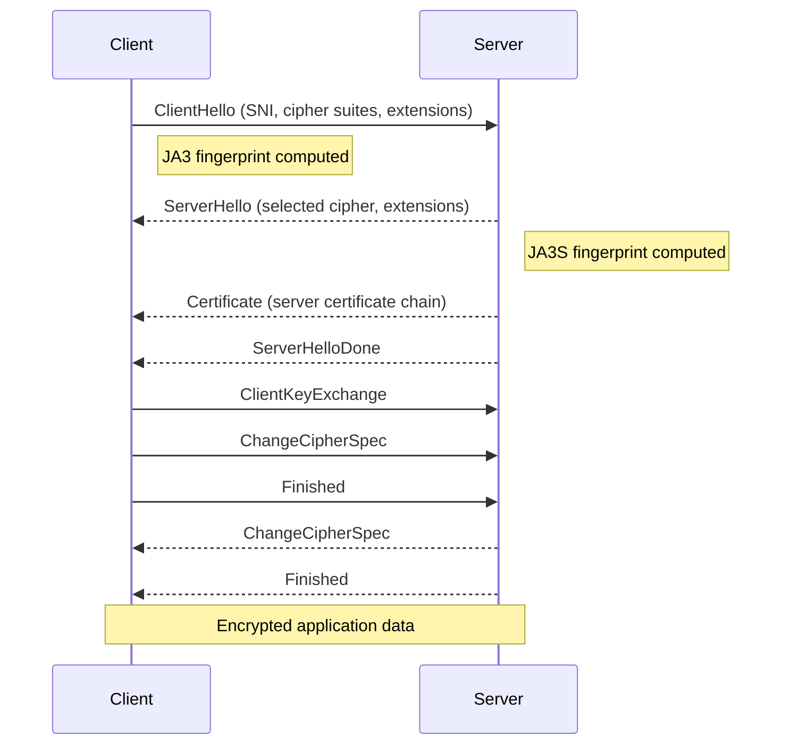

# TLS Inspection

The TLS analyzer inspects handshake messages without decrypting traffic. It extracts connection metadata from ClientHello and ServerHello messages, including SNI, cipher suites, and TLS fingerprints.

## TLS Handshake Analysis



lippycat captures and parses the unencrypted handshake messages at the start of every TLS connection.

Start TLS capture:

```bash
sudo lc sniff tls -i eth0
```

Filter by Server Name Indication (SNI):

```bash
# Specific domain
sudo lc sniff tls -i eth0 --sni example.com

# Wildcard
sudo lc sniff tls -i eth0 --sni "*.example.com"

# Bulk filtering from file
sudo lc sniff tls -i eth0 --sni-file domains.txt
```

## JA3 and JA3S Fingerprinting

JA3 creates a fingerprint of a TLS client by hashing the following fields from the ClientHello message:

```
TLS Version | Cipher Suites | Extensions | Elliptic Curves | EC Point Formats
```

These fields are concatenated and MD5-hashed to produce a 32-character fingerprint. Because different applications construct their ClientHello differently (different cipher suite orderings, different extensions), the JA3 fingerprint identifies the client software regardless of IP address.

JA3S applies the same concept to the ServerHello, fingerprinting the server's response (TLS version, selected cipher suite, extensions).

lippycat computes both automatically:

| Field            | Description                  | JSON Path                  |
| ---------------- | ---------------------------- | -------------------------- |
| JA3 String       | Raw fingerprint input        | `.TLSData.JA3String`       |
| JA3 Fingerprint  | MD5 hash                     | `.TLSData.JA3Fingerprint`  |
| JA3S String      | Raw server fingerprint input | `.TLSData.JA3SString`      |
| JA3S Fingerprint | MD5 hash                     | `.TLSData.JA3SFingerprint` |
| JA4 Fingerprint  | Modern fingerprint format    | `.TLSData.JA4Fingerprint`  |

> **JA4 compatibility note:** Builds containing the standards-correctness fix
> use SHA-256 (truncated to 12 hexadecimal characters) and the first/last ALPN
> character transformation required by JA4. Fingerprints produced by older
> lippycat builds used a non-standard truncated MD5 value and may also encode
> ALPN differently. Replace stored JA4 fingerprints and `tls_ja4` filters with
> values generated by a conforming JA4 implementation. lippycat does not
> silently match both formats. A runtime compatibility warning is not emitted
> because legacy and standard values have the same syntax and cannot be
> distinguished reliably.

**Filter by known fingerprint:**

```bash
# Capture traffic matching a known malware JA3 fingerprint
sudo lc sniff tls -i eth0 --ja3 "e7d705a3286e19ea42f587b344ee6865"

# Load multiple fingerprints from a threat intelligence file
sudo lc sniff tls -i eth0 --ja3-file known-bad-ja3.txt
```

**Build a fingerprint inventory:**

```bash
# List unique JA3 fingerprints with SNI
sudo lc sniff tls -i eth0 2>/dev/null | \
  jq -r 'select(.TLSData.HandshakeType == "ClientHello") |
    [.SrcIP, .TLSData.SNI, .TLSData.JA3Fingerprint] | @tsv' | \
  sort -u
```

## TLS Metadata Fields

| Field           | Description                                | JSON Path                  |
| --------------- | ------------------------------------------ | -------------------------- |
| Handshake Type  | ClientHello, ServerHello, Certificate      | `.TLSData.HandshakeType`   |
| TLS Version     | Negotiated version (e.g., "TLS 1.3")       | `.TLSData.Version`         |
| SNI             | Server Name Indication                     | `.TLSData.SNI`             |
| Cipher Suites   | Offered cipher suites (ClientHello)        | `.TLSData.CipherSuites`    |
| Selected Cipher | Chosen cipher suite (ServerHello)          | `.TLSData.SelectedCipher`  |
| ALPN Protocols  | Application protocols (e.g., h2, http/1.1) | `.TLSData.ALPNProtocols`   |
| Handshake Time  | ClientHello to ServerHello latency (ms)    | `.TLSData.HandshakeTimeMs` |
| Risk Score      | Security risk assessment (0.0-1.0)         | `.TLSData.RiskScore`       |

## Common TLS Investigations

**Detect weak TLS versions:**

```bash
sudo lc sniff tls -i eth0 2>/dev/null | \
  jq -r 'select(.TLSData.Version == "TLS 1.0" or .TLSData.Version == "TLS 1.1") |
    [.Timestamp, .SrcIP, .DstIP, .TLSData.SNI, .TLSData.Version] | @tsv'
```

**Correlate ClientHello with ServerHello:**

lippycat correlates handshake pairs when `--track-connections` is enabled (the default). Correlated pairs include the handshake latency:

```bash
sudo lc sniff tls -i eth0 2>/dev/null | \
  jq -r 'select(.TLSData.CorrelatedPeer) |
    [.Timestamp, .TLSData.SNI, (.TLSData.HandshakeTimeMs|tostring) + "ms"] |
    @tsv'
```

**High-risk connections:**

```bash
sudo lc sniff tls -i eth0 2>/dev/null | \
  jq -r 'select(.TLSData.RiskScore > 0.5) |
    [.Timestamp, .SrcIP, .TLSData.SNI, .TLSData.Version,
     "risk=" + (.TLSData.RiskScore|tostring)] | @tsv'
```
