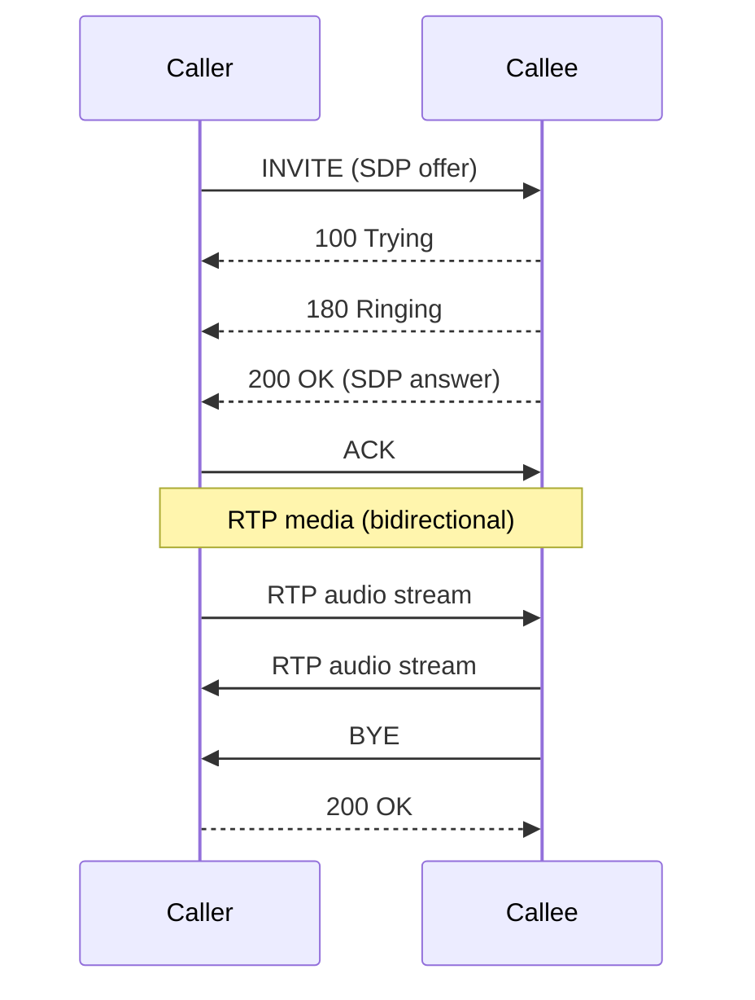
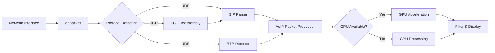

# VoIP: SIP and RTP Analysis

VoIP analysis is lippycat's most mature protocol mode. It tracks SIP signaling dialogs, correlates RTP media streams with their controlling SIP sessions, and supports per-call PCAP extraction for offline analysis.

## SIP Signaling Flow

SIP (Session Initiation Protocol) uses a request/response model to establish, modify, and tear down voice and video calls. lippycat tracks the full dialog lifecycle. A typical successful call follows this sequence:



lippycat parses each SIP message and extracts:

| Field             | Description                         | JSON Path                              |
| ----------------- | ----------------------------------- | -------------------------------------- |
| Call-ID           | Unique dialog identifier            | `.VoIPData.CallID`                     |
| Method            | SIP request method                  | `.VoIPData.Method`                     |
| Status            | Response code (e.g., 200)           | `.VoIPData.Status`                     |
| From / To         | SIP URI endpoints                   | `.VoIPData.From`, `.VoIPData.To`       |
| From-Tag / To-Tag | Dialog correlation tags             | `.VoIPData.FromTag`, `.VoIPData.ToTag` |
| User              | Username extracted from URI         | `.VoIPData.User`                       |
| Content-Type      | Body type (e.g., `application/sdp`) | `.VoIPData.ContentType`                |

**SIP methods lippycat recognizes:** INVITE, ACK, BYE, CANCEL, REGISTER, OPTIONS, PRACK, UPDATE, INFO, REFER, SUBSCRIBE, NOTIFY, MESSAGE, PUBLISH.

## Capturing SIP Traffic

Basic VoIP capture shows all SIP and RTP traffic on an interface:

```bash
sudo lc sniff voip -i eth0
```

Filter by SIP user to focus on specific endpoints:

```bash
# Single user
sudo lc sniff voip -i eth0 -u alicent

# Multiple users
sudo lc sniff voip -i eth0 -u "alicent,robb"

# Wildcard suffix match (all numbers ending in 456789)
sudo lc sniff voip -i eth0 -u "*456789"
```

Extract call setup information with `jq`:

```bash
# Show all INVITE requests with caller and callee
sudo lc sniff voip -i eth0 2>/dev/null | \
  jq -r 'select(.VoIPData.Method == "INVITE") |
    [.Timestamp, .VoIPData.From, .VoIPData.To, .VoIPData.CallID] |
    @tsv'

# Track call state transitions for a specific Call-ID
sudo lc sniff voip -i eth0 2>/dev/null | \
  jq -r 'select(.VoIPData.CallID == "abc123@pbx.local") |
    [.Timestamp, .VoIPData.Method // ("Response " + (.VoIPData.Status|tostring))] |
    @tsv'
```

## SIP Transport: UDP vs TCP

SIP runs over both UDP and TCP. UDP is more common for signaling, but TCP is used for large messages (e.g., SIP with SDP that exceeds the MTU) and is required for TLS-encrypted SIP (SIPS).

By default, lippycat captures both UDP and TCP SIP traffic. TCP SIP requires stream reassembly, which adds CPU overhead. On networks with heavy TCP traffic that is not SIP, you can skip TCP processing entirely:

```bash
# UDP-only mode -- generates optimized BPF filter excluding TCP
sudo lc sniff voip -i eth0 -U -S 5060
```

When TCP SIP is needed, choose a performance profile to tune reassembly parameters (see [CLI Capture with `lc sniff`](../part2-local-capture/sniff.md#tcp-performance-modes)):

```bash
sudo lc sniff voip -i eth0 -M throughput
```

## RTP and SRTP Media Streams

Once a SIP dialog is established, media flows as RTP (Real-time Transport Protocol) packets. lippycat detects RTP streams by identifying packets within configured port ranges (default: 10000-32768) that match the RTP header structure.

Each RTP packet carries metadata that lippycat extracts:

| Field           | Description                       | JSON Path               |
| --------------- | --------------------------------- | ----------------------- |
| SSRC            | Synchronization Source identifier | `.VoIPData.SSRC`        |
| Sequence Number | Packet ordering                   | `.VoIPData.SequenceNum` |
| Timestamp       | Media timing                      | `.VoIPData.Timestamp`   |
| Payload Type    | Codec identifier                  | `.VoIPData.PayloadType` |
| Codec           | Codec name (from SDP)             | `.VoIPData.Codec`       |

lippycat correlates RTP streams with their controlling SIP dialog using the Call-ID. When RTP packets arrive before the corresponding SIP INVITE (which happens when capture starts mid-call), lippycat creates a synthetic call record and merges it when the SIP signaling appears.

**Monitoring RTP streams:**

```bash
# Show active RTP streams with SSRC and codec
sudo lc sniff voip -i eth0 2>/dev/null | \
  jq -r 'select(.VoIPData.IsRTP) |
    [.SrcIP, .DstIP, .VoIPData.SSRC, .VoIPData.Codec, .VoIPData.SequenceNum] |
    @tsv'

# Detect RTP sequence gaps (potential packet loss)
sudo lc sniff voip -i eth0 2>/dev/null | \
  jq -r 'select(.VoIPData.IsRTP) |
    [.VoIPData.SSRC, .VoIPData.SequenceNum] | @tsv' | \
  awk -F'\t' '{
    if (prev[$1] != "" && $2 != (prev[$1]+1) % 65536)
      print "Gap: SSRC="$1, "expected="(prev[$1]+1)%65536, "got="$2;
    prev[$1] = $2
  }'
```

**Custom RTP port ranges:**

If your PBX uses non-standard RTP ports, specify the range explicitly:

```bash
sudo lc sniff voip -i eth0 -R 8000-9000
sudo lc sniff voip -i eth0 -R "8000-9000,40000-50000"
```

## Call Quality Metrics

RTP sequence numbers and timestamps enable call quality analysis. While lippycat captures the raw RTP metadata, you can derive standard quality metrics from the JSON output:

**Packet Loss**: Detected by gaps in the RTP sequence number. The sequence number is a 16-bit counter that increments by one for each packet, wrapping at 65535.

**Jitter**: Variation in inter-packet arrival time. Calculate by comparing the expected inter-arrival interval (based on RTP timestamps) against actual arrival times.

**MOS (Mean Opinion Score)**: An estimated voice quality rating from 1.0 (bad) to 5.0 (excellent). MOS is derived from the R-factor, which accounts for codec, packet loss, jitter, and delay. A MOS above 4.0 is considered good quality.

Example: calculate packet loss percentage per SSRC from a PCAP file:

```bash
lc sniff voip -r call-recording.pcap 2>/dev/null | \
  jq -r 'select(.VoIPData.IsRTP) |
    [.VoIPData.SSRC, .VoIPData.SequenceNum] | @tsv' | \
  awk -F'\t' '
    { count[$1]++; seq[$1] = $2 }
    END {
      for (ssrc in count) {
        # Expected = max_seq - min_seq + 1 (approximate)
        loss = 1 - (count[ssrc] / (count[ssrc] + 0.001))
        printf "SSRC=%s packets=%d\n", ssrc, count[ssrc]
      }
    }'
```

For production call quality monitoring, export RTP data to a dedicated monitoring system or use the TUI's real-time call view (see [Interactive Capture with `lc watch`](../part2-local-capture/watch-local.md)).

## Per-Call PCAP Workflow

Per-call PCAP writing creates separate capture files for each VoIP call, making it straightforward to archive, replay, or share individual call recordings.

The per-call PCAP feature is available on processor and tap nodes. It creates two files per call:

```
20250123_143022_abc123_sip.pcap    # SIP signaling packets
20250123_143022_abc123_rtp.pcap    # RTP media packets
```

**Standalone capture with per-call PCAP (tap mode):**

```bash
sudo lc tap voip -i eth0 \
  --per-call-pcap \
  --per-call-pcap-dir /var/voip/calls \
  --per-call-pcap-pattern "{timestamp}_{callid}.pcap" \
  --insecure
```

**Distributed capture with per-call PCAP (processor):**

```bash
lc process --listen :55555 \
  --per-call-pcap \
  --per-call-pcap-dir /var/capture/calls \
  --pcap-command 'gzip %pcap%' \
  --tls-cert server.crt --tls-key server.key
```

The `--pcap-command` hook runs when each PCAP file is closed, enabling automatic compression, upload, or archival. The `--voip-command` hook runs when an entire call completes (both SIP and RTP files are finalized):

```bash
lc process --listen :55555 \
  --per-call-pcap --per-call-pcap-dir /var/capture/calls \
  --pcap-command 'gzip %pcap%' \
  --voip-command '/opt/scripts/process-call.sh %callid% %dirname%' \
  --tls-cert server.crt --tls-key server.key
```

Pattern placeholders for filenames: `{callid}`, `{from}`, `{to}`, `{timestamp}`.

The PCAP grace period (`--pcap-grace-period`, default 5 seconds) controls how long lippycat waits after the last packet before closing a call's PCAP files. This accommodates late-arriving RTP packets and retransmissions.

For full per-call PCAP configuration, see [Central Aggregation with `lc process`](../part3-distributed/process.md#per-call-pcap-voip) and [Standalone Mode with `lc tap`](../part3-distributed/tap.md).

## VoIP Data Flow

Understanding how packets move through the VoIP analyzer helps with troubleshooting and performance tuning:



UDP SIP packets are parsed directly. TCP SIP packets go through the reassembly engine first (configured by `--tcp-performance-mode`). RTP packets are detected by header structure within the configured port range. The VoIP Packet Processor correlates RTP streams with SIP dialogs using the Call-ID. GPU acceleration, when available, offloads pattern matching for SIP user filtering.
