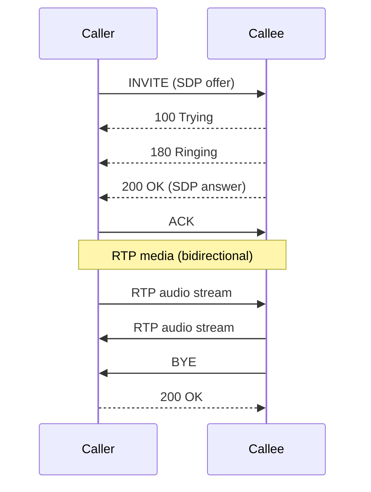
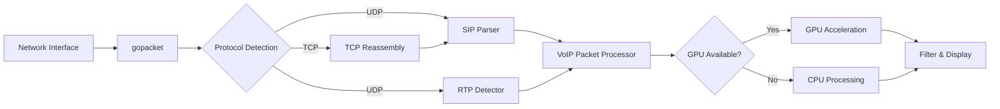

# VoIP: SIP and RTP Analysis {#voip-sip-and-rtp-analysis}

VoIP analysis is lippycat's most mature protocol mode. It tracks SIP signaling dialogs, correlates RTP media streams with their controlling SIP sessions, and supports per-call PCAP extraction for offline analysis.

## SIP Signaling Flow {#sip-signaling-flow}

SIP (Session Initiation Protocol) uses a request/response model to establish, modify, and tear down voice and video calls. lippycat tracks the full dialog lifecycle. A typical successful call follows this sequence:

<!-- i18n:skip -->


```mermaid
sequenceDiagram
    participant Caller
    participant Callee

    Caller->>Callee: INVITE (SDP offer)
    Callee-->>Caller: 100 Trying
    Callee-->>Caller: 180 Ringing
    Callee-->>Caller: 200 OK (SDP answer)
    Caller->>Callee: ACK

    Note over Caller,Callee: RTP media (bidirectional)
    Caller->>Callee: RTP audio stream
    Callee->>Caller: RTP audio stream

    Callee->>Caller: BYE
    Caller-->>Callee: 200 OK
```

lippycat parses each SIP message and extracts:

| Field             | Description                         | JSON Path                              |
| ----------------- | ----------------------------------- | -------------------------------------- |
| Call-ID           | Unique dialog identifier            | `.VoIPData.CallID`                     |
| Method            | SIP request method                  | `.VoIPData.Method`                     |
| Status            | Response code (e.g., 200)           | `.VoIPData.Status`                     |
| From / To         | SIP URI endpoints                   | `.VoIPData.From`, `.VoIPData.To`       |
| From-Tag / To-Tag | Dialog correlation tags             | `.VoIPData.FromTag`, `.VoIPData.ToTag` |
| User              | Username extracted from URI         | `.VoIPData.User`                       |
| Content-Type      | Body type (e.g., `application/sdp`) | `.VoIPData.ContentType`                |

**SIP methods lippycat recognizes:** INVITE, ACK, BYE, CANCEL, REGISTER, OPTIONS, PRACK, UPDATE, INFO, REFER, SUBSCRIBE, NOTIFY, MESSAGE, PUBLISH.

## Capturing SIP Traffic {#capturing-sip-traffic}

Basic VoIP capture shows all SIP and RTP traffic on an interface:

<!-- i18n:skip -->

```bash
sudo lc sniff voip -i eth0
```

Filter by SIP user to focus on specific endpoints:

For a single user:

<!-- i18n:skip -->

```bash
sudo lc sniff voip -i eth0 -u alicent
```

For multiple users:

<!-- i18n:skip -->

```bash
sudo lc sniff voip -i eth0 -u "alicent,robb"
```

For a wildcard suffix match (all numbers ending in `456789`):

<!-- i18n:skip -->

```bash
sudo lc sniff voip -i eth0 -u "*456789"
```

Extract call setup information with `jq`:

To show all INVITE requests with caller and callee:

<!-- i18n:skip -->

```bash
sudo lc sniff voip -i eth0 2>/dev/null | \
  jq -r 'select(.VoIPData.Method == "INVITE") |
    [.Timestamp, .VoIPData.From, .VoIPData.To, .VoIPData.CallID] |
    @tsv'
```

To track call state transitions for a specific Call-ID:

<!-- i18n:skip -->

```bash
sudo lc sniff voip -i eth0 2>/dev/null | \
  jq -r 'select(.VoIPData.CallID == "abc123@pbx.local") |
    [.Timestamp, .VoIPData.Method // ("Response " + (.VoIPData.Status|tostring))] |
    @tsv'
```

## SIP Transport: UDP vs TCP {#sip-transport-udp-vs-tcp}

SIP runs over both UDP and TCP. UDP is more common for signaling, but TCP is used for large messages (e.g., SIP with SDP that exceeds the MTU) and is required for TLS-encrypted SIP (SIPS).

By default, lippycat captures both UDP and TCP SIP traffic. TCP SIP requires stream reassembly, which adds CPU overhead. On networks with heavy TCP traffic that is not SIP, you can skip TCP processing entirely:

UDP-only mode generates an optimized BPF filter that excludes TCP:

<!-- i18n:skip -->

```bash
sudo lc sniff voip -i eth0 -U -S 5060
```

When TCP SIP is needed, choose a performance profile to tune reassembly parameters (see [CLI Capture with `lc sniff`](../part2-local-capture/sniff.md#tcp-performance-modes)):

<!-- i18n:skip -->

```bash
sudo lc sniff voip -i eth0 -M throughput
```

## RTP and SRTP Media Streams {#rtp-and-srtp-media-streams}

Once a SIP dialog is established, media flows as RTP (Real-time Transport Protocol) packets. lippycat detects RTP streams by identifying packets within configured port ranges (default: 10000-32768) that match the RTP header structure.

Each RTP packet carries metadata that lippycat extracts:

| Field           | Description                       | JSON Path               |
| --------------- | --------------------------------- | ----------------------- |
| SSRC            | Synchronization Source identifier | `.VoIPData.SSRC`        |
| Sequence Number | Packet ordering                   | `.VoIPData.SequenceNum` |
| Timestamp       | Media timing                      | `.VoIPData.Timestamp`   |
| Payload Type    | Codec identifier                  | `.VoIPData.PayloadType` |
| Codec           | Codec name (from SDP)             | `.VoIPData.Codec`       |

lippycat correlates RTP streams with their controlling SIP dialog using the Call-ID. When RTP packets arrive before the corresponding SIP INVITE (which happens when capture starts mid-call), lippycat creates a synthetic call record and merges it when the SIP signaling appears.

**Monitoring RTP streams:**

To show active RTP streams with SSRC and codec:

<!-- i18n:skip -->

```bash
sudo lc sniff voip -i eth0 2>/dev/null | \
  jq -r 'select(.VoIPData.IsRTP) |
    [.SrcIP, .DstIP, .VoIPData.SSRC, .VoIPData.Codec, .VoIPData.SequenceNum] |
    @tsv'
```

To detect RTP sequence gaps (potential packet loss):

<!-- i18n:skip -->

```bash
sudo lc sniff voip -i eth0 2>/dev/null | \
  jq -r 'select(.VoIPData.IsRTP) |
    [.VoIPData.SSRC, .VoIPData.SequenceNum] | @tsv' | \
  awk -F'\t' '{
    if (prev[$1] != "" && $2 != (prev[$1]+1) % 65536)
      print "Gap: SSRC="$1, "expected="(prev[$1]+1)%65536, "got="$2;
    prev[$1] = $2
  }'
```

**Custom RTP port ranges:**

If your PBX uses non-standard RTP ports, specify the range explicitly:

<!-- i18n:skip -->

```bash
sudo lc sniff voip -i eth0 -R 8000-9000
```

<!-- i18n:skip -->

```bash
sudo lc sniff voip -i eth0 -R "8000-9000,40000-50000"
```

## Call Quality Metrics {#call-quality-metrics}

RTP sequence numbers and timestamps enable call quality analysis. While lippycat captures the raw RTP metadata, you can derive standard quality metrics from the JSON output:

**Packet Loss**: Detected by gaps in the RTP sequence number. The sequence number is a 16-bit counter that increments by one for each packet, wrapping at 65535.

**Jitter**: Variation in inter-packet arrival time. Calculate by comparing the expected inter-arrival interval (based on RTP timestamps) against actual arrival times.

**MOS (Mean Opinion Score)**: An estimated voice quality rating from 1.0 (bad) to 5.0 (excellent). MOS is derived from the R-factor, which accounts for codec, packet loss, jitter, and delay. A MOS above 4.0 is considered good quality.

Example: calculate packet loss percentage per SSRC from a PCAP file:

The following command analyzes a recording by SSRC. The comment inside the `awk` program is part of that program and remains with it:

<!-- i18n:skip -->

```bash
lc sniff voip -r call-recording.pcap 2>/dev/null | \
  jq -r 'select(.VoIPData.IsRTP) |
    [.VoIPData.SSRC, .VoIPData.SequenceNum] | @tsv' | \
  awk -F'\t' '
    { count[$1]++; seq[$1] = $2 }
    END {
      for (ssrc in count) {
        # Expected = max_seq - min_seq + 1 (approximate)
        loss = 1 - (count[ssrc] / (count[ssrc] + 0.001))
        printf "SSRC=%s packets=%d\n", ssrc, count[ssrc]
      }
    }'
```

For production call quality monitoring, export RTP data to a dedicated monitoring system or use the TUI's real-time call view (see [Interactive Capture with `lc watch`](../part2-local-capture/watch-local.md)).

## Per-Call PCAP Workflow {#per-call-pcap-workflow}

Per-call PCAP writing creates separate capture files for each VoIP call, making it straightforward to archive, replay, or share individual call recordings.

The per-call PCAP feature is available on processor and tap nodes. It creates two files per call:

<!-- i18n:skip -->

```
20250123_143022_abc123_sip.pcap    # SIP signaling packets
20250123_143022_abc123_rtp.pcap    # RTP media packets
```

**Standalone capture with per-call PCAP (tap mode):**

<!-- i18n:skip -->

```bash
sudo lc tap voip -i eth0 \
  --per-call-pcap \
  --per-call-pcap-dir /var/voip/calls \
  --per-call-pcap-pattern "{timestamp}_{callid}.pcap" \
  --insecure
```

**Distributed capture with per-call PCAP (processor):**

<!-- i18n:skip -->

```bash
lc process --listen :55555 \
  --per-call-pcap \
  --per-call-pcap-dir /var/capture/calls \
  --pcap-command 'gzip %pcap%' \
  --tls-cert server.crt --tls-key server.key
```

The `--pcap-command` hook runs when each PCAP file is closed, enabling automatic compression, upload, or archival. The `--voip-command` hook runs when an entire call completes (both SIP and RTP files are finalized):

<!-- i18n:skip -->

```bash
lc process --listen :55555 \
  --per-call-pcap --per-call-pcap-dir /var/capture/calls \
  --pcap-command 'gzip %pcap%' \
  --voip-command '/opt/scripts/process-call.sh %callid% %dirname%' \
  --tls-cert server.crt --tls-key server.key
```

Pattern placeholders for filenames: `{callid}`, `{from}`, `{to}`, `{timestamp}`.

The PCAP grace period (`--pcap-grace-period`, default 5 seconds) controls how long lippycat waits after the last packet before closing a call's PCAP files. This accommodates late-arriving RTP packets and retransmissions.

For full per-call PCAP configuration, see [Central Aggregation with `lc process`](../part3-distributed/process.md#per-call-pcap-voip) and [Standalone Mode with `lc tap`](../part3-distributed/tap.md).

## VoIP Data Flow {#voip-data-flow}

Understanding how packets move through the VoIP analyzer helps with troubleshooting and performance tuning:

<!-- i18n:skip -->


```mermaid
flowchart LR
    A[Network Interface] --> B[gopacket]
    B --> C{Protocol Detection}
    C -->|UDP| D[SIP Parser]
    C -->|UDP| E[RTP Detector]
    C -->|TCP| F[TCP Reassembly]
    F --> D
    D --> G[VoIP Packet Processor]
    E --> G
    G --> H{GPU Available?}
    H -->|Yes| I[GPU Acceleration]
    H -->|No| J[CPU Processing]
    I --> K[Filter & Display]
    J --> K
```

UDP SIP packets are parsed directly. TCP SIP packets go through the reassembly engine first (configured by `--tcp-performance-mode`). RTP packets are detected by header structure within the configured port range. The VoIP Packet Processor correlates RTP streams with SIP dialogs using the Call-ID. GPU acceleration, when available, offloads pattern matching for SIP user filtering.

## Selective media capture with eBPF {#selective-media-capture-with-ebpf}

`hunt voip --rtp-ebpf` and `tap voip --rtp-ebpf` can reject unrelated media before
libpcap delivers it for userspace decoding. This explicitly enabled Linux path
keeps the libpcap reader and updates a persistent socket filter's maps as selected
calls change. It does not restart capture for call activity. Existing userspace
ownership, filter attribution, expiry and output checks remain authoritative.

Call-selected media is captured only after selection and endpoint publication.
Bounded validated SDP metadata may be retained before selection; RTP history is
not retained. Independent IP/CIDR filters and the configured no-filter policy
continue to apply.

Shared SDP learning retains valid independent media sections before and after an
invalid section, with exact numeric IP/port endpoints only. It performs no DNS,
ICE-candidate, or address-range inference. RTP and UDP/TLS/RTP profiles are
supported for audio, video, and other media kinds. RTCP defaults to the next port;
an explicit RTCP port/address overrides that default, while RTCP mux uses one
shared endpoint. Invalid media, connection, or RTCP data invalidates its affected
section without reusing a previous section's address. Invalid session connection
data prevents inherited endpoints; a later valid media-level address can still
be used. Zero ports, inactive media, and unspecified hold addresses contribute
no new endpoints. Previously accepted endpoints remain until authoritative call
lifetime cleanup. At capacity, only the first unique endpoints in wire order
within the configured bound are retained, and derivation remains incomplete.
Incomplete selected-call derivation applies the configured admission failure
policy and blocks enforcement recovery until a complete later description or
retirement of the affected lifetime. These shared endpoint semantics also apply
with eBPF disabled; opening kernel admission never invents userspace attribution.

With `--rtp-ebpf`, you do not need `--rtp-port-range`: RTP and RTCP endpoints
are learned from the selected call's SDP, including endpoints outside the
generated default 10000–32768 range. Use `--sip-port` to narrow signaling capture
to your SIP ports; it is optional, and omitting it preserves discovery on
arbitrary ports. For example:

<!-- i18n:skip -->

```bash
sudo lc hunt voip --processor processor:55555 -i eth0 \
  --rtp-ebpf --sip-port 5060 --tls-ca ca.crt
```

If you explicitly set `--rtp-port-range`, it remains a capture restriction:
learned media endpoints outside that range are excluded. An explicit `--filter`
also remains in effect and must allow the signaling and media you want to capture.

Explicit SIP ports also narrow non-media UDP discovery: a datagram without a
confident RTP/RTCP header is excluded outside those signaling ports, even on an
explicit media-range port. Disabled admission's ordinary port-based BPF can admit
such a datagram. Shadow and degraded-open modes preserve this explicit narrowing.

With `--rtp-ebpf`, including shadow mode, hunt and tap IP/CIDR selectors admit
eligible media independently of selected-call endpoints. They never bypass
explicit packet predicates or userspace output checks. With eBPF disabled, tap
routes IP/CIDR filters through classic BPF. In mixed IP and SIP-identity filter
configurations, an IP-matched RTP packet can be captured but rejected by userspace
because it has no selected-call association. Disabling admission therefore does
not preserve this mixed-filter output for unassociated media. True IP-only tap
configurations have no SIP-identity filter requiring that association. Hunter
IP/CIDR media selection remains independent with eBPF enabled or disabled.

`--rtp-ebpf-mode=shadow` records bounded decisions while retaining dynamic media
reception. Runtime update failures default to scoped broad admission, preserving
explicit capture restrictions; `--rtp-ebpf-failure-policy=closed` keeps valid
installed entries without opening. A failed mode-control write is reported
separately. Enforcement resumes only after complete current-state reconciliation.
Startup failure never silently enables shadow or broad capture.

`--rtp-ebpf-shadow-sample-every` (default `1`) samples approximately one in every
positive N decisions; YAML uses `rtp_ebpf.shadow_sample_every` beneath the role's
VoIP settings. This setting alone does not enable admission. Correlation retains
bounded transient frame evidence for at most two `pending_ttl` intervals and
requires a unique kernel sample, the captured frame, verified selected-lifetime
attribution, and historical publication generation. Frames over 256 bytes,
truncated or duplicate evidence, late samples, missing ownership, and changed
endpoint revisions remain incomplete. Status exposes no packet contents or call
identities. Kernel-ring loss, retained-sample overwrite, malformed samples,
collection errors, and incomplete correlation have separate counters. Classified
rejections are sampled observations, never exact whole-traffic rejection counts
or proof of parity.

Missing-media diagnostics distinguish unknown endpoint derivation from
intentionally inactive media. An accepted endpoint or completeness revision
resets the expectation, so an earlier media packet cannot mask a subsequent
media move. Per-owner notices are bounded and rate-limited and identify only a
transient numeric owner reference. They never widen admission automatically.

All interfaces share one observation domain by default. Explicit domain settings
separate overlapping local traffic and must put related signaling/media together.
Ethernet is supported; cooked `any` capture and explicit VLAN predicates are
rejected. Fragments, complex extension chains and supported encapsulation may
pass a counted compatibility path, reducing selectivity. Unknown packets and
missing-media diagnostics do not open a domain.

Reassembled tap TCP signaling uses the interface and capture timestamp of the
message's final contributing byte. Interfaces in the same observation domain
share framing, including queued segments, but each synthesized message retains
its actual contributing source. Interfaces in separate domains never complete
one another's frames. TCP-signaled calls share the same capacity accounting as
UDP-signaled calls. Terminal dialog responses complete only after processor
handling (or an explicit injection drop), preserving trailing-media grace and
lifetime-specific cleanup. With admission disabled, nonpositive call limits
retain the legacy default; configured positive budgets remain enforced.

Socket admission requires Linux AF_PACKET sockets, `SO_ATTACH_BPF`, enabled BPF
syscalls, the required map types, and ring-buffer helpers. Ring buffers were
introduced in Linux 5.8; that is a feature floor, not a universally verified
minimum kernel version. Kernel configuration, verifier behavior, distribution
policy, and container restrictions can still reject startup. Packet sockets
require `CAP_NET_RAW`; privileged BPF object operations require `CAP_BPF` or the
older `CAP_SYS_ADMIN` fallback. `CAP_NET_ADMIN` is not a general socket-filter
loader requirement; capture configuration may independently require permission.
Before Linux 5.11, BPF memory commonly counts against `RLIMIT_MEMLOCK`; newer
kernels can use memory-cgroup accounting. The application does not automatically
raise the locked-memory limit. See the [Linux BPF loader](https://github.com/torvalds/linux/blob/v6.18/kernel/bpf/syscall.c),
[ring-buffer documentation](https://docs.kernel.org/bpf/ringbuf.html), and
[memory-accounting guidance](https://ebpf-go.dev/concepts/rlimit/).

Enabled handles use immediate mode and retire retained socket/ring data before
activation; subsequent packets are not compared to a permanent wall-clock
boundary. Startup drain is bounded and permits packet loss. Unsupported links,
explicit VLAN predicates, offline use, unsupported packet-mmap retirement,
loading, attachment, or draining errors fail startup explicitly.

See the [configuration reference](../appendices/config-reference.md#voip-ebpf-media-admission)
for all resource bounds. The repository's `docs/VOIP_EBPF_ADMISSION.md` provides
platform, privilege, diagnostic and verification details; the implementation plan
records current integration status. libpcap remains a cgo dependency, and cgo does
not disable goroutine concurrency.
