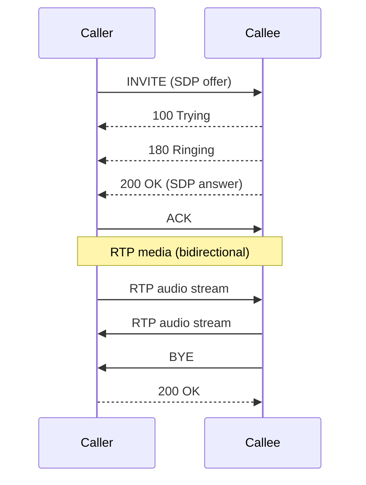
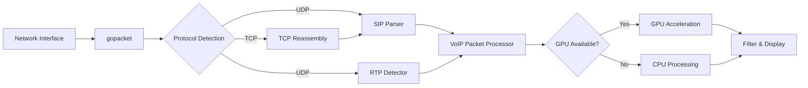

# VoIP: SIP and RTP Analysis {#voip-sip-and-rtp-analysis}

VoIP analysis is lippycat's most mature protocol mode. It tracks SIP signaling dialogs, correlates RTP media streams with their controlling SIP sessions, and supports per-call PCAP extraction for offline analysis.

## SIP Signaling Flow {#sip-signaling-flow}

SIP (Session Initiation Protocol) uses a request/response model to establish, modify, and tear down voice and video calls. lippycat tracks the full dialog lifecycle. A typical successful call follows this sequence:

<!-- i18n:skip -->


```mermaid
sequenceDiagram
    participant Caller
    participant Callee

    Caller->>Callee: INVITE (SDP offer)
    Callee-->>Caller: 100 Trying
    Callee-->>Caller: 180 Ringing
    Callee-->>Caller: 200 OK (SDP answer)
    Caller->>Callee: ACK

    Note over Caller,Callee: RTP media (bidirectional)
    Caller->>Callee: RTP audio stream
    Callee->>Caller: RTP audio stream

    Callee->>Caller: BYE
    Caller-->>Callee: 200 OK
```

lippycat parses each SIP message and extracts:

| Field             | Description                         | JSON Path                              |
| ----------------- | ----------------------------------- | -------------------------------------- |
| Call-ID           | Unique dialog identifier            | `.VoIPData.CallID`                     |
| Method            | SIP request method                  | `.VoIPData.Method`                     |
| Status            | Response code (e.g., 200)           | `.VoIPData.Status`                     |
| From / To         | SIP URI endpoints                   | `.VoIPData.From`, `.VoIPData.To`       |
| From-Tag / To-Tag | Dialog correlation tags             | `.VoIPData.FromTag`, `.VoIPData.ToTag` |
| User              | Username extracted from URI         | `.VoIPData.User`                       |
| Content-Type      | Body type (e.g., `application/sdp`) | `.VoIPData.ContentType`                |

**SIP methods lippycat recognizes:** INVITE, ACK, BYE, CANCEL, REGISTER, OPTIONS, PRACK, UPDATE, INFO, REFER, SUBSCRIBE, NOTIFY, MESSAGE, PUBLISH.

## Capturing SIP Traffic {#capturing-sip-traffic}

Basic VoIP capture shows all SIP and RTP traffic on an interface:

<!-- i18n:skip -->

```bash
sudo lc sniff voip -i eth0
```

Filter by SIP user to focus on specific endpoints:

For a single user:

<!-- i18n:skip -->

```bash
sudo lc sniff voip -i eth0 -u alicent
```

For multiple users:

<!-- i18n:skip -->

```bash
sudo lc sniff voip -i eth0 -u "alicent,robb"
```

For a wildcard suffix match (all numbers ending in `456789`):

<!-- i18n:skip -->

```bash
sudo lc sniff voip -i eth0 -u "*456789"
```

Extract call setup information with `jq`:

To show all INVITE requests with caller and callee:

<!-- i18n:skip -->

```bash
sudo lc sniff voip -i eth0 2>/dev/null | \
  jq -r 'select(.VoIPData.Method == "INVITE") |
    [.Timestamp, .VoIPData.From, .VoIPData.To, .VoIPData.CallID] |
    @tsv'
```

To track call state transitions for a specific Call-ID:

<!-- i18n:skip -->

```bash
sudo lc sniff voip -i eth0 2>/dev/null | \
  jq -r 'select(.VoIPData.CallID == "abc123@pbx.local") |
    [.Timestamp, .VoIPData.Method // ("Response " + (.VoIPData.Status|tostring))] |
    @tsv'
```

## SIP Transport: UDP vs TCP {#sip-transport-udp-vs-tcp}

SIP runs over both UDP and TCP. UDP is more common for signaling, but TCP is used for large messages (e.g., SIP with SDP that exceeds the MTU) and is required for TLS-encrypted SIP (SIPS).

By default, lippycat captures both UDP and TCP SIP traffic. TCP SIP requires stream reassembly, which adds CPU overhead. On networks with heavy TCP traffic that is not SIP, you can skip TCP processing entirely:

UDP-only mode generates an optimized BPF filter that excludes TCP:

<!-- i18n:skip -->

```bash
sudo lc sniff voip -i eth0 -U -S 5060
```

When TCP SIP is needed, choose a performance profile to tune reassembly parameters (see [CLI Capture with `lc sniff`](../part2-local-capture/sniff.md#tcp-performance-modes)):

<!-- i18n:skip -->

```bash
sudo lc sniff voip -i eth0 -M throughput
```

## RTP and SRTP Media Streams {#rtp-and-srtp-media-streams}

Once a SIP dialog is established, media flows as RTP (Real-time Transport Protocol) packets. lippycat detects RTP streams by identifying packets within configured port ranges (default: 10000-32768) that match the RTP header structure.

Each RTP packet carries metadata that lippycat extracts:

| Field           | Description                       | JSON Path               |
| --------------- | --------------------------------- | ----------------------- |
| SSRC            | Synchronization Source identifier | `.VoIPData.SSRC`        |
| Sequence Number | Packet ordering                   | `.VoIPData.SequenceNum` |
| Timestamp       | Media timing                      | `.VoIPData.Timestamp`   |
| Payload Type    | Codec identifier                  | `.VoIPData.PayloadType` |
| Codec           | Codec name (from SDP)             | `.VoIPData.Codec`       |

lippycat correlates RTP streams with their controlling SIP dialog using the Call-ID. When RTP packets arrive before the corresponding SIP INVITE (which happens when capture starts mid-call), lippycat creates a synthetic call record and merges it when the SIP signaling appears.

**Monitoring RTP streams:**

To show active RTP streams with SSRC and codec:

<!-- i18n:skip -->

```bash
sudo lc sniff voip -i eth0 2>/dev/null | \
  jq -r 'select(.VoIPData.IsRTP) |
    [.SrcIP, .DstIP, .VoIPData.SSRC, .VoIPData.Codec, .VoIPData.SequenceNum] |
    @tsv'
```

To detect RTP sequence gaps (potential packet loss):

<!-- i18n:skip -->

```bash
sudo lc sniff voip -i eth0 2>/dev/null | \
  jq -r 'select(.VoIPData.IsRTP) |
    [.VoIPData.SSRC, .VoIPData.SequenceNum] | @tsv' | \
  awk -F'\t' '{
    if (prev[$1] != "" && $2 != (prev[$1]+1) % 65536)
      print "Gap: SSRC="$1, "expected="(prev[$1]+1)%65536, "got="$2;
    prev[$1] = $2
  }'
```

**Custom RTP port ranges:**

If your PBX uses non-standard RTP ports, specify the range explicitly:

<!-- i18n:skip -->

```bash
sudo lc sniff voip -i eth0 -R 8000-9000
```

<!-- i18n:skip -->

```bash
sudo lc sniff voip -i eth0 -R "8000-9000,40000-50000"
```

## Call Quality Metrics {#call-quality-metrics}

RTP sequence numbers and timestamps enable call quality analysis. While lippycat captures the raw RTP metadata, you can derive standard quality metrics from the JSON output:

**Packet Loss**: Detected by gaps in the RTP sequence number. The sequence number is a 16-bit counter that increments by one for each packet, wrapping at 65535.

**Jitter**: Variation in inter-packet arrival time. Calculate by comparing the expected inter-arrival interval (based on RTP timestamps) against actual arrival times.

**MOS (Mean Opinion Score)**: An estimated voice quality rating from 1.0 (bad) to 5.0 (excellent). MOS is derived from the R-factor, which accounts for codec, packet loss, jitter, and delay. A MOS above 4.0 is considered good quality.

Example: calculate packet loss percentage per SSRC from a PCAP file:

The following command analyzes a recording by SSRC. The comment inside the `awk` program is part of that program and remains with it:

<!-- i18n:skip -->

```bash
lc sniff voip -r call-recording.pcap 2>/dev/null | \
  jq -r 'select(.VoIPData.IsRTP) |
    [.VoIPData.SSRC, .VoIPData.SequenceNum] | @tsv' | \
  awk -F'\t' '
    { count[$1]++; seq[$1] = $2 }
    END {
      for (ssrc in count) {
        # Expected = max_seq - min_seq + 1 (approximate)
        loss = 1 - (count[ssrc] / (count[ssrc] + 0.001))
        printf "SSRC=%s packets=%d\n", ssrc, count[ssrc]
      }
    }'
```

For production call quality monitoring, export RTP data to a dedicated monitoring system or use the TUI's real-time call view (see [Interactive Capture with `lc watch`](../part2-local-capture/watch-local.md)).

## Per-Call PCAP Workflow {#per-call-pcap-workflow}

Per-call PCAP writing creates separate capture files for each VoIP call, making it straightforward to archive, replay, or share individual call recordings.

The per-call PCAP feature is available on processor and tap nodes. It creates two files per call:

<!-- i18n:skip -->

```
20250123_143022_abc123_sip.pcap    # SIP signaling packets
20250123_143022_abc123_rtp.pcap    # RTP media packets
```

**Standalone capture with per-call PCAP (tap mode):**

<!-- i18n:skip -->

```bash
sudo lc tap voip -i eth0 \
  --per-call-pcap \
  --per-call-pcap-dir /var/voip/calls \
  --per-call-pcap-pattern "{timestamp}_{callid}.pcap" \
  --insecure
```

**Distributed capture with per-call PCAP (processor):**

<!-- i18n:skip -->

```bash
lc process --listen :55555 \
  --per-call-pcap \
  --per-call-pcap-dir /var/capture/calls \
  --pcap-command 'gzip %pcap%' \
  --tls-cert server.crt --tls-key server.key
```

The `--pcap-command` hook runs when each PCAP file is closed, enabling automatic compression, upload, or archival. The `--voip-command` hook runs when an entire call completes (both SIP and RTP files are finalized):

<!-- i18n:skip -->

```bash
lc process --listen :55555 \
  --per-call-pcap --per-call-pcap-dir /var/capture/calls \
  --pcap-command 'gzip %pcap%' \
  --voip-command '/opt/scripts/process-call.sh %callid% %dirname%' \
  --tls-cert server.crt --tls-key server.key
```

Pattern placeholders for filenames: `{callid}`, `{from}`, `{to}`, `{timestamp}`.

The PCAP grace period (`--pcap-grace-period`, default 5 seconds) controls how long lippycat waits after the last packet before closing a call's PCAP files. This accommodates late-arriving RTP packets and retransmissions.

For full per-call PCAP configuration, see [Central Aggregation with `lc process`](../part3-distributed/process.md#per-call-pcap-voip) and [Standalone Mode with `lc tap`](../part3-distributed/tap.md).

## VoIP Data Flow {#voip-data-flow}

Understanding how packets move through the VoIP analyzer helps with troubleshooting and performance tuning:

<!-- i18n:skip -->


```mermaid
flowchart LR
    A[Network Interface] --> B[gopacket]
    B --> C{Protocol Detection}
    C -->|UDP| D[SIP Parser]
    C -->|UDP| E[RTP Detector]
    C -->|TCP| F[TCP Reassembly]
    F --> D
    D --> G[VoIP Packet Processor]
    E --> G
    G --> H{GPU Available?}
    H -->|Yes| I[GPU Acceleration]
    H -->|No| J[CPU Processing]
    I --> K[Filter & Display]
    J --> K
```

UDP SIP packets are parsed directly. TCP SIP packets go through the reassembly engine first (configured by `--tcp-performance-mode`). RTP packets are detected by header structure within the configured port range. The VoIP Packet Processor correlates RTP streams with SIP dialogs using the Call-ID. GPU acceleration, when available, offloads pattern matching for SIP user filtering.

## Selective media capture with eBPF {#selective-media-capture-with-ebpf}

`hunt voip --rtp-ebpf` and `tap voip --rtp-ebpf` can reject unrelated media before
libpcap delivers it for userspace decoding. This explicitly enabled Linux path
keeps the libpcap reader and updates a persistent socket filter's maps as selected
calls change. It does not restart capture for call activity. Existing userspace
ownership, filter attribution, expiry and output checks remain authoritative.

Call-selected media is captured only after selection and endpoint publication.
Bounded validated SDP metadata may be retained before selection; RTP history is
not retained. Independent IP/CIDR filters and the configured no-filter policy
continue to apply.

Shared SDP learning retains valid independent media sections before and after an
invalid section, with exact numeric IP/port endpoints only. It performs no DNS,
ICE-candidate, or address-range inference. RTP and UDP/TLS/RTP profiles are
supported for audio, video, and other media kinds. RTCP defaults to the next port;
an explicit RTCP port/address overrides that default, while RTCP mux uses one
shared endpoint. RTP port 65535 requires `a=rtcp-mux`, `a=rtcp-mux-only` or a
valid explicit `a=rtcp:` port/address: the implicit next port would be 65536,
outside the UDP port range. Without one of those declarations, the parser
conservatively rejects the whole section. Invalid media, connection, or RTCP data
invalidates its affected section without reusing a previous section's address. Invalid session connection
data prevents inherited endpoints; a later valid media-level address can still
be used. Zero ports, inactive media, and unspecified hold addresses contribute
no new endpoints. Previously accepted endpoints remain until authoritative call
lifetime cleanup. At capacity, only the first unique endpoints in wire order
within the configured bound are retained, and derivation remains incomplete.
Incomplete selected-call derivation applies the configured admission failure
policy and blocks enforcement recovery until the affected signaling context is
repaired, validly superseded or retired. A complete opposite-side answer does not
by itself resolve an incomplete offer. SDP in unrelated SIP methods does not
resolve negotiation uncertainty. Rejecting a later offer preserves uncertainty
in its predecessor until successful negotiation establishes supersession.

Admission recovery supports the delayed-offer sequence of an observed bodyless
INVITE, an initial tagged reliable provisional response (for example, 183)
carrying the SDP offer with valid `Require: 100rel` and `RSeq` headers, and a
complete SDP answer in matching PRACK. Proof requires the same dialog fork and
selected call lifetime: PRACK's RAck response number must match RSeq, and its
referenced CSeq number/method must match the provisional response's INVITE
CSeq. PRACK's own CSeq and Via branch identify its separate transaction. The
offer alone, a bodyless final response or ACK, and unrelated PRACK SDP cannot
resolve the missing answer. Missing, conflicting, expired unmatched or
capacity-lost proof remains uncertain; independently safe endpoints can still
be promoted. Other unresolved contexts, failed endpoint promotions or control
writes also prevent recovery. Retained linkage is bounded and absent from
status and warning logs.

Recovery retains bounded reliable offer/answer linkage per request initiator and
dialog fork. The initial reliable response must have RSeq between 1 and 2^31-1;
later valid reliable responses remain subject to exact linkage and acknowledgment.
Unmatched linkage expires with `pending_ttl`. Once the answer is validated, its
bounded current-lifetime context survives that expiry until applicable
supersession or retirement. An exactly matched rejection of the PRACK restores
uncertainty.

The reliable provisional offer requires its answer in PRACK, as defined in
[RFC 3262 section 5](https://www.rfc-editor.org/rfc/rfc3262.html#section-5).
SDP in ACK after a bodyless PRACK does not substitute for that missing admission
proof; this exchange remains uncertain. Ordinary processor SDP association is a
separate behavior and may still associate endpoints from ACK. An early UPDATE
cannot answer an outstanding
reliable provisional offer. Early and established-dialog UPDATE have different
offer/answer constraints, as described in
[RFC 3311 section 5.1](https://www.rfc-editor.org/rfc/rfc3311.html#section-5.1).

After an observed successful final INVITE response establishes the dialog, a
complete confirmed re-INVITE or established-dialog UPDATE from either participant
can supersede applicable negotiation uncertainty in that same dialog and live
call. This includes conflicting transaction headers, faulty PRACK, unresolved
delayed offers and partial SDP. Freshness is checked in the repair initiator's
sequence space; caller and callee CSeq numbers are never compared with each other.
A request alone, partial or rejected answer, conflicting replacement headers,
stale exchange or another dialog cannot establish recovery. Independent unresolved
contexts, lost lifecycle/resource evidence, failed endpoint promotions and control
writes still prevent restored enforcement.

In enforce mode, obsolete uncertainty-only endpoint ownership remains available
for the role's trailing-media grace. Endpoints required by a healthy historical
exchange, the complete repair, or an independent obligation remain protected;
partial or conflicting observations do not become healthy history merely because
they were retained. Valid negotiation that takes an endpoint back cancels only
that endpoint's pending retirement. Cleanup rechecks exact lifetime and current
independent requirements; a stale callback cannot remove a reused lifetime's
ownership. Authoritative call completion leaves final cleanup to completion
grace. Healthy re-offers and hold/resume retain historical registry ownership.
Shadow recovery advances proof and diagnostics while preserving userspace endpoint
ownership. Retirement state uses existing configured metadata and per-owner limits.

Tap uses its effective `--pcap-grace-period` for both endpoint retirement and
call completion, with nonpositive values normalized to the existing five-second
default before routing is constructed. Hunter uses its configured `PCAPGracePeriod`
with the same five-second fallback; it has no `--pcap-grace-period` flag. A direct
low-level admission bridge can intentionally use zero for immediate retirement;
that library behavior does not change role startup defaults.

Grace protects attribution during its window, including an obsolete pair with
one endpoint shared by another call. After expiry, the existing one-sided
resolver fallback still applies: arbitrary late packets may resolve through the
remaining owner of a shared endpoint. Release markers that suppress that fallback
are secondary hardening and are not implemented by this change.

The SIP parser combines repeated `Require` lines and preserves the last singleton
`CSeq`, `RSeq` and `RAck` value for general consumers. Admission accepts identical
valid duplicates after semantic comparison: numeric fields ignore leading zeroes,
whitespace is normalized and SIP methods compare case sensitively. A malformed
singleton RSeq or RAck invalidates its reliable linkage without making an otherwise
valid ordinary offer/answer uncertain. A repeated group containing any malformed
value remains conflicting, including valid/malformed mixtures and identical invalid
repetitions. Conflicting CSeq retains only bounded valid minimum/maximum evidence
for its initiator; method conflicts and malformed or unavailable bounds remain
explicitly uncertain. A complete clean confirmed replacement must exceed the
applicable uncertainty watermark. Safe selected-call SDP endpoints may still be
learned within configured limits, without authorizing output or supplying proof.
The open/closed failure policy and all explicit capture/userspace restrictions
remain in force.

The parser retains the validated `CSeqMin`/`CSeqMax` range so the evidence
accurately describes every valid occurrence, independently of the last header
value exposed to general consumers. Recovery currently uses only `CSeqMax` as
the freshness bound; `CSeqMin` is retained for the parser evidence contract and
its range validation, not as a second recovery threshold.

Pending proof, endpoint provenance and delayed cleanup are bound to authoritative
call lifetimes. Explicitly bound old session/generation evidence is rejected even
after replay history expires. Retirement records bounded exact prior-initiator
sequence guards to quarantine reused wire identities during `replay_window`
(default `2m`), measured from retirement using the bridge's monotonic clock rather
than packet timestamps. A subsequent retirement of the same identity refreshes
its window; replay observations do not extend it. Malformed conflicts without
usable bounds block that initiator; lost identity/bounds block the reused Call-ID
within the window.

Replay history has a separate exact-only pool shared across observation domains:
`replay_guard_capacity` (default `10000`) and `replay_guard_bytes` (default
`2097152`), with 128 accounted bytes per entry. Both bounds apply; history does
not consume live selected-derivation capacity. Unexpired guards are never evicted
for new entries. Expiry maintenance in the existing worker scans the exact map,
with work bounded by the configured capacity. Close releases the accounting.
There is no probabilistic overflow store.

If a retirement guard cannot be recorded, all proof in that observation domain
is conservative until the last unrecordable retirement plus `replay_window`.
This fallback preserves existing exact guards and follows the configured open/closed
policy. Sustained overload may extend the interval. Healthy retained proof is not
marked missing by INFO, OPTIONS or exact retransmissions that add no media proof.
New proof-bearing observations enter a quarantine bound to the authoritative active
lifetime and charged to the existing selected-derivation context, byte and endpoint
limits. Quarantined evidence cannot authorize media or install endpoint ownership.

At the pressure deadline, recovery requires a complete accepted exact exchange entirely
observed after pressure began, covering every quarantined obligation and revalidated
against the current lifetime and surviving exact replay guards. A cached pre-pressure
answer cannot substitute for missing evidence. Elapsed time alone never makes a call
known. Explicit old lifetimes remain rejected, and both configured open and closed
policies preserve proof uncertainty.

Quarantine expires at its first observation plus `replay_window` plus `pending_ttl`;
retransmissions and repeated pressure never extend that fixed deadline. Incomplete,
exhausted or expired quarantine releases its reservations while the affected call
remains unknown until a fresh complete post-pressure exchange or configured call-lifetime
expiry. Unrelated calls are not held indefinitely. Retiring a call with missing evidence
records a blocked Call-ID guard for the window. Aggregate warnings are rate limited to
the retry interval and include no wire identities.

Retry maintenance performs global replay-guard and quarantine expiry scans, bounded
by configured capacities. SIP processing checks logical deadlines only for the touched
lifetime, exact guard and call recovery; expired evidence cannot authorize media between
maintenance ticks.

The two-minute default is an engineering margin over the usual 32-second
64-times-T1 SIP transaction horizon with T1 at 500 ms, described in
[RFC 3261 section 17.1.1.2](https://www.rfc-editor.org/rfc/rfc3261.html#section-17.1.1.2),
and the existing 30-second `pending_ttl`. It is not a bound on all SIP dialogs,
TCP reassembly, capture queues, hunter buffering, or forwarding delays. Configure
the window for known deployment delays. After it expires, unbound identical wire
identities cannot distinguish a fresh exchange from an old capture or delayed
message; arbitrary replay remains outside this finite protection guarantee.

Early-dialog proof is kept separately for each bounded fork. Observed confirmation
resolves the winning dialog; losing-dialog exclusive ownership follows trailing
media grace while shared and independent requirements remain. Multiple successful
forks remain conservative. Both an INVITE offer with its reliable-response answer
and a delayed offer with its PRACK answer can retain the canonical accepted SDP
while identical SDP repeats in a later reliable provisional. Each new provisional
requires its own valid next RSeq and matching RAck/PRACK in the same lifetime and
early dialog. Same-RSeq retransmissions do not create a new acknowledgement debt.
Changed SDP remains conservative and add-only until valid repair; final 200
repeating the canonical answer cannot bypass an outstanding PRACK. Equal SDP
bytes alone cannot validate unrelated RSeq, RAck, dialog or lifetime evidence.

Per-domain `rtp_ebpf.scopes[].uncertainty` reports unique active `unknown_calls`
and overlapping reason counts: `conflicting_headers`, `faulty_prack`,
`partial_sdp`, `delayed_offer`, `fork_ambiguity` and `evidence_loss`. One call can
have several reasons; do not add the reason counts to obtain a call total.
`identical_duplicates` and `conflicting_duplicates` are cumulative counts of
messages bearing a repeated singleton header group, counted separately for
CSeq, RSeq and RAck. Three or more repeated lines in one group count once, not
once per line; these counters do not count currently unknown calls. Identical
valid duplicates alone create no uncertainty.

`malformed_rseq` and `malformed_rack` separately count parsed messages containing
at least one malformed occurrence of that header kind, once per kind per message,
including retransmissions. A mixed or invalid duplicate group increments both its
malformed-kind counter and `conflicting_duplicates`; a malformed singleton does
not increment the duplicate counter. These occurrence counters are independent
of active unknown-call totals and may overlap.

`replay_guards` and `replay_guard_bytes` report per-domain exact-history usage;
`replay_guard_capacity` and `replay_guard_byte_limit` are shared pool bounds,
not allowances multiplied by domain count. `replay_window_ns` reports the effective
configured window. `replay_unrecorded` cumulatively counts failed guard insertion
attempts, and `replay_degraded_ns` is the remaining domain-wide conservative
interval, zero when inactive. Active calls affected by that interval also appear
in unique unknown-call totals and overlapping `evidence_loss` counts. These
fields require no identities or dynamic labels; older peers omit them.

`degraded_since_unix_ns` identifies the current degradation start and
`degraded_duration_ns` its elapsed duration, including degraded-closed and
control-failed states. Successful complete reconciliation resets both;
`open_duration_ns` remains cumulative confirmed-open time and has a different
meaning. CLI status JSON exposes these additive fields. The Nodes view displays
aggregate admission diagnostics for the selected hunter or processor/tap in
both table and graph layouts. No endpoint addresses, call identities or raw
parser/backend errors appear in these diagnostics. Older nodes omit the new
fields and older clients ignore them.

These shared endpoint semantics also apply
with eBPF disabled; opening kernel admission never invents userspace attribution.

The tracker endpoint budget includes RTP, separate RTCP and retained legacy
port-only diagnostic keys. Diagnostic keys cannot authorize media, but can consume
space needed for later exact endpoints during media moves. This shared budget
predates the follow-up remediation. Without admission, the ordinary tracker has
a library default of 64 endpoints per call and the local VoIP processor has a
default of 32; their current command wiring has no operator endpoint-limit
setting. Admission resource settings do not raise these ordinary registry limits.
Account for separate RTCP and diagnostic keys when interpreting resource-limited
warnings. Tracker eviction or retirement ends inherited
hunter selection even when a temporary buffer remains; stale buffered matches
do not authorize output. If the selected-owner token pool overflows, recovery
requires an empty authoritative registry, including retirement of unselected
calls, or an explicitly restarted capture after correcting capacity conditions.

SDP warnings report sanitized aggregate partial, failed, resource-limited and
suppressed counts during maintenance, at most once per 30-second reporting
interval, plus one final outstanding summary on shutdown. Normal logger settings
apply. They need neither eBPF nor structured-log output. Sniff/hunter use buffer
reporting, tap uses its local processor, and distributed processing reports
complete SIP messages on its own path. Packet handling does not wait for log I/O.

With `--rtp-ebpf`, you do not need `--rtp-port-range`: RTP and RTCP endpoints
are learned from the selected call's SDP, including endpoints outside the
generated default 10000–32768 range. Use `--sip-port` to narrow signaling capture
to your SIP ports; it is optional, and omitting it preserves discovery on
arbitrary ports. For example:

<!-- i18n:skip -->

```bash
sudo lc hunt voip --processor processor:55555 -i eth0 \
  --rtp-ebpf --sip-port 5060 --tls-ca ca.crt
```

If you explicitly set `--rtp-port-range`, it remains a capture restriction:
learned media endpoints outside that range are excluded. An explicit `--filter`
also remains in effect and must allow the signaling and media you want to capture.

Explicit SIP ports also narrow non-media UDP discovery: a datagram without a
confident RTP/RTCP header is excluded outside those signaling ports, even on an
explicit media-range port. Disabled admission's ordinary port-based BPF can admit
such a datagram. Shadow and degraded-open modes preserve this explicit narrowing.

With `--rtp-ebpf`, including shadow mode, hunt and tap IP/CIDR selectors admit
eligible media independently of selected-call endpoints. They never bypass
explicit packet predicates or userspace output checks. With eBPF disabled, tap
routes IP/CIDR filters through classic BPF. In mixed IP and SIP-identity filter
configurations, an IP-matched RTP packet can be captured but rejected by userspace
because it has no selected-call association. Disabling admission therefore does
not preserve this mixed-filter output for unassociated media. True IP-only tap
configurations have no SIP-identity filter requiring that association. Hunter
IP/CIDR media selection remains independent with eBPF enabled or disabled.

`--rtp-ebpf-mode=shadow` records bounded decisions while retaining dynamic media
reception. Runtime update failures default to scoped broad admission, preserving
explicit capture restrictions; `--rtp-ebpf-failure-policy=closed` keeps valid
installed entries without opening. A failed mode-control write is reported
separately. Enforcement resumes only after complete current-state reconciliation.
Startup failure never silently enables shadow or broad capture.

`--rtp-ebpf-shadow-sample-every` (default `1`) uses deterministic sampling shared
by kernel decisions, capture observation and verified attribution; YAML uses
`rtp_ebpf.shadow_sample_every` beneath the role's VoIP settings. For complete
frames up to 256 bytes the rule includes domain, full length and all frame bytes.
Positive N selects approximately one in N identities; `1` includes every eligible
identity. Identical copies share eligibility and every eligible copy is counted.
Hashes choose samples; exact bytes establish identity. Unsampled observations do
not occupy correlation entries. This setting alone does not enable admission.

**Shadow sizing warning:** the defaults retain only 1024 distinct eligible frame
identities, sample every identity (`N=1`) and keep entries for about 60–61 seconds.
This leaves little room for distinct eligible background traffic. Dividing 1024
by that retention window gives roughly 17 distinct eligible identities per second
before reserving burst headroom. This is a theoretical storage-sizing calculation,
not a supported packet rate, measured throughput or acceptance threshold. An
identity is a complete frame, so changing sequence numbers or payloads create new
identities even within one flow.

`shadow_evidence_capacity` bounds distinct eligible full-frame identities.
Correlation entries expire strictly after twice `pending_ttl`, at the next
`retry_interval` maintenance pass. Approximate sizing is eligible distinct
identities per second times that window, with burst headroom; the default window
is about 60–61 seconds. `pending_ttl` also controls pending SIP metadata, so
shortening it changes promotion behavior. Retired owner history lasts beyond
three TTLs and remains bounded by owner capacity. Separate sample history uses
the same evidence-capacity setting, counts occurrences and can overwrite even
when the identity table has space.

As eligible identity volume grows, consider increasing the sampling interval
before increasing capacity. Sampling reduces both retained identities and hook
work while counting every copy of each eligible identity. Larger capacity
retains more evidence but increases memory and maintenance work: maintenance
scans entries while holding the correlation mutex, and concurrent eligible
observations use `TryLock`. A lock miss is actual evidence loss and can prevent
classification; higher capacity alone does not guarantee complete evidence.

Storage grows separately for the full-frame correlation table, diagnostic sample
history, owner history and kernel ring. The identity table holds exact frame
bytes and correlation state; sample history holds bounded occurrences and can
overwrite independently; owner history is bounded by owner capacity; kernel-ring
storage is separately bounded. Sampling changes which observations enter these
paths but does not raise their configured capacities. No fixed per-entry memory
estimate or scan-duration guarantee is implied.

Classification requires unique full-frame evidence, capture observation,
verified selected-lifetime attribution and historical publication generation.
Frames over 256 bytes, truncated or duplicate evidence, late samples, missing
ownership, configuration mismatches and changed endpoint revisions remain
incomplete. Actual eligible overflow or lock pressure invalidates unsupported
uniqueness claims, potentially across other pending evidence. Persistent loss can
prevent useful classifications. Status exposes no packet contents or call
identities. Kernel-ring loss, retained-sample overwrite, malformed samples,
collection errors and incomplete correlation have separate counters. Classified
rejections are sampled observations, never exact whole-traffic rejection counts
or proof of parity.

Missing-media diagnostics distinguish unknown endpoint derivation from
intentionally inactive media. An accepted endpoint or completeness revision
resets the expectation, so an earlier media packet cannot mask a subsequent
media move. Per-owner notices are bounded and rate-limited and identify only a
transient numeric owner reference. They never widen admission automatically.

All interfaces share one observation domain by default. Explicit domain settings
separate overlapping local traffic and must put related signaling/media together.
Ethernet is supported; cooked `any` capture and explicit VLAN predicates are
rejected. Fragments, complex extension chains and supported encapsulation may
pass a counted compatibility path, reducing selectivity. Unknown packets and
missing-media diagnostics do not open a domain.

Reassembled tap TCP signaling uses the interface and capture timestamp of the
message's final contributing byte. Interfaces in the same observation domain
share framing, including queued segments, but each synthesized message retains
its actual contributing source. Interfaces in separate domains never complete
one another's frames. TCP-signaled calls share the same capacity accounting as
UDP-signaled calls. Terminal dialog responses complete only after processor
handling (or an explicit injection drop), preserving trailing-media grace and
lifetime-specific cleanup. With admission disabled, nonpositive call limits
retain the legacy default; configured positive budgets remain enforced.

Socket admission requires Linux AF_PACKET sockets, `SO_ATTACH_BPF`, enabled BPF
syscalls, the required map types, and ring-buffer helpers. Ring buffers were
introduced in Linux 5.8; that is a feature floor, not a universally verified
minimum kernel version. Kernel configuration, verifier behavior, distribution
policy, and container restrictions can still reject startup. Packet sockets
require `CAP_NET_RAW`; privileged BPF object operations require `CAP_BPF` or the
older `CAP_SYS_ADMIN` fallback. `CAP_NET_ADMIN` is not a general socket-filter
loader requirement; capture configuration may independently require permission.
Before Linux 5.11, BPF memory commonly counts against `RLIMIT_MEMLOCK`; newer
kernels can use memory-cgroup accounting. The application does not automatically
raise the locked-memory limit. See the [Linux BPF loader](https://github.com/torvalds/linux/blob/v6.18/kernel/bpf/syscall.c),
[ring-buffer documentation](https://docs.kernel.org/bpf/ringbuf.html), and
[memory-accounting guidance](https://ebpf-go.dev/concepts/rlimit/).

Enabled handles use immediate mode and retire retained socket/ring data before
activation; subsequent packets are not compared to a permanent wall-clock
boundary. Startup drain is bounded and permits packet loss. Unsupported links,
explicit VLAN predicates, offline use, unsupported packet-mmap retirement,
loading, attachment, or draining errors fail startup explicitly.

See the [configuration reference](../appendices/config-reference.md#voip-ebpf-media-admission)
for all resource bounds. The repository's `docs/VOIP_EBPF_ADMISSION.md` provides
platform, privilege, diagnostic and verification details; the implementation plan
records current integration status. libpcap remains a cgo dependency, and cgo does
not disable goroutine concurrency.
