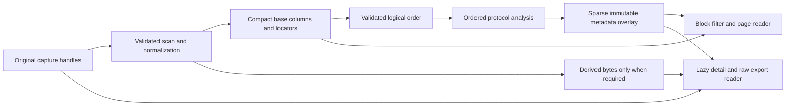

# Compact capture indexing: design and feasibility

Date: 2026-09-06. This is a design investigation, not an implemented replacement
for the offline backend. The earlier performance changes remain separate.

## Recommendation

Replace the eager serialized packet database with a hybrid, source-backed
capture index. Keep ordinary packet bytes in the original file, store compact
list/filter columns, and retain only the exceptional bytes and stateful metadata
that cannot be reconstructed from an individual source packet. Decode packet
presentation details on demand through the existing bounded cache.

First reduce total work while retaining the existing completed-dataset behavior.
Then separate a complete, immutable base packet index from an analysis revision
so users can browse while ordered analysis finishes. Measure those improvements
separately: moving work into the background is not a reduction in total work.

This is feasible within the existing package boundaries. It requires substantial
storage/reader work and, for progressive opening, an explicit lifecycle change.
Another round of small allocation fixes will not deliver the largest gain.

## Evidence from the actual capture

Input: `capture_20251020_082236.pcap`, 323,454,505 bytes, uncompressed classic PCAP,
Ethernet. The production normalizer yields 579,990 logical packets and 44,873
events. The previous three-run median, after the small performance fixes, is
10.26 seconds for the production indexing worker.

A fresh run with per-stream metrics measured:

| Current storage                           |       Bytes | Decimal MB |
| ----------------------------------------- | ----------: | ---------: |
| Details, including effective packet bytes | 526,285,829 |      526.3 |
| Filter/list summaries                     | 138,583,049 |      138.6 |
| Record offsets                            |  18,559,696 |       18.6 |
| Manifest and other overhead               |       8,358 |      0.008 |
| Total                                     | 683,436,932 |      683.4 |

The source contains 314,174,625 captured frame bytes, excluding PCAP framing.
Merely removing the duplicated raw bytes would still leave approximately
369 MB of metadata and indexing overhead. Source offsets alone are therefore
insufficient: the full detail and summary schemas also need replacement.

The current `Summary` excludes bodies and raw bytes logically, but serializes
through the full `PacketDisplay` field layout. Paths, endpoint text, interface
names, display strings, and many empty fields recur in per-packet records.
The detail record duplicates many summary fields as well as raw data. See
[summary.go](../../internal/pkg/offline/summary.go),
[codec.go](../../internal/pkg/offline/codec.go), and
[storage.go](../../internal/pkg/offline/storage.go).

### Bounded feasibility prototype

The feasibility experiment used a standalone, research-only locator scanner. It reads the entire source, hashes it, writes fixed-size
rows through a bounded buffer, syncs the output, and checks 64 sampled locators
by reading the original packet bytes back and comparing checksums. Temporary
indexes are removed after each run. Twelve synthetic validation cases also
covered both classic-PCAP byte orders and timestamp precisions, both row widths,
and rejection of truncated packet payloads.

Three warm-filesystem runs on the same i9-13900HX development host:

| Prototype                                  | Elapsed runs          |  Median | Index bytes |
| ------------------------------------------ | --------------------- | ------: | ----------: |
| 32-byte timestamp/offset/length locators   | 0.213, 0.206, 0.207 s | 0.207 s |  18,559,712 |
| 96-byte locators plus basic header columns | 0.250, 0.251, 0.238 s | 0.250 s |  55,679,136 |

These are **not equivalent to complete lippycat loading**. The prototype omits
normalization, BPF, application labels, searchable Info text, stateful protocol
analysis, full filter metadata, generation ownership, and production integrity
checks. Unsupported deeper protocol decoding stops after available headers.
Its index contains physical frames, not the finalized logical dataset.

The scanner found 579,991 physical frames, no physical timestamp regressions,
and two fragment candidates. That is consistent with, but does not by itself
prove, the normalizer's one-packet reduction. A pure physical offset table would
already change the packet count for this file. A repeat with diagnostic counters
found no direct VXLAN/ESP candidates; these counters are not exhaustive tunnel
classification.

The experiment establishes that reading, hashing, recording source locations,
and basic header extraction are inexpensive on this capture. It does not
establish a 0.25-second full-analysis time or a 55.7 MB complete production index.
Cold storage and highly disordered inputs need separate measurements.

## What Wireshark establishes

Wireshark's documented first pass dissects packets sequentially and builds
packet-list and conversation state. Later, selected packets or other operations
can trigger additional dissection. Its frame records include source file
offsets, and Wiretap supports rereading a record at its recorded offset.
That is evidence for the feasibility of retaining references and derived state;
it is not evidence that Wireshark skips analysis.

Sources: [dissection lifecycle](https://www.wireshark.org/docs/wsdg_html_chunked/ChWorksDissectPackets.html),
[frame data](https://www.wireshark.org/docs/wsar_html/frame__data_8h_source.html),
[Wiretap record reads](https://www.wireshark.org/docs/wsar_html/wtap_8h.html).
The user's approximately three-second Wireshark result has not been reproduced
under a controlled comparison here.

## Proposed storage model



### Source and backing registry

Keep source paths, file identity, link types, interface/section context, and
configuration once per source context. Hold file handles for the session and
its pinned queries/exports. Give repeated input arguments distinct identities;
never substitute a basename for source identity.

A packet locator identifies either original source bytes or a derived-byte
sidecar. It includes an explicit backing identity, offset, captured length,
original/effective length semantics, timestamp, and source provenance. Store
effective link type independently from the original source link type whenever
normalization changes encapsulation. Preserve
physical source ordinal separately from the existing logical `SourceSequence`:
the latter increments only after filtering and normalization.

The normalizer must explicitly say when bytes remain referenceable. Do not
compare complete byte arrays to discover that, or rely on the last transform:
a source subslice inside an already-reassembled datagram is still derived data.

### Compact base and sparse metadata

Use fixed-width, typed blocks rather than a serialized Go presentation object.
A conservative illustrative direct-address core is 112 bytes per logical packet:

| Fields                                           | Bytes |
| ------------------------------------------------ | ----: |
| Signed timestamp seconds and nanoseconds         |    12 |
| Backing byte offset                              |     8 |
| Captured/original lengths                        |     8 |
| Backing ID                                       |     4 |
| Logical source sequence                          |     8 |
| Source-context ID                                |     4 |
| Raw integrity checksum                           |     4 |
| IPv4/IPv6 source and destination slots           |    32 |
| Ports                                            |     4 |
| Address/transport/presence flags and protocol ID |     8 |
| Searchable text offset/length                    |    12 |
| Sparse metadata reference                        |     8 |
| Total                                            |   112 |

For 579,990 logical packets this is about 65.0 MB, **before** variable text,
protocol metadata, block headers/checksums, order mappings, query results, or
derived bytes. A dictionary-address variant can reduce fixed size, but must
bound dictionary memory and preserve address text semantics. The prototype's
96-byte layout reserves several metadata slots but does not implement this
complete schema. Format-specific locators and physical-record lookup tables
may add storage beyond that illustrative core.

A sensible test target is under 100 MB for the complete index and exceptional
sidecars on this particular capture, subject to measuring its retained text and
stateful metadata. That is an engineering target, not a demonstrated result or
a universal index-to-PCAP ratio. Captures with tiny packets and unique long
application fields can legitimately have larger relative metadata costs.

Keep searchable Info text, variable strings and protocol fields in bounded,
spillable arenas. Deduplicate stable source/node/interface names and useful
low-cardinality strings. Avoid an unbounded map of every URL or call ID.
Use explicit little-endian fields and versioned blocks; no `unsafe` Go-struct
dumps. Batch writes and checksum blocks rather than making a syscall for every
summary, detail, match ID, and offset.

### Preserve filter semantics

[Summary](../../internal/pkg/offline/summary.go) already identifies the required
projection. Preserve common endpoints/ports/protocol/Info/node/interface/length,
VoIP identity and RTP fields, DNS name/type/first TTL/latency, TLS SNI/JA3,
HTTP host/path/method/status/length, and metadata-presence bits.

Missing metadata is not an empty value; absent ports are not the string `"0"`.
Generic string filters can observe address formatting. `Info` is searchable,
so rendering a different lazy description changes results. Related-flow queries
also have intentional missing-node/unknown-transport wildcard behavior and
IPv4-mapped IPv6 normalization. See
[packet field semantics](../../internal/pkg/types/packet.go) and
[related queries](../../internal/pkg/offline/query.go).

Do not replace packet-local display metadata with richer normalized event
metadata merely because the latter is available. Today they have different
producers and can have different field meanings.

### Lazy details and raw exports

Selected-packet details combine owned source bytes, stateless decode, and the
pinned analysis overlay. Recreate ordinary header trees, raw hex, and packet-local
protocol fields on demand. Keep the existing byte-bounded cache and detail pins.
Lazy decoders must use frozen session configuration and private or stateless
decoding facilities; they must not consult a live detector/tracker or advance
stream state when a user selects a packet. Random-order and repeated detail
requests must produce identical results for a pinned revision.
A public `Detail` can still own its bytes without those bytes being permanently
serialized into the index.

Do not reconstruct reassembled SIP messages, RTP call attribution, TLS decryption,
correlated transactions, or EOF-dependent fields from an isolated packet.
Store those results or compact references to the derived messages/flow results.

Add a raw-record iterator for export. The existing export path loads full
`Detail` records but ultimately writes packet bytes and capture metadata;
it should not require presentation decoding. Preserve the existing effective,
normalized export bytes, not the original fragment or outer tunnel frame.

## Input format and normalization feasibility

| Input or operation                      | Initial backing strategy                                                   |
| --------------------------------------- | -------------------------------------------------------------------------- |
| Unchanged uncompressed classic PCAP     | Direct source payload offset                                               |
| Currently supported uncompressed PCAPNG | Direct offset plus parsed source/interface context                         |
| IPv4/IPv6 fragment completion           | Store only the completed logical bytes in a derived sidecar                |
| VXLAN extraction                        | Derived sidecar initially; direct inner subrange when proven source-backed |
| ESP rewriting/decapsulation             | Derived sidecar for changed effective bytes                                |
| Gzip classic PCAP                       | One seekable decompressed backing spool plus compact locators              |
| Unsupported formats                     | Keep existing explicit rejection                                           |

Current PCAPNG support rejects multiple sections/interfaces, and gzip PCAPNG
is not supported. Preserve those boundaries during the storage migration;
expanding format support is separate work. Maintain exact timestamp-resolution,
time-offset and missing-timestamp behavior from
[offline_ng.go](../../internal/pkg/capture/offline_ng.go).

Track bytes consumed by the parser. `os.File.Seek` on a buffered reader reports
read-ahead position, not necessarily the packet's offset. Classic PCAP has
24-byte file and 16-byte record headers. PCAPNG locators need checked block
positions, padding, and packet-block-specific payload offsets.

Normalization and initial BPF order must remain unchanged. BPF currently matches
original frames before reassembly and decapsulation. Record a new locator only
for a returned logical packet; keep its source argument and logical emission
sequence even when physical source records were filtered or merged.

## Ordered scanning without copying every packet

The current sorter writes all normalized bytes to a temporary spool, writes
64-byte keys, externally sorts those keys, and rereads/decode packets before
analysis. Replace raw-spool positions with backing locators.

During the mandatory source scan, validate framing, normalize, compute compact
headers, record locators, and hash the original input bytes. Preserve the exact
existing per-file SHA256 aggregation for event identity. For compressed sources,
identity must still hash original compressed bytes, not the decompressed spool.
Finish those hashes before assigning deterministic event IDs.

Detect ordering on the normalized stream. For one ordered source, the locator
sequence already supplies the order. For individually ordered multiple sources,
merge locator streams with a bounded heap. Only regressions require externally
sorting compact keys, using timestamp, argument index, and logical source
sequence as the stable ordering. Multiple inputs and late regressions must not
change TCP analysis outcomes.

Do not start stateful analysis under an optimistic order and discover at EOF
that it was wrong. The initial conservative design finishes the compact scan
and order validation before analysis. Coalesce adjacent source reads during
replay, with byte-bounded prefetch and source-buffer ownership.

## Queries and search performance

Replacing raw storage alone will not improve searches. Current
[Query](../../internal/pkg/offline/query.go) decodes one summary at a time and
writes each matched ID separately. Scan compact blocks sequentially, evaluate
only required columns where possible, and buffer result IDs. Keep identity
queries implicit, as `AllPackets` already does. A dense bitset with block rank
counts can reduce large match sets; sparse ordered IDs remain useful for sparse
matches. Do not introduce an upfront posting list for every conceivable field.

`QuerySpec.Match` is an opaque Go callback, so its field dependencies cannot be
inferred reliably. Preserve a compatible fallback that materializes a bounded
Summary projection. Add a structured, validated filter expression for the TUI
fast path, with identical aliases, boolean rules, text matching and presence
semantics. This enables column selection, per-block range pruning, and reuse of
per-query compiled predicates. Related-flow lookups should compare typed keys,
with optional lazily built postings for repeated lookups.

`AllPackets`, query pinning, and cache internals currently know concrete disk
backend types. Audit and generalize those helpers or evolve that backend in
place; implementing only the public Dataset methods is not sufficient to keep
all fast paths and lifetime guarantees.

## Readiness: reduce work first, then expose progress safely

The existing Dataset contract publishes only after analyzer EOF and all writes
are finalized. Retain that contract for the first storage replacement, which
makes total-ready comparisons fair and isolates storage correctness.

For progressive opening, introduce two explicit immutable views:

| View             | Ready when                                             | Complete operations                                                                                              |
| ---------------- | ------------------------------------------------------ | ---------------------------------------------------------------------------------------------------------------- |
| Base packet view | Normalization, compact scan and global ordering finish | Packet navigation, header/byte inspection, base-field filters, base statistics, unfiltered effective-byte export |
| Analyzed view    | Ordered analysis and EOF/amendments finish             | Application-dependent filters, finalized protocol statistics, event/call results, stateful detail                |

An unfinished field means pending, not absent or a failed match. Protocol names
and Info text may themselves depend on analysis; do not call filters on those
fields base-complete without a proven dependency classification. Base statistics
must be labeled as header-level where classification is not final.

Publish the first analysis overlay atomically at completion. Query/detail/export
operations pin base generation plus analysis revision. Extend stale-result
checks with that revision; do not silently change metadata under an active query
or export. Users may browse the base during analysis, and analysis failure may
leave a valid base with an explicit error instead of losing the capture.

Session cleanup must cancel and join the analysis worker before closing source
handles, derived storage, filters, details, and exports. Existing cancellation,
replacement-session and pinning machinery should be extended, not bypassed.

Showing a provisional first screen before the entire base scan finishes would
need a separate stable source identity/order mapping: a late timestamp regression
can reorder all logical IDs. Defer that extra complexity; the measured compact
scan makes completion-before-browsing a credible first approach.

Keep stateful analysis ordered initially. Parallelize only measured independent
header/stateless work with bounded queues and ordered output. Per-flow parallel
state is possible later, but deterministic event admission and IDs require an
explicit merge; CPU parallelism alone is not a correctness-preserving drop-in.

## Source lifetime and persistent reuse

Source offsets change today's snapshot semantics. Holding a file descriptor can
preserve access after rename/unlink on Unix, but cannot freeze in-place writes.
Track file identity and size/timestamps, verify referenced data against stored
integrity information, and fail explicitly on mutation/truncation. Never reopen
a replacement path and silently mix its bytes with an old index.

If immutable copies are required, offer an explicit snapshot backing strategy,
using filesystem reflinks where available and copying only when necessary. Do
not claim that source references retain the old independence from source files.
Mmap of a mutable source is not the initial recommendation: truncation and
memory accounting add complexity without removing the dominant duplicated work.

After first-open performance and correctness are established, a bounded persistent
index cache can improve repeated opens further. Key it by exact input content,
source ordering, codec/normalization/analyzer versions and relevant settings,
including BPF and key-material identity where applicable. Keep source verification,
atomic complete manifests, and eviction/leases. Distinguish cached base readiness
from cached complete analysis; reusing only a base still leaves analysis work.

## Priorities, measurement and limits

The maximum-gain path combines source references, narrow persisted metadata,
block IO/queries, and lazy stateless details. Optional progressive readiness
improves usability; optional persistent reuse improves repeat opens. Compressing
the current full database or buffering its writes alone leaves most unnecessary
work intact.

Use the existing implementation as a differential oracle for normalized packet
IDs/order, raw exports, filter sets, timestamps, protocol presence, statistics,
stateful metadata and event identities. Test real and synthetic captures covering
fragments, tunnels, gzip, PCAPNG timestamps, late regressions, duplicate input
arguments, truncation/mutation, failure cleanup, and pinned operations.

Report separately: time to a complete base, time to a useful first page, time to
complete analysis-dependent filtering, full analysis completion, repeated-open
latency, filter throughput, random detail latency, export throughput, index/sidecar
bytes, temporary peak disk, peak RSS and cumulative allocations. Use cold and
warm runs, and compare Wireshark under recorded settings. A target near three
seconds for full readiness is an acceptance goal to measure, not a result that
the offset prototype proves.

The staged implementation and acceptance gates are in
[the plan](../plans/watch-file-compact-source-index.md). This investigation does
not implement those stages or change production loading semantics.

## Reproducing the prototype

Retrieve the historical experiment from Git, then build it:

```sh
git show 0f107d93:docs/research/prototypes/offline_locator_scan.go > /tmp/offline_locator_scan.go
GOCACHE=/tmp/lippycat-go-cache go build -o /tmp/lippycat-locator-prototype \
  /tmp/offline_locator_scan.go
/tmp/lippycat-locator-prototype -pcap /path/to/capture.pcap -width 32
/tmp/lippycat-locator-prototype -pcap /path/to/capture.pcap -width 96
```

The 96-byte mode only extracts basic Ethernet/IP/TCP/UDP fields and reserves
space for future metadata references. It is not a supported capture reader or
an application-protocol/filter implementation. It intentionally writes no
packet payloads to its temporary index.
